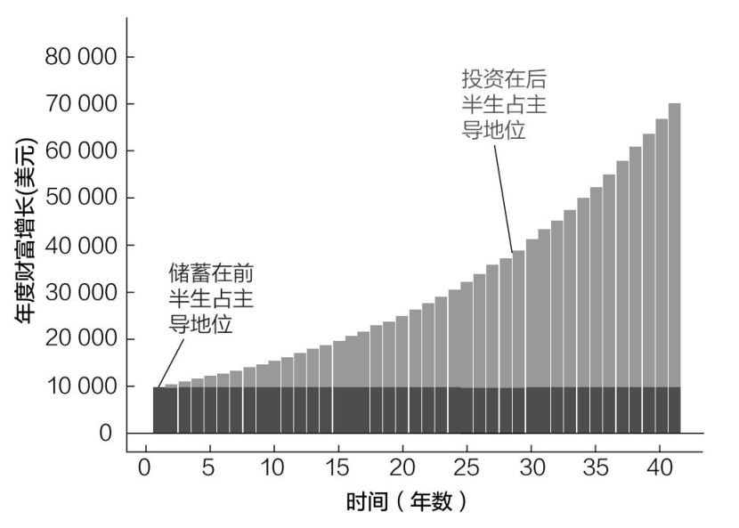

# 绪章 从何处开始？

为什么穷人要存钱，富人却要投资

23岁时，我以为自己知道如何积累财富。降低费率，分散投资，长期持有，我曾多次从沃伦·巴菲特、威廉·伯恩斯坦和约翰·博格等投资界传奇人物那里听到过这样的建议。虽然这些建议并没有错，但作为一名刚毕业的大学生，这让我把财务注意力放在了错误的事情上。

尽管当时我的退休账户里只有1000美元，但我还是花了很多时间来分析下一年的投资决策。我用电子表格来测算净值和预期收益。我每天都检查账户余额。我质疑自己的资产配置，几乎到了神经错乱的地步。

我应该把15%的钱投到债券上吗？还是20%？为什么不是10%呢？

我像着了魔一样。据说痴迷是年轻人的游戏。我深谙这个道理。

然而，我尽管对投资非常着迷，却没有花时间分析自己的收入或支出。我经常会和同事出去吃饭，一轮又一轮地点酒水饮料，然后打车回家。我当时住在旧金山，一晚上花掉100美元轻而易举。

想想这种行为是多么愚蠢。我名下的可投资资产只有1000美元，即使是10%的年收益率，一年也只能赚到100美元。但是，每次和朋友出去玩儿，我都要花掉100美元！一晚上的餐饮费加上交通费，我一年的投资回报（这还是在行情好的时候）就没了。

在旧金山，只要一个晚上不参加聚会，我就相当于赚到了当时一年的投资收益。我的财务优先项如此混乱，即使是巴菲特、伯恩斯坦和博格一起帮我理财，对我来说也无济于事。

相比较而言，对持有1000万可投资资产的人来说，如果投资组合下跌10%，他们就会损失100万美元。你觉得他们一年能攒下100万美元吗？几乎不可能。除非收入很高，否则年储蓄根本无法与投资组合的定期波动相提并论。这就是为什么与只有1000美元的人相比，有1000万美元的人必须花更多的时间来考虑投资决策。

这些例子说明，应该关注什么取决于自身的财务状况。如果没有很多钱可用于投资，那就应该专注于增加储蓄（并用来投资）。然而，如果已经有相当体量的投资，那就应该花更多的时间研究投资计划的细节。

简而言之：穷人要储蓄，富人要投资。

不能单单从字面上理解这句话的意思。我用“穷人”和“富人”，既有绝对意义，也有相对意义。例如，作为一名能够在旧金山参加派对的刚毕业的大学生，我绝对不是穷人，但相对于未来的自己来说，那时的我很穷。

用这种思维方式就很容易理解为什么穷人要储蓄，富人要投资了。

如果23岁的我懂得这个道理，我就会花更多的时间发展事业，增加收入，而不是质疑投资决策。一旦有了更多的储蓄，就可以调整投资组合。

———

那么，如何知道在我所谓的“储蓄-投资”统一体中，自己正处于什么位置呢？可以用一个简单的计算作为指导。

首先，计算出明年在毫不费力的情况下预计能存下多少钱。“毫不费力”是指轻而易举就可以做到。我们将其称为你的预期储蓄。比如，如果你预计每月能存下1000美元，那么你的预期储蓄应该是每年12000美元。

接下来，计算一下你的投资明年预计会增长多少（以美元计算）。例如，如果你有10000美元的可投资资产，你预计它们会增长10%，也就是预计增长1000美元。我们称其为你的预期投资增长。

最后，比较这两个数字。预期储蓄和预期投资增长哪个更大？

如果预期储蓄较高，那么你需要更多地关注储蓄和增加投资。然而，如果你的预期投资增长更高，你就应花更多的时间考虑如何投资你已经拥有的东西。如果这两个数字很接近，那么你应该在储蓄和投资上都花时间。

无论你目前处于财务生涯的哪个阶段，随着年龄的增长，你都应该把重点从储蓄转移到投资上。为了证明这一点，可以假设一个人工作40年，每年储蓄10000美元，年收益率为5%。

一年后，他将投资10000美元，并从这项投资中获得500美元的收益。此时，他从储蓄中获得的财富增长（10000美元）是他从投资中获得财富增长（500美元）的20倍。

将时间快进30年。届时，他的总财富将达到623227美元，并将在下一年从中赚取31161美元（同样是5%的年收益率）。现在，他从储蓄中获得的财富增长（1万美元）约是从投资中获得的财富增长（31161美元）的1/3。

图0.1分类显示了他每年的财富增长，我们可以从中看到上述转变。

可以看到，在工作的前十几年里，他每年的财富增长大部分是由储蓄带来的（深灰色柱）。然而，在他工作生涯的后几十年里，投资（浅灰色柱）对年度财富增长的贡献就要大得多了。

这种转变非常明显，在他退休时，年度财富增长的近70%来自投资收益，而不是储蓄！

图0.1 储蓄和投资随时间的推移对年度财富增长产生的不同影响

这就是为什么“储蓄-投资”统一体对你的财务注意力将在何处获得最佳回报非常重要。

在极端情况下，这种重要性显而易见。如果你没有可投资的资产，那么储蓄就是第一要务。你如果退休了，不能再工作了，就应该在投资上花更多的时间。

而在一般情况下，明确把时间花在哪里有些困难。所以，本书分为两部分。第一部分关于储蓄（“储蓄-投资”统一体的第一阶段），第二部分关于投资（“储蓄-投资”统一体的第二阶段）。
