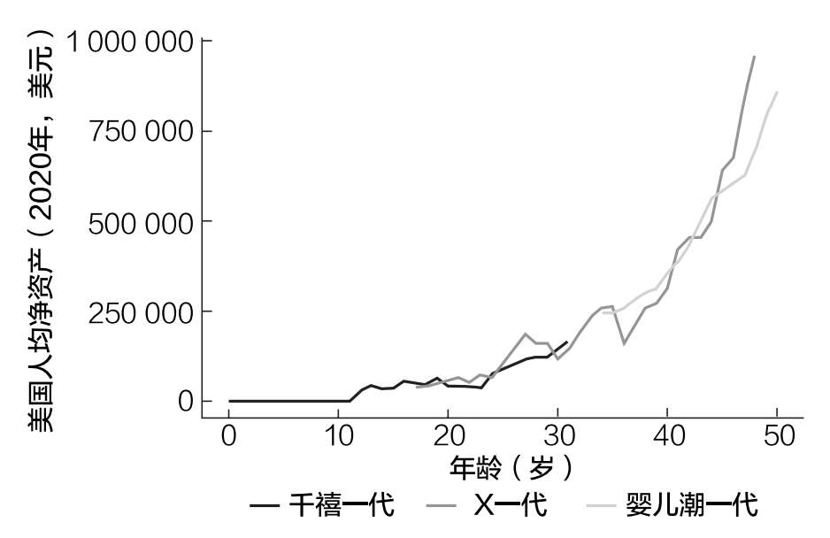

# 第一章 你应该存多少钱

很可能比预想的要少

如果你去阿拉斯加南部的小溪里钓鱼，你会看到成百上千条多利瓦尔登鱼在清澈的水中游来游去。一年中的大部分时间里，你看不到它们有什么可吃的。然而，从初夏开始，鲑鱼就来了。

多利瓦尔登鱼一看到肚子里装满鱼卵的肥美鲑鱼就会开始暴饮暴食，吃到肚子好像随时会爆炸。

怀俄明大学大卫·史密斯保护研究院的研究员约翰尼·阿姆斯特朗说：“多利瓦尔登鱼完全是鱼卵狂人。它们的胃里装满了鲑鱼的鱼卵，在和鲑鱼搏斗时它们被打得体无完肤。”

鲑鱼消失后，尽管没有稳定的食物来源，许多多利瓦尔登鱼仍然能够存活下来。“如果计算一下该流域一年中大部分时间的能量和食物量，你很快就会发现，它们不太可能全年都在那里生存，”阿姆斯特朗说，“但它们确实生存下来了。”

多利瓦尔登鱼是如何承受这样的条件的？正如阿姆斯特朗和他的同事摩根·邦德所发现的那样，当食物缺乏时，为了消耗更少的能量，它们会收缩消化道。当鲑鱼出现时，它们的消化器官会长到正常大小的两倍。[^2]

在生物学上，这一概念被称为表型可塑性，是一种生物体改变其生理条件以适应环境的能力。表型可塑性不仅有助于理解植物、鸟类和鱼类是如何根据环境变化的，还有助于你决定自己应该持有多少钱。

大多数储蓄建议存在的问题

在谷歌搜索“我应该存多少钱”，你会看到不下15万个结果。浏览一下前10个结果，你会看到这样的建议：

“要把收入的20%存起来。”

“先把收入的10%存起来，之后要努力存20%，然后是30%。”

“30岁时存款是你收入的1倍，35岁时存款是你收入的2倍，40岁时存款是你收入的3倍。”

这些文章都建立在有同样缺陷的假设之上。首先，它们假设收入在一段时间内是相对稳定的。其次，它们假设所有收入水平的人都有能力以相同的比例储蓄。这两种假设都被学术研究证明是不合理的。

首先，收入动态小组研究（PSID）的数据表明，随着时间的推移，收入会越来越不稳定，而不是越来越稳定。研究人员利用这些数据发现，从1968年到2005年，“家庭收入波动幅度呈现25%~50%的扩大趋势”[^3]。

这在逻辑上讲得通，因为从单一收入家庭到双收入家庭的逐渐转变意味着家庭不再需要担心一个人失去工作，而是担心两个人失去工作。

其次，决定个人储蓄率最主要的因素是收入水平。这一事实已在金融文献中得到广泛证实。

例如，美国联邦储备委员会和美国国家经济研究局的研究人员估计，收入最低的20%的人每年能攒下其收入的1%，而收入最高的20%的人每年能攒下其收入的24%。

此外，研究人员的估算显示，收入最高的5%的人的年储蓄率为37%，而收入最高的1%的人年储蓄率则是51%。[^4]

同样，加州大学伯克利分校的两位经济学家发现，在美国历史上，从1910年到2010年，除了20世纪30年代，每个十年的储蓄率都与财富呈正相关。[^5]

这就是为什么像“把收入的20%存起来”这样的储蓄规则是在误导大家。这样的建议不仅忽略了收入的波动，而且假设每个人都能以相同的比率储蓄。这在实证上是站不住脚的。

这就是多利瓦尔登鱼表型可塑性的用武之地。多利瓦尔登鱼不是一年中均匀地消耗相同数量的卡路里，而是根据可获得的食物量来改变自身的卡路里摄入量（和新陈代谢）。

当涉及储蓄时，我们也应该这样做。

当我们有能力多存钱时，我们就应该多存钱；当我们没有能力多存钱时，我们可以少存一些钱。我们不应该使用一成不变的规则，因为我们的财务状况很少是一成不变的。

我就亲身经历过储蓄率的大幅波动。在搬到纽约的第一年，我的储蓄率从住在波士顿时的40%下降到4%。因为换了工作，搬到纽约后不再与人合租，我的储蓄率直线下降。

如果我发誓无论如何都要把收入的20%存起来，那么我在纽约的第一年肯定会很痛苦。这不是生活该有的样子。

这就是为什么最好的储蓄建议是：存下能存的钱。

如果听从这个建议，你的压力会更小，快乐会更多。因为人们对钱的担忧已经足够多了。根据美国心理协会的说法，“不管经济环境如何，自美国2007年第一次压力调查以来，财务一直是美国人的第一压力来源”[^6]。

是否存够了钱是最常见的财务压力之一。西北互惠银行在2018年的计划与进展研究中指出，48%的美国成年人对他们的储蓄水平感到“高度”或“中度”焦虑。[^7]

数据清楚地表明，人们对自己能存多少钱感到担忧。不幸的是，储蓄不足带来的压力比储蓄本身更有害。布鲁金斯学会的研究人员在分析了盖洛普的数据后证实，“储蓄压力的负面影响大于其积极影响”[^8]。

这意味着，只有当以一种没有压力的方式存钱时，存更多的钱才更有益。否则，存钱本身就是弊大于利。

我很清楚这一点，因为一旦不再根据武断的规则存钱，我就不再纠结于我的财务状况。尽我所能地存钱，就能享受我自己手里的钱，而不是质疑自己所做的每一个财务决定。

如果你想在存钱方面实现类似的转变，那么你首先需要确定你能存下多少钱。

确定你能存多少钱

计算你能存多少钱可以参考这个简单的等式：

储蓄=收入-支出

用挣的钱减去花的钱，剩下的就是储蓄。这意味着解这个方程你只需要知道两个数字：

1. 你的收入

2. 你的支出

我建议根据每月发生的财务项目（例如工资、租金/抵押贷款、订阅服务费等），按月计算其金额。

例如，如果你的月收入是4000美元，而你一个月花3000美元，那么你每月的储蓄就是1000美元。

对大多数人来说，计算收入很容易，而计算支出则要困难得多，因为支出往往波动更大。

在一个理想的世界里，我会让你知道你的每一元钱都花在了哪里，但我也知道这是多么耗时。每次读到一本书，告诉我要计算我的确切支出时，我都会忽略它。因为我觉得你也会忽略，所以我有一个更简单的方法。

与其计算你花的每一元钱，不如找到你的固定支出，然后估计剩下的。固定支出是指每月不变的支出。这包括：租金/抵押贷款、互联网/有线电视费、订阅服务费、汽车付款等。

一旦把这些数字加起来，你就会得到每月的固定支出金额。在此之后，你可以估计可变支出。例如，如果你每周去一次超市，花了大约100美元，那么就用400美元作为你每月的食品支出。你也可以用同样的方法估算外出吃饭、旅行等支出。

另一个帮助我更好地估计支出的策略是，把所有可变支出都放在同一张信用卡上（月底我会全额还款）。这样做并不是为了攒信用卡积分，而是为了更容易地追踪自己的消费。

无论决定用哪种方法，你最后都会知道自己大约可以节省多少钱。

我推荐这种方法，是因为人们很容易因为没有足够的钱而迷失方向。例如，如果你问1000个美国成年人：“你需要多少钱才算得上富人？”他们会说是230万美元。[^9]

但是，如果你向1000个百万富翁（拥有至少100万美元可投资资产的人）提出同样的问题，这个数字就会增加到750万美元。[^10]

我们变得更富有了，但仍然觉得不够。我们总是觉得我们可以或者应该存更多的钱。但如果你仔细研究数据，你会发现完全不同的情况——你可能已经存了够多的钱。

为什么需要存的钱比预想的要少

刚退休的人最大的担忧之一就是，钱终有一天会被花光。事实上，有压倒性的证据表明，情况似乎正相反——退休人员反而是支出不够多。

正如得克萨斯理工大学的研究人员所言：“许多研究发现，退休人员的金融资产会保持稳定，甚至随着时间的推移而增加。人们不会在退休后花光储蓄。”[^11]作者证实，之所以出现这种情况，是因为许多退休人员的支出并没有超过他们每年从社保、养老金和投资中获得的收入。因此，他们从不抛售投资组合的本金，而他们的财富通常会随着时间的推移而增长。

最低分配规则（RMDs）迫使退休人员出售部分资产，情况的确如此。正如研究人员得出的结论，“（这）证明退休人员会将必要的分配用于其他金融资产的投资”。

一年之中，有多少比例的退休人员会出售其资产？只有1/7。根据投资与财富研究所的报告：“不管他们的财富状况如何，58%的退休人员提取的资金少于他们的投资收益，26%的人提取的资金与其投资组合的收益相当，只有14%的人正在提取本金。”[^12]

结果是，退休人员往往会给继承人留下一大笔钱。根据美国智能投顾平台的一项研究，60多岁去世的退休人员平均留下的净财富为29.6万美元，70多岁的为31.3万美元，80多岁的为31.5万美元，90多岁的为23.8万美元。[^13]

这一数据表明，对退休人员来说，担心退休后花光钱比实际花光钱的威胁更大。当然，未来退休人员的财富和收入可能会比现在的退休人员少得多，但数据似乎也不支持这一点。

例如，根据美联储的财富统计数据，千禧一代的人均财富与X一代大致相当，X一代经通胀调整后的人均财富与同龄的婴儿潮一代大致相同。[^14]

如图1.1所示，随着时间的推移，这几代人的人均财富似乎都遵循类似的轨迹。

这表明，总体而言，千禧一代积累财富的速度并不比前几代人慢。是的，千禧一代的财富分配存在问题，一些人负债较多，但总体情况并不像媒体通常描绘的那么可怕。

在社会保障方面，情况也不像看起来那么惨淡。尽管77%的工人认为他们退休时没有社会保障，但福利被完全取消似乎也不太可能。[^15]

图1.1 按年龄和代际分列的美国人均净资产（经通胀调整后）

2020年4月，关于美国社会保障信托基金状况的精算报告得出的结论是，该信托基金即使在2035年左右将钱用光，也有足够的收入支付“79%的福利待遇”。[^16]

这意味着，如果美国保持目前的政策，未来的退休人员仍将获得80%左右的退休待遇。这一结果并不理想，但比许多人预想的要好得多。

根据实证研究，对现在和未来的退休人员来说，钱被花光的风险仍然很低。这就是为什么你需要存的钱可能比你想象的要少。再加上尽你所能地存钱，这就构成了“你应该存多少钱？”这个问题的两个重要答案。

然而，对于那些需要存更多的钱的人，我们将进入下一章。

[^2]: Miller, Matthew L., "Binge ’Til You Burst: Feast and Famine on Salmon Rivers," Cool Green Science (April 8, 2015).

[^3]: Nichols, Austin and Seth Zimmerman, "Measuring Trends in Income Variability," Urban Institute Discussion Paper (2008).

[^4]: Dynan, Karen E., Jonathan Skinner, and Stephen P. Zeldes, "Do the Rich Save More?" Journal of Political Economy 112:2 (2004) 397–444.

[^5]: Saez, Emmanuel, and Gabriel Zucman, "The Distribution of US Wealth: Capital Income and Returns since 1913." Unpublished (2014).

[^6]: "Stress in America? Paying With Our Health," American Psychological Association (February 4, 2015).

[^7]: "Planning & Progress Study 2018," Northwestern Mutual (2018).

[^8]: Graham, Carol, "The Rich Even Have a Better Kind of Stress than the Poor," Brookings (October 26, 2016).

[^9]: Leonhardt, Megan, "Here’s How Much Money Americans Say You Need to Be ‘Rich’," CNBC (July 19, 2019).

[^10]: Frank, Robert, "Millionaires Need $7.5 Million to Feel Wealthy," The Wall Street Journal (March 14, 2011).

[^11]: Chris Browning et al., "Spending in Retirement: Determining the Consumption Gap," Journal of Financial Planning 29:2 (2016), 42.

[^12]: Taylor, T., Halen, N., and Huang, D., "The Decumulation Paradox: Why Are Retirees Not Spending More?" Investments & Wealth Monitor (July/August 2018), 40–52.

[^13]: Matt Fellowes, "Living Too Frugally? Economic Sentiment & Spending Among Older Americans," unitedincome.capitalone.com (May 16, 2017).

[^14]: Survey of Consumer Finances and Financial Accounts of the United States.

[^15]: 19th Annual Transamerica Retirement Survey (December 2019).

[^16]: The 2020 Annual Report of the Board of Trustees of the Federal Old-Age and Survivors Insurance and Federal Disability Insurance Trust Funds (April 2020).
