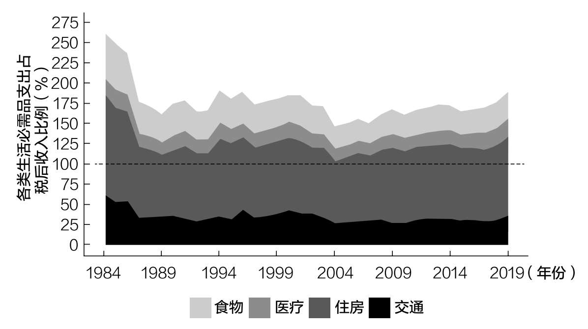
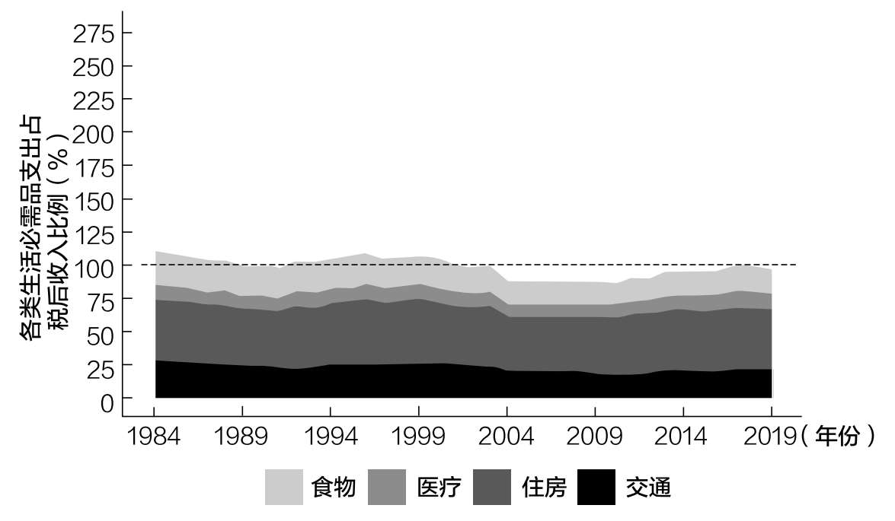
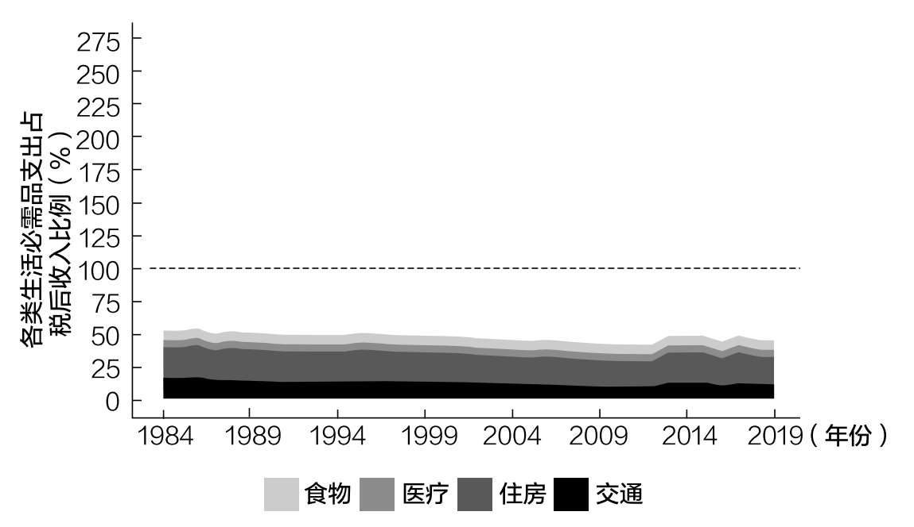

# 第二章 如何存更多钱

个人理财中最大的谎言

公共卫生领域的传统观点是，西方世界日益增长的肥胖主要归因于两个要素：饮食不当和缺乏锻炼。该理论认为，除了摄入高热量食物，我们坐在办公桌前燃烧的卡路里也比我们的祖先在狩猎和觅食时燃烧的卡路里要少。

但是，当人类学家研究居住在坦桑尼亚北部以狩猎采集为生的哈扎部落的日常能量消耗时，他们为自己的发现感到震惊。是的，哈扎人的体力活动比典型的西方人多得多。男人捕猎大型动物、砍伐树木，女人寻找食物、在布满岩石的土壤中挖掘，他们的生活方式相当耗体力。

然而，这种体力消耗并没有转化为更多的能量消耗。事实上，不考虑体型因素，哈扎人燃烧的卡路里与美国和欧洲那些久坐不动的人大致相同。[^17]

这项研究表明，随着时间的推移，人体会根据身体活动调整其总能量消耗。所以，如果你决定每天跑两公里，一开始你会燃烧更多的卡路里，但随后情况就会稳定下来。你的身体最终会适应身体活动的这种变化，并相应地调整能量消耗。

科学文献几十年前就记载了这种适应性。例如，一项对1966—2000年所有关于运动和减肥的研究发现，增加体育活动确实能在短期内消耗更多的脂肪。然而，“当回顾长期研究结果时，并没有发现二者的这种关系”[^18]。

这表明，尽管运动对健康有许多益处，但它对减肥的作用似乎受到人类进化的限制。虽然体育活动对体重有一定的影响，但饮食的改变似乎更重要。

类似于减肥界的节食与运动之争，个人理财界也存在关于如何存更多钱的两派之争。一派认为应该专注于控制支出，而另一派则声称应该努力增加收入。

例如，控制支出派可能会声称，在家里煮咖啡（而不是在星巴克买咖啡）可以在一生中为你节省高达100万美元的金钱。另一方面，增加收入派可能会争辩说，通过副业赚取额外收入要比质疑你的每一个消费决定容易得多。

从理论上讲，双方的观点都没错。回到前一章的等式，储蓄的定义是：

储蓄=收入-支出

因此，为了增加储蓄，要么增加收入，要么减少支出，或者两者都要。

是不是其中一方的观点更正确呢？

数据表明是的。就像运动对减肥的影响一样，想要存更多的钱，削减开支也有内在的局限性。

为了说明这一点，让我们来看看消费者支出调查。该调查总结了美国家庭在各种不同类别上的支出。在将这些数据根据收入分成五组后，我们可以看到，削减开支并不是帮助许多美国家庭省钱的可行选择。

例如，你可以看看收入最低的20%的家庭在食品、住房、医疗和交通上的花费，很明显，他们的收入甚至不足以满足生活的基本需求（见图2.1）。

图2.1 收入最低的20%的家庭在生活必需品上的支出情况

自1984年以来，收入最低的20%的家庭在这四个方面的支出一直超过他们的税后收入。请注意，这还不包括教育、服装或任何形式的娱乐支出。仅仅是生活必需品就把他们的薪水用光了。

2019年美国收入最低的20%的家庭平均税后年收入为12236美元，这些家庭每月只能支出大约1020美元。然而，在2019年，他们在食品、医疗、住房和交通上的平均月支出为1947美元。

如果按类别划分，我们会看到他们每个月的花费如下：

·食品：367美元

·医疗：238美元

·住房：960美元

·交通：382美元

你觉得哪项数字过高，他们在哪些方面可以合理削减呢？坦白地说，我看不出有多少调整的余地。

请记住，这些家庭每月只挣1020美元，而每月却要花费1947美元（平均）。这意味着，为了省钱，他们需要把开支削减一半！这对我来说似乎不现实，尤其是考虑到他们的支出水平已经很低了。

但这一逻辑也适用于其他收入水平的家庭。例如，如果观察随后20%的美国家庭（第20至第40百分位），我们也会看到类似的情况（见图2.2）。

虽然这些家庭在2019年的平均税后年收入为32945美元，几乎是收入最低的20%的家庭的3倍，但他们也几乎把所有收入都花在了生活必需品上。

图2.2 接下来的20%做得更好，但也没有好很多，收入在第20至第40百分位的家庭在生活必需品上的支出情况

同样，基本生活开支消耗了他们大部分的薪水。然而，当我们观察这些家庭的绝对支出水平时，端倪开始出现。

虽然收入在第20至第40百分位的家庭的平均收入是收入最低的20%的家庭的近两倍，但他们的总支出只是收入最低的20%的家庭的140%。这说明了削减支出与提高收入之争中的一个关键点：

收入的增加并没有带来相应的支出增加。

当然，你可能认识一些收入很高却把钱都花光的人。确实有这样的人。重要的一点是，数据表明，这些人是例外。总体而言，高收入家庭的支出占收入的比例低于低收入家庭。

在调查美国收入最高的20%的家庭时，我们可以清楚地看到这一点（见图2.3）。2019年，这些家庭的平均税后年收入为174777美元，但在食品、医疗、住房和交通等必需品上的支出仅为收入的一半左右。

图2.3 收入最高的20%的家庭在生活必需品上的支出情况

与收入最低的20%的家庭相比，收入最高的20%的家庭在生活必需品上的支出是其3.3倍，但税后收入却是其14倍以上！

为什么支出没有随着收入成比例地增加呢？因为经济学上有一个理论叫边际效用递减。这是一个术语，但它的意思很简单，它意味着每增加一单位消费所带来的效用都比前一单位带来的效用小。

我称之为胃口法则。

想象一下，你很饿，非常想吃比萨。吃第一块时你肯定会非常爽。从第一口开始，你将体验到一种味觉的爆发，它将直接向你的大脑发送愉快的信号。和不吃比萨相比，吃一块感觉超棒。

然后你继续吃第二块。是的，吃第二块感觉仍然很好，但肯定不如吃第一块的感觉好。吃第三块也是如此，以此类推。

每多吃一块，你的快乐就会比吃前一块时少一点儿。而且到了某个时点你会吃得很饱，再吃一块比萨实际上会让你感觉更糟。

当涉及花钱时，同样的事情也会发生。即使你的收入增加了10倍，你也不太可能因此在食品、住房或其他必需品上多花10倍的钱。虽然你可能会提高食物和住房的品质，但不太可能花10倍以上的钱。

这就是为什么高收入家庭更容易存钱——相对于他们的收入，他们在生活必需品上的支出占其收入的比例比低收入家庭要低。

然而，大多数主流财经媒体不会承认这一点。相反，他们继续讲述着如何增加储蓄和致富的谎言。

个人理财中最大的谎言

阅读个人理财文章，你会发现有很多关于如何致富或提前退休的建议。这些文章会讨论拥有正确的心态，设定目标，并遵循一个系统，但它们不会告诉你，作者是如何真正致富的。

因为如果深入研究这些文章，你会发现，他们真正致富的方式是高收入或低得离谱的支出，或者两者兼而有之。

是的，如果你住在拖车里，你可以在35岁退休。

是的，如果你做了10年以上的投资银行家，你可以变得富有。

但是，不，仅靠心态是无法完成这两项任务的。事实上，世界上所有的消费追踪和目标设定都无法弥补资金上的不足。

在研究了上述消费者支出调查之后，我很难提出相反的观点。是的，一定比例的美国家庭没有知识、习惯或心智来改善他们的财务状况。你可能会想到自己的生活中也有一些这样的人。

但是，还是那句话，这些人是例外，而不是大多数。虽然有很多人因为自己的行为而陷入财务困境，但也有很多人有着良好的理财习惯——他们只是没有足够的收入来改善自己的财务状况。

来自世界各地的实证研究已经无可置疑地证明了这一点。例如，伦敦经济学院的研究人员发表的一篇题为《为什么人们一直贫穷？》的论文，阐述了缺乏初始财富（而不是动力或天赋）是如何使人们陷入贫困的。

研究人员通过给孟加拉国的农村女性随机分配财富（例如以牲畜的形式）来验证这一假设，然后等着看财富转移会如何影响她们未来的财务状况。正如相关论文所述：

（我们）发现，如果该计划使个人的初始资产超过一个阈值，她们就可以摆脱贫困，但如果没有达到这个阈值，她们就会再次陷入贫困……我们的研究结果表明，大额一次性财务支持如果使人们能够从事生产力更强的职业，将有助于缓解持续贫困。[^19]

这篇论文清楚地说明，许多穷人之所以贫穷，不是因为他们的才华或动机，而是因为他们从事低薪工作——他们必须工作才能生存。

从本质上讲，他们陷入了贫困陷阱。在这个贫困陷阱里，缺钱使他们无法通过接受培训或获得资本从事高薪工作。你可能对这一观点持怀疑态度，但在肯尼亚进行随机财富分配实验的研究人员也发现了类似的情况。[^20]

这就是为什么说“如果削减开支，你就能变得富有”是个人理财领域最大的谎言。

财经媒体告诉你不要每天花5美元买咖啡，这样你就有可能成为百万富翁，从而助推了这个谎言的传播。

然而，这些专家却忘记了这一点：只有在你的投资年化收益率达到12%（远高于市场平均8%~10%的年化收益率）的情况下，这才有可能实现。

即使你能获得12%的年化收益率，你也需要将资金全部投入股市并持有几十年。这说起来容易，做起来很难。

同样的财经媒体还报道人们如何通过自己制作洗洁精或重复使用牙线来省钱。真正让我感到不安的是，这些例子居然被吹捧为缩减开支可以致富的证据。

这些帖子的作者可能会说：“你财务不自由是因为你一直在买汰渍洗衣凝珠！”想想这句话对普通家庭来说是多么居高临下！

你已经看出他们在对我们耍什么花招儿了。他们将这些非常规情况视为常规情况。然而，事实并非如此。

最具持续性的致富方法是增加收入，并投资创收资产。

这并不意味着你可以完全忽略你的支出。每个人都应该定期梳理自己的支出，以确保没有浪费（例如，已经忘了的订阅服务、不必要的奢侈品等）。但你没必要控制自己少买咖啡。

如果你想存更多的钱，那么你可以在你能省的地方省一省，然后重点是，专注于增加你的收入。

如何增加收入

我或许是第一个承认增加收入（至少在初始阶段）比削减开支困难得多的人。如果你想要一个可持续的方式来节省更多的钱、积累财富，这是唯一的选择。

增加收入最好的方法就是找到能够将你的内在财务价值变现的方式。这里我将探讨人力资本的概念，或者说你的技能、知识和时间的价值。人力资本可以被认为是一种可以转化为金融资本（金钱）的资产。

将人力资本转化为金融资本的好方法有哪些？以下是五个你应该考虑的方法：

1. 出售时间和专业知识

2. 出售技能/服务

3. 教学

4. 销售产品

5. 公司内部晋升

每种方法都有其优缺点，我们将在接下来的章节中讨论，但它们都可以用来增加你的收入。

1. 出售时间和专业知识

俗话说，时间就是金钱。因此，如果你想挣更多的钱，可以考虑出售更多的时间或专业知识。

有很多方法可以做到这一点，但我建议你先研究一下，看看你的技能在哪里发挥得最好。一开始你可能挣不到很多钱，但随着专业技能的提高，你可以收取更高的费用。

出售时间唯一的缺点是无法规模化。一小时的工作永远等于一小时的收入。仅此而已。因此，只靠出售时间，你永远不会变得非常富有。

出售自己的时间并没有错，但最终你会希望有不靠工作的收入。我们将很快讨论这个问题。

总结

·优点：容易做。启动成本低。

·缺点：时间有限。无法规模化。

2. 出售技能/服务

既然我们已经讨论了出售时间，这自然就涉及出售技能或服务。出售一项技能或服务是指开发一项有市场价值的技能，然后通过平台（比如在线平台）出售。

例如，你可以在广告分类网站Craigslist上为你的摄影服务做广告，或者在综合类外包平台Upwork这样的网站上做平面设计工作。每天有数百种有市场价值的技能在网上交易，这只是其中的两个例子。

与出售时间相比，出售一项技能或服务能给你带来更多的收入。如果你能为自己的技能或服务创立一个品牌，并收取更高的价格，你就能获得更多的收入。

然而，就像出售时间一样，出售技能或服务是很难规模化的。你必须为每一项服务付出相应的劳动。当然，你可以雇用其他有类似技能的人帮助你工作，但这会使事情变得更复杂。

总结

·优点：薪水更高。能够创立一个品牌。

·缺点：需要投入时间来开发有市场价值的技能/服务。不容易规模化。

3. 教学

亚里士多德说过：“知道的，就去做。懂得的，就去教。”

教学（尤其是在线教学）是获得可观收入的最佳途径之一。无论你是选择通过优兔还是Teachable这样的学习平台，教人一些有用的东西都是增加收入的好方法。

在线教学既可以是自定进度的录制课程，也可以是基于社群的在线课程。虽然录制课程的受众规模更大，但无法收取在线课程那么高的费用。

你能教什么呢？任何人们愿意花钱学习的东西，写作、编程、修图等等。

教学的美妙之处在于，你还可以围绕授课内容创立一个品牌，并长期运营。不幸的是，这也是在线教学的难点之一。除非你是在一个小众领域，否则市面上会有很多竞争者。为了与他们竞争，你需要找到一种脱颖而出的方法。

总结

·优点：易于规模化。

·缺点：竞争激烈。吸引生源可能是一场持久战。

4. 销售产品

如果你不适合教人，你可以考虑做一个对他人有益的产品。要做到这一点，最好的方法是发现问题，然后打造一个产品来解决它。

这个问题可能是情绪上的、精神上的、身体上的，也可能是经济上的。无论你决定做什么，通过产品解决问题都能帮助你创造可规模化的价值。

为什么？因为只要打造出一款产品，你就可以想卖多少次就卖多少次。对那些可以在网上无限次销售而无须额外成本的数字产品来说，情况尤其如此。

不幸的是，打造一个产品前期需要大量投资，还需要更多的努力把它推向市场。

做产品并不容易，但如果你能找到人们喜欢的产品，你就可以从中赚取长期收入。

总结

·优点：可规模化。

·缺点：需要前期大量投资和持续营销。

5. 公司内部晋升

在所有增加收入的路径中，公司内部晋升是最常见的，也是最不受待见的。人们普遍认为，朝九晚五地为他人工作在某种程度上不如自己创业或做副业有价值。

但是，如果你看一下数据，朝九晚五仍然是大多数人积累财富的方式。事实上，许多美国人是通过专业学位（如医学、法学等）成为百万富翁的。正如《邻家的百万富翁》一书对20世纪90年代末一群百万富翁的研究所述：

作为一个群体，（百万富翁们）都受过良好的教育。只有1/5的人不是大学生。他们中的许多人拥有高等学位。18%的人有硕士学位，6%的人有博士学位，8%的人有法学学位，6%的人有医学学位。[^21]

百万富翁不仅更有可能走传统的教育和职业道路，而且他们不会一夜之间成为百万富翁。事实上，一个典型的白手起家的百万富翁需要32年才能完成他们的财富积累。[^22]

这就是为什么我支持通过传统的职业道路增加收入，尤其是对那些年轻或缺乏经验的人来说。虽然朝九晚五的工作很难让你变得非常富有，但学习如何与人相处并培养职业技能非常有利于自身的职业发展。

即使最终你能自立门户，往往最初也是从员工起步的。这就解释了为什么企业家的平均年龄是40岁。[^23]到了40岁，你有两样东西是大多数22岁的人不具备的——经验和资金。这些经验和资金从何而来？来自传统的职业，很可能是为别人打工。

总结

·优点：可以获取技能和经验。收入增长的波动风险较小。

·缺点：你无法控制自己的时间和所做的事情。

———

不管你将来如何努力增加收入，以上所有的方法都应该是临时的。我说临时是因为，最终，你的额外收入应该用来增加更多的创收资产。

这样才能真正增加储蓄。

为了存更多的钱，你应该像老板一样思考

猜猜谁是史上最富有的美国职业橄榄球大联盟（NFL）球员？是汤姆·布雷迪吗？还是佩顿·曼宁？或是约翰·麦登？都不是。

是一个叫杰瑞·理查森的人。你可能从未听说过他。但他是唯一一个在美国职业橄榄球大联盟打球的亿万富翁。

理查森是怎么赚钱的？不是通过打球。

理查森是一个很好的球员。他所在的球队1959年赢得了美国职业橄榄球大联盟的冠军。但他的大部分财富是通过在美国各地开设哈迪快餐连锁店积累起来的。最终，他积累了足够的资本，在1993年创办了卡罗莱纳黑豹队。

使理查森暴富的不是他的劳动收入，而是他对企业的所有权。

我希望你用同样的思路来增加收入。是的，出售时间、技能或产品都是很好的选择，但它们不应该是最终目标。

最终目标应该是所有权——用你的额外收入来获得更多的创收资产。

无论是投资自己的企业还是别人的企业，你都需要将人力资本转化为金融资本，以积累长期财富。

如果想这样做，你就需要像老板一样思考。

我们已经讨论了如何能存更多的钱，接下来我们将把注意力转向如何让花钱没有负罪感。

[^17]: Pontzer, Herman, David A. Raichlen, Brian M. Wood, Audax Z.P. Mabulla, Susan B. Racette, and Frank W. Marlowe, "Hunter-gatherer Energetics and Human Obesity," PLoS ONE 7:7 (2012), e40503.

[^18]: Ross, Robert, and I.N. Janssen, "Physical Activity, Total and Regional Obesity: Dose-response Considerations," Medicine and Science in Sports and Exercise 33:6 SUPP (2001), S521–S527.

[^19]: Balboni, Clare, Oriana Bandiera, Robin Burgess, Maitreesh Ghatak, and Anton Heil, "Why Do People Stay Poor?" (2020). CEPR Discussion Paper No. DP14534.

[^20]: Egger, Dennis, Johannes Haushofer, Edward Miguel, Paul Niehaus, and Michael W. Walker, "General Equilibrium Effects of Cash Transfers: Experimental Evidence From Kenya," No. w26600. National Bureau of Economic Research (2019).

[^21]: Stanley, Thomas J., The Millionaire Next Door: The Surprising Secrets of America’s Wealthy (Lanham, MD: Taylor Trade Publishing, 1996).

[^22]: Corley, Thomas C., "It Takes the Typical Self-Made Millionaire at Least 32 Years to Get Rich," Business Insider (March 5, 2015).

[^23]: Curtin, Melanie, "Attention, Millennials: The Average Entrepreneur is This Old When They Launch Their First Startup," Inc.com (May 17, 2018).
