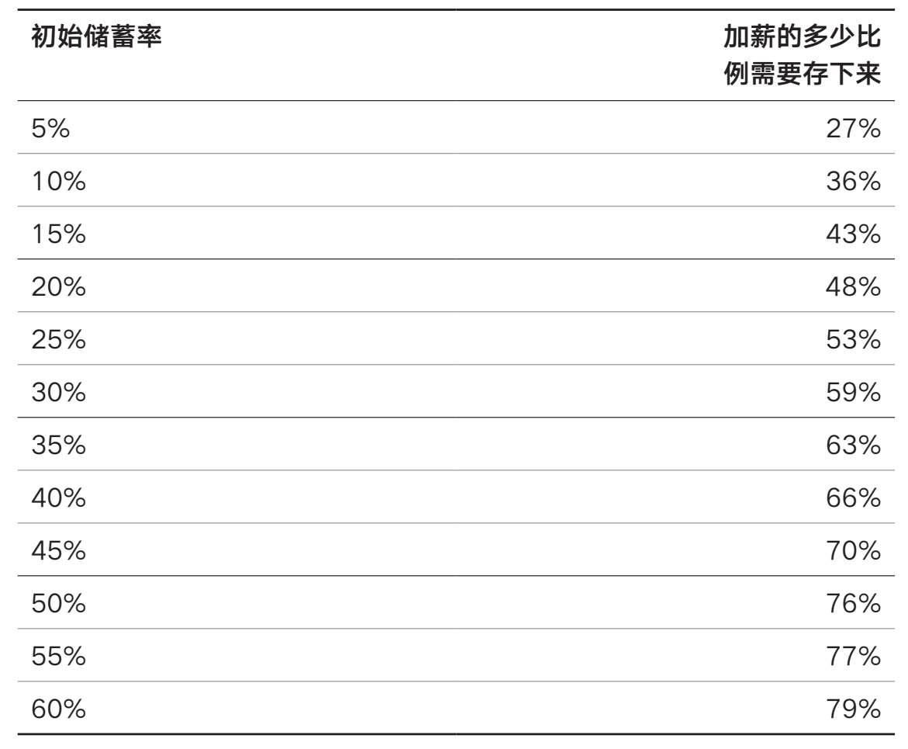

# 第四章

## 你可以接受生活方式多大程度上的改变

为什么比你想象的程度要大得多

那是1877年1月4日，一位世界首富刚刚去世。科尼利尔斯·范德比尔特作为铁路和运输先驱，生前积累的财富超过1亿美元。

这位海军准将认为，拆分家族财富会导致破产，所以他把大部分财富（9500万美元）留给了儿子威廉·范德比尔特。在他立下这一遗嘱时，9500万美元比美国财政部持有的资金还要多。

事实证明，他的决定是正确的。在接下来的9年里，威廉通过妥善管理家族的铁路业务，将父亲的财富增加了一倍，达到近2亿美元。经通胀调整后，范德比尔特家族的2亿美元在2017年的价值约为50亿美元。

然而，1885年底，威廉的去世埋下了祸根，最终导致了范德比尔特家族财富的覆灭。之后的20年里，这个家族没有一个人跻身美国富豪之列。事实上，“1973年，当海军准将的120名后裔聚集在范德比尔特大学举行第一次家庭聚会时，他们中没有一个是百万富翁”30。

是什么导致了范德比尔特家族财富的崩溃？主要是生活方式等方方面面的改变。

生活方式的改变是指人们随着收入的增加相应地增加了支出，或向同阶层的人看齐。

对范德比尔特家族的人来说，这意味着在马背上用餐、抽顶级香烟、住纽约最奢华的豪宅——这些都只是为了比肩曼哈顿的其他社会名流。虽然你的生活方式可能不像范德比尔特家族那样奢侈，但他们的故事说明了随着时间的推移增加支出是多么容易，特别是在你的收入增加后。

例如，想象一下你刚刚在工作中获得了加薪，现在你想出去庆祝一下。毕竟你努力工作了，你应该得到一些好东西，对吧？也许你想要一辆新车，一个更好的住所，或者你只是想经常出去吃饭。不管你决定用增加的薪水做什么，你都已经成为生活方式改变的受害者。

虽然许多个人理财专家会告诉你要不惜一切代价避免生活方式的改变，但我并不这样认为。事实上，我相信生活方式的少许“腐化”可以是令人振奋的。毕竟，如果你不能享受你的劳动成果，那么努力工作有什么意义呢？

但是，界限在哪里呢？你能承受生活方式多大程度的“腐化”呢？一般来说，这取决于个人的储蓄率，但对大多数人来说，答案是50%左右。

一旦被花掉的部分超过加薪的50%，你就要推迟退休时间了。

收入增加而储蓄不足会让你推迟退休时间，这听起来可能很奇怪，但我将证明为什么确实是这样。事实上，与储蓄率较低的人相比，储蓄率较高的人必须将未来加薪的更大比例（如果他们想在既定的时间退休）存起来。

一旦你理解了为什么会出现这种情况，那么以上50%的限制就更有意义了。

为什么高储蓄者需要把更多的加薪存起来

首先，考虑两个不同的投资者：安妮和鲍比。两人的税后年收入都是10万美元。然而，他们每年储蓄的金额不同。安妮每年将税后收入的50%（5万美元）存起来，而鲍比只存10%（1万美元）。显然，这意味着安妮每年花5万美元，鲍比花9万美元。

我们假设安妮和鲍比都希望退休后和工作时花一样多的钱（维持原有生活水平），那么安妮退休时需要的钱将比鲍比少，因为她的日常花销更少。

如果我们还假设每个投资者需要其年度支出的25倍的储蓄才能舒适地退休，那么安妮需要125万美元，而鲍比需要225万美元。（在第八章，我们将讨论为什么25倍年度支出的储蓄目标可以使人获得舒适的退休生活。）

假设年实际收益率为4%，收入/储蓄率没有变化，安妮将能够在18年后退休，而鲍比将需要59年。请注意，需要59年才能退休对大多数人来说是不现实的，所以如果他想在更合理的时间退休，他必须提高储蓄率。

现在，让我们进入10年后的未来。经过10年的储蓄（经通胀调整后的年收益率为4%），安妮将积累600305美元，而鲍比将有120061美元。他们都还在按计划退休（安妮将在8年后退休，鲍比将在49年后退休）。

但是，现在我们假设他们都获得了每年10万美元的加薪，他们的年收入增加到每年20万美元（税后）。如果安妮和鲍比想按原来的计划退休，他们应该存多少钱？

你可能会想，“就以他们原来的储蓄率储蓄吧”，对吗？但如果安妮将加薪的50%存起来，鲍比将加薪的10%存起来，这实际上会推迟他们的退休时间。

为什么？因为他们制定退休目标时没有考虑到他们因加薪而增加的支出。

如果安妮现在每年挣20万美元，并把其中的50%（10万美元）存起来，显然，她每年会花掉其余的50%（10万美元）。加薪后，她的支出从5万美元翻了一番，达到10万美元，如果安妮想保持她新的生活方式，她的退休支出也必须翻一番。

这意味着安妮现在需要250万美元才能退休，而不是她最初的125万美元。然而，由于安妮在之前的10年里是按照125万美元的退休目标存钱的，因此她不得不工作更长时间，以弥补过去较低的储蓄水平。

凭借600305美元的投资和每年10万美元的加薪后储蓄（4%的年收益率），安妮将在12年内实现250万美元的退休目标，而不是她最初的8年。改变了的生活方式将推迟她的退休时间。这就是为什么生活方式过度腐化可能是危险的。重要的是它对你一生支出的影响。

如果安妮想按照原来的计划退休，她每年的支出应低于10万美元。这意味着她新增的储蓄必须超过加薪的50%。事实上，安妮需要将她加薪的74%（74000美元）存起来，才能如期在8年内退休。因此，安妮每年需要储蓄124000美元（原始储蓄50000美元+加薪后的74000美元），直到退休。

由于安妮每年储蓄124000万美元，因此接下来每年将花费76000万美元。在这个支出水平上，安妮的退休目标将是190万美元，而不是250万美元。

那鲍比呢？如果他想在获得10万美元的加薪后在49年内如期退休，他将需要每年额外储蓄14800美元，即他加薪的14.8%。这使得他每年的支出为175200美元，退休目标为438万美元。他仍然需要49年才能退休。

正如我上面提到的，存59年的钱是不现实的。因此，如果鲍比想在一个更合理的时间退休，他应该将他加薪的50%（或更多）存下来。我将在下一节解释为什么要这样。

更重要的是，这个思想实验证明了为什么高储蓄者如果想保持退休日期不变，就必须提高加薪的储蓄比例（与低储蓄者相比）。这就是为什么安妮（高储蓄者）必须把她加薪的74%存起来，而鲍比（低储蓄者）只需要把他加薪的14.8%存起来，就可以按计划退休了。

虽然这个思想实验在上述案例中是有用的，但它没法告诉你到底应该将加薪的多少存起来。由于大多数人一般会在他们的职业生涯中获得多次小额加薪（而不是一次大额加薪），因此我们如果希望实验更准确，应该模拟多次小额加薪的影响。

下一节将模拟多次小额加薪的影响，并对应该节省多少加薪提供一个精确的衡量标准。

加薪应该存下多少

年收益率、收入水平和收入增长率的差异远没有那么重要。在测试了所有这些东西后，我发现储蓄率是最重要的。决定你加薪储蓄率（以如期退休）最重要的因素就是当前的储蓄率。

因此，我创建了以下表格（表4.1），根据你当前的储蓄率，显示你还需要将加薪的多少存下来才能如期退休。该分析假设需要存储25倍的年度支出才能退休，每年获得3%的加薪，投资组合每年增长4%（均经通胀调整后计算）。

表4.1 储蓄率与如期退休所需储存的加薪比例

例如，如果你现在每年的储蓄率为10%并获得加薪，那么你还需将加薪（以及随后的每次加薪）的36%存下来，才能如期退休。如果你现在的储蓄率为20%，那么你还需要将加薪的48%存下来。如果你现在的储蓄率为30%，那么你还需要将加薪的59%存下来，以此类推。

这也正好说明，一些生活方式的改变是可以的！对现在将收入的20%存下来的人来说，他们可以在按原计划退休的情况下花掉未来加薪的一半。当然，如果他们花的钱不到未来加薪的一半，他们可以更早退休，这取决于他们个人。

与直觉相反，当前的储蓄率越低，生活方式的改变就越不容易影响当前的退休计划。为什么？因为显然，储蓄少，花费就多。

因此，当这些低储蓄者获得加薪并决定花掉其中的一部分时，他们的总支出（以百分比为基础）变化小于获得相同加薪并花掉相同百分比的高储蓄者。加薪带来的支出的变化对高储蓄者的影响要大于对低储蓄者的影响。

为什么要把加薪的50%存起来

尽管上面展示了所有复杂的理论、假设和分析，我还是建议你把加薪的50%存起来，因为这适用于大多数情况下的大多数人。

如果我们假设绝大多数储蓄者的储蓄率在10%~25%，那么根据我的模拟数据，50%的标准是正确的解决方案。如果你的储蓄率目前低于10%，那么将未来加薪的50%（或更多）存起来将有助于你积累财富。

更重要的是，存下50%的加薪很容易牢记并实现。一半给现在的你，另一半给未来的你（退休后）。

巧合的是，这个想法与我在前一章讨论如何花钱不感到内疚时所写的两倍法则相似。

快速回顾一下，两倍法则的意思是，在购买昂贵的东西之前你应该留出同样金额的现金来购买创收资产。因此，花400美元买一双漂亮的皮鞋意味着你还需要向指数基金（或其他创收资产）投资400美元。

这相当于50%的边际储蓄率，恰好与上面强调的50%的生活方式变化完美契合。所以，享受你的加薪吧！但记住，只花50%。

到目前为止，我们一直在讨论如何花钱。然而，有些支出可能需要花费你没有的钱。

现在让我们来讨论一下你是否应该负债。
