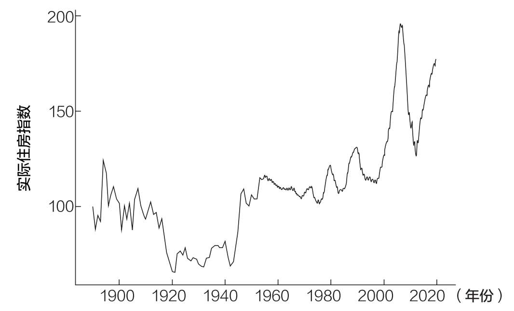

# 第六章 你应该租房还是买房

如何考虑大额购买

1972年，我的外祖父母以2.8万美元的价格买下了他们在加州的房子。如今，这处房产大约值60万美元，是当初购买价的20多倍。即使经过通胀调整，房子的价值也增加了3倍。但除了经济回报，我的外祖父母还在那里养育了3个孩子，包括我的母亲，并在那里抚养了孙辈中的7个孩子，包括我。

我爱那个家。圣诞夜都是在那里度过的。我记得我在厨房里吃了很多外祖母做的美味的花生酱煎饼。我还记得外祖父坐着看电视而给沙发留下的那个永久的凹痕。我还记得我小时候摔在屋外的砖头上，划破了左边的眉毛。我一照镜子就会看到那道疤痕，并回想起当初划破时的情形。

听到这样的故事，你很容易明白为什么有那么多人在鼓吹买房，而不是租房。家不仅可以帮助你建立经济上的财富，而且可以通过提供一个稳定的基础来帮助你建立社会财富。一些人认为这种投资的情感回报是无价的。

但是，在租房还是买房的辩论中，我们在为买房唱赞歌之前，也要考虑到很多其他与房屋所有权相关的成本。

买房的成本

除了抵押贷款，住房所有权还有一系列一次性和持续性的成本。一次性成本包括首付款和与购买有关的费用，而持续性成本包括税费、维护费和保险费。

第一次买房时，你应该准备房屋总价的3.5%~20%作为首付。攒下这么多钱可能需要时间，但下一章将讨论攒房屋首付款的好办法。

攒够首付后，你还将面对大约占房屋价值2%~5%的交易成本。这些成本包括申请费、评估费、发起/承销费等。虽然一些卖家可能会为买家支付这些成本，但这取决于你（或房地产经纪人）的谈判能力。

说到房地产经纪人，这是买房的又一大成本。房地产经纪人通常对他们经手成交的房子收取3%的佣金。如果有两个房地产经纪人参与交易（一个服务买方，一个服务卖方），这意味着买卖双方一共需要支付房屋总价值的6%作为佣金。

总的来说，买房的一次性成本可能为房屋价值的5.5%~31%，这取决于首付、交易成本和雇用的房地产经纪人。如果不算首付，与买房相关的交易成本则为房屋价值的2%~11%。

这就是为什么买房通常只对那些会长期住在里面的人有意义。如果你买卖太频繁，单是交易成本就会抵消预期升值。

除了买房的一次性成本，持续维护的成本可能也很大。在买房后，你还需要支付财产税、维护费和保险费。幸运的是，财产税和保险费通常包括在每月的抵押贷款中。

然而，这些额外成本的大小将根据少数因素而有所不同。例如，税费将取决于房屋所在地和当前税法。

2017年的《减税和就业法案》提高了税费抵扣标准，对许多业主来说，成为业主的主要好处之一（扣除抵押贷款利息）实际上没有了。这是税法将影响买房成本的诸多变化（以及未来的变化）之一。

你住在哪里，买房时付了多少钱，将决定你必须在保险上花多少钱。如果首付低于房屋价值的20%，除了房屋保险，你往往还须支付私人抵押贷款保险（PMI）。这将使你每年花费贷款价值的0.5%~1%。因此，如果你有30万美元的抵押贷款，你将面临每年1500~3000美元的额外成本，即每月125~250美元的私人抵押贷款保险。

最后，从财务和时间的角度来看，房屋的持续维护成本可能是相当大的。虽然这部分成本将根据居住地和房屋建造时间而变化，但大多数专家建议将每年的维护预算控制在房屋价值的1%~2%。这意味着，一处30万美元的房产每年的维护费用应该在3000~6000美元。

除了与房屋维护相关的明确的财务成本，还有巨大的时间成本。我从朋友和家人那里听到了很多有关成为业主就像获得了一份兼职工作的逸事。无论你是雇人定期维修还是自己亲自动手，房屋维护都可能比你最初想象的要占用更多的时间。

这是买房最容易被忽视的成本之一。与租客不同，作为业主，当东西坏了，你必须修缮。虽然有些人会喜欢做这些事，但许多人不会。

无论是买房的一次性成本还是持续性的维护成本，房子往往都是负债而不是资产。当然，租客也不能免受这些财务成本的影响，因为这些成本可能已经包括在租金中。

然而，从风险的角度来看，租客和房东对这些成本的体验非常不同。因为租客确切地知道他们在可预见的未来必须支付什么，而房东则不知道。例如，一年内的特定维护成本可能是房屋价值的4%，也可能是0。这可能会影响房主，但对租房者没有影响。

因此，在短期内，买房通常比租房风险更大。一年之内，买房成本比租房成本波动更大。然而，如果拉长时间，这种情况就会发生改变。

租房成本

租房的主要成本（不包括每月支付的租金）是长期风险。这种风险表现为未来租房成本不确定、住房状况不稳定和搬家成本。

例如，尽管租客能够锁定未来12~24个月的房租，但他们不知道10年后的房租将是多少。他们总是按市场价格租房，而市场价格可能会大幅波动。与此相比，房东确切地知道他们未来将为住房支付什么。

更重要的是，租房时，你的住房状况会不稳定。你也许找到了一个你喜欢的住处，但房东却可能大幅提高租金，迫使你再次搬家。这种住房状况不稳定可能会导致经济和心理上的不稳定，尤其是对那些努力养家的人来说。

最后，由于住房状况不稳定，租客（相较于业主）会更频繁地搬家。我很清楚这一点，因为自2012年以来，我在美国各地住过八套不同的公寓（大约每年一套）。虽然由于朋友和家人的帮助，其中几次搬家很容易，但也有几次需要请搬家公司，成本要高得多。

无论你如何看待它，租房者都面临着绝大多数业主不会面临的长期风险。不过，租房者不太可能面临的一个风险是，他们的住房投资是否会获得良好的回报。

住房投资

不幸的是，当把住房看作一种投资时，情况就没有那么乐观了。诺贝尔经济学奖得主罗伯特·席勒计算出，1915—2015年，经通胀调整后，美国住房市场的年实际收益率“仅为0.6%”。[^45]更重要的是，这部分实际收益大部分发生在2000年之后。

如图6.1所示，从19世纪末到20世纪末，经通胀调整后，美国住房价格基本持平。

图6.1 美国1890年以来的住房指数

这是经通胀调整后美国住房价格没有发生重大变化的100年。在过去的几十年里，美国的房价一直在涨，但我不相信这种趋势会持续很久。

当你把美国住房作为一种投资时，你必须将其与同一时期对另一种资产的投资进行比较。这就是所谓的投资机会成本。

例如，我的外祖父母用2.8万美元购买了他们的房子，并在1972年至2001年每月支付280美元的抵押贷款。2001年前后，房子的价值约为23万美元。但如果他们不买房子，而是把这些钱投资到标准普尔500指数上呢？

如果从1972年到2001年，他们每月向标准普尔500指数投入280美元，到2001年，即使不算股息再投资，他们也将至少得到95万美元。这还不包括他们的首付！如果将首付也用于投资，到2001年他们就会有100多万美元。

尽管我的外祖父母住在加州，经历了美国房地产历史上最好的几十年，但他们的房子带来的经济收益大约是投资一篮子美国股票带来的收益的1/4。

当然，在心理上，持有30年美国股票要比偿还抵押贷款困难得多。当你拥有的是一套房子时，你不会每天看股价，也可能永远不会看到它的价值减半。然而，美国股市并非如此。事实上，从1972年到2001年，有三次主要的市场崩溃（分别是1974年、1987年和21世纪初的互联网泡沫破裂），其中两次崩溃的跌幅超过50%！

这就是为什么住房是一种与股票或其他风险资产根本不同的资产。虽然你的房子不太可能暴跌，但它也不太可能成为你敲开财富大门的入场券。更重要的是，即使你看到你的房价大幅上涨，你也只能在将其出售并在其他地方购买更便宜的房子，或者重新租房的情况下才能变现。

这是否意味着你应该永远租房，并将因此省下来的所有钱投资于其他资产？不一定。正如我之前所说的，你需要考虑非经济原因。更重要的是，考虑买房也有社会原因。

不是要不要买房，而是什么时候买

虽然房子不太可能是一项出色的长期投资，但买房是有社会原因的。根据消费者财务调查，2019年美国的住房自有率为65%。[^46]那些收入和财富水平较高的家庭住房自有率更高。

例如，美国人口普查局的研究人员发现，2020年，那些收入高于中位数收入的家庭住房自有率接近80%。[^47]我的计算结果表明，在消费者财务调查中，那些净资产超过100万美元的家庭住房自有率超过90%。

为什么买房如此普遍？除了可以获取政府补贴和遵循文化规范，买房也是许多美国家庭积累财富的主要方式。

通过观察2019年消费者财务调查数据，研究人员发现，住房“占最低收入家庭总资产的近75%……但对最高收入家庭来说，这一比例仅为34%”[^48]。无论收入水平如何，房子都可能是你（即使不是最理想的）财富积累的来源。

更重要的是，买房可能是你做过的最大的财务决定。这个决定是社会可以接受的，对生活中的许多其他事情至关重要。住房决定了人们住在什么样的社区，他们的孩子在哪里上学，等等。如果你决定一辈子租房，这也很好，但你可能因此被排除在某些社区之外。

这就是为什么大多数买得起房的人往往都会买房。因此，你需要问自己的更重要的问题不是你应该买房还是租房，而是你应该什么时候考虑买房。

买房的最佳时机

买房的最佳时机是当你能满足以下条件时：

·你计划在那个地方待10年。

·你有稳定的个人和职业生活。

·你负担得起。

如果你不能满足以上所有条件，那么你最好选择租房。让我来解释一下。

考虑到买房的交易成本是房屋价值的2%~11%，居住时间够长才能弥补这些成本。简单起见，让我们选择这个范围的中间值，假设买房的交易成本是6%。按照席勒对美国住房市场年实际收益率0.6%的估计，这意味着一般的美国住房需要10年的时间才能升值到足以支付6%的交易成本。

同样，如果你打算在一个地方住10年，但你的个人或职业生活并不稳定，那么买房可能不是正确的选择。例如，如果你在单身时买了一套房子，一旦你决定建立一个家庭，你就可能需要卖掉它，升级到一个更大的房子。此外，如果你经常换工作，或者你的收入很不稳定，那么抵押贷款可能会让你的财务状况处于危险之中。不管怎样，从长远来看，不稳定性会让你更有可能支付更多的交易成本。

这就是为什么当你能更好地预测自己的未来时，抵押贷款的效果最好。当然，未来永远是不确定的，但你对未来的洞察力越强，买房就越轻松。

如果你能负担得起，那么买房就更容易了。这意味着你可以支付20%的首付，并将你的债务收入比维持在43%以下。我用43%这个比例，是因为这是合格（低风险）抵押贷款最大的债务收入比。[^49]需要提醒的是，债务收入比的定义为：

债务收入比=月负债/月收入

因此，如果你有一笔每月还款2000美元的抵押贷款，你目前的月收入为5000美元，没有其他需要偿还的债务，那么你的债务收入比将是40%（2000美元/5000美元）。当然，债务收入比越低越好。

另外，当你买房子的时候，你不必真正支付20%的首付，但你应该有能力支付。这种区别很重要。有能力支付20%的首付表明你能在一定时间内存下足够的现金。

因此，你如果能拿出20%的首付，但不这么做，这没有任何问题。我知道把所有的现金投入像房子这样的非流动性投资在短期内是有风险的。然而，付更多的钱意味着你往往可以负担得起更贵（也可能更大）的房子。

如果你正在考虑是应该存钱买个大房子，还是先买个小房子作为过渡，我建议你再等等，一次性搞定大房子。考虑到交易成本，买一套超出预算的房子可能比先买一套房子然后在几年内卖掉要好。

我知道这听起来很冒险，但你买房后的头几年风险最大。随着时间的推移，你的收入可能会随着通货膨胀而增长，但你的抵押贷款却不会。

我的外祖父母经历过这种情况，因为20世纪70年代的高通货膨胀，他们的抵押贷款（按实际价值计算）减少了一半。1982年，他们为住房支付的费用是10年前的一半。租客就无法享受这个好处。

无论最后你在买房这件事情上做什么决定，重要的是做对你个人和财务状况都最有利的决定。因为买房可能是你做过的最大、最情绪化的财务决定，你应该花时间来做正确的决定。

无论是租房还是买房，你都应该知道积攒首付的最好方法。这是我们下一章的关注点。

[^45]: Shiller, Robert J., "Why Land and Homes Actually Tend to Be Disappointing Investments," The New York Times (July 15, 2016).

[^46]: Bhutta, Neil, Jesse Bricker, Andrew C. Chang, Lisa J. Dettling, Sarena Goodman, Joanne W. Hsu, Kevin B. Moore, Sarah Reber, Alice Henriques Volz, and Richard Windle, "Changes in US Family Finances from 2016 to 2019: Evidence From the Survey of Consumer Finances," Federal Reserve Bulletin 106:5 (2020).

[^47]: Eggleston, Jonathan, Donald Hayes, Robert Munk, and Brianna Sullivan, "The Wealth of Households: 2017," U.S. Census Bureau Report P70BR-170 (2020).

[^48]: Kushi, Odeta, "Homeownership Remains Strongly Linked to Wealth-Building," First American (November 5, 2020).

[^49]: "What is a Debt-to-Income Ratio? Why is the 43% Debt-to-Income Ratio Important?" Consumer Financial Protection Bureau (November 15, 2019).
