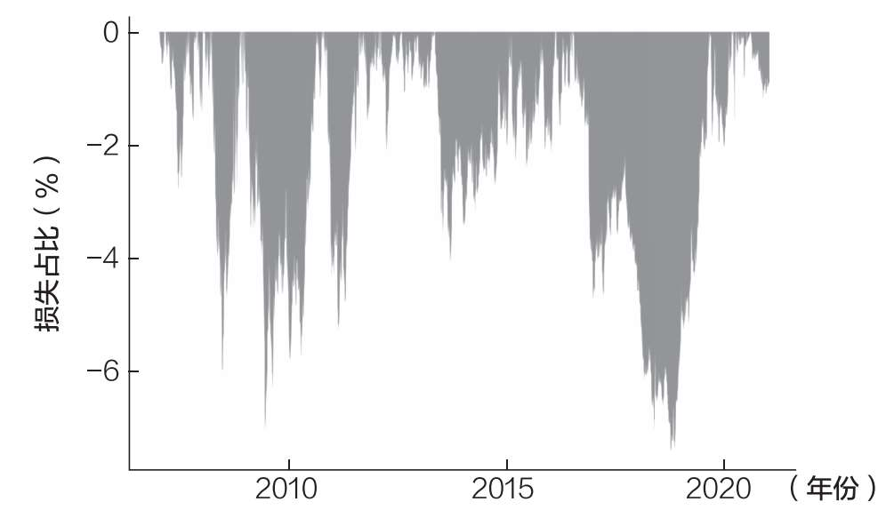
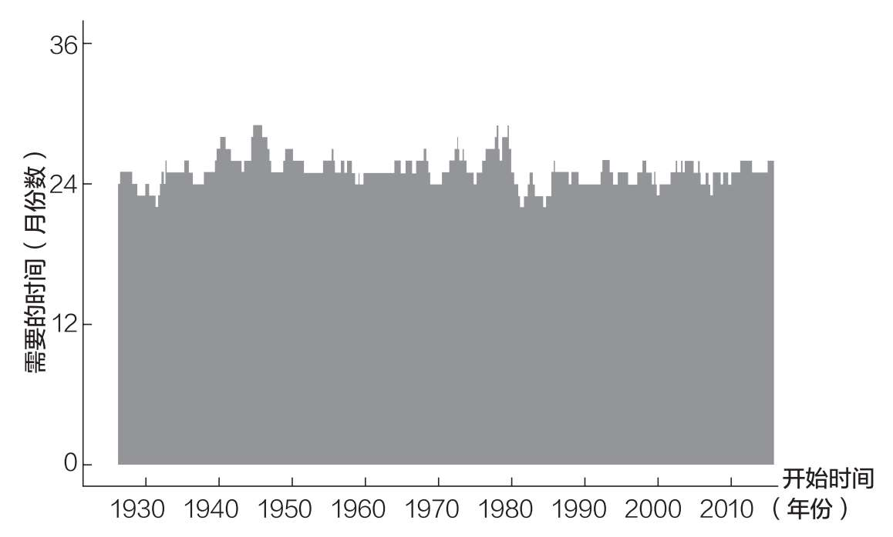
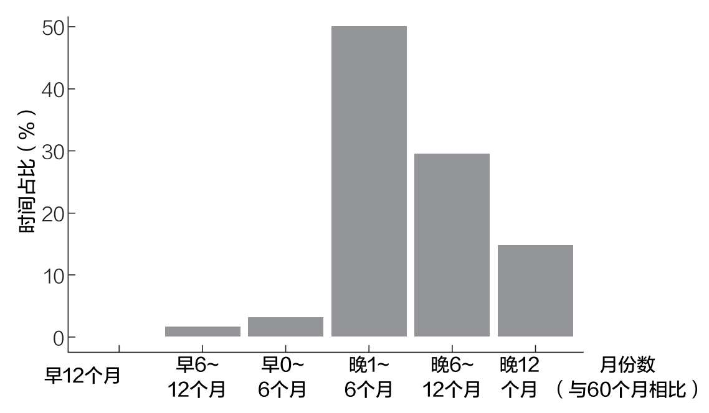
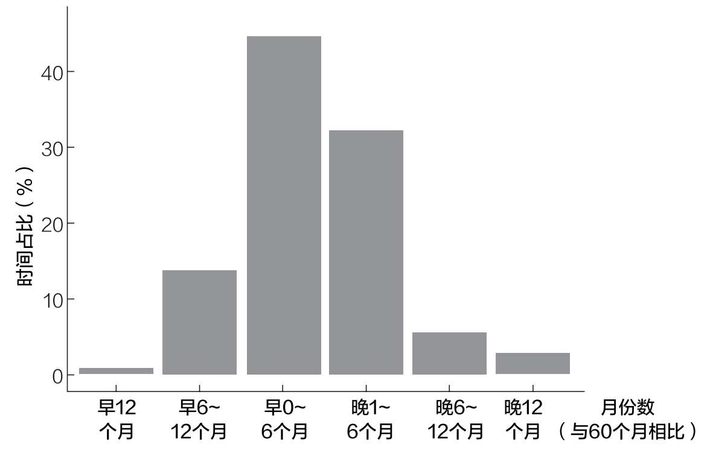
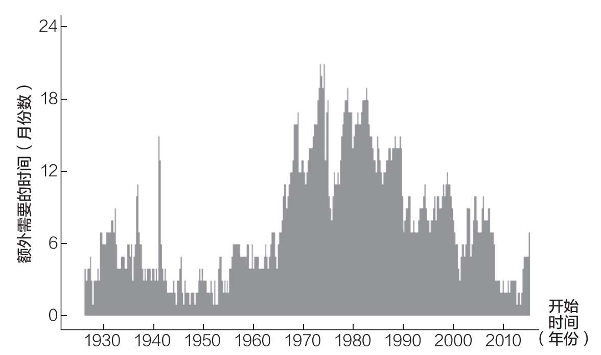
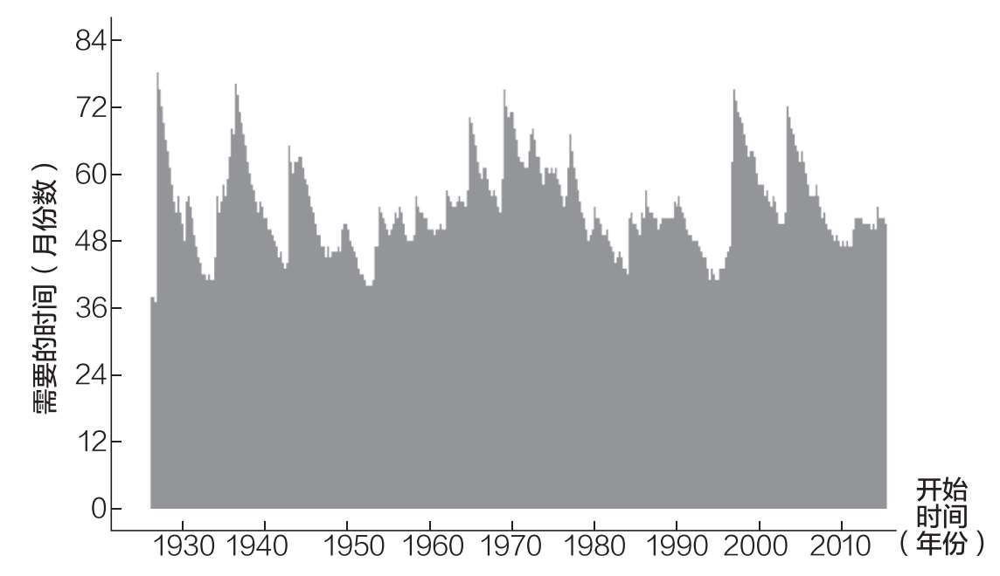

# 第七章

## 如何为房屋首付和其他“大额购买”存钱

为什么时间跨度如此重要

你决定要迈出一大步。

你想买你的第一套房子。或者你想结婚，或者你只是想要一辆新车。无论你下定决心要做什么，你都该存钱。

但是，最好的方法是什么呢？应该持有现金，还是在等待期间投资？

我问了几位与我合作多年的财务顾问，他们的回答都是一样的——现金，现金，现金。当谈到为首付（或其他大件物品）存钱时，现金是最安全的方式。不管什么时候都是这样。

我已经知道你在想什么了。通货膨胀呢？是的，在你储蓄的同时，通胀将使你每年损失几个百分点。然而，考虑到你只在很短的一段时间（几年）内持有现金，这种影响其实很小。

例如，如果你需要存下2.4万美元作为房子的首付，而你每月可以存1000美元，那么在没有通胀的情况下你需要24个月（两年）实现目标。

然而，在2%的年通货膨胀率之下，你需要额外储蓄1000美元才能实现目标。这意味着，由于通货膨胀，你必须存下2.5万美元的名义货币，才能在两年内获得2.4万美元的实际购买力。

是的，这并不理想，但这是为了保证你在需要的时候有钱可用而付出的小代价。从大局来看，多出来的1000美元并不是什么大开销。这就是为什么现金是完成即将到来的大额采购最可靠、风险最低的储蓄方式。

但如果你想在储蓄的同时对抗通胀呢？或者，如果你需要储蓄两年以上的时间呢？现金仍然是最好的选择吗？

为了回答这个问题，让我们看看历史上现金储蓄与债券投资的比较。

债券比现金好吗

为了比较投资债券是否优于持有现金，我们可以进行同样的操作，每月储蓄1000美元，但这次我们将把这些钱投资于美国国债。我们通过ETFs（交易型开放式指数基金）或指数基金来进行投资。通过购买美国国债，我们可以在持有低风险资产的同时获得一些收益。

有什么不一样呢？

低风险不等于没有风险。如图7.1所示，中期美国国债的价格经常下跌3%或更多。

图7.1 中期美国国债价格的下跌

这些债券价格的正常波动说明了为什么与现金储蓄相比，将储蓄投资于债券可能会延迟你达成目标的时间。

回到我们每月储蓄1000美元直到存下2.4万美元的例子。在终点线附近债券价格下跌3%将使你的投资组合损失近750美元。这一时期的价格下跌将比早期的类似下跌更糟糕，因为你投资的钱更多，损失也就更大。

为了抵消这种下跌，你必须多存1000美元（相当于一个月的储蓄金额）才能达成你2.4万美元的目标。即使持有债券，你也可能需要超过预计的24个月才能达到储蓄目标。

事实上，如果我们将上述测算回溯至1926年，情况也是如此。平均而言，每月投资1000美元美国国债（经通胀调整后），你在25个月后才能攒下2.4万美元。

正如你在图7.2中看到的，当我们投资债券时，有时需要25个多月才能达成目标，有时不到25个月就能达成目标。

图7.2 每月省下1000美元并全部投资于美国国债，要攒够2.4万美元所需的时间

然而，与投资债券相比，持有现金需要的时间更长。如果我们把债券换成现金，重新进行上述测算，经通胀调整后，平均需要26个月才能达到2.4万美元的储蓄目标。

为什么这比我之前提到的25个月要长？因为通胀率会变化！如果通胀稳定在2%的水平，那么持有现金一般需要25个月能达到2.4万美元的目标。

然而，更高的通胀率意味着你将需要更多的时间来实现你的储蓄目标。事实上，在某些时期，如果每月储蓄1000美元，你需要花近30个月的时间才能达到2.4万美元的目标。

虽然在前两年债券的表现往往比现金好，但并没有好多少。正如我上面所说，如果投资债券，你需要25个月才能攒下2.4万美元，如果持有现金，则可能需要26个月。

与其在需要现金时担心债券价格是否会下跌，还不如多存1000美元。

事实上，自1926年以来，在大约30%的时间里，比起投资债券，持有现金能同样或者更好地实现2.4万美元的储蓄目标。

这表明，当存钱时间小于两年时，现金可能是最佳方式，因为风险较小。我采访的财务顾问在这方面的直觉是准确的。

但是，如果你想为一件需要储蓄两年以上才能买到的大件商品存钱，那该怎么办？你应该改变策略吗？

如果需要储蓄两年以上，怎么办

当储蓄时间大于两年时，持有现金的风险可能比最初看起来的要大得多。

例如，如果你想通过每月储蓄1000美元的现金来攒下6万美元，不考虑通胀需要60个月（5年）。

然而，如果你以1926年至今为测算区间，你会发现50%的时间需要61~66个月（比预期长1~6个月）才能达成目标，15%的时间需要72个月或更长时间（比预期至少长12个月），如图7.3所示。

图7.3 每月储蓄1000美元现金，你需要多长时间才能存下6万美元

平均而言，持有现金需要67个月才能达到6万美元的储蓄目标。为什么？因为时间越长，通胀的影响越大。

与此相比，投资债券平均只需要60个月就可以达到6万美元的储蓄目标。

如图7.4所示，债券带来的收益抵消了通胀的影响，有助于维持购买力。

图7.4 每月将1000美元用于投资债券，你需要多长时间才能存下6万美元

更重要的是，与我们想要在24个月内攒下2.4万美元相比，想要在60个月内存下6万美元，持有现金的风险要大得多。

一两个月的额外储蓄不再能够抵消通胀的影响。而是需要平均额外7个月的现金储蓄才能达到这一目标。

是的，在某些情况下，你仍然可以通过只持有现金就能在60个月内达到6万美元的目标，但这个可能性很小。由于期限较长，持有现金的风险大于投资债券的风险。

通过图7.5，你可以更清楚地看到这一点。看看与投资债券相比，持有现金需要额外存多少个月的钱才能实现6万美元的储蓄目标。

正如你所看到的，在所有测算过的时间段，长期储蓄时，现金的表现都不如债券。

图7.5 与投资债券相比，每月储蓄1000美元的现金，总金额达到6万美元额外需要的时间

这是否意味着存在一个最佳时间节点，你应该不再持有现金，转而投资债券？也不尽然，但我们可以做一个大胆的猜测。

例如，鉴于攒钱期限为两年时持有现金优于投资债券，而攒钱期限为5年时投资债券优于持有现金，上述“切换点”将介于两者之间。在查看了数据后，我发现这一时间点似乎在3年左右。

如果你的攒钱期限不到3年，持有现金。如果攒钱期限超过3年，则投资债券。

这就引出了一个问题：投资股票会比投资债券更好吗？

投资股票好过投资债券吗

现在，让我们看看每月存下1000美元，并将其投资于标准普尔500指数的情况。

与投资债券相比，这种策略如何？大多数时候这种策略表现更好，但有时也会更差。

例如，你打算每月存1000美元直至存下6万美元，如果投资债券，平均需要60个月，如果投资股票，只需要54个月。

然而，正如你在图7.6中所看到的，投资股票有时也会需要更长的时间才能达成储蓄目标。图中的峰值显示，有时这个时间甚至会超过72个月。

图7.6 每月将1000美元用于投资股票，总金额达到6万美元所需的时间

为什么会这样？

因为与投资债券相比，在暴跌期间（如1929年、1937年、1974年、2000年和2008年）投资股票意味着你需要额外储蓄和投资一年（或更长时间）才能达到目标。

更重要的是，该分析假设，无论潜在的经济状况如何，你都能够每月投资1000美元。但情况并非总是如此。

在重大市场崩盘后，你可能会失去工作或有其他金融需求，以至你存不下那么多钱。这是通过投资股票为大额购买攒钱可能存在的风险。

然而，为大额购买而将储蓄进行投资并不一定只能是0或1的选择。你不必要么100%投资于股票，要么100%投资于债券。

事实上，当为5年（或更长时间）后的大额购买攒钱时，你可以找到一个平衡的投资组合，使之更适合自己的时间表和风险状况。

为什么时间是最重要的因素

综上所述，显然，储蓄方式深受储蓄时间的影响。

从短期来看，现金才是王道。而随着时间的推移，你必须考虑其他选择。除非你愿意为每年的通货膨胀付出代价，否则你将需要持有债券，可能还有股票，让你的钱在一段时间内保持购买力。

最后，上述分析假设你能一直存下钱，直到达成一个特定目标。然而，正如我在前面章节中提到的，我们的财务状况很少如此稳定。

如果你碰巧比预期提前达成了目标，那么恭喜你！你可以立即购买你想要的高价商品了。

然而，如果需要在将来消费（例如在未来某个固定日期举办婚礼），那么你将需要以某种方式投资，以保持购买力。然而，这意味着要么放弃现金储蓄，选择更高增长率的投资方式，要么存下更多的钱，以抵抗通货膨胀。

无论如何，个人理财的某些领域可能更像艺术而不是科学。这就是为什么我建议你根据你当时可用的投资选择来调整你的策略。

现在我们已经了解了如何为首付存钱，接下来可以继续回答最大的储蓄问题了——你什么时候可以退休？
