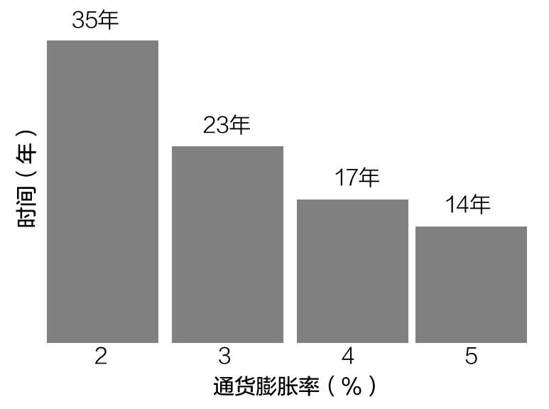
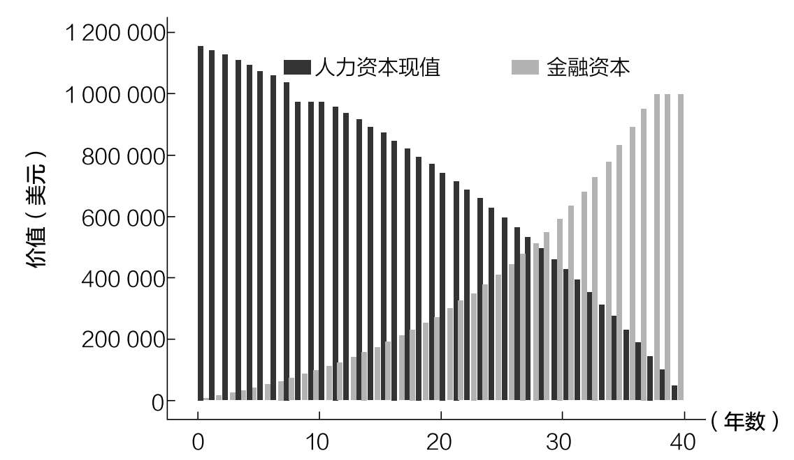

# 第九章

## 为什么要投资

让钱增值在当下比以往任何时候都重要的三个原因

退休的概念直到19世纪末才出现。在那之前，大多数人在去世之前要一直工作。没有黄金岁月，没有新的生活与爱好，没有海滩漫步。

1889年，德意志帝国宰相奥托·冯·俾斯麦创建了世界上第一个由政府资助的退休计划，改变了这一局面。当时，70岁以上的人有资格从政府领钱。

当被问及为什么要创建这样一个退休计划时，俾斯麦回答：“那些因年龄和残疾而失去工作的人有充分的理由要求国家照顾他们。”60尽管德国的退休年龄最初是70岁，但在1916年降低到65岁。

俾斯麦的革命性思想最终催生了包括美国在内的世界多国政府资助的退休计划。

为什么这种思想会席卷全球呢？因为人们的寿命开始延长。

1851年，英格兰和威尔士只有25%的人活到了70岁；到1891年，这一数字达到了40%；如今，超过90%的人能活到70岁。在同一时期，美国和其他发达国家的人口寿命也出现了类似的增长。61

全球人均寿命的大幅延长是当代退休理念的催化剂。随着退休制度的产生，投资和财富保值需求也在增加。

在此之前，人们没有投资的概念，因为没有必要为未来投资。但是，在过去的150年里，健康和医学的进步改变了这一切。

现在我们有了投资的理由，也知道为什么过去的人不投资。但这并不是投资的唯一理由，只是主要理由之一。

本章将介绍投资的三个主要原因。

1. 为未来的自己存钱。

2. 抵御通货膨胀。

3. 用金融资本替代人力资本。

我们将依次展开讨论这些原因，并思考为什么它们对个人财务很重要。

1. 为未来的自己存钱

正如我们刚才所讨论的，人要为未来的自己，主要是老年的自己存钱。因为有一天你会不愿意或不能工作，投资可以让你拥有一个资金池，在年老时使用。

当然，人们很难想象年老的自己，会感觉很陌生。那时的自己会和现在的自己一样吗？还是会有很大的不同？什么样的经历可能塑造或改变一个人？你能坦然接受自己的变老吗？

尽管未来的自己和现在的自己可能有很大的不同，研究表明，为未来的自己考虑是改善投资行为的最好方法之一。

例如，一项实验让一组人看自己的“年龄增长效果图”（经过数字化处理后的老年照片），来看看这是否会影响人们对退休金的分配。的确会有影响！

看到自己老年照片的人分配给退休的钱（平均）比没有看到这些照片的人分配的钱多2%。62这表明，看到自己老年的状态可能有助于鼓励长期投资行为。

在研究哪些动机对储蓄行为影响最大时，其他研究人员得出了类似的结论。他们发现，除了存钱以备不时之需，那些把退休作为储蓄动机的人通常比那些没有存钱动机的人能存更多的钱。63

这意味着其他的财务目标，如为孩子存钱、为度假存钱或为房子存钱，与改善储蓄行为无关。然而，为退休存钱却可以改善储蓄行为。研究人员发现，即使控制了收入等标准社会经济指标，实验也会得到同样的结论。

正如我在第二章中强调的，收入是决定储蓄率的最大因素之一。然而，研究表明，即使收入一样，那些将退休作为储蓄动机的人也更有可能定期储蓄。

因此，如果你想储蓄和投资更多，就自私一点儿吧（多为未来的自己着想）。但是，未来的自己并不是投资的唯一理由。你之所以要投资，也是因为还有其他不利的金融因素。

2. 抵御通货膨胀

亨利·扬曼说过：“美国人越来越强壮。20年前，价值10美元的杂货需要两个人来搬运。如今，一个5岁的孩子都能做到。”

遗憾的是，扬曼并不是在谈论美国年轻人日益强壮的体力，而是在谈论美元的贬值。扬曼的笑话调侃了通货膨胀，或者说，随着时间的推移，物价普遍上涨是一个不可避免的现实。

你可以把通货膨胀想象成一种无形的税，由某一特定货币的持有者支付。持有者年复一年地缴纳这种税，却甚至没有意识到这一点。他们的食品杂货账单慢慢攀升，房产和车辆的保养费用越来越高，孩子的教育费用每年都在增加。与此同时，他们的工资上涨了吗？可能涨了。也可能没有涨。

不管怎样，通货膨胀的祸害仍将有增无减。虽然通货膨胀的影响在短期内通常很小，但从较长时间来看，这种影响可能相当显著。

如图9.1所示，如果年通货膨胀率为2%，货币的购买力将在35年内减半。在每年5%的通货膨胀率下，货币的购买力每隔14年就会减半。

图9.1 不同通货膨胀率导致货币购买力减半所需的时间

这意味着，在适度的通货膨胀水平下，日常商品的价格应该每20~30年翻一番，如果通货膨胀率更高，价格增长速度要快得多。

一个更极端的通货膨胀（恶性通货膨胀）的例子发生在第一次世界大战结束后的魏玛共和国。在特定时期内，通货膨胀率可能非常高，商品的价格甚至会在一天之内发生变化。

正如亚当·弗格森在《当货币死亡》一书中所描述的：

有这样的一个故事……去餐馆吃完饭结账时发现，价格已经比点餐的时候要高了。一杯5000马克的咖啡，喝下去要花6000马克。

虽然这种情况很少见，但这说明了通货膨胀在极端情况下的破坏性影响。

然而，有一种有效的反击方式——投资，可以应对通货膨胀。持有能够保持或提高购买力的资产可以抵消通货膨胀的影响。

例如，1926年1月至2020年底，1美元需要增长到25美元才能跟上通货膨胀。在这段时间里，投资美国国债或美国股票的收益能与上述增长持平吗？

能，而且很容易。

如果你在1926年投资1美元购买长期美国国债，到2020年底，这1美元将增长到200美元（收益率比通货膨胀率高约13倍）。如果你在1926年投资1美元购买美国股票，在同一时期内，这1美元会增长到10937美元（收益率是通货膨胀率的约729倍）！

这说明投资可以抵消通货膨胀的影响，以实现财富的保值和增值。

对退休人员来说，通货膨胀的影响更加明显，因为他们支付的价格越来越高，但工资却没有相应地增长。由于退休人员不工作，他们对抗通货膨胀的唯一武器就是资产增值。记住这一点，尤其是在退休即将到来的时候。

总的来说，虽然持有现金总是会有一些很正当的理由（例如应对紧急情况、进行短期储蓄等），但从长远来看，持有现金几乎得不偿失，因为通货膨胀每年都会造成损失。因此，如果你想把这种损失降到最低，现在就要把非急用现金投资出去。

如果抵御通货膨胀的诱惑还不够，那么替代人力资本的诱惑可能会说服你投资。

3. 用金融资本替代人力资本

投资的最后一个主要原因是用金融资本替代人力资本。

在第二章，我们将人力资本定义为你的技能、知识和时间的价值。虽然你的技能和知识在不断增长，但你的时间没有。

因此，投资是唯一能让你在时间的洪流中奋起反击，并将不断减少的人力资本转化为生产性金融资本的方法。金融资本会让你在未来很长一段时间都有收益。

你的人力资本今天值多少钱

在讨论这个问题之前，我们首先必须弄清楚，你的人力资本当前值多少钱。我们可以通过估算你未来收入的现值来计算。

现值是未来现金流在今天的价值。例如，如果一家银行承诺每年为你的存款支付1%的利息，那么你今天给他们100美元，一年后你会得到101美元。反过来应用这个逻辑，一年后101美元的现值是100美元。

在这个例子中，未来的101美元用1%的利率折现到现在，这1%通常被称为折现率。在评估收入损失时，大多数人身损害纠纷的律师使用1%~3%的折现率。

因此，如果我们知道你未来会赚多少钱以及一个折现率，我们就可以计算出这些收入现在值多少钱。

例如，如果你将在未来40年里每年赚5万美元，那么你未来40年的总收入将是200万美元。然而，假设折现率为3%，这些未来收益的现值约为120万美元。

这意味着你的人力资本价值约为120万美元。假设这些估计是准确的，那么你应该愿意用努力工作换取120万美元。为什么？因为你可以用这120万美元来复制你未来的收入。

换句话说，如果你今天投资这120万美元，年收益率为3%，在未来40年里，你每年可以提取5万美元，然后钱就被花光了。

正如你所看到的，每年5万美元的现金流与你未来40年的收入完全相同！这就是为什么说人力资本和金融资本是可以互换的。

这一点很重要，因为你的人力资本正在减少。你每工作一年就会减少人力资本的现值，因为你未来的收入少了一年。

因此，保证你将来有一些收入（政府资助收入之外）的唯一方法就是积累金融资本。

积累金融资本以替代人力资本

你可以想象一下，你人力资本的现值每年都在减少，而你的金融资本则在增加以抵消人力资本的减少。如图9.2所示，我们假设你连续40年每年赚5万美元，你把收入的15%存起来，年收益率为6%。

图9.2 年龄越大，越应该用金融资本替代人力资本

这就是你储蓄和投资时会发生的事情。每年，你工作所得的一部分收入都应该转换成金融资本。当你开始以这种方式看待金钱时，你就会意识到它既可以用来消费商品，也可以为你创造更多的钱。

从本质上讲，通过投资，你正在将自己重建为一种金融资产，一旦你失业了，这种方式就可以为你提供收入。所以，在你停止朝九晚五的工作后，你的钱可以继续为你工作。

在人们应该投资的所有理由中，这可能是最令人信服的，也是最容易被忽视的。

这一概念有助于解释为什么一些职业运动员可以一年赚数百万美元，但最终还是破产了。他们没有足够快地将人力资本转化为金融资本，以维持他们离开体育职业后的生活方式。

如果你一生的大部分收入是在4~6年赚到的，那么储蓄和投资对你来说就比对其他人更重要了。

不管你是如何赚钱的，意识到你的能力最终会消失是投资的最佳动力之一。

既然我们已经讨论了为什么你应该投资，接着我们要来看看你应该投资什么。
