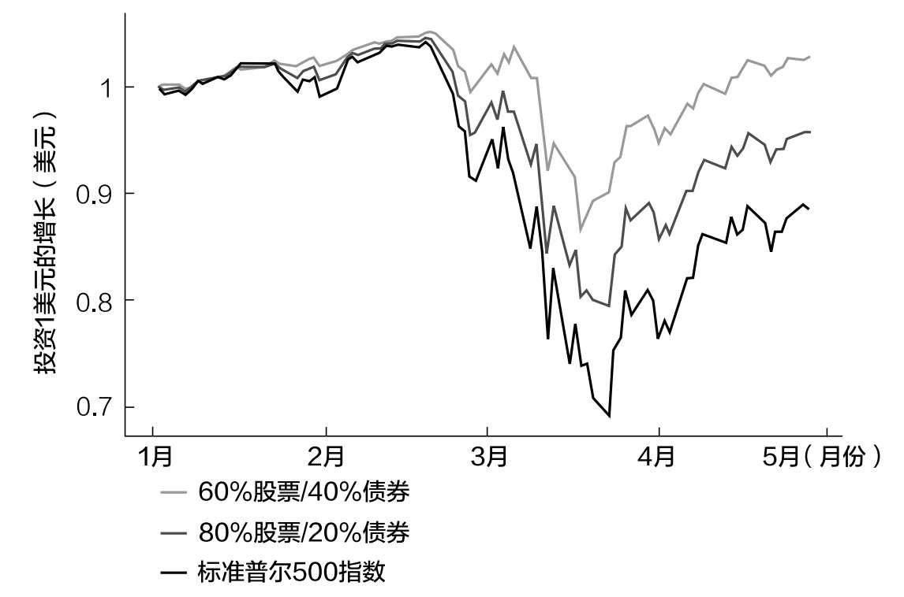
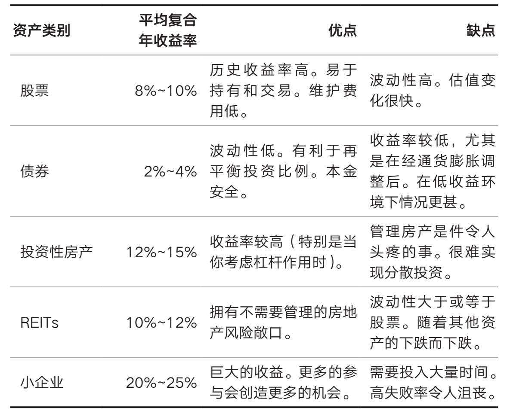

# 第十章 你应该投资什么

真正的致富之路不止一条

虽然你可能从未听说过沃利·杰，但他被认为是史上非常伟大的柔道教练之一。尽管从未参加过柔道比赛（只参加过柔术），杰却在柔道和其他武术领域获奖无数。

杰的一个重要见解是，并不是每个人都能像他那样学习。

教练最大的错误就是完全按照自己受教的方式去教别人。曾经有个老师对我说：“我所有的学生都得到了我的真传。”然后在实战中，他的学生没有一个能打败我的学生。一个都没有。所以我告诉他，他必须进行个性化教学。[^64]

杰意识到，对某些人有用的东西不一定对其他人有用，在柔道和投资中都是如此。

然而，投资建议很少以这种方式呈现。相反，你通常会碰到一个所谓的大师，他声称自己知道一条通往财富的真正道路。但实际上，这样的路径有很多。赢的方法有很多。

因此，建立财富的正确方法是探索所有路径，以找到最适合你的方法。这就是为什么我说，如果你想变得富有，那么你需要不断购买各种各样的创收性资产。你应该还记得本书前言中的内容。这是“买，买，买”的核心要义。

最难的部分是确定拥有什么样的创收资产。大多数投资者在创建投资组合时很少冒险投资股票和债券。我能理解他们。不过，这两种资产类别是积累财富的绝佳选择。

但股票和债券也只是投资的冰山一角。你如果真的想增加财富，就应该考虑投资当今世界提供的所有选择。

为此，我整理了一份能产生收入的最佳资产清单，你可以用它来增加你的财富。对于所讨论的每一种资产类别，我将介绍它的定义和投资利弊，最后告诉你如何投资。

下面的列表不是推荐，而是帮助你开始进一步研究。因为我不知道你目前的情况，所以不确定以下哪些资产适合你。

事实上，我只投资过下面列出的四种资产类别，因为其中一些对我来说没有意义。我建议你在增加或删除投资组合中的资产之前，对每个资产类别进行全面评估。

话虽如此，让我们从我个人最喜欢的开始吧。

股票

如果让我选择一类一骑绝尘的资产，股票绝对是首选。股票代表企业的所有权（股权），是非常好的资产，从长远来看，投资股票是创造财富最可靠的方式之一。

为什么你应该/不应该投资股票

正如杰里米·西格尔在《股市长线法宝》中所说的那样：“在过去的204年里，美国股市的年均实际收益率为6.8%。”[^65]

当然，美国股市是过去几个世纪表现最好的股市之一。然而，数据表明，随着时间的推移，全球其他许多股市也获得了经通胀调整后的正收益（实际收益）。

例如，当埃尔罗伊·迪姆松、保罗·马什和迈克·斯汤顿分析了16个不同国家1900—2006年的股本收益时，他们发现所有这些国家都有长期的正实际收益。其中年化实际收益率最低的是比利时，为2.7%，最高的是瑞典，同期接近8%。

美国在这些国家中处于什么位置呢？

前25%（第75百分位）。虽然美国的收益率高于世界平均水平，但仍落后于南非、澳大利亚和瑞典。[^66]这说明，尽管美国的股票收益率非常高，但在全球舞台上，美国并不是异类。

更重要的是，迪姆松、马什和斯汤顿所做的分析是针对人类历史上破坏性最大的20世纪。尽管经历了两次世界大战和大萧条，全球股市（作为一个整体）依然提供了正的长期实际收益。

《财富、战争与智慧》一书的作者巴顿·毕格斯研究几个世纪以来哪种资产类别最有可能使财富保值和增值，得出了类似的结论。他说：“鉴于其流动性，你不得不承认，股市是财富最好的去向。”[^67]

当然，20世纪全球股市的上升趋势可能不会一直持续，但我还是相信股市会上行。

持有股票的另一个好处是不需要持续地维护。你拥有企业并获得收益，而其他人（管理层）为你经营企业。

尽管我刚才对股票大加赞扬，但投资股票并不适合胆小的人。事实上，股市在一个世纪里会有几次超50%的价格大跌，每4~5年下跌30%，至少每隔一年下跌10%。

正是股票这种高度波动的特性使人们在动荡时期难以坚持持有。即使是经验最丰富的投资者，看到10年的增长在几天内消失也会感到痛苦。

对抗这种波动最好的方法是着眼于长期。虽然这不能保证收益，但历史证据表明，只要有足够的时间，股市往往会弥补其周期性的损失。时间是股票投资者的朋友。

如何投资股票

你可以分散投资个股、指数基金和ETFs，这会让你留有更大的敞口。例如，标准普尔500指数基金可以为你投资美国股票，而全球股票指数基金将为你投资全球股票。

我更喜欢持有指数基金和ETFs而不是个股，原因有很多（下一章将主要讨论），主要是因为指数基金是一种简单又廉价的实现分散投资的方法。

即使只通过指数基金持有股票，对于应该持有哪种股票也众说纷纭。有人认为应该关注规模（小型股），有人认为应该关注估值（价值股），还有人认为应该关注价格趋势（趋势股）。

甚至还有人认为，持有经常分红的股票是致富的必胜之道。提醒一下，股息是企业支付给股东的，是你的利润。所以，如果你拥有一家公司5%的股份，这家公司总共支付100万美元的股息，那么你将得到5万美元。很可观吧？

无论你选择哪种股票投资策略，对这类资产留有一定的敞口才是最重要的。就我个人而言，我通过三种不同的ETFs持有美国股票、发达市场股票和新兴市场股票。我还持有一些小型价值股。

这是投资股票的最佳方式吗？谁知道呢？但它对我有效，从长远来看应该会有很好的效果。

股票总结

平均复合年收益率：8%~10%。

·优点：历史收益率高。易于持有和交易。不怎么需要维护（由其他人经营）。

·缺点：波动性大。估值可能会根据市场参与者的情绪而非企业基本面迅速变化。

债券

前面我们已经讨论了高歌猛进的股市，现在让我们来讨论一下更为平静的债券市场。

债券是投资者向借款人发放的贷款，借款人承诺在一定期限内偿还。这个“一定期限”被称为债券期限。许多债券需要在债券期限内定期支付利息（称为息票）给投资者，然后在期限结束时偿还全部本金。支付的年息除以债券价格就是收益率。如果你以1000美元购买债券，每年得到100美元利息，那么这只债券的收益率将为10%（100美元/1000美元）。

借款人可以是个人、企业或政府。大多数时候，美国投资者在讨论债券时，指的是美国国债——美国政府是借款人。

美国国债有长短不同的期限：

1~12个月

2~10年

10~30年

你可以在Treasury.gov.网站上找到不同期限美国国债的利率。[^68]

除了美国国债，你还可以购买海外政府债券、公司债券（向企业贷款）和市政债券（向地方/州政府贷款）。虽然这两类债券的利息通常比美国国债高，但风险往往也更高。

为什么它们的风险高于美国国债？因为美国财政部是全球信誉较好的债务人。

由于美国政府可以随心所欲地印美元，任何借钱给美国政府的人几乎都可以收回本金。但对其他国家的政府、美国地方政府或企业来说，情况就未必如此了，因为它们都可能违约。

这就是为什么我倾向于只投资美国国债和我所在州的一些免税市政债券。即使我想承担更大的风险，也不会选择投资风险更高的债券。债券应该是分散风险的资产，而不是风险资产。

我明白，持有收益率更高、风险更高的债券是有道理的，尤其是考虑到自2008年以来美国国债的收益率一直很低。然而，收益率并不是唯一重要的因素。债券还有其他对投资者有用的属性。

为什么你应该/不应该投资债券

我推荐债券是因为债券具备以下特点：

1. 当股票（和其他风险资产）价格下跌时，债券价格往往会上涨。

2. 债券比其他资产的收入流更稳定。

3. 债券可以提供流动性，以再平衡你的投资组合或偿还债务。

在市场抛售期间，当其他资产的价格都在下跌时，债券是唯一价格往往会上涨的资产。这种情况往往发生在投资者抛售风险较高的资产以购买债券的时候，也就是通常所说的“避险”。因此，债券可以在最糟糕的时候充当主要的投资工具。

同样，由于其稳定性，随着时间的推移，债券能提供更稳定的收入。由于美国政府可以随心所欲地印美元（并偿还债券持有人），你不必担心债券收益的变化。

最后，债券由于在市场暴跌时更稳定，往往也能提供很好的流动性，以防你需要额外的现金来再平衡投资组合或偿还债务。例如，如果你因为金融恐慌失去了工作，你会很欣慰地看到，你可以通过投资组合中的债券来度过这个困难时期。换句话说，你可以卖出一些债券变现。

通过研究2020年初新冠病毒感染疫情引起的市场暴跌期间各种投资组合的情况，你可以很清楚地看到债券在稳定投资组合方面的作用。如图10.1所示，债券（美国国债）持有比例较高的投资组合跌幅小于债券持有比例较低的投资组合。

图10.1 持有更多债券的投资组合跌幅更小（2020年1月1日—2020年4月28日）

在这种情况下，2020年3月，60%股票/40%债券和80%股票/20%债券两种投资组合的跌幅均小于只持有标准普尔500指数基金的投资组合。

更重要的是，那些留有债券敞口并在危机期间调整了投资组合的投资者在随后的复苏中获得了更大的收益。例如，我很幸运地在2020年3月23日调整了我的投资组合。市场见底的那天，我卖出了一些债券，买入了一些股票。是的，这个时机完全是运气，但我持有债券并能够出售一些债券购买股票，这并不是运气。

然而，债券的收益率往往远低于股票和大多数其他风险资产的收益率。当市场处于低位时尤其如此，比如在2008年和2020年。在市场低迷的环境下，经通胀调整后，债券的收益可能接近零，甚至为负。

如何购买债券

你可以直接购买单只债券，但我建议通过债券指数基金或ETFs购买，因为这样更容易。

虽然关于个人债券和债券基金之间的表现是否存在实质性差异，过去一直存在争论，但实际上二者并没有实质性差异。AQR资本管理公司创始人克利夫·阿斯尼斯在2014年的《金融分析师杂志》上彻底驳斥了这种观点。[^69]

无论你如何购买债券，它们都可以发挥提供增长以外的重要作用。俗话说得好：“买股票是为了吃得好，但买债券是为了睡得好。”

债券总结

·平均复合年收益率：2%~4%（在低利率环境下可能接近0）。

·优点：波动性低、有利于调整投资组合、本金安全。

·缺点：收益率低，尤其是在经通胀调整之后。在低收益的环境下，这对收入来说可不是好事。

投资性房产

除了股票和债券，最受欢迎的创收资产之一是房地产投资。拥有一套投资性房产是很好的，你可以自住，也可以把它出租给别人，赚取额外收入。

为什么你应该/不应该购买投资性房产

如果你能很好地管理房产，其他人（租客）就会帮你支付抵押贷款，同时你还可以享受房产长期的增值。此外，如果在购买房产时能够贷款，收益可能会因为杠杆作用而被放大。当贷款购买投资性房产时，杠杆也会扩大你对房产价格变化的风险敞口。

例如，如果你为一处50万美元的房产首付了10万美元，这意味着你将借贷40万美元。假设一年后房产增值到60万美元。如果你卖掉房产并还清贷款，你将剩下大约20万美元，而不是原来的10万美元。由于杠杆作用，房价20%的上涨让你获得了100%的收益（10万美元变成了20万美元）。

虽然令人难以置信，但事实确实如此。你必须记住，如果价格下跌，杠杆也会对你不利。例如，如果房子的价格从50万美元跌到40万美元，卖掉房子后你就血本无归了。房产价格下降20%会导致你的投资亏损100%。

由于房地产价格的极端波动往往是罕见的，对房地产投资者来说，杠杆往往有利可图。

尽管拥有一处投资性房产从财务上来看有许多好处，但它也需要耗费比打理其他资产更多的精力。

房地产投资需要有与人打交道的能力（租户），你还需要上传房产信息到租赁网站，让它看起来对潜在租户有吸引力，并进行长期维护，等等。在做这些事情的同时，你还必须处理房贷带来的额外压力。

如果一切顺利，拥有一处投资性房产会是一件美妙的事情，尤其是当大部分款项是贷款的时候。然而，当出现2020年新冠病毒感染疫情导致旅游受限那样的情况时，问题就出现了。许多依靠爱彼迎房屋租赁网站的创业者从惨痛的经历中认识到，投资房地产并不总是那么容易。

虽然投资房地产的收益可能比股票或债券高得多，但这些收益也需要你付出更多的努力。

最后，买投资性房产类似于买个股，因为它们无法分散投资。当购买投资性房产时，你承担了该房产的所有风险。房地产市场有可能蓬勃发展，但如果你的房产有太多潜在问题和成本，结果可能会很糟糕。

鉴于大多数投资者不太可能拥有足够多的投资性房产来实现多元化，单一投资性房产的风险是一个问题。

然而，如果你想对自己的投资有更多的控制权，也喜欢房地产的有形属性，那么你应该考虑将房地产投资作为你投资组合的一部分。

如何购买投资性房产

购买投资性房产的最好方法是通过房地产经纪人或直接与卖方谈判。这个过程可能相当复杂，所以我建议你在走这条路之前深入研究。

投资性房产总结

·平均复合年收益率：12%~15%（取决于当地的租赁条件）。

·优点：收益率高于其他更传统的资产类别，尤其是在使用杠杆时。

·缺点：管理物业和与租户打交道可能是一个令人头疼的问题。很难分散投资。

REITs（房地产投资信托基金）

如果你喜欢房地产，但不想自己管理，那么REITs可能比较适合你。REITs会持有和管理房地产，并将这些房地产的收入支付给基金持有者。

事实上，法律规定，REITs至少要将应税收入的90%作为股息支付给股东。这一要求使其成为最可靠的创收资产之一。

然而，并不是所有REITs都是一样的。住宅房地产投资信托基金可以持有公寓楼、学生公寓、人造住宅和独栋住宅，而商业房地产投资信托基金可以持有办公楼、仓库、零售空间和其他商业地产。

此外，REITs可以公开交易、非公开交易或公开不交易。

·公开交易的REITs：像其他上市公司一样在证券交易所交易，对所有投资者开放。

1. 任何持有股票指数基金的人都已经变相持有了一些公开交易的REITs头寸，所以只有在你想增加房地产头寸的情况下，才有必要购买更多的REITs。

2. 与其购买单一公开交易的REITs，不如购买公开交易的REITs指数基金——它投资于一篮子REITs。

·非公开交易的REITs：不在证券交易所交易，只提供给合格投资者（净资产不低于100万美元或过去三年的年收入不低于20万美元的人）。

1. 需要一个经纪人，可能产生高昂费用。

2. 监管较少。

3. 由于持有期限较长，流动性较差。

4. 可能产生比公开交易的REITs更高的收益。

·公开不交易的REITs：不在证券交易所交易，但通过众筹向所有大众投资者开放。

1. 比非公开交易的REITs监管更多。

2. 有最低投资要求。

3. 由于持有期限较长，流动性较差。

4. 可能产生比公开交易的REITs更高的收益。

虽然我只投资过公开交易的REITs的ETFs，但房地产众筹是一种非公开交易REITs的替代选择，可以提供更高的长期回报。

为什么你应该/不应该投资REITs

无论你决定如何投资REITs，它们通常都与股票一样可以带来收益（或收益更高），且在经济景气时期与股票的相关性较低。这意味着当股票表现不佳时，REITs也能有较好的表现。

然而，像其他大多数风险资产一样，公开交易的REITs往往会在股市崩盘时遭到抛售。在股市下行时，不能指望信托投资基金分散风险。

如何投资REITs

正如前面提到的，你可以通过各种经纪平台投资公开交易的REITs，或者去一个众筹网站购买公开不交易的或非公开交易的REITs。我个人倾向于公开交易的REITs，因为流动性更强（更容易买卖），但在选择具体的投资产品时，了解一下公开不交易的或非公开交易的产品也有好处。

REITs总结

·平均复合年收益率：10%~12%。

·优点：拥有不需要管理的房地产风险敞口。在经济景气时期与股市的相关性较低。

·缺点：波动性大于或等于股票。非公开交易的REITs流动性更差。在股市崩盘期间，与股票和其他风险资产高度相关。

农地

除了房产，美国的农地是另一种重要的创收资产，有史以来一直是财富的主要来源。

为什么你应该/不应该投资农地？

如今，投资农地主要是因为它与股票和债券的相关性较低。毕竟，农业收入往往与金融市场的走势无关。

此外，农地的波动性比股票低，因为土地的价值不会随着时间的推移发生太大的变化。由于一直以来土地的生产率比企业的生产率更稳定，因此与股票相比，农地的整体波动性更低。

此外，农地还能提供通胀保护。农地往往会随着经济上行而升值。由于其特定的风险状况（低波动性和体面的收益），农地的价格不太可能像个股或债券那样归零。当然，气候变化的影响可能会在未来改变这一点。

你能指望从农地得到什么样的收益？杰伊·吉罗托在接受泰德·西德斯的采访时表示，农地的收益模型是“高个位数”，其中大约一半的收益来自农业产量，一半来自土地增值。[^70]

如何投资农地

虽然购买私人农地不是一件小事，但投资者持有农地最常见的方式是通过公开交易的REITs或众筹。众筹很好，因为你可以更好地控制你实际投资的农地的属性。

而众筹的缺点是，投资机会通常只提供给合格的投资者（净资产不低于100万美元或过去三年的年收入不低于20万美元的人）。此外，这些众筹平台的费用可能比其他公共投资平台的费用要高。

考虑到促成这些交易的工作量，我不认为这些费用很过分，但如果你讨厌费用，你需要记住这一点。

农地总结

·平均复合年收益率：7%~9%。

·优点：与股票和其他金融资产的相关性较低。能有效抵御通货膨胀。下行风险更低（土地比其他资产更不可能“归零”）。

·缺点：流动性更差（更难买卖）。费用更高。需要以“合格投资者”的身份参与众筹。

小企业投资/天使投资

也许你还可以考虑拥有一家小企业或小企业的一部分。这就是小企业投资和天使投资的用武之地。

然而，在开始投资之前，你必须确定你是要经营业务，还是只提供资金和专业知识。

所有者+运营商

如果你想成为小型企业的所有者+运营商，你只要记住，工作会远比你想象中的要多。

小企业投资专家布伦特·贝肖尔曾在推特上写道，经营一家赛百味餐厅的操作手册长达800页。想象一下经营一家价值5000万美元的制造商。[^71]

我提到布伦特的评论并不是为了劝阻你创业，只是为了让你对需要做的工作有一个合理的预期。拥有并经营一家小型企业能带来比上述其他创收资产高得多的收益，但你必须为此付出相应的努力。

只当所有者

假设你不想走经营者路线，做一个天使投资人或小型企业的被动所有者可以给你带来非常大的收益。事实上，根据多项研究，天使投资的预期年收益率在20%~25%。[^72]

然而，这些收益并非常态。天使资本协会的一项研究发现，只有1/9（约11%）的天使投资产生了正收益。[^73]这表明，尽管一些小企业可能会成为下一个苹果公司，但大多数小企业都走不了太远。

著名投资人、YCombinator总裁山姆·奥特曼曾写道：

最成功的天使投资赚到的钱往往比其他所有天使投资赚到的钱加起来还要多，这是很常见的。因此，真正的风险是错过那些优秀的投资，而不是能不能收回成本（或者像有些人要求的那样，保证获得两倍的收益）。[^74]

这就是为什么投资小企业很难，但收益也高。

然而，在决定全力以赴之前，你应该知道投资小企业需要付出很多时间。这就是为什么塔克·马克斯放弃了天使投资，为什么他认为大多数人甚至不应该开始。马克斯的观点很清楚：如果你想找到能带来超额收益的天使投资项目，那么你必须深深地扎根于那个领域。[^75]

马克斯说的没错。关于这一主题的研究发现，花在尽职调查上的时间、经验和参与度都与天使投资者的长期收益呈正相关。[^76]

如何投资小企业

你不能把天使投资或小企业投资当作副业来做，还指望能有大回报。虽然一些众筹平台允许散户投资小型企业（为合格投资者提供机会），但他们不太可能提前接触到下一个成功企业。

我这么说并不是要打击你，而是要重申，最成功的小企业投资者在这方面投入的不仅仅是资本。如果你想做一个小企业投资者，请记住，为了看到显著的成果，你可能需要生活方式上的巨大改变。

小企业投资总结

·平均复合年收益率：20%~25%。成功者很少。

·优点：可以获得极高的收益。参与得越多，发现的未来机会就越多。

·缺点：需要投入大量时间。高失败率会令人沮丧。

版税

如果你不喜欢小企业，也许你需要投资一些文化含量更高的东西，比如版税。版税是为持续使用特定资产而支付的费用，通常针对的是受版权保护的作品。在一些网站上，你可以买卖音乐、电影和商标的版税，并从中获得收入。

为什么你应该/不应该投资版税

版税可能是一项很好的投资，能产生与金融市场无关的稳定收入。

例如，Jay-Z和艾丽西亚·凯斯的《帝国之心》在12个月的时间里获得了32733美元的版税。在RoyaltyExchange.com网站上，这首歌10年的版税售价为190500美元。

如果我们假设未来每年的版税（32733美元）保持不变，那么在未来10年，这一版权的所有者每年将从他们190500美元的投资中获得约11.2%的收益。

当然，没有人知道这首歌的版税在未来10年里会增加、保持不变还是减少。这跟大众的音乐品位有关，而音乐品位每年都有可能发生变化。

这是版税投资的风险（和好处）之一。文化在变化，曾经流行的东西可能会过时，反之亦然。

然而，RoyaltyExchange.com网站上有一个叫作美元年龄的指标，人们用它来量化一件东西可能会流行多久。

例如，如果两首不同的歌曲2020年都获得了1万美元的版税，但其中一首是在1950年发行的，另一首是在2019年发行的，那么1950年发行的歌曲的美元年龄更大，可能是更好的长期投资。

为什么？

1950年发行的这首歌有70年的实际收益，而2019年发行的这首歌只有1年的实际收益。2019年的这首歌可能只是昙花一现，1950年的这首歌却是无可否认的经典。

这个概念更正式的说法是林迪效应。林迪效应指出：某样东西在未来的受欢迎程度与它在过去存在的时间成正比。

林迪效应解释了为什么2220年的人会更喜欢听莫扎特而不是金属乐队。尽管今天金属乐队在世界范围内的听众可能比莫扎特的还多，但我不确定两个世纪后是否还会如此。

最后，投资版税的另一个缺点是买家可能需要向卖家支付高额费用。通常情况下，买家必须在拍卖结束后支付最终成交价的一定比例，这可能是相当大的一笔费用。所以，除非你计划只投资版税（并大规模投资），否则这种投资可能不太适合你。

如何投资版税

对投资者来说，购买版税最常见的方式是使用一个匹配买家和卖家的在线平台。虽然你也可以通过私下交易购买版税，但线上交易可能是更简单的方式。

版税总结

·平均复合年收益率：5%~20%。[^77]

·优点：与传统金融资产不相关，且收入比较稳定。

·缺点：费用高昂。大众的文化品位会随机变化，从而影响投资收益。

自己的产品

还有一种非常好的创收资产，就是你自己的产品。与上述资产不同，开发产品（数字产品或其他）比选择大多数其他资产类别拥有更多的控制权。

因为你是自己产品100%的所有者，你可以设定价格，从而（至少在理论上）决定这个产品的收益。产品可以包括图书、信息指南、在线课程等。

为什么你应该/不应该投资自己的产品

我认识不少人，他们通过在网上销售产品赚了几万到几十万美元。更重要的是，如果你已经通过社交媒体、电子邮件或网站拥有了受众，那么销售产品就是从这些受众身上赚钱的一种方式。

即使你没有受众基础，得益于Shopify和Gumroad等在线销售平台以及在线支付软件，如今在线销售产品也是最容易实现的销售方式。

投资产品的困难之处在于，你需要做大量前期工作，而且无法保证收益，盈利之路很长。

然而，一旦你有了一款成功的产品，扩展你的品牌和销售其他东西就会容易得多。

例如，我发现我在自己的博客OfDollarsAndData.com上的收入渠道已经从小规模的联营伙伴关系扩大到包括广告销售和更多的自由职业机会。我的博客写了好几年才开始赚钱，但现在总有新的机会冒出来。

如何投资自己的产品

如果你想投资自己的产品，你就得自己动手做。无论是为博客创建一个网站，还是创建自己的Shopify线上商店，都需要大量的时间和精力。

自己的产品总结

·平均复合年收益率：变化很大。分销是长尾的（大多数产品收益很低，但有些产品收益很高）。

·优点：拥有完全所有权。有个人满足感。可以使人创造一个有价值的品牌。

·缺点：属于劳动密集型。无法保证有所回报。

黄金、加密货币、艺术品？

少数资产类别没有进入上述名单，原因很简单：它们不产生收入。黄金、加密货币、大宗商品、艺术品和葡萄酒没有与其所有权相关的可靠收入流，所以我没有将它们包括在我的创收资产列表中。

当然，这并不意味着你不能用这些资产赚钱。只不过它们的估值完全基于感知，即别人愿意为其支付多少钱。没有潜在的现金流，感知就是一切。

不过，对产生收益的资产来说，情况就不同了。尽管人们的看法确实在这些资产的定价中发挥了作用，但至少在理论上，现金流应该会锚定估值。

出于这个原因，我的大部分投资（90%）都在创收资产上，剩下的10%分散在非创收资产上，如艺术品和各种加密货币。

本章总结

表10.1是本章有关资产类别的主要信息的汇总表，你可以更好地进行比较。

表10.1 不同资产类别相关信息汇总表

无论你最终选择了怎样的创收资产组合，只要适合你，就是最优的资产配置方案。记住，人们的投资策略可以非常不同，但这些投资策略都可以是正确的。

既然我们已经讨论了你应该投资什么，下面我们将花一些时间讨论为什么你不应该投资个股。

[^64]: Colberg, Fran, "The Making of a Champion," Black Belt (April 1975).

[^65]: Seigel, Jeremy J., Stocks for the Long Run (New York, NY: McGraw-Hill, 2020).

[^66]: Dimson, Elroy, Paul Marsh, and Mike Staunton, Triumph of the Optimists: 101 Years of Global Investment Returns (Princeton, NJ: Princeton University Press, 2009).

[^67]: Biggs, Barton, Wealth, War and Wisdom (Oxford: John Wiley & Sons, 2009).

[^68]: U.S. Department of the Treasury, Daily Treasury Yield Curve Rates (February 12, 2021).

[^69]: Asness, Clifford S., "My Top 10 Peeves," Financial Analysts Journal 70:1 (2014), 22–30.

[^70]: Jay Girotto, interview with Ted Seides, Capital Allocators, podcast audio (October 13, 2019).

[^71]: Beshore, Brent (@brentbeshore). 12 Dec 2018, 3:52 PM. Tweet.

[^72]: Wiltbank, Robert, and Warren Boeker, "Returns To Angel Investors In Groups," SSRN.com (November 1, 2007); and "Review of Research on the Historical Returns of the US Angel Market," Right Side Capital Management, LLC (2010).

[^73]: "Who are American Angels? Wharton and Angel Capital Association Study Changes Perceptions About the Investors Behind U.S. Startup Economy," Angel Capital Association (November 27, 2017).

[^74]: Altman, Sam, "Upside Risk," SamAltman.com (March 25, 2013).

[^75]: Max, Tucker, "Why I Stopped Angel Investing (and You Should Never Start)," Observer.com (August 11, 2015).

[^76]: Wiltbank, Robert, and Warren Boeker, "Returns To Angel Investors in Groups," SSRN.com (November 1, 2007).

[^77]: Frankl-Duval, Mischa, and Lucy Harley-McKeown, "Investors in Search of Yield Turn to Music-Royalty Funds," The Wall Street Journal (September 22, 2019).
