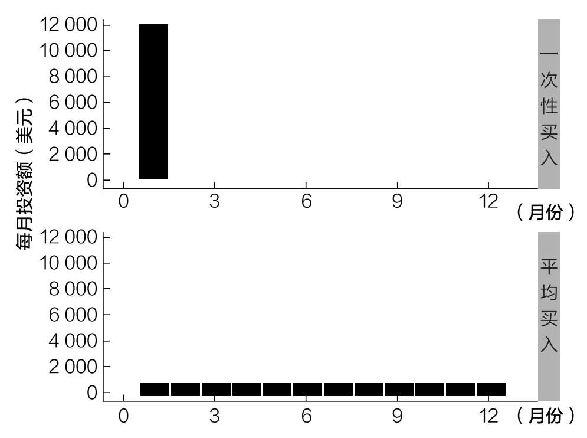
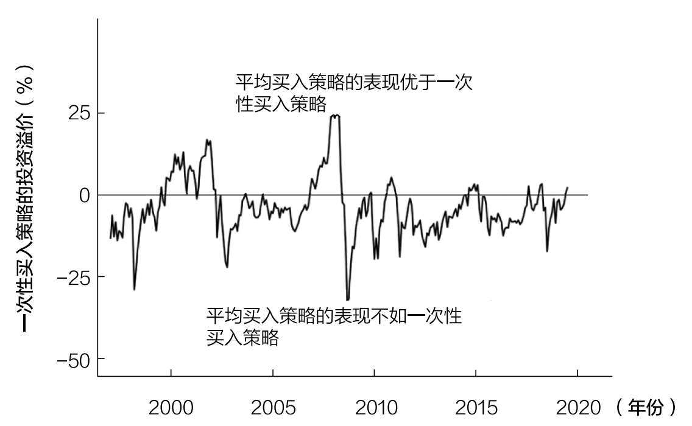
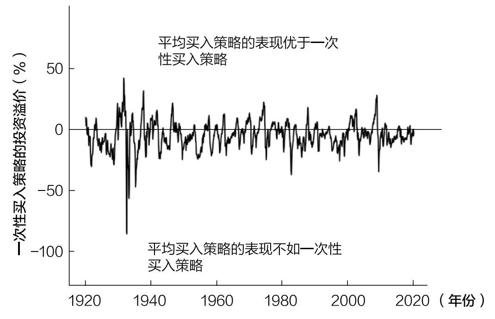
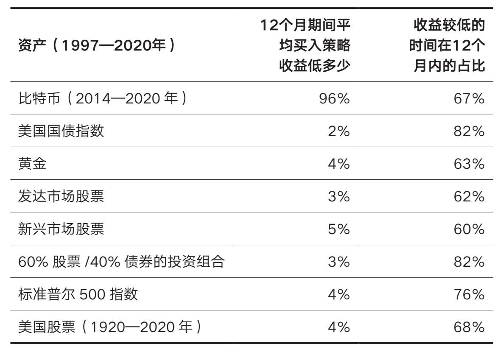
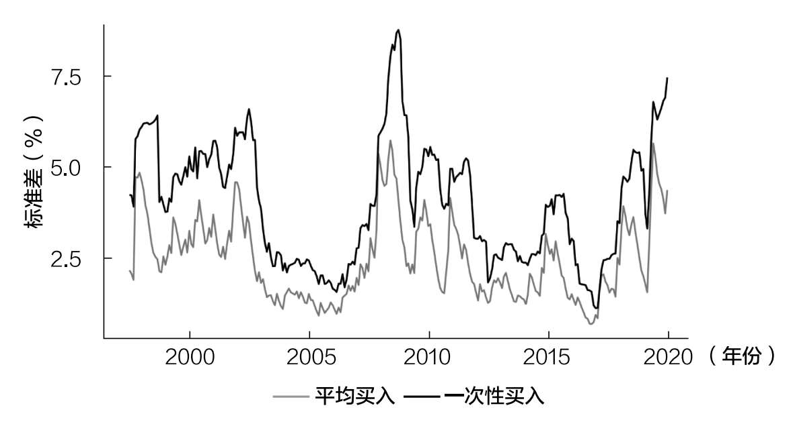
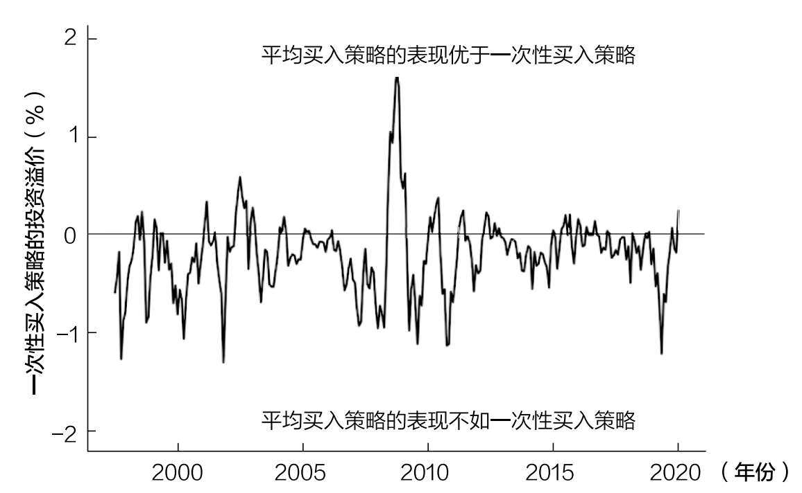
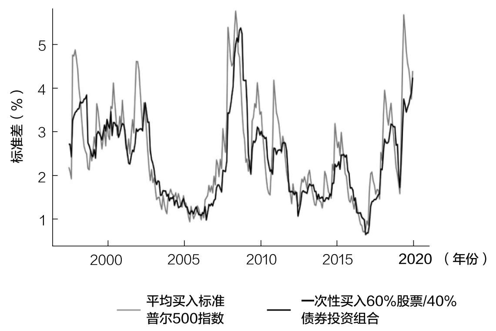
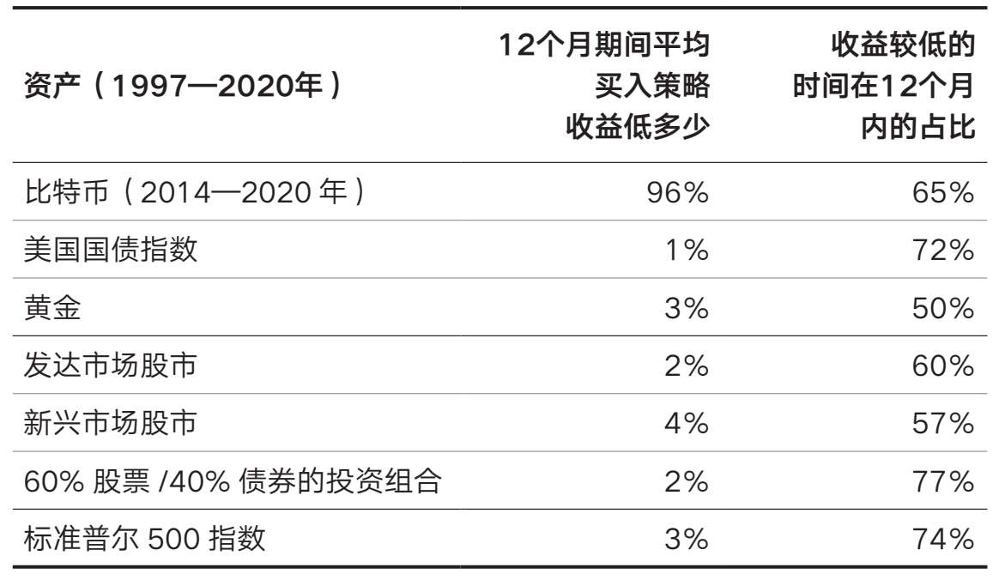
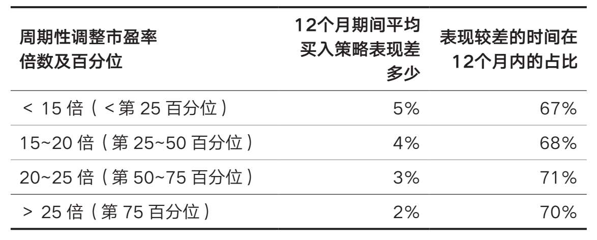

# 第十二章

## 你投资了吗

为什么早投资比晚投资好

在2015年“美国法老”获得三连冠之前，没有人对这匹马抱有多大期望。但杰夫·塞德却不这么认为。

塞德转行到赛马行业前曾在花旗集团担任分析师，他不像其他赛马研究员那样痴迷于马的血统。

传统的观点认为，马的母亲、父亲和血统是其比赛成功的主要决定因素。然而，在浏览了历史记录后，塞德意识到血统并不是一个很好的预测因素。他需要找到其他预测因素，需要数据。

他搜集了很多数据。多年来，他使用过无数指标——鼻孔大小、粪便重量、快收缩肌纤维密度，但都一无所获。

然后，塞德想到了用便携式超声波测量马匹内部器官的大小。终于，他发现了有价值的东西。

塞斯·斯蒂芬斯-达维多维茨在《每个人都说谎》中讲述了塞德的发现：

他发现心脏的大小，特别是左心室的大小，是一匹赛马能否成功的重要预测因素，是一个最重要的变量。84

心脏大小比其他任何东西都能更好地预测赛马的能力，这就是塞德所知道的。他说服买主拍下“美国法老”，而无视拍卖会上的其他151匹马，并因此创造了历史。

塞德的故事说明，一个有用的数据可以带来非常深刻的见解。汉斯·罗斯林在讨论儿童死亡率对理解一个国家的发展的重要性时，以事实回应了这一观点。

你知道我对儿童死亡率的数字很着迷吗？孩子们非常脆弱，有很多东西可以杀死他们。在马来西亚，1000名儿童中只有14名死亡，这意味着其他986名都存活了下来。他们的父母和社会设法保护他们免受所有可能致命的危险：细菌、饥饿、暴力等等。

所以“14”这个数字告诉我们，马来西亚的大多数家庭都有足够的食物，他们的污水不会被排放到饮用水中，他们有很好的初级医疗保健体系，母亲们会读书写字。儿童死亡率不仅关系到儿童健康问题，它衡量的是整个社会的质量。85

罗斯林对儿童死亡率的理解和塞德对赛马心脏数据的使用证明，一条准确的信息可以让复杂的系统变得更容易理解。

投资频率问题中也有这样的重要信息，可以指导所有投资决策。

大多数市场在大多数时候都会上涨

可以指导你所有投资决策的一条信息是：

大多数市场在大多数时候都会上涨。

这是事实，尽管人类历史的进程是混乱的，有时是破坏性的，正如沃伦·巴菲特强调的那样：

在20世纪，美国经历了两次世界大战、代价高昂的军事冲突以及其他重创，大萧条，十几次的衰退和金融恐慌，石油危机，流感肆虐，以及一位名誉扫地的总统的辞职。然而道琼斯指数却从66点上升到11497点。86

这种逻辑不仅仅适用于美国市场。正如我在第十章开头所阐述的那样，全球股市都呈现出长期上升趋势。

鉴于这些经验数据，建议你尽快投资。

为什么？

因为大多数市场在大多数时间都在上涨，现在的等待往往意味着将来必须支付更高的价格。因此，与其等待投资的最佳时机，不如大胆尝试，投资你现在可以投资的东西。

我们可以用一个相当荒谬的思想实验来说明这一点。

想象一下，你收到了100万美元的礼物，你想在接下来的100年里最大限度地使之增值。然而，你只能从以下两种可能的投资策略中选一种：

1. 现在把所有钱都用于投资；

2. 未来100年，每年投资1%的现金。

你更倾向于哪种策略？

如果我们假设你所投资的资产会随着时间的推移而增值（否则你为什么要投资？），那么很明显，现在投资比100年后投资要好。等上一个世纪再投资意味着你将支付更高的价格，而你未投资的现金也会因为通胀而贬值。

我们可以将同样的逻辑运用于远小于100年的时间。因为如果你不愿意等上100年，那么你也不应该等100个月或100个星期。

正如那句老话所说：“种一棵树最好的时间是10年前，其次是现在。”

当然，你总感觉这不是正确的决定，因为你总想着未来的价格可能会更低。

你猜怎么着？这种感觉是准确的，因为很有可能未来的价格会更低。

然而，数据表明，最好的办法是完全忽略这种感觉。

我们现在来看看为什么未来可能会有更低的价格，为什么你不应该等到最低价格再投资，以及为什么你应该尽早投资。尽早投资是投资美国股市的最佳策略，也是投资几乎所有其他资产类别的最佳策略。

为什么未来可能会有更低的价格（以及为什么你不应该等待）

如果你在1930—2020年随便哪一天买入道琼斯工业平均指数，那么它在未来某个交易日回调的可能性超过95%。

这意味着大约20个交易日中有1个交易日（一个月一次）会给你提供绝对的机会，而另外19个交易日会让你在未来的某个时候感到后悔。

这就是为什么等待更低的价格再买入似乎是正确的。从概率上看，你有95%的机会是正确的。

事实上，自1930年以来，你买入道琼斯工业平均指数后等待更低价格的时间中位数是两个交易日，但平均为31个交易日（1.5个月）。

真正的问题是，有时较低的价格永远不会出现，或者需要很长一段时间才能等到较低的价格。

例如，2009年3月9日，道琼斯工业平均指数收盘于6547点。这正是大萧条的底部。

你知道在那之前，道琼斯工业平均指数收于6547点以下是什么时候吗？

1997年4月14日——12年前。

这意味着，如果你在1997年4月15日买入道琼斯指数，你将需要近12年才能等到更低的价格。对所有投资者来说，有耐心等待这么长时间以获得更好的价格几乎是不可能的。

这就是为什么市场择时虽然在理论上很有吸引力，但在实践中却很难。

因此，最好的择时就是尽快投资。这并不是我的一家之言——多个资产类别和多个时间段的历史数据都支持这一观点。

现在投资还是以后投资

在我们开始数据分析之前，让我们定义一些后文将会用到的专业术语。

·一次性买入：一次性投资所有可用资金。投资金额并不重要，重要的是立即全部投入。

·平均买入：将所有可用资金在一定时期内分批进行投资的行为。如何按时间分配资金取决于你自己。然而，典型的方法是在特定的时间段内等额投资（例如，每月投资1次，为期12个月）。

我们可以从图12.1中看到一次性投资1.2万美元与在12个月内平均投资1.2万美元的区别。

图12.1 一次性买入vs平均买入

通过“一次性买入”，你在第一个月投资了12000美元（你的全部资金），但“平均买入”是指在第一个月，你只投资1000美元，其余的11000美元将在未来11个月内以每月投资1000美元的形式均摊。

如果你曾通过这两种方法投资标准普尔500指数，你会发现大多数情况下平均买入策略的表现不如一次性买入策略。

更准确地说，1997—2020年，每连续12个月内，平均买入策略的收益比一次性买入策略的收益低4%，而有76%的时间两者持平。

虽然4%在一年中可能看起来不多，但这只是平均水平。随着时间的推移，金额不容小觑。

图12.2便说明了这一点——它显示了自1997年以来，每连续12个月内投资于标准普尔500指数，平均买入策略较一次性买入策略的溢价。

图12.2 连续12个月平均买入策略与一次性买入策略投资美国标准普尔500指数的业绩表现

这条线上的每一点都代表了未来12个月内平均买入和现在一次性买入策略之间的收益差异。例如，这条线的最高点出现在2008年8月，一年内平均买入策略比一次性买入策略的收益高30%。

为什么在2008年8月，相较于平均买入策略而言，一次性买入策略的表现如此之差？

因为美国股市在2008年8月之后不久暴跌。更具体地说，如果你在2008年8月底在标准普尔500指数上投资了1.2万美元，到2009年8月底，你将只剩下9810美元（包括股息再投资），总损失为18.25%。

然而，如果你遵循平均买入策略，在同一时期每月投资1000美元，到2009年8月底，你将有大约1.35万美元（或约为12.5%的收益）。

这说明了从2008年8月到2009年8月平均买入策略如何获得了30%的投资溢价。

不过，我们从图12.2中得到的真正收获不是这个峰值，而是这条曲线经常低于0。当曲线低于0时，平均买入策略的表现不如一次性买入策略，当曲线高于0时，平均买入策略的表现优于一次性买入策略。

正如大家看到的，大多数时候，平均买入策略的表现不如一次性买入策略。这也不仅仅是近因偏差。如果回顾一下1920年以来的美国股市，我们会发现，每连续12个月内，平均买入策略的收益比一次性买入策略的收益低4.5%，而在68%的时间中两者持平。图12.3说明了这一点。

只有在市场崩盘之前的峰值时刻，平均买入策略的表现才会优于一次性买入策略（如1929年、2008年等）。这是说得通的，因为平均买入策略在市场开始下跌时买入，因此，买入的平均价格低于一次性买入的价格。

图12.3 连续12个月平均买入策略与一次性买入策略投资美国股票的业绩表现

虽然我们似乎总是处于市场崩盘的边缘，但事实是，重大下跌是相当罕见的。这就是为什么大部分时间里，平均买入策略的收益低于一次性买入策略。

正如我们上面所看到的，在投资股票时，一次性买入比平均买入要好，但其他资产呢？

美股以外的资产呢？

我没有用很多图表来说明在各种资产类别中，一次性买入比平均买入要好，而是做了一个汇总表。表12.1显示，在1997—2020年的所有12个月期间，平均买入策略要比一次性买入策略差多少。

表12.1 各类资产平均买入策略相较于一次性买入策略表现汇总表

表12.1显示，在1997年至2020年的任何12个月期间，对黄金来说，平均买入策略的收益比一次性买入策略的收益低4%，且收益低的时间占比为63%。

正如大家看到的，对大多数资产来说，任何12个月内，平均买入策略的收益比一次性买入策略的收益低2%~4%，且收益低的时间占比为60%~80%。

这意味着，如果你随机选择一个月开始平均买入一项资产，其收益很可能会低于该月对该资产的一次性买入。

两种策略的风险差异

到目前为止，我们只比较了一次性买入策略和平均买入策略的收益差异，但我们知道，投资者也关心两种策略的风险差异。

一次性买入是不是比平均买入风险更大？答案是肯定的！

如图12.4所示，当投资标准普尔500指数时，一次性买入策略的标准差总是高于平均买入策略。标准差显示了一个特定的数据序列与其平均结果的偏离程度。因此，标准差越高，投资策略的风险也越高。

图12.4 连续12个月平均买入策略与一次性买入策略投资标准普尔500指数的标准差

的确，一次性买入风险更高，因为一旦买入，就相当于承担了相关资产的全部风险，而平均买入策略在整个买入期间都会持有部分现金。我们知道，股票的风险比现金高，因此，你持有的股票越多，风险就越高。

然而，如果担心风险，那么也许你应该考虑一次性买入更保守的投资组合。

例如，如果你原本打算用平均买入策略建立一个股票投资组合，你现在可以考虑用一次性买入策略投资60%股票/40%债券，在相同的风险水平下获得略好的收益。

如图12.5所示，自1997年以来的大部分时间里，与其平均买入股票，不如按60%股票/40%债券的比例一次性买入股票和债券。

图12.5 连续12个月平均买入标准普尔500指数vs一次性买入60%股票/40%债券的投资组合

是的，在这种情况下，一次性买入虽然只能获得略高一点儿的收益，但你也正承担着相同（或更低）的风险。这就是投资者想要的：收益更高，风险更低。图12.6显示了这两种策略在此期间的连续标准差。

图12.6 连续12个月平均买入标准普尔500指数与一次性买入60%股票/40%债券投资组合的标准差

正如大家所看到的，在大多数时候，一次性买入60%股票/40%债券投资组合比平均买入标准普尔500指数（100%股票）的风险要低。

总而言之，按60%股票/40%债券的配置一次性买入风险平衡的投资组合带来的收益通常要高于平均买入股票的投资。

因此，如果你担心一次性买入股票带来的风险，更好的选择是一次性买入风险较低的投资组合，例如60%股票/40%债券，而不是平均买入股票。

将闲散资金投资于美国国债会有不同吗

对这种分析的一种常见的批评是，平均买入策略假设在投资过程中，还未投资的钱都以现金的形式持有。一些人认为，这部分现金应该投资于美国国债，以获取收益。

我在理论上同意这个逻辑，但问题是，大多数投资者在实践中并没有遵循这个建议。很少有投资者在陆续买入股票的同时将闲散资金投资于美国国债。

之所以这么说，是与我交谈过的财务顾问告诉过我，他们与那些潜在客户进行过无数次谈话，那些人持有现金很多年，只为了等待合适的时机进入市场。

美国个人投资者协会每月进行的资产配置调查结果也显示，自1989年以来，平均而言，个人投资者的投资组合中有超过20%的现金配置。87

尽管这个前提并不成立，因为投资者在实践中不会这样做，但我还是查阅了相关数据。表12.2显示，即使你在平均买入的过程中将闲散资金投资于美国国债，其收益还是低于一次性买入。

表12.2显示，对于在1997年至2020年任何12个月内平均买入比特币（同时将现金投资于美国国债）的投资者，其平均收益为一次性买入策略平均收益的96%，且在65%的时间里表现不佳。

表12.2 将闲散资金投资于美国国债的情况下各类资产平均买入策略相较于一次性买入策略表现汇总表

与表12.1的主要区别是：表12.1中平均买入策略相较于一次性买入策略的收益低2%~4%，而表12.2的收益低1%~3%，而且收益较低的时间在12个月内的占比为60%~70%（而不是70%~80%）。在将闲置资金投资于美国国债的情况下，虽然平均收益的差额有所减少，但仍然存在。

估值重要吗

当我建议一次性买入而不是平均买入时，常见的反应是：“这在正常情况下是有道理的，但在极端估值情况下是没有道理的！”

因此，当整个市场的估值都在上升时，这是否意味着我们应该重新考虑平均买入策略？

不尽然。

对外行来说，这里有必要解释一下。我使用的估值比率被称为“周期性调整市盈率（CAPE）”。周期性调整市盈率是衡量在股市中你需要支付多少钱才能获得1美元收益的指标。所以当周期性调整市盈率为10倍时，意味着你需要为1美元的收益支付10美元。当周期性调整市盈率较高时，股票更贵，当周期性调整市盈率较低时，股票更便宜。

我们如果将1960年以来平均买入策略与一次性买入策略的表现按周期性调整市盈率百分位进行细分，就可以看到，在所有情况下，平均买入策略的收益均低于一次性买入策略（如表12.3所示）。

表12.3 1960年以来平均买入策略相较于一次性买入策略表现汇总表

平均买入策略与一次性买入策略的收益差确实随着周期性调整市盈率的提高而减少，但不巧的是，我们在试图分析估值最高的时期时，遇到了样本数量问题。

例如，如果我们只考虑周期性调整市盈率大于30倍（大约是2019年底的水平）的情况，那么在未来12个月里，平均买入策略比一次性买入策略的收益高1.2%。然而，在过去10年间，周期性调整市盈率超过30倍的情况只在互联网泡沫时出现过！

但你如果因为周期性调整市盈率太高而等待，就可能会错过一些大额收益。例如，周期性调整市盈率最近一次超过30倍是在2017年7月。如果你当时转而持有现金，到2020年底，你将错过标准普尔500指数65%的涨幅（含股息）。

如果你认为市场估值过高，应该大幅回调，你可能需要等待多年，才能证明你是正确的。在你用估值作为持有现金的借口之前，请考虑这一点。

本章总结

当考虑一次性买入还是分批买入时，现在一次性买入总是更好的选择。这适用于任何资产、任何时间以及任何估值方式。一般来说，等待时间越长，收益越低。

我说“一般”是因为，在市场崩盘时，分批买入可以获得更好的收益。然而，恰恰是在市场崩盘的时候，你最不愿意投资。

这种情绪很难被消除，所以许多投资者无论如何都无法在市场下跌时持续买入。

如果你现在仍然担心一次性投入一大笔钱，真正的问题可能是你正在考虑的投资组合对你来说风险太大。这个问题如何解决呢？方法是现在一次性买入更保守的投资组合。

如果你的目标投资组合配置是80%股票/20%债券，你可以考虑现在一次性买入60%股票/40%债券的投资组合，并慢慢过渡。例如，你可以现在投资60%股票/40%债券的投资组合，并制订一个具体的计划，一年后过渡到70%股票/30%债券，再一年后过渡到80%股票/20%债券。

这样，你仍然可以在不承担太多风险的情况下获得一些收益。

既然我们已经讨论了为什么现在投资比等待更好，接下来让我们来回答为什么你永远不应该等待逢低买入的问题。
