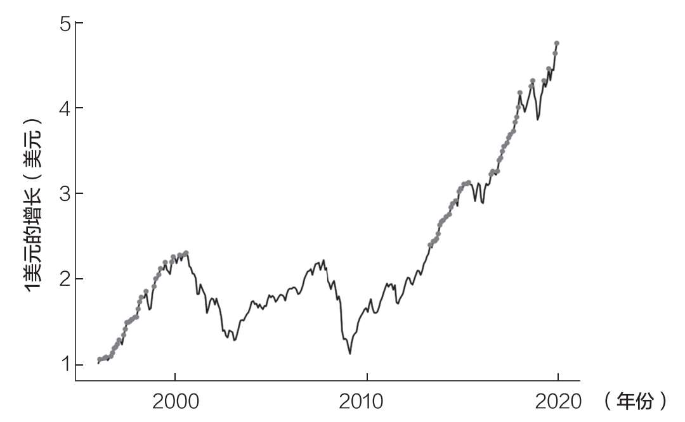
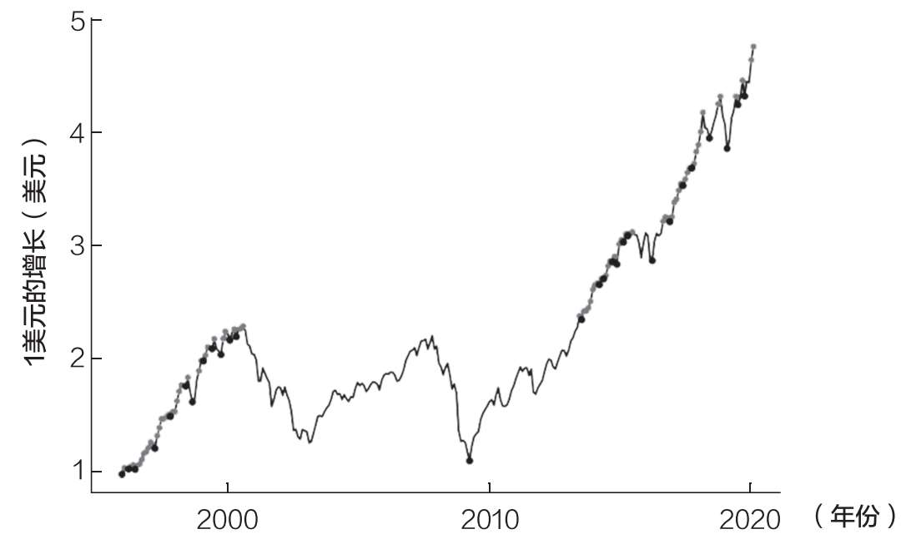
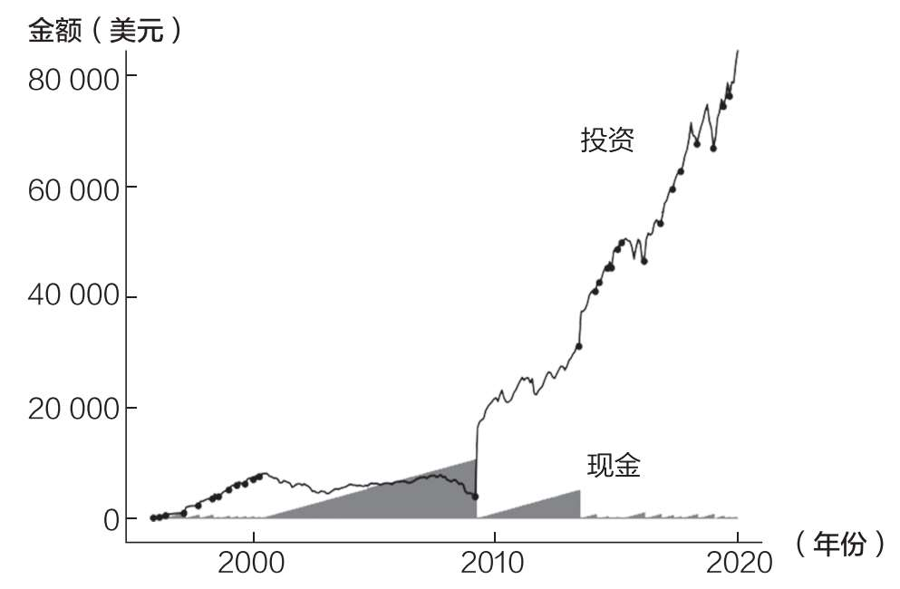
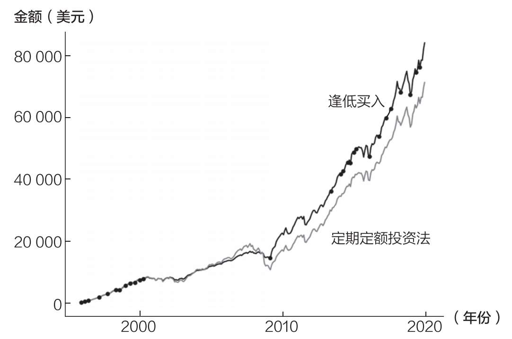
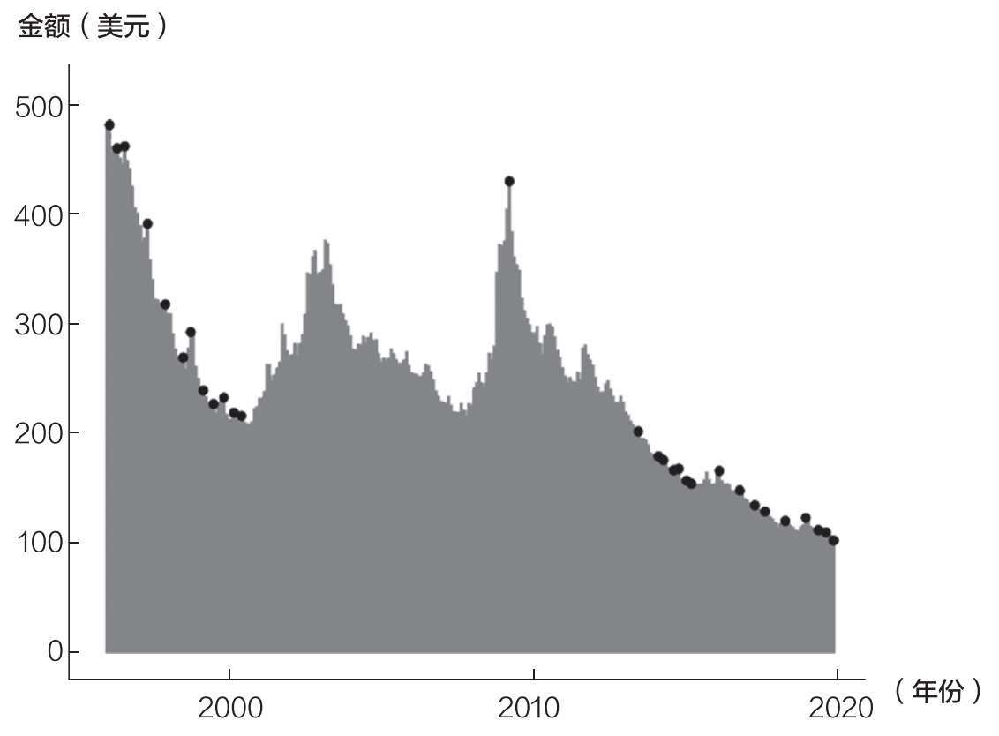
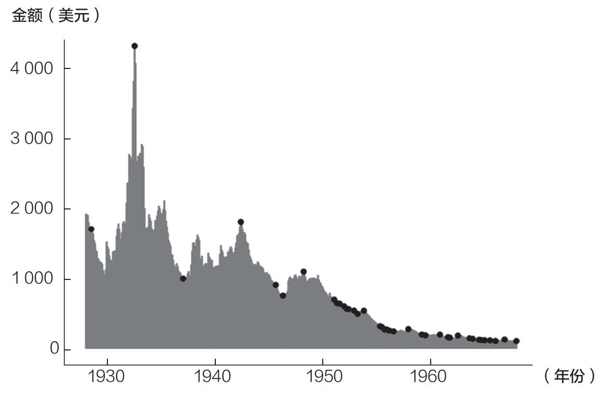
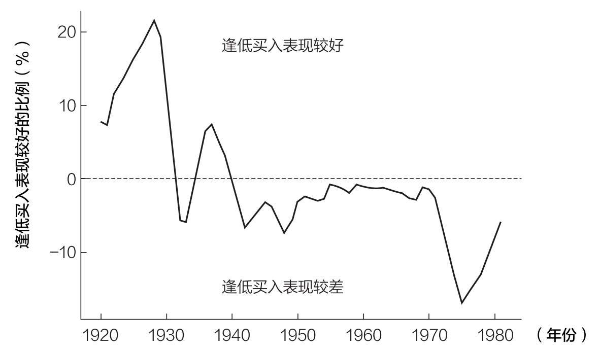
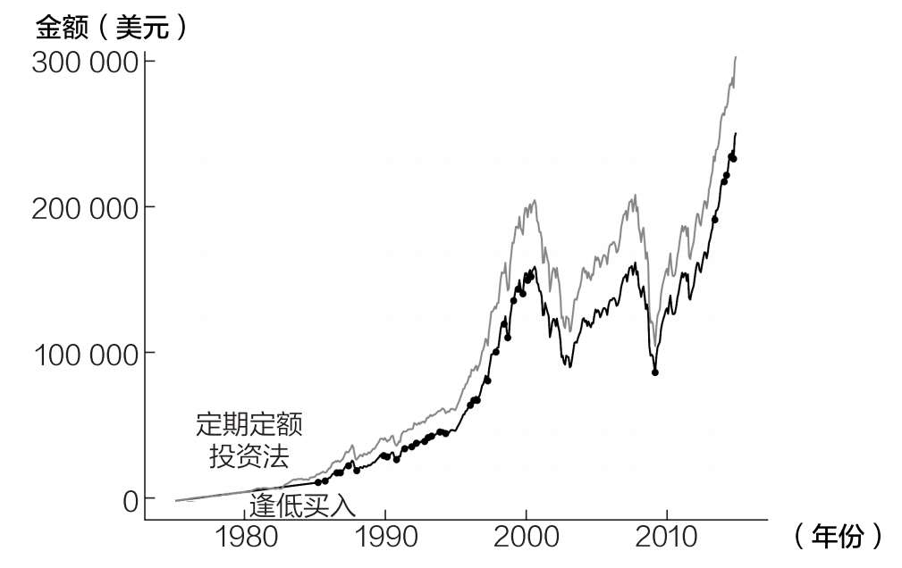
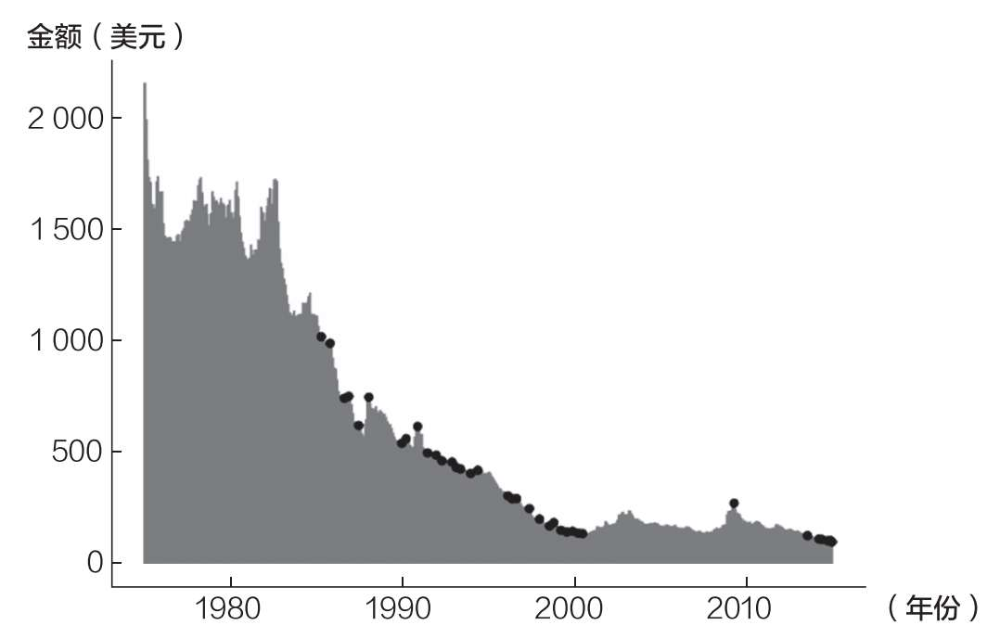

# 第十三章 为什么不应该等待逢低买入

即使是上帝也无法打败定期定额投资法

如果上一章没有说服你坚决放弃择时买入，那么这一章肯定会。这个说法有点儿狂妄，但我可以用数据来证明。

首先，我们来玩儿个游戏。

假设你被扔到1920年到1980年的某个时间。你必须在接下来的40年里投资于美国股市，并只有两种投资策略可以选择：

1. 定期定额投资法：每月投资100美元，坚持40年。

2. 逢低买入：每月节省100美元，只在市场低点买入。这里“低点”的定义是“市场没有处于历史高点”。但是，我要把这种策略做得更好。你不仅能逢低买入，我还会让你知道应该什么时候买（上帝视角）。你会确切地知道市场何时处于绝对底部从而确保你总能以尽可能低的价格买入。

这个游戏的另一个规则是，你不能随意买入卖出股票。一旦你购买了这些股票，你就要一直持有。

那么，你会选择哪种策略：定期定额投资法还是逢低买入？

从逻辑上讲，逢低买入似乎肯定不会错。如果你知道市场什么时候处于底部，你总是能以相对于那个历史高点的低价买入。

然而，如果你真的执行这种策略，你会看到在从1920年到1980年的某个40年期间里，逢低买入的收益比定期定额投资法低70%以上。这是真的，尽管你确切地知道市场何时会触底。

即使是上帝也无法打败定期定额投资法！

为什么会这样？因为只有当你知道暴跌即将到来，你可以完美地把握时机时，逢低买入才有效。

问题是，市场暴跌并不经常发生。在美股历史上，严重的下跌只发生在20世纪30年代、70年代和21世纪初期。这意味着逢低买入战胜定期定额投资法的概率很小。

逢低买入战胜定期定额投资法需要无可挑剔的时机和上帝视角。错过底部短短两个月的时间，逢低买入优于定期定额投资法的概率就会从30%降至3%。

我说的话或许还不足以为信，接下来让我们深入研究一下细节，来看看为什么会这样。

了解如何逢低买入

首先，让我们看看1996年1月至2019年12月为期24年的美国股市，以熟悉这一策略。

图13.1显示了标准普尔500指数（含股息，经通胀调整后）在这24年内的走势，小灰点为历史高点。

图13.1 标准普尔500指数的高点

现在，我将展示一张几乎与上面完全相同的图，但在市场的每一次下跌（两个历史高点之间的最低点）都增加了一个黑点。这些点是逢低买入策略买入的点（如图13.2所示）。

正如你在图13.2中所看到的，相对最大跌幅发生在任何两个历史高点（灰点）之间的最低点（黑点）。在此期间，最大的一次下跌发生在2009年3月（2010年之前唯一的黑点），这是2000年8月市场高点后的最低点。

图13.2 标准普尔500指数的高点和低点

然而，你也会注意到，在历史高点之间也有许多不那么显著的下跌。这些下跌集中在牛市期间（20世纪90年代中后期和20世纪第一个十年的中期）。

为了可视化逢低买入策略是如何运作的，我标出了该策略在1996年至2019年期间在市场上的投资金额及其现金余额（见图13.3）。

每当该策略买入（黑点），现金余额（灰色阴影区域）就会趋于零，投资金额相应向上移动。这一点在2009年3月最为明显，当时，该策略在持有近9年现金之后，逢低买入了10600美元股票。

比较一下逢低买入和定期定额投资法的投资组合价值，你就会发现，逢低买入在2009年3月前后表现开始优于大盘，见图13.4。同样，黑点代表逢低买入策略的每一次买入。

▲图13.3 逢低买入

▲图13.4 逢低买入vs定期定额投资法

如果你想了解为什么某一次买入如此重要，让我们考虑一下定期定额投资法的每一次买入最终增长了多少，以及逢低买入的买入时机。图13.5显示了每100美元的投资在2019年12月的现值。

例如，1996年1月投资的100美元到2019年12月增值到500多美元。黑点再次代表逢低买入的买入时间。

图13.5 定期定额投资法和逢低买入每一单位投资的最终增长金额

图13.5显示，在2009年3月每投资100美元，到2019年12月将增长到近450美元，这就是逢低买入的力量。

对此，还有两件事需要注意：

1. 平均而言，早期的买入会增长更多（复利作用！）。

2. 有的月份（例如2003年2月和2009年3月），某些买入比其他月份的增长多得多。

如果我们把这两个点放在一起，那意味着在该时期市场大跌之前，逢低买入将优于定期定额投资法。

最好的例子是1928—1957年（如图13.6所示），因为这段时间包含了美国股市历史上最大的下跌（1932年6月）。

图13.6 定期定额投资法和逢低买入每一单位投资的最终增长金额

1928—1957年，逢低买入的效果非常好，因为早期可以逢低买在最低点（1932年6月）。你在1932年6月市场底部投资的每100美元，到1957年都会增长到4000美元！在美股历史上，没有任何一个时期能匹敌这个水平。

我知道这听起来像我在努力推广逢低买入，但1996—2019年和1928—1957年恰好出现长期、严重的熊市。

如果我们从更长的时间维度来看（从历史上看），大多数时候逢低买入带来的收益一般都达不到预期。图13.7显示了逢低买入（与定期定额投资法相比）在每40年期间的较好表现。较好表现的衡量方式是逢低买入投资组合的最终价值除以定期定额投资法投资组合的最终价值。

当逢低买入表现更优时，曲线在0以上，而当其表现更差时，曲线在0以下。确切地说，超过70%的时间，逢低买入带来的收益低于定期定额投资法。

图13.7 逢低买入vs定期定额投资法（40年期间）

你可以从图13.7中注意到，由于20世纪30年代严重的熊市，从20世纪20年代开始，逢低买入表现良好，投资组合的最终价值比定期定额投资法高20%。然而，在20世纪30年代的熊市之后，逢低买入表现变差，并继续恶化。其表现最差的一年（相对于定期定额投资法）发生在1974年熊市之后（从1975年开始投资）。

1975—2014年这段时间对逢低买入尤其不利，因为错过了1974年的底部。从1975年开始，市场的下一个历史高点直到1985年才出现，这意味着该策略直到1985年之后才有可能买入。

由于逢低买入的时机不佳，定期定额投资法很容易获得高收益。图13.8显示了从1975年开始的40年里，逢低买入与定期定额投资法的对比。与前文一样，黑点表示逢低买入的时机。

图13.8 逢低买入vs定期定额投资法

正如大家所看到的，定期定额投资法从始至终都优于逢低买入。尽管逢低买入在这段时间内赶上了少数几次大幅下跌，但因为这些下跌发生在这段时间的后期，带来的复利较少。

图13.9所呈现出的这段时间投资的增长额更能说明这一点。

图13.9 定期定额投资法和逢低买入每一单位投资的最终增长金额

与1928—1957年或1996—2019年不同，逢低买入不会在1975—2014年早期大幅下跌时买入。它确实可以在2009年3月的下跌时买入，但这发生在后期，无法提供足够的收益来超过定期定额投资法。

这表明，即使有充分的信息，逢低买入的表现通常也比定期定额投资法差。因此，你如果持有现金，希望在下一个底部买入，结果可能会比现在买入更糟糕。

为什么？

因为当你等待心爱的美食时，你会发现它永远不会到来。结果，你会错过几个月（或更多）的复利，因为市场不断上涨，把你甩在后面。

到目前为止，我们一直假设你会确切地知道什么时候是市场底部。但是，在现实中，你永远不会确切地知道这一点。你永远不可能精准地预见市场底部，这是逢低买入无法克服的问题。

如果在市场触底两个月后逢低买入，猜猜结果如何？仅仅错过底部两个月就导致其在97%的时间里表现不如定期定额投资法！即使是那些善于预测市场底部并能在两个月内预测市场绝对底部的人，从长远来看也会亏损。

本章总结

本章的主要目的是重申持有现金逢低买入是徒劳的。持续买入的结果会更好。而且，正如我们在前一章中所看到的，通常越早投资越好。综上所述，结论是不可否认的：

你应该尽快、尽可能多地投资。

这就是持续买入的核心理念，它超越了时间和空间。

例如，如果你从1926年起随机选择一个月，开始购买一篮子美国股票，并在接下来的10年里一直买入，那么你有98%的概率战胜持有现金的投资者，有83%的概率战胜5年期美国国债的投资者。更重要的是，在这样做的时候，你往往能获得10.5%的收益。[^88]

如果你对1970年以来的一组全球股票进行类似的操作，10年内，你将在85%的时间超过持有现金的投资者，获得约8%的收益。[^89]

在这两种情况下，创造财富的方法都是一样的——持续买入。

毕竟，连上帝都不能战胜定期定额投资法，你还有什么机会？

上帝仍然会笑到最后

在处理本章的数据时，我学到的最重要的事情是，我们的投资生命有多依赖于运气（术语是“收益风险序列”，我们将在下一章中讨论）。

例如，在本章分析中，收益最高的40年是1922—1961年，你平均买入的4.8万美元（40年×12个月×100美元）增长到了50万美元以上（经通胀调整后）。

而在最糟糕的1942—1981年，4.8万美元仅仅增长到了15.3万美元。这是226%的差异，比任何策略之间的差异都大得多！

遗憾的是，这说明你的策略不如市场的表现重要。上帝仍然笑到了最后。

话已至此，下面就让我们来看看运气在投资中的作用吧！

[^88]: This is the median outcome for investing every month for a decade into U.S. stocks from 1926–2020.

[^89]: For more detail see: ofdollarsanddata.com/in-defense-of-global-stocks.
