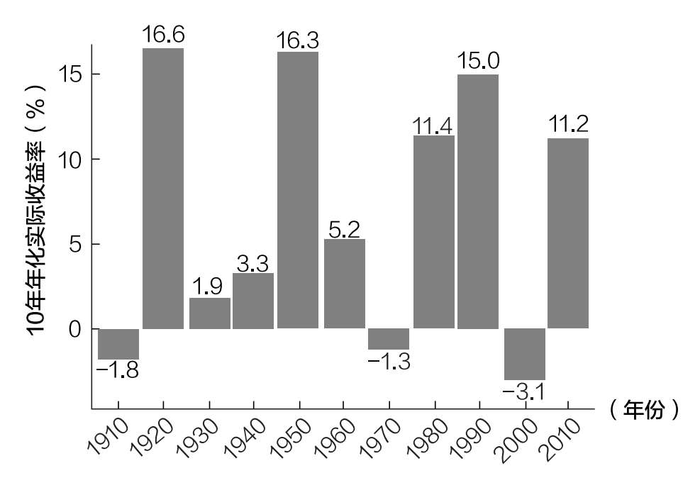
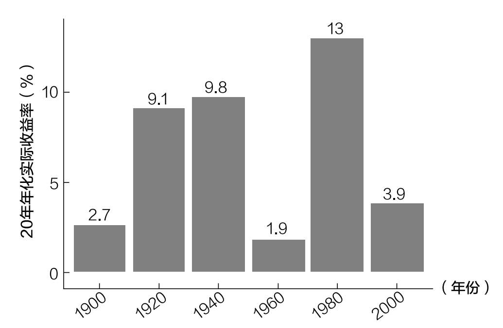
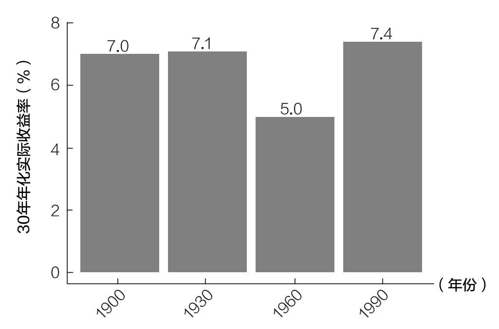
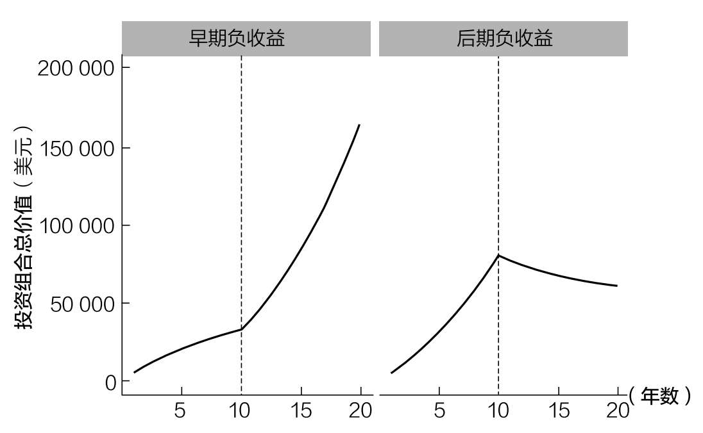

# 第十四章

## 为什么投资要靠运气

为什么你又不应该在乎运气

在20世纪70年代末，出版界的流行观点是，一个作者一年只能出一本书。他们的想法是，一年出版的书超过一本会冲淡作者的知名度。

这对斯蒂芬·金来说是个问题，因为他以每年两本书的速度写书。金没有因此放慢脚步，而是决定以理查德·巴赫曼的笔名发表他的其他作品。

在接下来的几年里，金出版的每部作品都卖出了数百万册，而理查德·巴赫曼却一直默默无闻。金是一个传奇人物，而巴赫曼是个无名小卒。

然而，当华盛顿特区一位叫史蒂夫·布朗的书店职员注意到金和巴赫曼的写作风格相似时，这一切都改变了。在看到证据后，金承认了，并同意在几周后接受布朗的采访。法兰斯·约翰森在他的《运气生猛》一书中讲述了这个故事。

1986年，秘密一经公开，金就以他的真名重新出版了巴赫曼的所有作品，这些作品在畅销书排行榜上一路飙升。《瘦到死》第一版已经卖出了2.8万本，是巴赫曼所有作品中销量最高的，也高于普通作家的平均水平。然而，当人们知道理查德·巴赫曼就是斯蒂芬·金的那一刻，巴赫曼的书就开始迅速畅销，销量最终达到了300万册。

无独有偶，J. K.罗琳也曾以罗伯特·加尔布雷恩为笔名出版过一本名为《布谷鸟的呼唤》的书，这本书后来被一个从事文本分析的人发现是罗琳的作品。90

在公众发现加尔布雷恩就是罗琳后不久，这本书的销量增长了15万多倍，从之前的亚马逊畅销书排行榜第4709位跃居第三位。91

金和罗琳对笔名写作的尝试都表明，运气在成功中扮演了一定的角色，这一点虽然残酷，却是事实。虽然金和罗琳的成就不仅仅是偶然的，但很难解释为什么他们的书销量达到了数百万本，而巴赫曼和加尔布雷恩却没有，尽管几部作品的水平差不多。运气起着重要的作用。

不幸的是，同样的神秘力量可以成就或破坏你的职业生涯，也可以对你的投资结果产生巨大的影响。

你的出生年份如何影响你的投资收益

你可能会认为，像出生年份这样随机的事情对积累财富的能力几乎没有影响，但你错了。纵观历史你会发现，股票市场往往会经历难以预测的起起伏伏。

为了说明这一点，请思考标准普尔500指数自1910年以来以10年为单位的年化收益率（含股息，经通胀调整后）。

正如你在图14.1中所看到的，投资年份不同，收益也不同：你10年获得的年化收益率可能是16.6%，也可能是-3.1%。在与投资决策无关的情况下，二者的年化收益率仍然相差20个百分点。

图14.1 标准普尔500指数幸运和不幸的10年

然而，这只是投资冰山的一角。因为如果把投资期限延长到20年，年化收益率的差异仍然很大。

图14.2 20年期间标准普尔500指数的收益情况

在20年的时间里，最好的情况下你可以获得13%的年化收益率，而最坏的情况下你只能获得1.9%的年化收益率。

由于这种收益随着时间的推移而变化，即使是具备一定技能的投资者，也可能表现得不如那些仅仅拥有幸运的投资者。

例如，即使你从1960年到1980年每年跑赢市场5%，你赚的钱也会比你从1980年到2000年每年跑输市场5%赚的钱少。这是事实，因为1960—1980年的年化实际收益率为1.9%，而1980—2000年为13%（1.9%+5%＜ 13%-5%）。

想想看：一个出色的投资者（每年跑赢市场5%）赚的钱会比一个糟糕的投资者（每年跑输市场5%）少，这仅仅是因为他们开始投资的时间不同。这是一个精心挑选的个例，但它展示了熟练投资者（表现优异的投资者）如何仅仅因为在艰难的市场环境中投资而输给非熟练投资者（表现不佳的投资者）。

这里唯一的好消息是，在30年期间，年化收益率的差异要小得多（如图14.3所示）。

图14.3 30年期间标准普尔500指数的收益情况

尽管我们只研究了四个不重叠时期的数据，但这些数据表明，美国股市的长期投资者通常会因为他们的努力而获得回报。虽然这个结论在未来可能不成立，但根据历史记录，我认为它会成立。

我们已经研究了运气如何根据时间的不同影响你的总投资收益，接下来我们还需要考虑投资收益的顺序以及顺序为什么重要。

为什么投资收益的顺序很重要

假设你把1万美元存入一个投资账户，在未来四年里，该账户的收益如下：

·第一年+25%

·第二年+10%

·第三年-10%

·第四年-25%

如果你以不同的顺序得到收益，结果会更好吗？例如，假设你获得了与上述相同的收益，但顺序相反：

·第一年-25%

·第二年-10%

·第三年+10%

·第四年+25%

这会影响你1万美元初始投资的最终价值吗？

答案是不会。

当进行一项投资时，在不增加或减去额外资金的情况下，你的收益顺序并不重要。如果你不相信我，花一分钟试着证明3×2×1不等于1×2×3。

但如果随着时间的推移，你的钱会增加（或减少）呢？那么收益顺序重要吗？

答案是肯定的。当你的资金随着时间的推移而增加时，未来的收益更重要，因为未来有更多的资金承担风险。因此，随着你投入更多的钱，未来收益的重要性也更大。这意味着，在增加本金后，负收益将比在增加这些本金之前让你损失更多。

由于大多数个人投资者会随着时间的推移增加本金，投资收益的顺序比你将面临的几乎任何其他金融风险都更重要。这一般被称为收益风险序列，可以用下面的思想实验来解释。

想象一下，在两种不同的情况下，每年存下5000美元，持续20年。

1. 前期负收益：在前10年内获得-10%的收益，在后10年内获得+10%的收益。

2. 后期负收益：在前10年内获得+10%的收益，在后10年内获得-10%的收益。

这两种情况下，20年期间的收益相同，10万美元的投入也相同，唯一的区别是相对于投入资金的收益顺序。

图14.4显示了投资组合在每种情况下的最终价值。请注意，我在10年处用虚线做了标记，以突出显示收益顺序从-10%翻转到+10%（反之亦然）。

图14.4 人生晚年负收益对生活的影响更大

正如你所看到的，就算每年投入同样的5000美元，基于收益顺序的不同，投资组合的最终价值也会有很大的差异：在前期负收益的情况下，其投资收益比后期负收益的情况下多10万美元。

人生晚年（当投资本金最多的时候）获得负收益，比你第一次开始投资时经历负收益要糟糕得多。换句话说，结局就是一切。

结局就是一切

鉴于你（像大多数投资者一样）大部分时间都在积累资产，最重要的投资收益将发生在退休前后。如果你在这段时间内经历了巨额负收益，资产可能会大幅减少，你可能活不到回本的时候。

让这种情况更糟糕的是，退休期间你的储蓄会减少，这将以更快的速度耗尽你的资产池。

幸运的是，研究表明，市场上一两年的糟糕情况不太可能对你的退休生活产生重大影响。正如金融专家迈克尔·基塞斯所发现的那样：“事实上，在对数据进行更深入的研究后我们发现，退休头一两年的收益与投资组合中能够维持的安全提现率之间几乎没有关系……即使退休始于市场崩盘时期。”92

但基塞斯发现，退休头十年的收益（特别是经通胀调整后的收益）可能会产生重大影响。虽然一两个糟糕的年份没什么大不了，但糟糕的十年可能会造成严重的财务损失。这说明了为什么退休后第一个十年的投资收益如此重要。

考虑到这些信息，以下是基于出生年份（假设你在65岁退休）投资收益对你最重要的十年：

·1960年出生：2025—2035年

·1970年出生：2035—2045年

·1980年出生：2045—2055年

·1990年出生：2055—2065年

·2000年出生：2065—2075年

我出生在1989年，这意味着我需要在2055—2065年（当我应该投资最多的时候）获得最好的收益。但即使我没有得到我想要的丰厚收益，我也知道有一些方法可以降低运气对我财务状况的影响。

作为投资者，如何规避坏运气带来的风险

尽管运气在投资中很重要，但你对自己未来财务的控制仍占主导地位。这是因为无论市场怎么变化，决定储蓄和投资的比例、投资哪些资产以及投资频率的仍然是你自己。投资不仅仅关乎你手中的牌，更关乎如何打好手中的牌。

尽管我尊重运气在投资和生活中的重要性，但我并不是无能为力。你也是。在坏运气发生前后，你都可以有所作为。

例如，如果即将退休的你担心市场会迎来一个糟糕的十年，有些方法可以减少你的损失。

·使用足够的低风险资产（如债券）充分分散投资风险。退休后，你可以持有大量债券，获取足够的收入，以防止低价出售股票。

·考虑在市场低迷时期减少提现。如果你最初计划每年提取4%，暂时降低你的提现率可能有助于减轻市场崩盘造成的损害。

·考虑兼职来补充收入。退休的好处之一是你可以自由支配自己的时间。这意味着你可以开始做一些新的事情来产生收入，而不是出售已有资产。

在困难时期，即使你还没面临退休，适当分散投资和及时调整支出水平也可能会非常有帮助。

如果你还年轻，规避坏运气最好的方法就是时间本身。正如我们在第十二章中看到的，大多数市场在大多数时候都会上涨，这意味着时间是年轻投资者的朋友。

不管你的财务状况如何，你总是可以选择与坏运气做斗争。更重要的是，坏运气并不总是像看起来的那么坏。有时候这只是游戏的一部分。这就是为什么我们下一章的主题是市场波动，以及为什么你完全不需要担心它。
