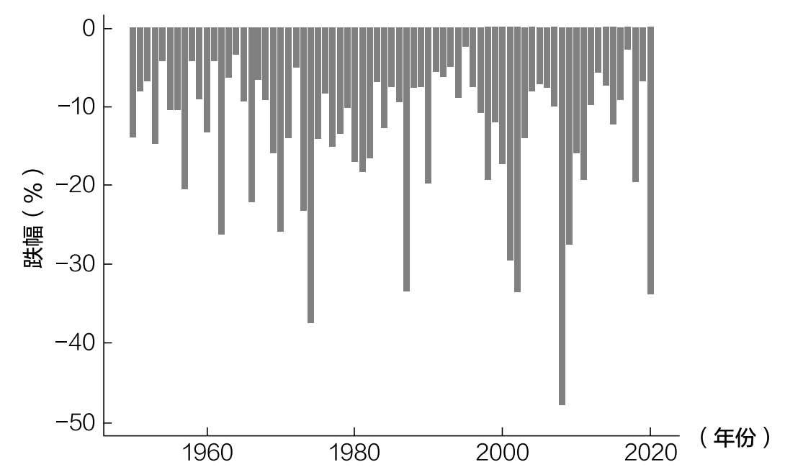
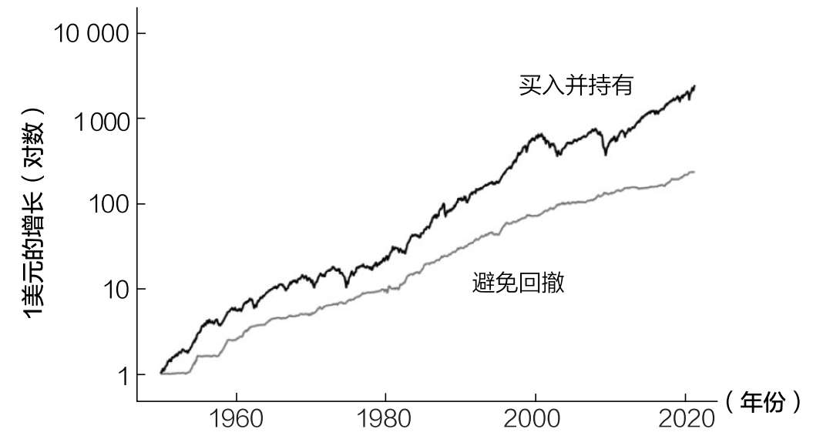
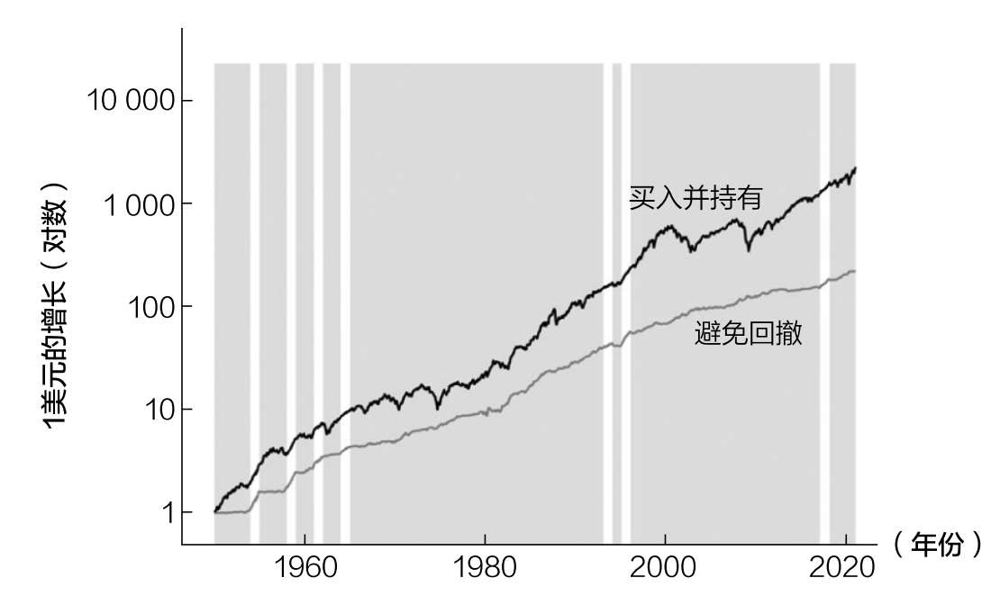
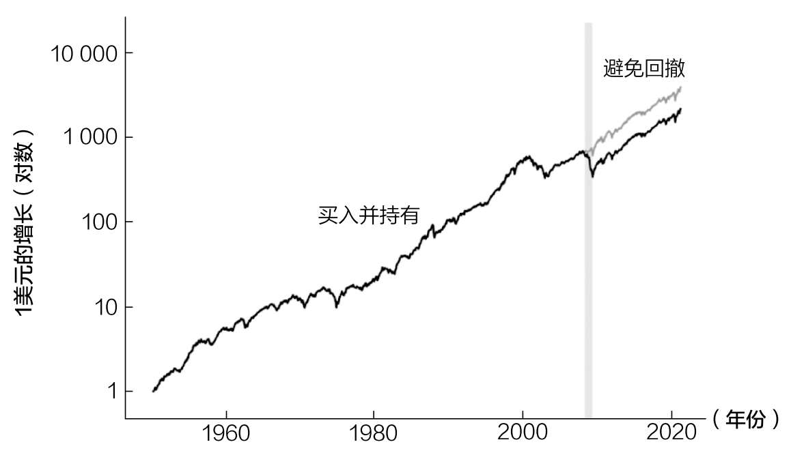
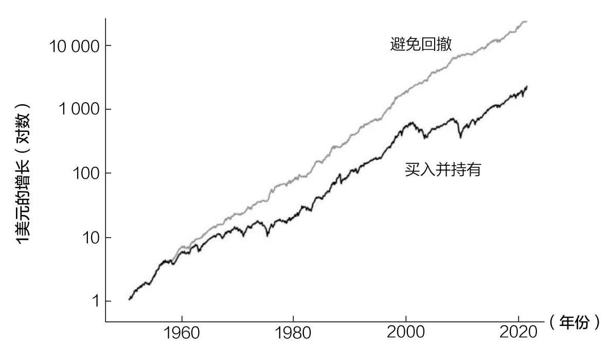
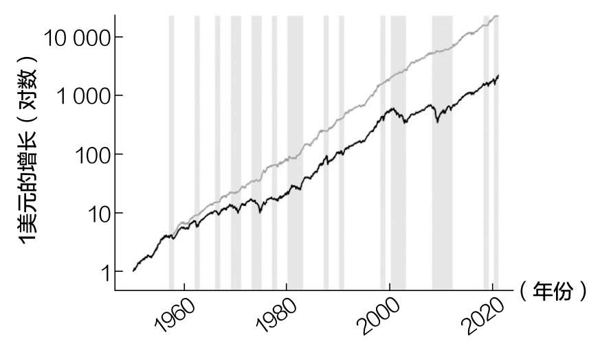
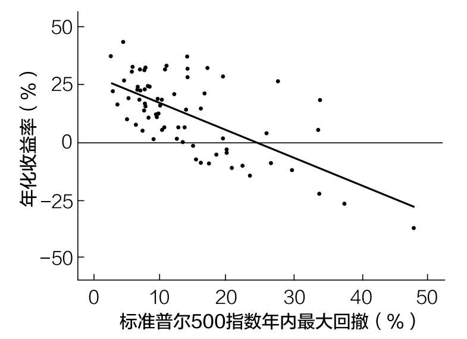

# 第十五章

## 为什么不应该害怕波动

成功投资的入场费

弗雷德·史密斯已经束手无策了。他已经将自己的大部分净资产投入这家名为美国联邦快递的包裹递送公司，而他之前的融资伙伴通用动力公司刚刚拒绝了他的额外融资。

那天是星期五，史密斯知道他必须在下周一为下一周的航空燃油支付2.4万美元，但问题是，美国联邦快递的银行账户上只有5000美元。

史密斯做了他唯一能想到的“理智的”事情——他飞到拉斯维加斯，用剩下的5000美元玩儿21点。

到了周一早上，美国联邦快递总经理兼运营总监罗杰·弗洛克检查了公司的银行账户，感到震惊。弗洛克立即质问史密斯发生了什么事。

史密斯承认：“与通用动力董事会的洽谈失败了，我知道我们周一需要钱，所以我坐飞机去拉斯维加斯，赢得了2.7万美元。”

是的。史密斯把公司仅剩的5000美元拿去玩儿21点了，还赢了一大笔钱。

弗洛克仍然很震惊，他问史密斯怎么可以用公司仅剩的5000美元来冒险，史密斯回答：“有什么区别吗？如果没有支付燃料公司的资金，我们无论如何也飞不起来。”93

史密斯的故事说明了风险和不作为的代价——有时你能承担的最大风险就是完全不承担风险。

在投资方面尤其如此。尽管金融媒体经常会提到对冲基金破产或彩票中奖者破产，但它们有多少次讨论过一个持有现金几十年却仍未能创造财富的人？几乎没有。

问题是，那些行事谨慎的人多年来都看不到自己行为的后果，而这些后果可能与承担过多风险的后果一样具有破坏性。

在研究市场波动和那些试图避免市场波动的人身上，这一点最明显。因为避免太多不利因素也会严重限制有利因素。

因此，如果你想获得向上积累的财富，你必须接受随之而来的波动和周期性下跌。这是长期投资成功的入场费。但你应该接受多大程度上的波动呢？入场费应该是多少钱？

本章将用一个简单的思想实验来解答这个问题。

入场费

假设存在一个市场精灵，它每年12月31日向你提供下一年的美国股市信息。

不幸的是，这个精灵不能告诉你应该买哪只个股，也不能告诉你市场将如何表现。但精灵知道，股市在未来12个月的最低点是多少（年内最大跌幅）。

我的问题是：市场明年要下跌多少，你才会完全放弃投资股票，转而投资债券？

例如，如果精灵说，明年某个时候市场将下跌20%，你会继续投资还是避开股市？下跌40%呢？你的极限在哪里？

在你回答这个问题之前，我先给你提供一些数据，以便你更好地做决定。自1950年以来，标准普尔500指数年内平均最大跌幅为13.7%，中位跌幅为10.6%。

这意味着，如果你在1950年以来任何一年的1月2日买入标准普尔500指数，一半的时间里市场将比年初下跌10.6%（或更多），另一半的时间里市场将下跌不到10.6%。市场在一年内的某个时间点平均下跌约13.7%。

图15.1显示了标准普尔500指数自1950年以来的年内最大跌幅。

正如你所看到的，最严重的下跌发生在2008年，当时标准普尔500指数在11月底较上年同期下跌了48%。

看到这些数据后，你认为多大程度的下跌会让你选择放弃投资股票？

让我们先假设你非常保守。你告诉精灵，无论哪一年股市下跌5%或以上，你都会避开股市，转而投资债券。

图15.1 标准普尔500指数年内最大跌幅

我们将其称为避免回撤策略，因为它在股市回撤过高（对你而言，5%或以上）的年份将所有资金投资于债券，并在其他年份将这些资金转移到股票上。避免回撤策略是，在任何特定年份，要么完全投资于债券，要么完全投资于股票。

如果你在1950—2020年根据避免回撤策略投资了1美元（同时避免所有回撤5%或以上的年份），你将付出巨额代价。到2018年，你的资金将比你一直持有股票（买入并持有）少90%。图15.2说明了这种情况（注意，纵轴是一个对数尺度，可以更好地说明情况随着时间推移的变化）。

使用避免回撤策略时你的收益低于买入并持有的原因很简单：太频繁地退出市场。事实上，你90%的时间（自1950年以来，除了其中的7年）应该持有债券。

你可以从图15.3中看到这一点。灰色突出了避免回撤策略持有债券时期的表现。请注意，图15.3除了用灰色突出避免回撤策略持有债券时期的表现，其他都与图15.2相同。

▲图15.2 买入并持有策略跑赢避免回撤策略（5%或以上）

▲图15.3 避免回撤策略（5%或以上）回撤期间持有债券的收益情况

正如你所看到的，长期持有债券，很少参与股票市场增长（不愿承担风险）的避免回撤策略，其最终收益会远远落后于买入并持有策略。

避免5%或以上的回撤显然是一条过于安全的路线，所以如果我们走向另一个极端，只避免超过40%的回撤会怎么样呢？

如果你这样做了，自1950年以来，你退出市场的唯一一年是2008年。如图15.4所示，这正是避免回撤策略与买入并持有策略收益差异逐步变大的时候。

图15.4 避免回撤策略（40%以上）回撤期间持有债券的收益情况

虽然避免回撤策略（灰线）确实在一段时间内跑赢了买入并持有策略（黑线），但收益并没有好很多。如果保守一些，避免回撤策略可以获得很好的收益。

那么应该多保守才合适呢？如果你想将财富最大化，应该避免多大比例的回撤？

答案是15%或以上。

在市场下跌15%或以上的年份投资债券，在所有其他年份投资股票，这将使你的长期财富最大化。

事实上，如果你在市场下跌15%或以上的所有年份都持有债券，你获得的收益将比在1950—2020年执行买入并持有策略的收益高出10倍以上。

图15.5显示了当避免回撤策略避免15%或以上的回撤时，买入并持有策略与避免回撤策略的对比。

图15.5 买入并持有策略vs避免回撤策略（15%或以上）

这是避免回撤策略的最佳位置，不是太冒险，但也不是太保守。事实上，当避免年内15%或以上的回撤时，该策略将在约1/3的时间中投资于债券。图15.6用灰色阴影区域显示了该策略持有债券的时间。

图15.6 避免回撤策略（15%或以上）回撤期间持有债券的收益情况

将回撤下限提高到15%以上（例如20%、30%等）会给你带来更差的回报，当股票更有可能赔钱时，你却投资股票。

为什么？

因为标准普尔500指数年内较大的回撤通常与年底较差的收益表现有关。看看标准普尔500指数的年化收益率与年内回撤的对比图（图15.7）就能很好地明白这一点。

图15.7 最大回撤vs年化收益率（1950—2020年）

正如你在图15.7中所看到的，最大回撤和年化收益率之间呈负相关。那些大幅下跌的年份股市通常不会有好结果。

然而，并非所有的下跌都是坏事。实际上，自1950年以来，标准普尔500指数每年都有正收益，年度回撤为10%或以下。

没有魔法精灵

这一分析表明，如果我们想使财富最大化，我们要接受一定的年度回撤幅度（0~15%），也应该避免一定的年度回撤幅度（15%以上）。

这是股票投资者的入场费。因为市场不会在没有任何波动的情况下让你免费搭车。为了获得成功，你必须经历一些失败。

正如图15.7所显示的那样，避免这些回撤可能是有益的，尽管知道回撤何时会发生是不可能的。遗憾的是，世间没有魔法精灵。

那我们有什么呢？

我们有分散投资的能力。我们可以对已有的资产进行分散，也可以边买边分散。随着时间的推移购买一系列多样化的创收资产是应对波动的最佳方式之一。

更重要的是，你必须接受，波动性是投资者的必修课，是投资游戏的一部分，而这场游戏我们不一定会输。想想沃伦·巴菲特的长期商业伙伴查理·芒格的智慧：“如果你不愿意以平静的态度应对一个世纪内两三次50%的市场价格下跌，你就不适合成为普通股投资者，你就注定得到平庸的结果。”

和其他伟大的投资者一样，芒格愿意承受市场的波动。你呢？

如果你仍然担心波动，那么你可能需要重新构建你对市场崩盘的想法。对此，请看下一章。
