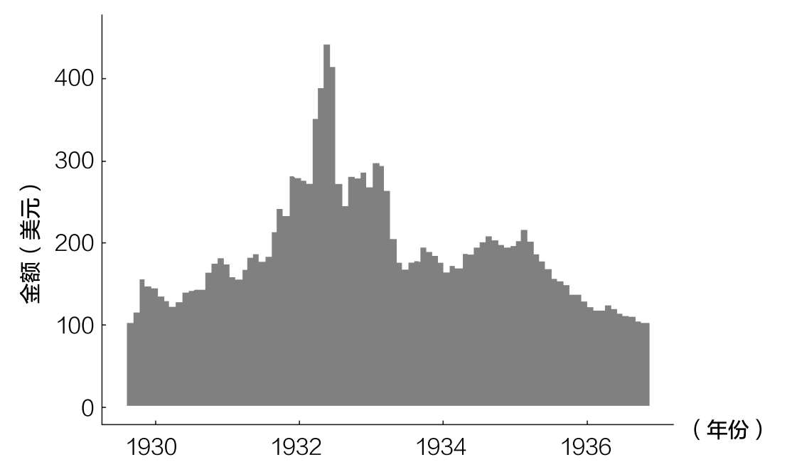
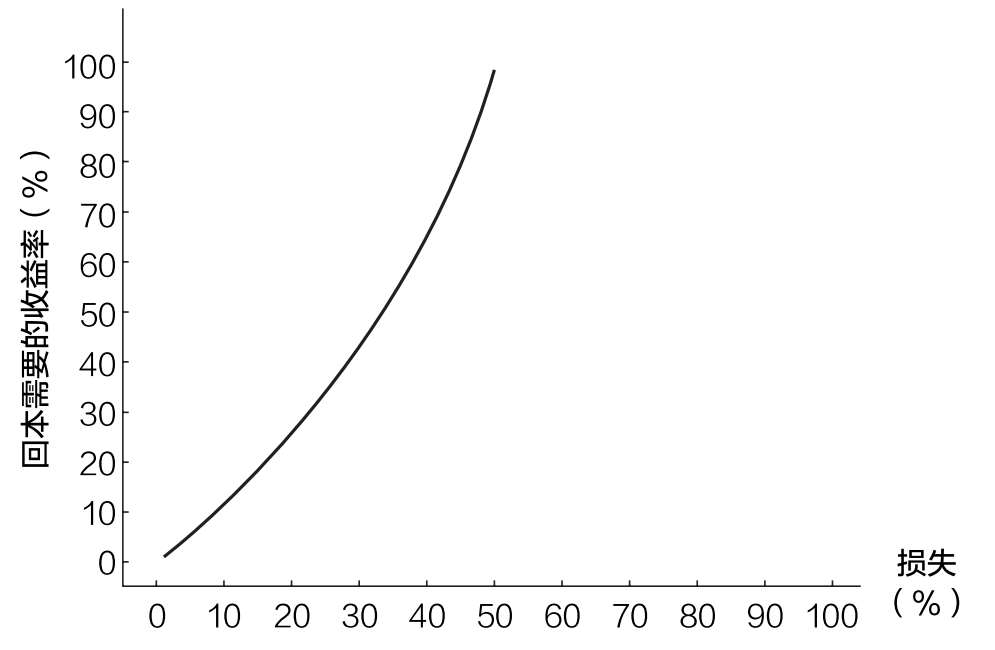
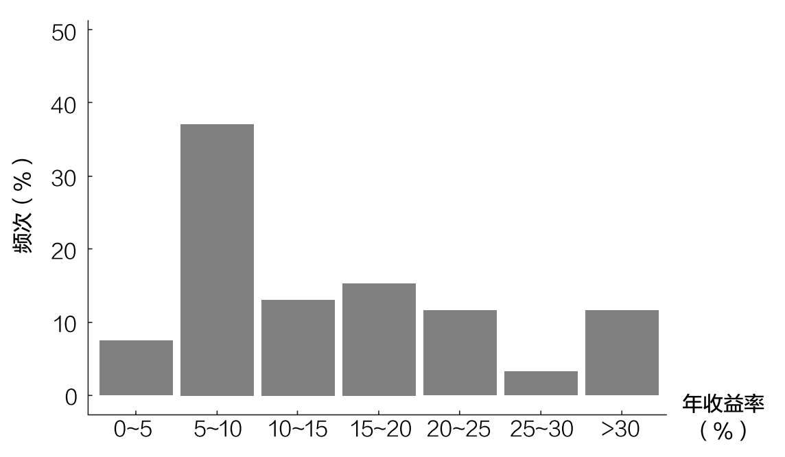
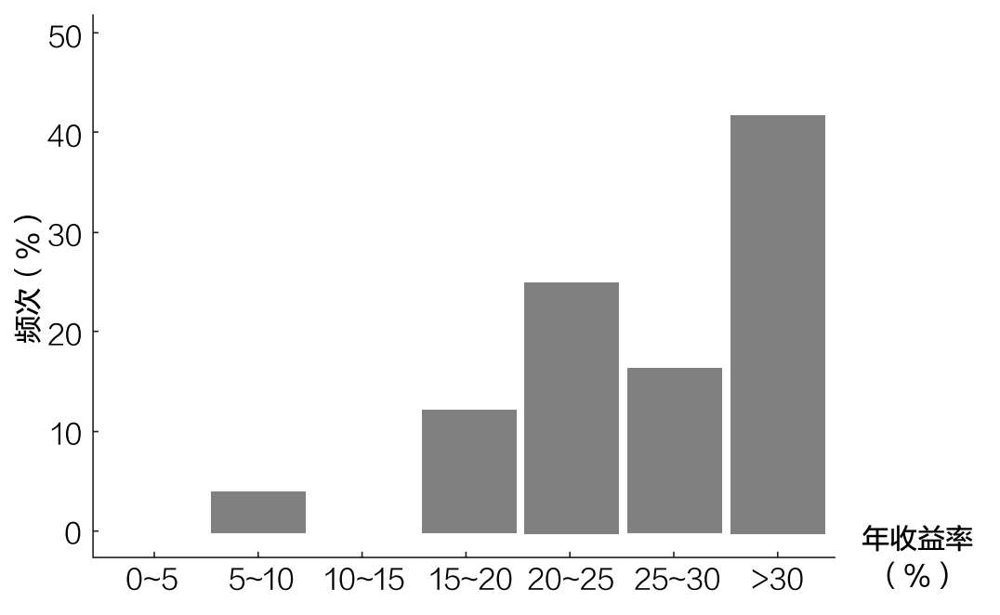
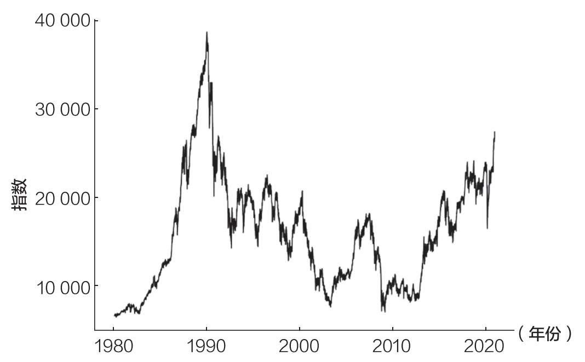
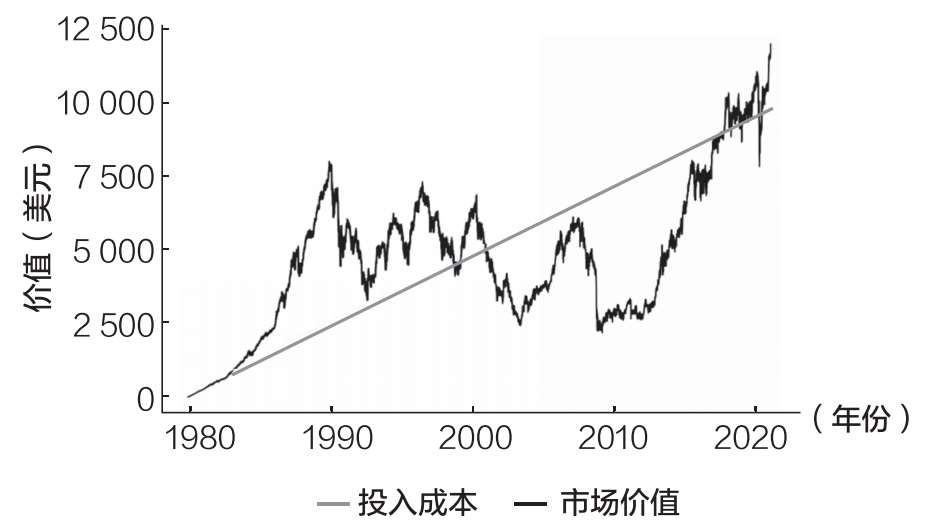

# 第十六章 危机期间如何投资

为什么要在恐慌时保持镇定

我永远不会忘记我在2020年3月22日上午做的事。那是一个星期天，我正在去曼哈顿的一家当地商店买杂货的路上。

不到48小时前，标准普尔500指数本周收盘下跌3.4%，较一个月前的高点下跌32%。我之所以记得这一点，是因为我一直努力为市场在全球经济因新冠病毒感染疫情而陷入停滞的情况下如何能够复苏寻找理由。

纽约的室内餐厅已经被关闭。NBA（美国男子篮球职业联赛）赛季暂停。通知婚礼取消的邮件开始进入我的收件箱。我知道其他人也很恐慌，因为我收到了越来越多来自朋友和家人表达担忧的短信：

底部到了吗？

我应该卖出我的股票吗？

情况还会变得更糟吗？

说实话，我一点儿都不知道。但我必须找到一种思考这场危机的方式，让自己（以及那些联系我的人）保持理智。

当我乘自动扶梯来到商店的一层大厅时，我看到一大堆各式各样的鲜花在出售。这些花平时也在自动扶梯旁边的空地上摆着，但在这个特别的周日早上，我第一次注意到一个人在不慌不忙地整理它们。

就在这个时候，我意识到一切都会好起来的。不管怎样，就算世界在我周围分崩离析，卖花的人也还在那里卖他的花。

那一刻的某些东西让我难以忘怀。也许是因为这看起来太大胆了。这种时候我为什么需要花？我需要罐头食品和卫生纸。

但这并不大胆。这是一个正常的时刻。如果卖花的人还有希望，我为什么没有呢？我从来没有把这件事情告诉过任何人，但在我最需要的时候，那一刻的场景振奋了我的精神。

接下来的一系列思考让我总结出了一个在金融恐慌中投资的新框架。我希望这个框架能改变你在未来市场崩盘时购买资产的想法。

我写这一章是为了让你回顾一下金融世界看起来最不确定的时候。当灾难性的风暴来袭时（在未来的某个时刻，它仍将不可避免地袭来），我希望你们回到这一章，再读一遍。如果你做对了，本书对你来说就是物超所值的。愿投资之神眷顾你。

为什么市场崩盘是买入机会

据报道，18世纪的银行家罗斯柴尔德爵士说过：“当街头发生流血事件时，才是买入的时候。”在滑铁卢战役后的恐慌中，罗斯柴尔德利用这句格言发了一笔小财。但这句话在多大程度上是对的呢？

在第十三章中，我尽我所能地说服你，寄希望于只在市场调整期间（比如街头发生流血事件的时候）买入是不明智的。这些事件的低频使得大多数投资者在大多数时间里囤积现金，无利可图。

然而，数据表明，如果你在市场调整期间拥有可投资的现金，这可能是你将获得的最好的投资机会之一。

理由很简单——假设市场最终会复苏，在危机期间投资的1美元的增长幅度将远远超过几个月前投资的1美元。

为了证明这一点，让我们想象一下，从1929年9月到1936年11月，你决定每月投资100美元购买美国股票。这一时期涵盖了1929年的崩盘和随后的复苏。

如果你遵循这样的策略，图16.1便显示了到1936年11月美国股市复苏时，每100美元的月投资将增长到什么水平（含股息，经通胀调整后）。

正如你所看到的，你在1932年夏天买入的价格越接近底部，长期收益就越大。在低点时投资的100美元到1936年11月将增长到440美元，大约是1930年投资的100美元投资增长（到1936年增长到150美元）的3倍。

图16.1 100美元月投资的最终增长

大多数市场崩盘不会提供这样的3倍机会，但其中许多确实提供了50%~100%的上行机会。

这种好处从何而来？

它来自一个简单的数学定理——每一个百分比的损失都需要更大百分比的收益才能回本。

损失10%需要11.11%的收益回本，损失20%需要25%的收益回本，损失50%需要100%的收益（翻倍）回本。通过图16.2，你可以更清楚地看到这种指数关系。

2020年3月22日，当我意识到全球即将挺过新冠病毒感染疫情时，标准普尔500指数下跌了约33%。

从图16.2中可以看出，这意味着市场必须上涨50%才能回到下跌前的水平。假设市场在未来某个时间恢复到之前的水平，2020年3月23日（随后的交易日）投资的1美元最终将增长到1.5美元。

图16.2 回本需要的收益率

幸运的是，市场确实在一定时间内复苏了。在6个月内，标准普尔500指数再次创下历史新高。那些在3月23日买入的投资者在半年内获得了50%的收益。

然而，即使复苏需要数年时间，在2020年3月23日买入仍将是一个伟大的决定。你所要做的就是重新构建你对市场前景的看法。

重构好的一面

尽管在2020年3月23日买入股票是明智之举，但许多投资者不敢这样做——问题似乎在于他们如何看待这个问题。

例如，如果我在2020年3月22日问你：“你认为市场需要多长时间才能从33%的损失中恢复过来？”你会说什么呢？

它需要一个月才能达到新的历史高点吗？

还是需要一年？

或者需要十年？

根据你的回答，我们可以重新调整我们对未来市场的预期年收益率。

怎么样？

我们知道33%的损失需要50%的收益才能回本。因此，一旦我知道你预计市场需要多长时间复苏，我就可以将50%的上涨转化为年度收益。

其公式为：

预期年收益率=（1+回本需要的收益率）^（1/回本年限）-1

但由于我们知道“回本需要的收益率”是50%，我们可以将这个数字代入并简化这个方程为：

预期年收益率=（1.5）^（1/回本年限）-1

因此，如果你认为市场复苏需要：

·1年，那么你的预期年收益率=50%

·2年，那么你的预期年收益率=22%

·3年，那么你的预期年收益率=14%

·4年，那么你的预期年收益率=11%

·5年，那么你的预期年收益率=8%

当时，我认为市场将需要一到两年的时间才能复苏，这意味着我在2020年3月23日投资的每一美元都可能在这两年内每年增长22%（或以上）。

更重要的是，即使是那些预计市场将在5年内复苏的人，如果他们在当天买入，也能获得8%的年收益率。8%的收益率接近美国股市的长期平均收益率。

这就是为什么在这场危机中购买股票是一件轻而易举的事情。即使在市场需要5年时间才能复苏的情况下，你仍然可以在等待期间获得8%的收益。

这一逻辑也适用未来的任何市场危机。因为如果你在市场下跌30%或更多的时候买入，你将来往往能获得比较高的收益率。

图16.3说明了这一点。它显示了如果你在1920—2020年美国股市下跌30%（或以上）时的任何一个月买入，所获得年收益率的分布情况。图16.3所显示的收益跨度是从股票第一次下跌30%（或以上）到下一次历史高点。

图16.3 30%以上回撤时买入后的年收益率

图16.3表明，在市场下跌至少30%的情况下买入，你获得0~5%年收益率（含股息，经通胀调整后）的可能性不到10%。事实上，在一半以上的时间里，你在复苏期间的年收益率将超过10%。将0~5%柱和5%~10%柱加在一起，你就会发现，它们的总和还不到50%。

但不要着急，还有更多其他的发现。如果我们对数据进行子集划分，只包括那些市场从1920—2020年下跌50%（或以上）的时期，你的未来收益看起来将更有吸引力。

正如你在图16.4中所看到的，当美国股市被腰斩时，未来的年收益率通常会超过25%。这意味着，当市场下跌50%时，是时候满仓、尽可能多地投资了。

当然，由于经济的不确定性，当市场波动时，你可能没有很多可投资的现金来利用这个罕见的机会。然而，如果你确实有多余的现金，那么数据表明，利用这个买入机会是明智的。

图16.4 50%以上回撤时买入后的年收益率

那些不能迅速复苏的市场怎么办

本章的分析假设股市在几年内或者10年内能从一次重大崩盘中恢复过来。虽然大多数时候都是这样，但也有明显的例外。

例如，日本股市在30年后的2020年底仍低于1989年12月的高点，如图16.5所示。

每当我讨论长期投资的重要性时，日本都是一个典型的反例。

也有其他例子。例如，2020年底，俄罗斯股市较2008年高点下跌50%，希腊股市较2008年高点下跌98%。这些市场会复苏吗？我不知道。

图16.5 日本股市30多年一直低于曾经的高点

然而，我们不应该让例外情况代替一般情况——大多数股票市场在大多数时候都会上涨。

是的，在较长的时间内，市场偶尔会有表现不佳的时期。毕竟，从2000年到2010年，就连美国股市也在下跌。

但在几十年的期间内，股市亏损的可能性有多大？

在分析了39个发达国家在1841年至2019年的股市表现后，研究人员估计，在30年的投资期限内，相对于通胀而言，投资股市的损失概率为12.5%。[^94]

这意味着，在一个特定的股票市场上，大约有12.5%的可能性会出现30年内购买力下降的情况。日本股市就是一个例子。

然而，尽管这看起来很可怕，但这项研究反而增强了我对全球股市的信心。因为它意味着，从长远来看，股票市场有87.5%的机会带来购买力的提高。我喜欢这种可能性。

更重要的是，研究人员的估计是基于对股票市场的一次性投入，而不是分批投入。例如，如果你在1989年日本股市达到顶峰时将所有现金投入日本股市，30年后你的这笔投资就会缩水。但个人投资者做出这种一次性重大财务决策的频率有多高？几乎不存在。

大多数人会分批买入创收资产，而不是一次性买入。如果你分批购买，而不是一次性投入，你在几十年里赔钱的可能性就会更小。

例如，如果你从1980年到2020年底的每个交易日都向日本股市投资1美元，你的投资组合在这40年间仍然会为你带来一些正收益。

正如图16.6所示，在这40年中，有些时期你投资组合的价值超过了投入成本，有些时期则没有。

图16.6 每天投资日本股市1美元的投资组合市场价值vs投入成本

市场价值（黑线）高于投入成本（灰线）意味着赚钱。市场价值低于投入成本就意味着亏钱。

正如你所看到的，到2020年底，这40年内投资组合有少量收益。这不是一个很好的结果，但考虑到日本股市在过去30年里的表现当属世界最差之列，这个结果也不算坏了。

一些人以日本和其他国家为借口而持有现金，直到下一次危机尘埃落定。然而，当尘埃落定时，市场往往已经上涨了。

那些胆小的人太害怕卷入其中，他们最终将被甩在后面。我在2020年3月亲眼见证了这一点，我非常有信心未来会再次见证。

如果你仍然害怕在危机期间买入，我能理解你。纵观历史，我们很容易找到这样的例子：事后看来，这样做是愚蠢的。但我们不能根据例外情况或可能发生的情况进行投资。否则，我们永远都不会投资。

正如弗里德里希·尼采说过的那样：“忽视过去，你将失去一只眼睛；生活在过去，你的两只眼睛都会失去。”

了解历史很重要，但沉迷于历史会让我们误入歧途。这就是为什么我们必须根据数据告诉我们的情况进行投资。著名金融作家杰里米·西格尔对这一点做了最好的总结。他写道：“与令人印象深刻的历史证据相比，恐惧对人类行为的影响更大。”

这是我一直以来最喜欢的对投资的总结，也是唯一适合本章的结束语。我只希望它能给你提供精神上的支持，让你在下次市场暴跌时继续勇敢买入。

我们已经花了一些时间来回顾如何购买资产，包括在行情最差的时候该怎么做，我们现在要将注意力转向一个更难的问题：你应该在什么时候出售资产？

[^94]: Anarkulova, Aizhan, Scott Cederburg, and Michael S. O'Doherty, "Stocks for the Long Run? Evidence from a Broad Sample of Developed Markets," ssrn.com (May 6, 2020).
