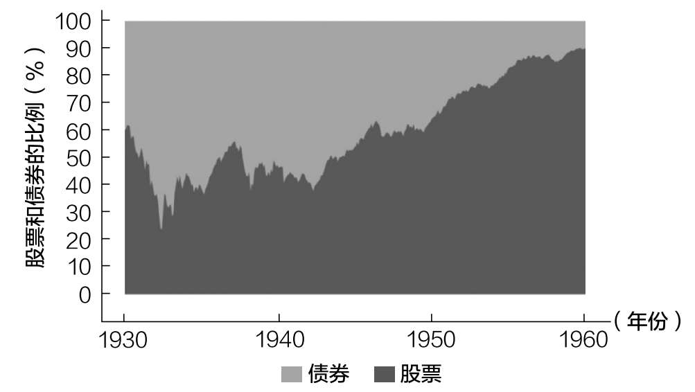
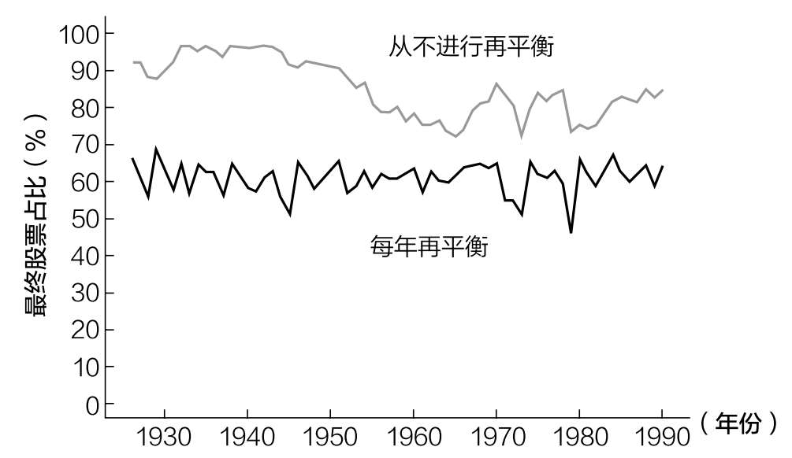
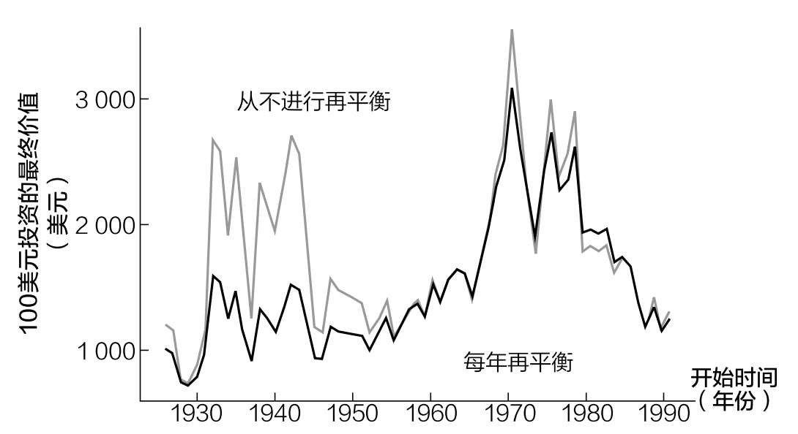
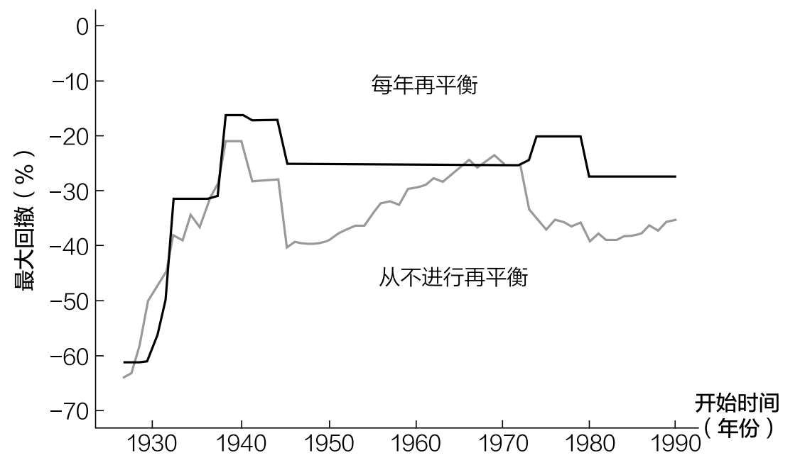
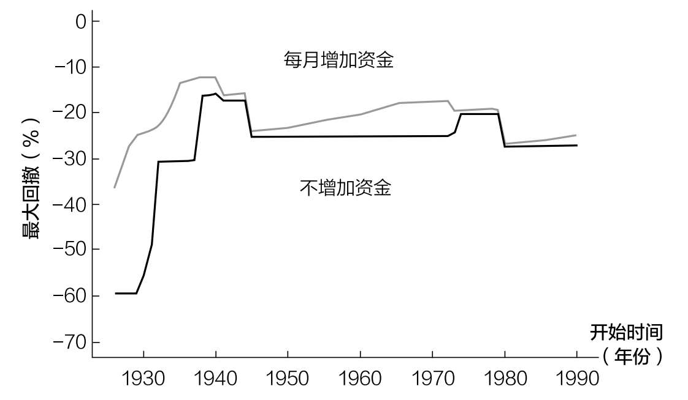

# 第十七章

## 应该什么时候卖出

关于平衡投资组合、集中头寸和投资目的

尽管我们的投资理念是持续买入，但在你的投资旅程中，不可避免地会出现一个你需要卖出的时刻。不幸的是，选择何时卖出可能是你作为投资者所做过的最困难的决定之一。

为什么？

因为卖出迫使你面对投资世界中两个最强烈的行为偏见——担心在市场上行时错过机会，担心在市场下行时赔钱。这种情绪上的恶习会让你质疑你做出的每一个投资决定。

为了避免这种心态上的混乱，你应该设定一组条件，当你想在某个位置卖出时，参照已经设定的条件，你可以直接卖出，而不是受情绪左右。这将使你可以根据自己的情况，按计划出售你的投资。

对于何时应该出售资产，我只找到以下三种情况：

1. 再平衡投资组合。

2. 摆脱集中（或亏损）的头寸。

3. 满足财务需求。

如果你不需要再平衡你的投资组合，摆脱集中（或亏损）的头寸，或试图满足财务需求，那么我认为你没有理由出售资产，永远没有。

我之所以这么说，是因为卖出可能会需要缴税，这是我们应该尽可能避免的事情。但在我们深入研究这一点和上面列出的三个条件之前，让我们先来讨论一下关于何时应该出售资产的总体战略。

一次性卖出还是分批卖出

在第十二章中，我们研究了为什么一次性买入比分批买入要好。理由很简单：大多数市场大多数时间都在上涨，等待通常意味着错过上涨的机会。

当涉及卖出资产时，我们可以使用同样的推理，但得出相反的结论。由于市场往往会随着时间的推移而上涨，最佳的做法是尽可能晚地卖出。因此，（尽可能晚地）分批次卖出通常比一次性卖出要好。

当然，在某些情况下，一次性卖出的收益会更好，但如果你有选择，在出售或平衡头寸之前等待尽可能长的时间，通常会让你净赚更多的钱。

换句话说，快买慢卖。

我提出这一点是因为它有助于你未来所有关于买卖时机的决策。然而，即使有了这个框架，在投资领域，人们在选择时机时也会受到干扰。

正如我们上面看到的，为了再平衡投资组合，出售投资是可以接受的。下面我们来具体看一下。

再平衡有什么好处

“完美平衡，一切都应该如此。”

这不仅是漫威电影中的主要反派灭霸的台词，在管理你的投资组合时，这句话也有一些实际应用。

在第十章中，我们讨论了你应该投资什么资产，却从未讨论投资组合将如何变化。在投资领域，解决这个问题的办法是再平衡。

适当提醒一下，你在第一次建立投资组合时，应该根据你的目标进行配置。例如，你的目标可能是配置60%股票/40%债券——以美国市场为例，如果你投资1000美元，这意味着600美元将投资于美国股票市场指数，400美元将投资于美国国债。

如果不进行再平衡，你的投资组合将会逐渐偏离其目标配置，变成以收益较高的资产为主。例如，如果我们按6∶4的比例投资股票和债券，并在30年内不交易，30年后，我们的投资组合将以股票为主。

正如你将在图17.1中所看到的，1930—1960年，我们对一个从未进行再平衡的投资组合以60%股票/40%债券的形式进行单一投资，30年后这个投资组合的90%将是股票。

图17.1 从未进行再平衡的60%股票/40%债券投资组合

这种情况不仅仅发生在20世纪30年代。如果我们将这一分析扩展到1926—2020年的每30年期间，也会看到类似的结果。

图17.2显示了以6∶4的比例投资股票和债券的投资组合采用两种不同的再平衡策略——一种是每年再平衡，另一种是从不进行再平衡——在30年后的股票占比。

图17.2 60%股票/40%债券的投资组合30年后的股票占比

正如你在图17.2中所看到的，执行每年再平衡策略的投资组合往往在第30年的年末持有约60%的股票。这是合乎逻辑的，因为该策略每年将其股票持有量再平衡到投资组合的60%。

另一方面，从不进行再平衡的投资组合往往在第30年的年末最终持有75%~95%的股票，股票占绝对地位。这是因为在较长的时间内，美国股市的表现往往优于美国债券。

从这个简单的事实我们可以推断出，从不进行再平衡的投资组合通常会跑赢每年再平衡的投资组合。为什么？因为再平衡意味着出售高增长的资产（股票），购买低增长的资产（债券）。这会降低总收益。

图17.3以100美元的投资为例，比较每年再平衡策略与从不进行再平衡策略下的增长情况。

图17.3表明，在大多数情况下，投资组合中高增长资产和低增长资产之间的再平衡往往会降低整体业绩。1980—2010年是一个例外，因为当时美国债券表现良好，而美国股市在这一时期的后十年（2000—2010年）受到重创。

图17.3 60%股票/40%债券的投资组合30年后的最终价值

图17.3说明，在大多数情况下，再平衡通常不会提高收益。那么，人们为什么仍然这样做？

为了降低风险。

再平衡就是为了控制风险。假设你的目标投资组合是以6∶4的比例投资美国股票和债券，如果不进行再平衡，你的投资组合最终可能会在几十年内变成75%股票/25%债券，甚至95%股票/5%债券。因此，投资组合的风险最终将比初始设定的风险要大很多。

一个简单的例子是考虑这两种策略在30年期间的最大回撤。需要说明的是，最大回撤是指在给定的时间内投资组合下跌的最大幅度。比如你的投资组合从100美元开始，最糟糕的时候下降到30美元，那便是70%的最大回撤。

正如图17.4所示，在大多数时候，从不进行再平衡策略下的回撤比每年再平衡策略下的回撤更大。

图17.4 60%股票/40%债券的投资组合30年内的最大回撤

例如，如果你在1960年在60%股票/40%债券的投资组合中投资了100美元，但在30年里从未进行再平衡，在最糟糕的时候，你的投资组合将比最高价值下降约30%。这是它在30年时间里的最大回撤。

但是，如果你每年都将投资组合再平衡到目标配置，最大回撤便只有25%。

从图17.4中我们可以看到，在大多数时候，再平衡能够通过将资金从波动性较高的资产（股票）转移到波动性较低的资产（债券）来降低风险。然而，在股票长期下跌期间（如20世纪30年代初和70年代初），情况可能恰恰相反。在这些情况下，再平衡实际上增加了波动性，因为它通过出售债券来购买继续下跌的股票。

尽管这些情况很罕见，但它们表明，周期性再平衡并不是风险管理的完美解决方案。然而，我确实建议大多数个人投资者在一些时间点上进行再平衡（只不过很难找到合适的时间点）。

你应该多久再平衡一次

虽然我很想给你一个明确的答案，告诉你应该多久再平衡一次你的投资组合，但事实是……没有人知道。我研究了从一个月一次到一年一次，但一直没有找到一个最佳频率。遗憾的是，没有任何再平衡频率自始至终优于其他频率。

先锋领航集团的研究人员在对50%股票/50%债券投资组合的最佳再平衡频率进行分析后得出了类似的结论。他们在论文中写道：“无论投资组合是每月、每季度还是每年再平衡，经风险调整后的收益都没有特别大的不同。然而，再平衡的成本随着再平衡次数的增加而显著增加。”95

虽然他们分析的是具有不同风险特征的资产（股票和债券）之间的再平衡，但同样的逻辑也适用于具有类似风险特征的资产之间的再平衡。例如，著名金融作家威廉·伯恩斯坦在研究了全球股票组合之间的再平衡频率后得出结论：“没有最优的再平衡周期。”96

所有这些分析都说明了同样的事情：什么时候再平衡并不重要，只要你定期再平衡就行了。因此，我建议每年进行一次再平衡，原因有两个：

1. 不需要花太多时间。

2. 与年度纳税时间重合。

出于不同的原因，这两者都很重要。

首先，每年花更少的时间来监控你的投资，可以让你有更多的时间做你喜欢的事情。这就是为什么我不支持基于容忍范围的再平衡。基于容忍范围的再平衡是指当资产配置偏离目标配置一定范围后进行的再平衡。

例如，如果你的投资组合中60%是股票，有10%的容忍区间，你会在每次股票配置高于70%或低于50%时将其再平衡到60%。这种方法很管用，但也需要花更多的时间。

其次，年度再平衡可以和其他与税收有关的财务决策同时进行——从这个角度看，年度再平衡也是很好的选择。例如，如果你出售了一项待缴纳资本利得税的投资，你可能会发现，同时再平衡你的整体投资组合可以节省税费。

无论选择什么样的再平衡频率，你都应该避免不必要的税费。这就是为什么我不建议你在应税账户（经纪账户）中频繁进行再平衡。因为每次这么做，你都得缴税。

但如果我们可以在不缴税的情况下实现再平衡呢？还有比卖出更好的方法吗？

一个更好的再平衡策略

虽然卖出资产以平衡投资组合并不是世界上最糟糕的事情，但还有一种不需要纳税的再平衡策略——持续买入。这是有道理的。你可以通过买入资产来平衡投资组合的配置。我称之为积累型再平衡，因为你是通过持续买入头寸少的资产来实现再平衡的。

例如，假设你的投资组合目前是70%股票/30%债券，但你希望它是60%股票/40%债券，那么你可以继续购买债券，直到你的配置回到60%股票/40%债券，而不是出售10%的股票，再购买10%的债券。

然而，这种方法只适用于那些仍处于财务积累期的人。一旦你不再能存下钱，你就必须卖出资产来实现目标配置。

我喜欢积累型再平衡策略，因为它可以减少投资组合在市场暴跌时的损失。通过不断增加资金投入，你可以持续抵消投资组合中的损失。例如，回到我们的60%股票/40%债券的投资组合，与不增加资金投入相比，在30年内不断增加资金投入的情况下，大多数时期的最大回撤要小得多。

如图17.5所示，在每个月增加资金的同时进行再平衡，在某些情况下可以使投资组合的最大回撤减少一半。图17.5对比了两个60%股票/40%债券的投资组合在30年内的最大回撤，其中一个从不增加资金投入，另一个使用积累型再平衡策略连续30年每月增加资金。

图17.5 60%股票/40%债券投资组合30年内的最大回撤

在这两种情况下，通过增加资金投入进行积累型再平衡，其投资组合的最大回撤要更小。

积累型再平衡策略的唯一困难之处在于，随着投资组合规模的增加，它变得越来越难以实现。虽然在投资组合规模小的时候你很容易增加资金来再平衡投资组合，但随着投资组合规模的扩大，你可能没有足够的现金来维持目标配置。在这种情况下，从风险的角度来看，用应税账户卖出股票是有意义的，只是不要太频繁。

我们已经讨论了再平衡时为什么你可能需要卖出，接下来让我们看看为了摆脱集中（或亏损）头寸，你该如何卖出资产。

摆脱集中（或亏损）头寸

正如我在第十一章中讨论的，我不太喜欢集中投资于单一证券。然而，有时候生活并不会给我们选择。例如，如果你在一家提供股权薪酬的公司工作（或创办一家这样的公司），有一天你可能会发现，你的很大一部分资产都投入了一种证券。

在这种情况下，祝贺你！然而，随着时间的推移，你可能会考虑卖出一部分股权。你应该卖多少？这取决于你卖出的目的。

例如，如果你有抵押贷款债务，且投资头寸集中于某一证券，那么出售这种证券以偿还抵押贷款可能是有意义的。从收益的角度来看，这可能是次优的，因为你持有的证券可能会比你的房子升值得更快。

然而，从风险的角度来看，这可能很有意义。毕竟，投资的未来收益只是一种可能性，但未来需要偿还的抵押贷款是确定的。有时候，用“可能”换“确定”是好的决策。

那么到底应该怎么做呢？

找到一种卖出策略并坚持下去。无论这意味着每个月（或每个季度）卖出10%、一半还是立即卖出大部分，只要你能因此晚上安眠即可。你也可以根据价格水平（上行和下行）卖出，只要事先确定就行。使用一套预先确定的规则将使你在卖出过程中不受情绪的影响。

无论你用什么策略，不要一次卖掉全部头寸。为什么？因为税收问题，并且如果证券的价格在你卖出后飙升，你后悔的可能性很大。与你卖掉95%结果剩下的5%价值清零相比，你全部卖掉结果价格上涨10倍的情况让人感觉更糟。在决定卖出数量的时候，你应该使用这种使后悔最小化的框架。

然而，我确实需要提醒你，你的集中头寸很可能表现低于整体股市。如果你看看美国自1963年以来的个股，年化收益率（含股息）中位数仅为6.6%。这意味着，如果你自1963年以来在任何时间点随机买入一只股票，你在接下来的一年里将获得大约6.6%的收益。然而，你如果买的是标准普尔500指数，就会获得9.9%的收益。

这说明了持有集中头寸的真正风险——收益低。虽然有些人能接受这种风险，但也有些人不能。所以，要明确你愿意为集中头寸承担的风险水平，然后相应地卖出头寸。

除了出售集中头寸，你还可能需要在投资生命周期的某个时候出售亏损头寸。无论是你对某一资产类别的信念发生变化，还是你的某个集中头寸持续下跌，有时你只是必须退出。

我在对黄金进行了一些分析后体会到了这一点。我意识到，我不应该长期持有黄金。由于我对该资产类别的信念是根据基本面分析（而不是情绪）改变的，我卖出了该头寸。即使我持有的黄金价值增加了，情况也是如此。虽然这个头寸在货币意义上还不是一个亏损的头寸，但我相信它最终会是亏损的，所以我卖出了。

由于头寸亏损往往是罕见的，特别是在较长的时间内，因此出售亏损不应该是常见的情况。不要把一段时间的表现不佳与亏损混为一谈。每个资产类别都会经历表现不佳的时期，所以你不应该把这些时期作为卖出的借口。

例如，2010—2019年，美国股市的总收益率为257%，而新兴市场的总收益率只有41%。然而，从2000年到2009年，情况恰恰相反，新兴市场上涨了84%，而美国股市的涨幅不到3%！关键是，表现不佳是不可避免的，它不是卖出的好理由。

我们已经讨论了为摆脱集中（或亏损）的头寸而卖出头寸的情况，然而卖出头寸还有其他原因。

投资的目的

你考虑卖出一项投资的最后一个原因是最明显的——过上你想要的生活。无论这意味着为退休生活提供资金，还是为大件物品筹集现金，卖出投资都是实现目标的一种方式。毕竟，如果你从来没有享受过投资的结果，那投资还有什么意义？

对那些将绝大部分财富集中在一个地方的人来说，这一点尤其正确。你赢得了游戏，但其他人不想停止游戏。为什么要冒这个险？为什么不拿出一些钱，让你的财富多样化，并适当享受生活呢？

你可以为你和你爱的人建立一个安全网，为你孩子的529教育账户提供资金，并偿还你的抵押贷款。如果你愿意，你甚至可以买梦想中的车。无论你怎样花自己的钱都可以。

在为想要的生活冒险之前，先为需要的生活准备资金。

我之所以推荐这种方法，是因为人类心理学认为这是明智的做法。正如第二章所讨论的，每增加一个单位的消费，它所带来的快乐都会减少。财富也是如此。

这就是为什么财富从0美元到100万美元比财富从100万美元到200万美元给人带来的幸福感要大得多。虽然这两种财富的变化在绝对意义上是相同的，但从0美元到100万美元的人在相对意义上的变化要大得多。正是财富和幸福之间的这种递减关系让人相信，有时候卖出是可以的。

既然我们已经讨论了何时应该考虑卖出你的资产，接下来我们讨论一下你应该将资产放在哪里。
