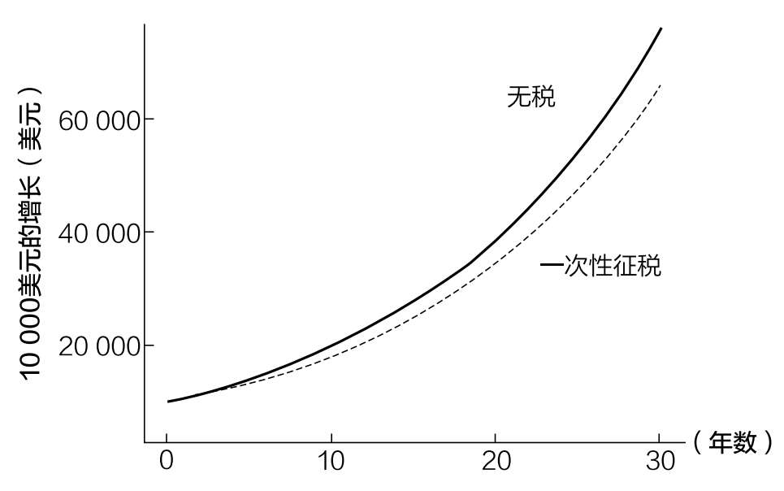

# 第十八章

## 你应该在哪里投资

罗斯401（k）与401（k）退休金计划

“等等……剩下的呢？”我震惊地说。曾经，我拿着我的第一份薪水，茫然地盯着工资单时，确信一定是有人弄错了。站在旁边的母亲听到我的话，笑了起来。

但那不是我母亲平常的笑，那是一种智慧的笑。她早就知道了一些我即将学到的东西。

“税收，亲爱的，是税收。”她笑着说。

我猜你在拿到第一份薪水后也有类似的经历。困惑之后是失望。“等等……剩下的呢？”是常见的反应。

到目前为止，我们忽略了税收是如何影响投资决策的，但本章将讨论这一点。我们将探讨一些与税收有关的重要的投资问题，包括：

·我应该参加罗斯401（k）还是401（k）退休金计划？

·我应该封顶缴纳401（k）退休金计划吗？

·我应该如何打理我的资产？

这些问题将为你的投资方向提供一般性指导。虽然本章中涉及的账户类型主要集中在美国［401（k）退休金计划、IRAs（个人退休金账户）等］，但讨论的原则适用于任何投资与税收有关的地方。

税收性质的变化

本杰明·富兰克林说过：“人的一生中有两件事是确定无疑的——死亡和税收。”遗憾的是，富兰克林的这句话并不像它最初看起来的那样正确。你只需要研究一下美国所得税的历史就能知道原因。

尽管现代美国所得税始于20世纪初，但美国所得税的历史要复杂得多。美国第一次提议征收所得税是在1812年战争期间，但该提议并未被采纳施行。

接下来，在1862年的《税收法案》中，所得税作为美国内战期间的一项救济措施出现了。这一法案通过了，但战后该法案在1872年被废除。

20多年后，美国国会通过了《1894年税收法案》，开始在和平时期征收所得税。然而，一年后，美国最高法院在“波洛克诉农家贷款和信托公司案”中裁定，这项税收违反宪法。

尽管遭遇了这些挫折，但民众仍然支持征收个人所得税。1909年，第十六条宪法修正案通过。1913年，国会正式拥有“对收入征税的权力，无论收入来源如何”。

在第十六条宪法修正案之前，国会只能合法地从关税和特定商品，如酒精或烟草的消费税中获得收入。然而，根据第十六条宪法修正案，国会可以对个人收入征税。现代版的美国所得税诞生了。

然而，它仍然与我们今天所知道的所得税完全不同。不仅税率较低（1913年仅为1%），而且免税额很高，只有2%的美国家庭缴纳所得税。97正如你所看到的，从那时到现在，我们已经取得了很大的进展。

我告诉你美国所得税的历史，以说明美国税收政策在不断变化。遗憾的是，正是税收政策的这种不断演变，让人难以决策。未来随着法律的变化，围绕这些法律的最佳决策也会发生变化。

这就是为什么我建议向税务顾问寻求专业帮助。当涉及税收时，个人的基本情况很重要。你的年龄、家庭结构、居住地所在州等等都会影响你做出与投资相关的税务决定。遗憾的是，在税收问题上没有放之四海而皆准的解决方案。

即便如此，接下来的讨论也能为思考税收问题提供一个有用的框架。

首先，我们来看一个古老的问题：我应该参加罗斯401（k）还是401（k）退休金计划？

是否参加罗斯401（k）退休金计划

个人理财领域一个最常被提及的问题是，是通过雇主参加401（k）还是罗斯401（k）退休金计划。提醒一下，401（k）退休金计划，也被称为传统的401（k）计划，缴纳的是税前收入，而罗斯401（k）退休金计划缴纳的是税后收入。这两种账户的唯一区别是什么时候交税。

为了说明这一点，下面我将简单演示一下两种账户的运行方式。在此之前，我要提醒你，当我在讨论401（k）计划与罗斯401（k）计划时，同样的逻辑通常也适用于403（b）计划和IRAs。

下面让我们开始吧。

·401（k）计划：凯特收入100美元，她直接用其缴纳401（k）计划，无须缴纳任何所得税。在接下来的30年里，让我们假设100美元增长到300美元。在退休时，凯特支取了300美元，但必须支付30%的所得税。她在退休后能消费的钱（税后）是210美元（300美元的70%）。

·罗斯401（k）计划：凯文现在赚100美元，缴纳30%的所得税，税后收入为70美元。他将这70美元直接存入他的罗斯401（k）计划，在未来30年里，这笔钱将增长到210美元。退休后，凯文不用付任何额外的所得税就能消费210美元。

凯特和凯文最终都有210美元的退休金，因为他们缴纳的金额一样，投资收益率一样，所得税率也一样。从数学角度看，这是有道理的，因为将一组数字相乘时，数字的顺序并不重要。

3×2×1=1×2×3

或者以凯特和凯文为例：

100×3×70%=100×70%×3

他们俩唯一的区别是交税的时间，凯特最后交税，凯文在开始时交税。这就是为什么如果在工作期间和退休后的实际所得税率相同，那么加入401（k）计划还是加入罗斯401（k）计划没有什么差别。

请注意，我说实际所得税率只是简单起见，因为在现实生活中，更重要的是边际效率。例如，如果凯特在2020年的应税收入超过9875美元，她的不高于9875美元的收入部分的税率将仅为10%，之后每一美元的税率将增加到10%以上。在本章接下来的内容中，除非另有说明，你可以假设任何提到的税率都是实际税率（所有收入的平均税率）。

重申一下，如果实际个人所得税率保持不变，那么你无论选择401（k）还是罗斯401（k）计划都没有区别。然而，如果你希望个人所得税率有所变化，那么我们可以简化这个决定。

简化有关401（k）计划与罗斯401（k）计划的决策

在决定是选择401（k）计划还是罗斯401（k）计划时，缴税时间很重要，我们可以把这个问题简化为回答这样一个问题：

你现在（工作时）还是以后（退休时）的实际所得税率更高？

在其他条件相同的情况下，你如果认为你现在的实际所得税率更高，那么你就参加401（k）计划，否则就参加罗斯401（k）计划。

当你的税率最高时，缴纳退休金账户的目的是避税。然而，你必须考虑联邦、州和地方的所得税可能会随时发生变化。

思考未来的税率

考虑到在选择401（k）或罗斯401（k）计划时，未来的税率是最重要的，你的下一个问题可能是：“尼克，未来的税率是多少？”

遗憾的是，我也不知道！

其他人也不知道。你可以尝试利用历史趋势来考虑未来几十年联邦或州的税率是高还是低，但这比想象的要难。

例如，在2012年，我认为美国联邦所得税率未来可能会提高，在某种程度上接近欧洲发达国家。但令我惊讶的是，2017年《减税与就业法案》通过了，这降低了美国联邦所得税率。预测未来是很困难的。

虽然无法预测美国未来的所得税率，但花时间考虑你退休时的情况有助于弄清楚401（k）和罗斯401（k）计划的区别。

例如，假设你认为联邦实际所得税率将从你工作时的20%提高到退休时的23%。在其他条件相同的情况下，这意味着罗斯401（k）计划将是更好的选择，因为你现在支付的税率（20%）比退休时将要支付的税率（23%）低。

但如果其他条件都不一样呢？如果你现在在一个所得税率高的州（例如加利福尼亚）工作，并且你计划以后在一个所得税率低的州（例如佛罗里达）退休，你该怎么办？在这种情况下，参加401（k）计划将是首选，因为目前省下的州所得税可能会超过将来增加的联邦所得税。

然而，这将因州而异。例如，年龄在59.5岁以上的纽约州居民有权享受最高2万美元的州所得税减免，前提是这笔钱来自合法的退休计划，并满足其他一些要求。这会让你退休金计划的缴费计算变得复杂，但这是值得注意的。

虽然我们不能预测未来的税率，但我们可以对退休后需要多少收入以及我们计划在哪里退休进行预估。有了这两项信息，我们就能很好地判断出自己应该加入401（k）计划还是罗斯401（k）计划。

什么时候401（k）计划更好

虽然在某些情况下，罗斯401（k）计划会比401（k）计划更受欢迎，但我通常更喜欢401（k）计划。为什么？因为它有一个罗斯401（k）计划不具备的优点，即选择权。

使用401（k）计划，你可以更好地控制在何时何地交税。如果你把这一点和401（k）计划可以转换成罗斯个人退休金账户的优势结合起来，就可以玩儿一些有趣的税务游戏。

例如，如果你有一年收入很低（或无收入），你可以利用这段时间将401（k）计划转换为税率较低的罗斯个人退休金账户。

我有朋友在商学院时就用过这种策略，因为他们知道自己暂时赚不到什么钱。他们为转换账户支付的税款远低于他们在工作时参加罗斯401（k）计划缴纳的税款。

但你不一定非要去商学院才能使用这种策略。任何长期的低收入（例如请一年的假来抚养孩子、去休假等）情况下你都可以使用这种策略。

注意，这是假设你401（k）账户的余额不超过你一年的收入。如果超过，那么你将在转换账户时支付相同的（或更高的）税率。在将401（k）计划转换为罗斯个人退休金账户之前，请记住这一点。

除了选择时间，你还可以改变你的退休地点，以避免那些征收高额所得税的城市/州。这就是为什么如果你住在纽约市这样的高税率地区，向罗斯401（k）账户存钱可能是没有意义的，除非你知道你将在一个税率同样高的地区退休。

最后，虽然本章一直使用实际税率，但边际税率才是关键。例如，你（作为个人）在退休时通过401（k）计划取得退休金，对收入的前9875美元你只支付10%的税率，从9876美元到40125美元你只支付12%的税率，以此类推。这意味着，如果你计划在退休后接受低于你当前收入的退休金，那么401（k）计划是一个很好的选择。

例如，如果你在工作时挣了20万美元，但退休后只打算每年提取3万美元，那么401（k）计划允许你在工作时避免较高的边际税率，然后在退休时支付较低的边际税率。按照2020年单一申请人的税率，这将意味着避免32%的边际税率，而只需支付12%的边际税率。

虽然我不知道这些税收策略中的哪一个在未来对你最有用，但我知道，罗斯401（k）计划不提供这些选项。401（k）计划带来的额外灵活性，使它成为我雇主资助的退休计划的不二之选。

什么时候罗斯401（k）计划更好

尽管罗斯401（k）计划缺乏可转换性，但在一些特殊情况下，罗斯401（k）计划可能是最佳选择。其中一种情况是针对高储蓄者的。

为什么是这样？因为与401（k）计划相比，封顶缴纳罗斯401（k）计划意味着有更多的钱到了免税账户中。一点儿数学运算可以证明这一点。

想象一下，莎莉和山姆在2020年每人用19500美元封顶缴纳他们的401（k）计划。萨莉将19500美元存入罗斯401（k）账户，山姆则将19500美元存入401（k）账户。30年后，让我们假设他们的账户价值都增长到58500美元。遗憾的是，山姆还得缴纳所得税。假设缴了30%的税，他就只剩下40950美元用于退休了。

为什么莎莉的退休收入比山姆高？因为莎莉一开始就把更多的钱存入了她的免税账户。山姆为了在参加401（k）计划后拥有58500美元的税后退休资金，他最开始必须向他的账户缴纳27857美元。然而，由于2020年401（k）的最高年度缴纳额为19500美元，山姆运气不好。

这个简单的例子表明，罗斯401（k）计划可能对高储蓄者来说是更好的选择，因为他们能享受更多的递延所得税福利。

此外，如前所述，如果你比较确定退休时的税率将超过你工作时的税率，罗斯401（k）计划会是更好的选择。在这种情况下，你显然最好参加罗斯401（k）计划，在现在税率相对较低的情况下纳税。

为什么不能两者兼而有之

到目前为止，我一直在拿401（k）计划与罗斯401（k）计划做比较，就好像它们非得非此即彼。但事实并非如此。你可以两者兼而有之。

事实上，对任何参加罗斯401（k）计划的人来说，如果你的雇主也替你缴纳养老金，那么你的账户中就会自动有一部分是401（k）计划，所以你必须习惯两个账户兼而有之。然而，这并不是一件坏事。两者兼而有之能让你拥有更多的选择。

例如，我与一些退休金从业者进行过交谈，他们建议在职业生涯的早期，当收入较低时，参加罗斯401（k）计划，然后随着收入的增加，换成401（k）计划。

这个策略很好，因为它避免了收入最高的年份的最高税率，并在领取退休金时提供了额外的灵活性。正如我前面提到的，由于领取退休金的税收待遇因州而异，双重战略可能是有效应对复杂局面的最佳解决方案。

既然我们已经讨论了401（k）账户与罗斯401（k）账户的成本和好处，接下来让我们对使用这些账户可获得的税收好处加以量化。

量化退休金账户的好处

在谈到税收和投资时，你必须担心两层税收。第一层是个人所得税，我们刚刚讨论过，第二层是资本利得税。正是因为避免了资本利得税，退休金账户才如此有吸引力。

例如，如果你用100美元买入了一只标准普尔500指数基金，两年后以120美元的价格卖出，你就必须为这20美元的收益支付长期资本利得税。然而，在使用退休金账户［例如401（k）计划、IRAs］等时，假设你达到了退休年龄，那么这些收益不需要缴纳资本利得税。

通过避免资本利得税，你能在退休账户中获得多少好处？让我们来看看。

我们可以模拟将1万美元一次性投资到三种不同账户中的情况：

1. 无税：一个已经缴纳了所有相关所得税的免税账户［例如罗斯401（k）账户、罗斯个人退休金账户等］。

2. 一次性征税：一个应税账户（例如经纪账户），资本利得税只在账户清算时支付。假设不需要支付股息且所有收益最终都能实现。

3. 每年征税：每年缴纳资本利得税的应税账户（例如经纪账户）。想象一下，整个投资组合每年出售一次，然后买入一次。这就产生了按长期资本利得税计算的已实现收益。

所有账户将经历7%的年化增长率（超过30年），应税账户将在适用时支付15%的长期资本利得税。此外，我在这里使用罗斯401（k）账户/IRAs，因为我只想比较支付所得税产生的税收影响。

我已经从这个模拟中删除了第一层税收（个人所得税），只关注第二层税收（资本利得税）。这种做法的目的是将不缴纳资本利得税的长期好处（不纳税vs一次性纳税）和不每年买卖的好处（一次性纳税vs每年纳税）加以量化。

如果我们在支付了所有适用的资本利得税后绘制30年内无税和一次性征税账户的10000美元的增长图，情况将如图18.1所示：

图18.1 10000美元按账户类型的增长

30年后，无税账户的最终价值为76000美元，而一次性征税账户的最终价值为66000美元。从百分比上看，无税账户比一次性征税账户的税收总额高出了15%，或在30年内每年高出0.5%。

但这种比较建立在你能够在你的应税经纪账户中买入并持有30年的假设上。如果你没有这种程度的自律，那么计算就会发生重大变化。例如，如果你每年买入/卖出你的头寸，并在此过程中支付长期资本利得税（每年征税账户），你就会多损失0.55%的年收益。

回到我们的模拟，按照每年征税的方式，1万美元的投资只会增长到5.7万美元，而不是一次性征税方式下的6.6万美元。过于频繁的交易总共会让你付出17%的代价，每年约0.55%。

当你将这一点与使用应税账户而不是非应税账户损失的0.5%结合起来时，你每年损失的资本利得税超过1%。其中大约一半的损失来自使用经纪账户（而不是退休金账户），另一半来自频繁的进出。

为什么每年征税对你的投资收益来说是灾难性的？因为频繁地进出会阻碍收益复利。从数学上讲，当你以15%的利率实现每年的收益时，你只能获得预期收益的85%。这就相当于，在税收的影响下，你每年只能以5.95%的复利计算财富，而不是以每年7%的复利（0.85×7%=5.95%）。

对那些太想每年买卖头寸的人来说，将这些钱放入401（k）账户可以每年将税后收益提高1%以上。这在很长一段时间内是很重要的。

然而，对那些更自律的人来说，把尽可能多的钱存入退休金账户可能不是最佳选择。这就是为什么与主流财务建议相反，你可能不应该封顶缴纳你的401（k）计划。

为什么你可能不应该封顶缴纳你的401（k）计划

我知道你以前已经听过很多次这样的建议了——如果可以，封顶缴纳401（k）计划。这几乎是个人理财专家普遍的建议。事实上，我也主张过这个观点。

然而，自从计算了这些数字后，我的看法改变了。封顶缴纳你的401（k）计划远没有一开始看起来那么有益。但不要误解我的意思。你应该一直缴纳你的401（k）计划，只是金额的上限应为雇主缴纳部分。雇主缴纳部分基本上是免费的，你不应该错过。然而，超出雇主缴纳部分的金额你需要更仔细地考虑。

正如我在上一节中强调的那样，与管理良好的应税账户相比，将你的钱存入非应税账户每年将省下0.5%的个人所得税。然而，这种比较建立在你只向退休金账户缴纳一次款项且每年没有股息的假设上。我们知道，这两件事都不太可能。

随着时间的推移，大多数人将增加资金，并不得不为经纪账户中的股息纳税。如果我们通过使用2%的年度股息和30年的年度缴纳款来进行调整，那么401（k）计划的税后福利将增加到每年0.73%。

虽然这是一笔相当多的钱，但我们没有据此调整401（k）计划的费用。到目前为止，我们一直假设你为401（k）计划支付的费用与为应税账户支付的费用相同。但我们知道情况并非总是如此。由于401（k）计划的投资选择有限，而且有行政和其他费用，你可能不得不为401（k）计划支付比应税账户更多的费用。

根据上面的计算，如果你雇主在401（k）计划中的投资成本只比你在应税经纪账户中支付的费用高0.73%，那么你401（k）计划的年度福利将被完全抵消。

这不是一个很高的标准。例如，如果我们假设你必须每年支付0.1%的基金费用才能在经纪账户中获得多元化的投资组合，那么在401（k）计划中每年支付超过0.83%（0.73%+0.1%）的任何费用都将完全抵消其长期税收优惠。

德美利证券发现，2019年美国401（k）计划的平均成本为0.45%。98这意味着美国人平均每年从401（k）计划中获得0.38%的福利（0.83% ~ 0.45%）（超过雇主缴纳部分）。

遗憾的是，考虑到你必须将资金锁定到59.5岁，这并不是很友好。虽然你可以在某些情况下从罗斯401（k）计划中取钱，但为了所有实际目的，你应该把401（k）账户内的钱视为不可提前支取的。

如果你的计划费用高于0.45%怎么办？如果你恰好在一家规模较小的公司，401（k）计划的全部费用通常会超过1%，那么超出雇主匹配部分的长期缴纳部分将是负收益！与将这笔钱存入管理良好的应税账户相比，超出雇主匹配部分缴纳的每一美元实际上都要花费你的钱。

另一方面，如果你雇主的401（k）计划的全部成本很低（0.2%或更低），那么仍然有一些货币利益可以最大化。

但是，在你这么做之前，你应该问问自己：每年额外0.6%~0.7%的收益值得你将相当大的一部分财富锁定到老年吗？对此我不太确定。

我问这个问题是因为我觉得我犯了一个财务错误：我年轻时的401（k）计划缴款过高。虽然我的退休计划现在看起来很好，但我也对我可以用我的钱做什么设定了一些限制。

例如，我20多岁的时候在401（k）退休金计划里存了太多钱，导致我目前无法支付在曼哈顿买房所需的巨额首付。我甚至不确定我是否想在短期内买房，但如果我想买，由于我的401（k）计划缴款过多，我将需要几年的时间才能存够首付。这在一定程度上是因为我没有提前规划，但也因为我年轻时被“封顶缴纳401（k）计划”的建议吸引。

这就是为什么我很难支持你为了每年额外0.5%（有时更少）的收益而封顶缴纳401（k）计划。这种非流动性溢价太小，不值得你这样做，即使你不需要这笔钱来支付房子的首付。

当然，如果你改变我迄今为止所做的假设，关于是否应该封顶缴纳401（k）计划的答案也会改变。例如，如果将长期资本利得税率从15%提高到30%，401（k）计划对经纪账户的年度福利将从每年0.73%增加到1.5%。这是一个巨大的差异，封顶缴纳401（k）计划可能因此成为更好的选择。

此外，还有一些强烈的行为原因可以解释为什么你可能想要封顶缴纳401（k）账户。例如，如果你发现自己很不会管钱，那么401（k）计划提供的自动化和流动性不足可能正是你所需要的。你不会在电子表格中发现这些好处，但它们肯定很重要。

最终，是否封顶缴纳401（k）计划取决于你的个人情况。你的性情、财务目标和雇主401（k）计划的成本等因素都将在这一决定中发挥作用。在做任何决定之前，请确保你已经仔细考虑了这些因素。

讨论完封顶缴纳401（k）计划的利弊，下面我们对税收进行最后一点儿讨论：资产配置的最佳方式。

资产配置的最佳方式

重要的不是你拥有什么，而是你在哪里拥有它。我说的是资产位置，或者你如何在不同类型的账户中分配资产。例如，你的应税账户（如经纪账户）、非应税账户［如401（k）计划、IRAs等］中是否有债券？还是两者兼有？你的股票怎么样？

传统看法认为，你应该把债券（和其他经常分红的资产）放入非应税账户，把股票（和其他高收益资产）放入应税账户。其中的逻辑是，如果你的债券收入（利息）超过股票收入（股息），你应该为这些收入避税。

更重要的是，由于债券收入的税率高于股票收入的税率（所得税vs资本利得税），将债券放在你的非应税账户中将避免更高的税率。

从历史上看，当债券收益率远远高于股票收益率时，这种策略是有意义的。然而，当债券的收益率/增长率较低时，让其免于征税可能不是最好的选择。

事实上，如果你想将税后财富最大化，你应该把增长最快的资产放在免税账户［例如401（k）计划、IRAs等］，把增长最慢的资产放在应税账户。

这是事实，尽管2020年的所得税率超过了资本利得税率。我们可以用一个例子来说明为什么将高增长资产放在非应税账户中更好。

假设你将1万美元投资于两种不同的资产（资产A和资产B）。资产A每年可获得7%的收益，无股息/利息，而资产B每年可获得2%的利息。一年后，资产A的账户将有10700美元（税前），资产B的账户将有10200美元（税前）。

假设长期资本利得税率为15%，所得税率为30%，资产A应缴税款为105美元（700美元×15%），资产B应缴税款为60美元（200美元×30%）。既然我们想要最小化我们支付的税款，那么最好将资产A放在一个非应税账户中，即使没有任何利息/股息。

这个例子说明了为什么在做出资产配置决定之前，除了考虑所得税/资本利得税的税率，你还需要考虑资产的预期增长率。

此外，将高增长（可能风险较高）资产放入非应税账户，你可能不会在市场暴跌期间卖出它们，因为它们更难买到。

这种策略的另一个好处是，低增长资产（债券）可能会保值，并在你最需要的时候为你提供额外的流动性。在应税账户中持有低增长（和低风险）资产意味着比在非应税账户中更高的可获得性。因此，当市场暴跌时，最有可能保持其价值的资产也是最容易获得的资产。

然而，将高增长和低增长资产在应税和非应税账户之间分开可能会使不同账户之间的再平衡更加困难。例如，如果你的所有股票都在401（k）计划/IRAs中，然后它们跌了一半，你就不能从经纪账户中移动资金到这些账户中以再平衡投资组合的目标配置。虽然从数学上讲，把增长较快的资产放入你的非应税账户可能是最优的，但我不喜欢这样做，因为这给再平衡带来了困难。

这就是为什么我更喜欢在所有账户中平均分配投资。这意味着我的经纪账户、IRAs和401（k）计划都以同样的比例持有类似的资产。它们的资产结构是类似的。

我更喜欢这种方法，因为对我来说，这种管理方式比在一个账户中持有股票、在另一个账户中持有REITs并在其他地方持有债券更容易。这不是实际税率最高的解决方案，但这是我更喜欢的解决方案。

总的来说，如果你是一个需要获得更多收益的人，那么将你的高增长资产隐藏在非应税账户中是正确的做法。然而，如果这对你来说并不重要，那么在不同账户类型之间进行类似的分配可能会让你更容易管理投资。

探讨完如何优化资产配置，接下来让我们讨论一下，为什么这些财富永远不会让你感到富有。
