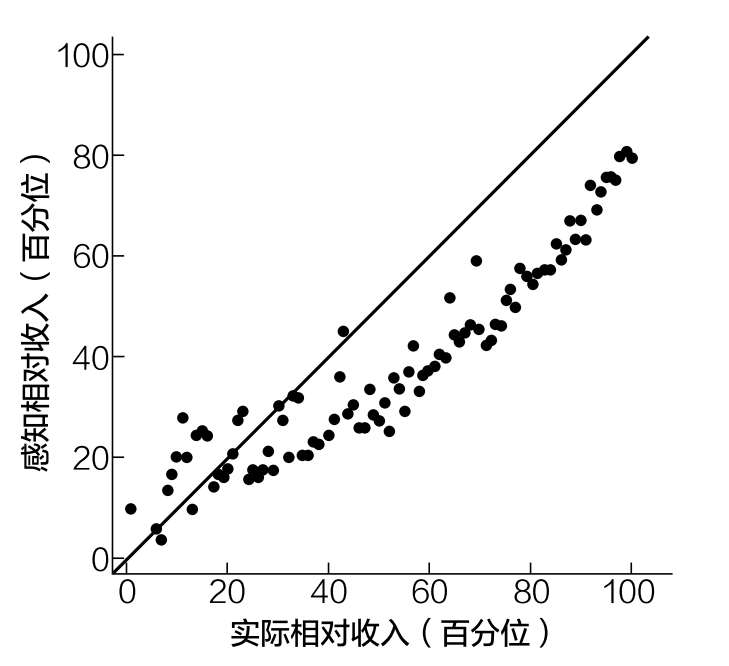
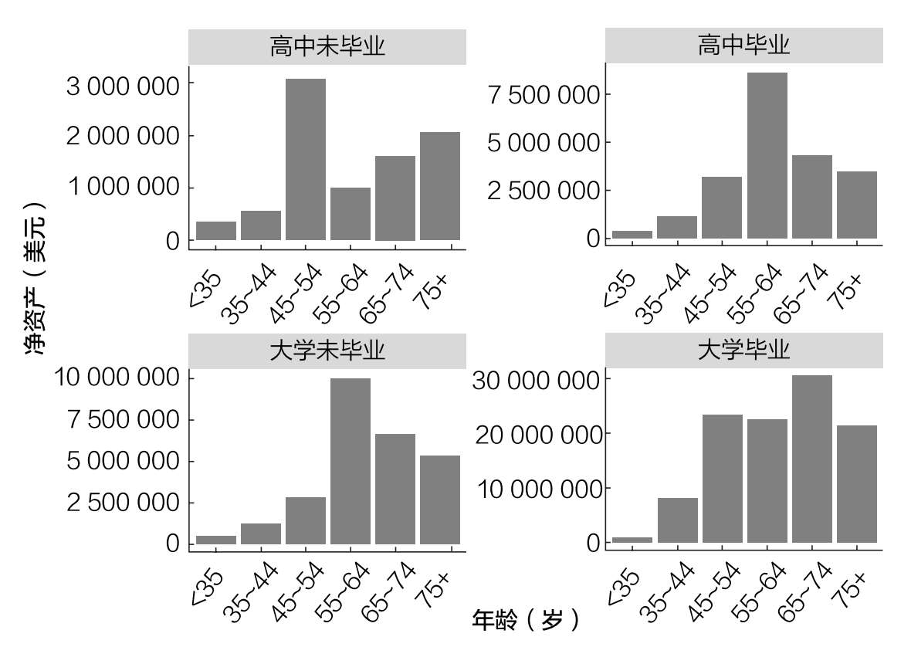

# 第十九章

## 为什么你从来不觉得自己富有

——即使你可能已经很富有了

那是2002年的圣诞节，整个西弗吉尼亚州的人都在花钱，好像钱已经不值钱了。但是，他们买的不是礼物或蛋酒。是什么呢？

彩票。

下午3点26分，彩票购买狂潮达到高峰，每秒有15张彩票售出。嘀嗒，嘀嗒，嘀嗒。45个新的希望之星点燃大众对彩票的狂热。

杰克·惠特克就是其中之一。他不常买彩票，但奖金超过1亿美元，他怎么能拒绝呢？杰克买完彩票就回家了。

当晚11点，强力球彩票中奖号码公布。相伴四十年的妻子朱厄尔把睡着的杰克叫醒。这是个奇迹。他们押对了五个数字中的四个。这不是头奖，但他们都知道，六位数的奖金在等着他们。

第二天早上，杰克在上班前打开电视。有一个惊人的发现。昨晚的抽奖中有一个公布的数字错了。杰克把他的彩票和正确的号码核对了一下，说不出话来。

他刚刚赢得了美国历史上最大的单张彩票头奖——3.14亿美元。杰克决定立即拿走这笔钱。他收到了税后1.13亿美元。99

但你已经知道这事不会有好结果了，对吧？

在收到这笔1.13亿美元巨款的两年内，杰克的孙女去世了（可能是因为过量吸毒），他的妻子疏远了他，杰克把时间花在豪赌、招妓和酒驾上。杰克最终输掉了所有赢来的钱。

我已经知道你在想什么了：“哦，尼克，又一个彩票中奖者出了差错的故事。如此耳熟啊。”

关于杰克·惠特克，有个小细节我没说：他本来就已经很有钱了。

是的，他的确已经很有钱了。在他买这张将永远改变生活的彩票之前，杰克的净资产已超过1700万美元。他是怎么变得富有的？他是一个成功的商人，是多元化企业建设公司（西弗吉尼亚州的一家承包公司）的老板。

我之所以讲这个故事，是因为它说明了即使那些有着最好的意图、最好的背景和最好的判断力的人，也会因为金钱改变人生。

杰克·惠特克本性并不坏。他供养妻子和孙女，一直很虔诚，甚至在中彩票后立即捐赠了数千万美元，成立了非营利基金会。

然而，当诱惑出现时，他无法拒绝。金钱使人改变。

颇具讽刺意味的是，如果杰克意识到他已经如此富有，这一切都不会发生。

我怎么知道杰克不觉得自己很富有？因为他仍然在买彩票，尽管他的身家是1700万美元！虽然很容易得出结论，杰克只是一个贪婪的人，但我从经验中知道，承认自己的财富总是比看起来更难。

我没钱，他们有钱

在2005年左右，我的朋友约翰（化名）和我开始了一场关于在美国富有意味着什么的讨论。约翰在湾区一个最富有的城市长大，父母都有研究生学历，在医学和教育领域有成功的事业。然而，约翰说他没那么有钱，并告诉了我原因。

约翰16岁时，父亲给了他1000美元，让他开一个经纪账户，学着了解股市。那天晚上晚些时候，约翰把礼物的事告诉了他最好的朋友马克，并问马克他得到了什么生日礼物，因为他们是同一天出生的。马克说他从父亲那里得到了一模一样的礼物。

约翰听到这话很震惊。他知道他的父亲和马克的父亲是好朋友，所以他们给儿子送同样的生日礼物似乎是合理的。然而，约翰也知道马克家比他家富裕得多。事实上，马克的父亲可以说是腰缠万贯。

马克的祖父创立了一家著名的投资公司，马克的父亲是一家大型科技公司的董事会成员。从账面上看，马克的家人都是亿万富翁，所以当约翰听说马克只得到1000美元时，他很困惑。

当约翰问马克：“你也得到了1000美元？”马克犹豫地回答：“不，是10万美元，但基本上是一样的礼物。”

这就是有钱和很有钱的区别。

2002—2007年，我认为我家也很富有，或者说至少有一些钱。

我家有一台大屏幕电视（约76cm宽）。我们有一辆越野车和一辆跑车。我们住在一幢三层楼的房子里，它位于一个有门禁的社区，孩子们简单地称其为“大门”。后来我发现，这种奢侈的生活只是暂时的。

2002年，我妈妈和继父买下了这栋三层房子，花了27.1万美元。到2007年初，这栋房子涨到了62.5万美元。在此期间，我们家一次又一次地用它进行抵押贷款，房屋价值的透支越来越多。只要房价继续上涨，我们就可以继续靠着高房价过着不错的生活。

不幸的是，房价没有继续上涨。随着2007年底房价开始暴跌，一切都完蛋了。我们失去了房子，被迫卖掉了越野车、电视和跑车。我们曾经的家里已经住进了别人。我知道，我们并不富有。

但直到上了大学，我才意识到我们是多么贫穷。我永远不会忘记开学的第一周，我发现我是新生宿舍20个孩子中唯一没有去过欧洲的。事实上，在那个时候，我从加州乘坐飞机去过最远的地方是新墨西哥州，那次旅行是由科学基金资助的。回顾过去，我现在明白了为什么我认为自己在2002—2007年很富有——因为我经历过更恶劣的生活环境。

就在住在盖茨镇之前，我和我的家人住在一个公寓里，那里的烤箱下会有蟑螂出没。每当烤东西时，它们就会出来，在烤箱的控制面板上晒太阳，就像阳光下的小蜥蜴一样。它们经常入侵我们的储藏室，还留下排泄物。太恶心了。直到今天我都不能忍受蟑螂。

尽管情况很糟糕，但生活还是很美好的。我从不挨饿，我有一个非常支持我的家庭，我甚至有自己的电脑（那是在2001年！）。然而，我不知道这样的生活有多好，因为我只能看到自己的生活，看不到其他人的生活。

这就像我的朋友约翰，他看不到自己的财富，因为他所知道的只是成长过程中相较于高中时的朋友们，他自己更穷。不幸的是，即使你很富有，这种感觉似乎也不会消失。

为什么亿万富翁也感觉不到富有

你可能会认为，当你成为亿万富翁时，就会觉得自己很富有了，但情况并非如此。你可以看看2020年2月媒体对高盛前首席执行官、亿万富翁劳埃德·布兰克费恩的采访。在采访中他声称，尽管他拥有巨额财富，但他并不富有。

布兰克费恩坚称自己是“富人”，而不是富豪。他坚持说：“我甚至算不上富人……我不认为自己是富人，我也没有富人的作风。”

他说他在迈阿密和纽约都有房，但只是简单装修了一下。他开玩笑说，如果买了一辆法拉利，他会担心车被剐蹭。100尽管这听起来令人震惊，但我理解布兰克费恩的想法。

当你经常与杰夫·贝佐斯和大卫·格芬这样的人交往，并将瑞·达利欧和肯·格里芬视为同行时，只有10亿美元似乎真的不算多。

然而，从完全客观的角度看，布兰克费恩是美国家庭中最富有的0.01%，也就是1%中的1%。根据经济学家萨兹和祖克曼的数据，2012年，美国最富有的0.01%的家庭（约1.6万个家庭）的净资产至少为1.11亿美元。101即使根据2012年以来资产价格的上涨进行调整，布兰克费恩也很容易跻身前0.01%。

但不只是布兰克费恩有这种认知问题，大多数收入较高的人都认为自己比实际情况要差。

例如，《经济与统计评论》上的一项研究表明，大多数收入处于中上等水平的家庭并没有意识到他们有多好。102如图19.1所示，收入在第50百分位以上的家庭往往低估了自己相对于其他人的表现。

图19.1 实际相对收入和感知相对收入的对比

图19.1显示了第一轮被调查者的感知相对收入与实际相对收入之间的关系，我们构建了100个大小相同的实际相对收入统计堆，并在其中显示感知相对收入统计堆。45度线说明了无偏差情况。观测次数为1242次。

从图19.1中我们可以看到，即使是实际收入在第90百分位及以上的家庭也认为自己处于第60~80百分位。

虽然这个结果乍一看可能令人惊讶，但如果你把财富感知看作一个网络问题，你就很容易理解了。马修·杰克逊在《人类网络》中讨论为什么大多数人觉得自己不如朋友受欢迎时，很好地解释了这一概念：

你有没有觉得别人的朋友比你多？如果答案是肯定的，你并不孤单。我们的朋友平均比一般人有更多的朋友。这就是友谊悖论……友谊悖论很容易理解。最受欢迎的人出现在许多其他人的朋友列表上，而朋友很少的人出现在相对较少的人的朋友列表上。朋友多的人在人们的朋友列表中的比例相对于他们在总人口中的比例偏高，而朋友少的人的比例偏低。103

你可以在你的社交网络中应用同样的想法来说明为什么大多数人感觉自己不如他们实际富有。

例如，你可能会想到至少有一个人比你更富有。那个更富有的人可能有一些更富有的朋友，所以他和他的那些朋友也会想到比自己更富有的人。如果他们不能，那么他们可以很容易地提到一个名人（如盖茨、贝佐斯等）。

把这个逻辑延伸到它的自然结论，你会意识到，每个人（除了世界上最富有的人）都可以指着别人说：“我不富有，他更富有。”

这就是像布兰克费恩这样富有的亿万富翁依然会觉得自己只是“富裕”的原因。

而你也跟他差不多。

我怎么会知道？因为你可能比你想象的要富有得多。例如，根据2018年瑞士信贷全球财富报告，如果你的净资产超过4210美元，那么你比世界上一半的人都富有。104

如果你的净资产超过93170美元，这与美国的净资产中位数相似，这将使你跻身全球前10%。我不知道你怎么想，但我认为排名前10%的人是富人。

让我猜猜：你不同意吗？你不认为把你自己和世界各地的人，比如发展中国家的人进行比较是公平的吗？

你猜怎么着？劳埃德·布兰克费恩可能也认为把自己和你我这样的人比较是不公平的！

没错，从客观上讲，布兰克费恩声称自己不富有，比在全球排名前10%的人声称自己不富有更奇怪。然而，这从根本上来说原因相同。我们只是在吹毛求疵。

毕竟，最富有的10%是富人吗？

最富有的1%呢？

最富有的0.01%呢？

在什么群体范围内？在全球范围内吗？在全国范围内吗？在全市范围内吗？

没有正确的答案，因为富有是一个相对的概念。过去是，将来也是。相对论将贯穿你的一生。

例如，你需要1110万美元的净资产才能在2019年跻身美国前1%的家庭之列。然而，在控制了年龄和受教育程度后，最富有的1%的家庭拥有的净资产是从341000美元到3050万美元不等。

例如，要成为35岁以下的高中辍学家庭的前1%，你只需要34.1万美元。然而，要跻身65~74岁受过大学教育的家庭的前1%，你需要3050万美元。

图19.2通过按受教育程度和年龄分列的2019年美国最富有的1%的家庭拥有的净资产说明了这一点。

图19.2 按年龄和受教育程度划分的美国最富有的1%的家庭

这就是为什么没有人觉得自己很富有——人们总是很容易拿自己和比自己更富有的人对比。

诀窍是不要忘记所有可能想和你比的人。

既然我们已经讨论了你可能永远不会感到富有的原因，下面我们将注意力转向一项比其他资产都能让你感觉更富有的资产。
