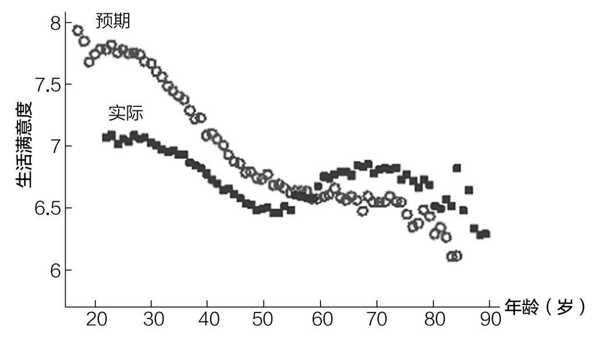

# 第二十章 最重要的资产

为什么你永远无法得到更多

医生、长寿专家彼得·阿提亚在2017年做了一次关于如何延长寿命的演讲，他在演讲中向听众分享了以下思想实验。

我敢打赌，如果现在沃伦·巴菲特把钱都给你们，你们中没有一个人会愿意和他交换人生……顺便说一句，我还敢打赌，为了再活20年，巴菲特宁愿破产。[^105]

考虑一下阿提亚的交易。想象一下拥有巴菲特的财富、名声和世界上最伟大的投资者的地位。你可以去任何你想去的地方，见任何你想见的人，买任何可以买的东西。然而，你现在已经87岁了（和巴菲特当时的年龄一样）。你愿意做这个交易吗？

我知道这听起来很神秘，但我打赌你不会。你非常清楚，在某些情况下，时间比金钱更有价值。因为你可以用时间做一些用钱做不到的事情。事实上，只要有足够的时间，你甚至可以移山。

山人

人类历史上最引人注目的坚持不懈的故事之一可能是你以前从未听说过的。

故事发生在1960年印度东北部的吉拉尔镇。那时，吉拉尔镇非常偏僻，偏僻到村民如果需要补给或就医，就必须沿着山脊走上50公里。

有一天，一个女村民在山脊上行走时摔倒了，受了伤。她的丈夫达什拉斯·曼吉得知她受伤后，认为吉拉尔的村民已经沿着山脊走了太长的时间了。当天晚上，曼吉发誓要在山上开辟一条路。

第二天，曼吉拿起锤子和凿子，开始在山脊上开凿。当地村民听说曼吉的目标时，都嘲笑他说这是不可能的。然而，他从未放弃。

在接下来的22年里，曼吉夜以继日，一个人慢慢地凿开了这座山。他最终凿出了一条长110米、宽9.1米、深7.6米的小路。

在20世纪80年代初完成这条路时，他总共凿掉了7000多立方米的岩石，为自己赢得了“山人”的绰号。

凿通这条小路后，曼吉将吉拉尔镇与邻近村镇之间的通行距离从55公里减少到了15公里。如果你在谷歌地图上搜索“Dashrath Manjhi Passthrough”，并进入街景模式，你就可以找到他为之工作了20多年的那条小路。不幸的是，曼吉的妻子（他开辟道路的动力）在小路凿通的前几年就去世了。

曼吉的故事说明了时间所具有的令人难以置信的价值。虽然曼吉没有钱请施工队在山上开路，但他有时间。

这就是为什么时间是，而且永远是你最重要的资产。你在20多岁、30多岁和40多岁时如何利用时间，将对你50多岁、60多岁和70多岁的生活产生巨大影响。不幸的是，这个道理需要一段时间才能被认识到。对此，我有切身体会。

在本书的开头，我讨论了我大学刚毕业时对金钱的担忧，在本书的结尾，我将告诉你我在差不多同样的年纪给自己设定的一个目标。这个目标并不重要，但追求目标的过程教会了我时间的价值以及我们如何评价自己的生活。

我们的生命开始于成长股，结束于价值股

23岁时，我告诉自己，我想在30岁前拥有50万美元。在那个时候，我名下只有不到2000美元的资金。读到沃伦·巴菲特在30岁时拥有100万美元后，我选择了50万美元作为奋斗目标。

请注意，巴菲特在1960年拥有的100万美元，相当于今天的900多万美元。鉴于我不是巴菲特，我将目标削减了一半，也没有根据通胀进行调整。

当2020年11月，我31岁时，我的净资产仍然没有达到50万美元，还差很多。差多少呢？比我想要的要多得多。

但这并不重要。正如范·迪塞尔在《速度与激情》中饰演的角色多米尼克·托雷托说过的那样：“不管你是赢了一英寸（1英寸=2.54厘米。——编者注），还是赢了一英里（1英里=1.609344千米。——编者注）。赢了就是赢了。”

不管亏损一位数还是六位数，亏损就是亏损。但这种亏损让人感到遗憾的是，它发生在大牛市期间。我不能归咎于标准普尔500指数，我只能怪我自己。

我哪里失误了？我并不是不努力。我已经全职工作了8年多，在近4年的时间里，每周花10个小时写博客。我直到2020年才让博客变现，但即使我的博客能够更早一些变现，我离目标仍然会有距离。

我也不认为我可以归咎于消费。虽然我可以少去旅行，少出去吃饭（我非常喜欢这样的经历），但这些并不能改变我的生活。

但你知道怎样才能让情况有所不同吗？做好职业生涯的早期规划。我应该优化的不是钱，而是时间。

我的很多朋友都去了知名的大型科技公司，获得了非常棒的股权激励，而我在同一家咨询公司工作了6年，拿到了丰厚的薪酬，但没有股权。我意识到我错过了很多，但为时已晚。

现在，这些朋友中的许多人在科技股估值大幅增长后变现了其股票期权，成为百万富翁（至少也是“50万美元富翁”）。是的，人们一般会认为是我的朋友很幸运，这确实没错，但我也知道这只是一个借口。因为我有很多机会在这艘大型科技轮船经过时登上它，但我都拒绝了。

这并不是说我特别想在大型科技公司工作（因为我没有很想），而是在27岁之前，我没有花大量时间来思考我的职业生涯。纽约联邦储备银行的研究人员已经发现，在工作的前10年（25~35岁）个人收入增长最快。[^106]根据这些信息，你可以明白为什么我在23岁时应该把重点放在我的职业生涯上，而不是我的投资组合上。

我犯错的原因是我错误地认为金钱是比时间更重要的资产。我后来才意识到为什么这是错误的。

你能挣到更多的钱，但没有什么能买到更多的时间。

虽然这听起来很残酷，但我保证我对自己并不像看起来那么苛刻。我知道，相较于我的成长经历，我现在的生活已经很好了。此外，如果我加入了一家大型科技公司，我可能就没有机会写这本书。但这还是不能改变我没有做好早期职业生涯规划的事实。

更重要的是，我知道即使我达到了50万美元的目标，这可能也不会以任何有意义的方式改变我的生活。因为财富是逐步增长的，大致以10倍的量级。这就是为什么与财富从20万美元增加到30万美元相比，财富从1万美元增加到10万美元对人的生活影响更大。因此，我即使在30岁时拥有50万美元，也不会有什么不同。

当许多美国家庭在努力维持生计时，我却抱怨没有达到一个过高的财务目标，我知道这听起来多么令人讨厌。但是，正如我在前一章中解释的那样，财富不是一个绝对的游戏，而是一个相对的游戏。

不管怎样，我像你们一样，总是会拿自己和同龄人做比较。我希望可以不这样，但事实就是这样。你可以和我争论，但是，压倒性的研究结果表明情况就是如此。

例如，在《你的幸福曲线》一书中，乔纳森·劳赫描述了大多数人的幸福感如何在20岁左右开始下降，在61岁时触底，在那之后又开始上升。从图20.1中你可以看到，人一生的幸福度最终看起来像U形曲线（或一个小小的微笑）。

你可以在美国西北大学经济学家兼助理教授汉内斯·施万特的实证研究中看到这一点，他将人们未来5年的预期生活满意度按年龄划分，并将5年后的实际生活满意度也按年龄划分。[^107]

例如，30岁的人目前的生活满意度为7分（满分10分），他们预计5年后，当他们都35岁时，自己的生活满意度为7.7分（满分10分）。然而，看看图20.1你便知道，35岁的人的生活满意度比30岁的人低——他们在35岁时的实际生活满意度是6.8分，而不是他们在30岁时预测的7.7分。平均而言，30岁的人预计他们的生活满意度会在未来5年增加0.7分，但实际上可能会下降0.2分。

图20.1 预期生活满意度与实际生活满意度

你如果只看代表当前生活满意度的点，就可以看到25~70岁著名的幸福U形曲线。

为什么幸福感会在20岁之后开始下降呢？因为，随着人们年龄的增长，他们的生活通常无法满足他们的高期望。正如劳赫在《你的幸福曲线》中所说：

年轻人总是高估自己未来的生活满意度。他们犯了一个巨大的预测错误，就像你住在西雅图，希望每天都有阳光一样……20多岁的年轻人对其未来生活的满意度平均高估了约10%。然而，随着时间的推移，过度的乐观情绪会消失……人们并没有变得抑郁。他们正在变得，嗯，现实。[^108]

这项研究解释了为什么我在23岁时为自己设定了一个大胆的财务目标，以及为什么没有达到这个目标让我感到有些沮丧。然而，这也解释了为什么我一开始就不太可能达到这个目标，也就是说，我可能太乐观了。

你可能也会在自己的生活中发现同样的模式。年轻的时候，你可能期望很高，后来却失望了。然而，正如研究表明的那样，这是完全正常的。

随着时间的推移，降低你的期望也是正常的。降低得多一些，当你进入老年时，惊喜可能会给你带来额外的快乐。我们的生命开始于成长股，结束于价值股。

成长股的定价与我们年轻时对自己的看法相似。人们对未来抱有很高的期望和希望。然而，我们中的许多人，就像许多成长股一样，最终未能达到那么高的预期。

随着时间的推移，我们的期望降低得如此之多，以至我们怀疑未来的情况是否会更好。这类似于投资者如何给股票定价。然而，事情通常会比预期的要好，我们像价值投资者一样，可以体验到行情上涨带来的惊喜和愉快。

当然，这只是平均水平。每个人的生活都有不同的曲折。我们都必须根据我们当时所知道的情况来做决定。这就是我们所能做的。

接下来，让我们将所有内容与游戏结合起来。

[^105]: Peter Attia, "Reverse Engineered Approach to Human Longevity," YouTube video, 1:15:37 (November 25, 2017).

[^106]: Guvenen, Fatih, Fatih Karahan, Serdar Ozkan, and Jae Song, "What Do Data on Millions of US Workers Reveal About Life-cycle Earnings Dynamics?" FRB of New York Staff Report 710 (2015).

[^107]: Schwandt, Hannes, "Human Wellbeing Follows a U-Shape over Age, and Unmet Aspirations Are the Cause," British Politics and Policy at LSE (August 7, 2013).

[^108]: Rauch, Jonathan, The Happiness Curve: Why Life Gets Better After 50 (New York, NY: Thomas Dunne Books, 2018).
