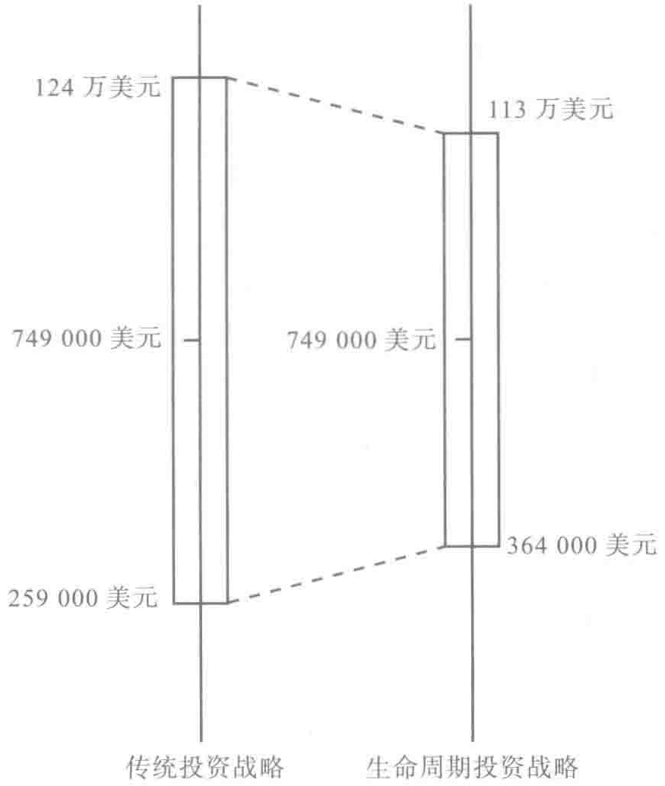

# 前言 — preface

1986 年，耶鲁大学陷入财务危机。校区大楼年久失修，即将就任的校长本诺·施密特（Benno Schmidt）为节约运营成本，竟然提出要停办社会学系。

当时，耶鲁大学捐赠基金的市值为 10 亿美元，由新招的基金经理大卫·斯文森（David Swensen）管理。选择大卫来挑大梁，实在让人意外。他有耶鲁大学经济学博士学位，但之前在捐赠基金管理方面毫无经验。结果他上任后，采取了非典型的投资方式。斯文森发现耶鲁大学捐赠基金的投资结构有问题。50% 是股票，40% 是美国国债和公司债券，剩下不到 10% 属于其他投资类型。斯文森觉得这样的比例太不符合投资的逻辑！

具体来说有两个问题亟待解决。首先，股票历来的表现比债券要好，至少从长期的角度来看的确如此，资产组合中股票投资的比重过小。其次，组合投资的资产类型过于单一。90% 都是国内投资，很少有资本投放在商品或房地产市场，风险资本的比例也很小，国际投资占比微乎其微。

经济学家们喜欢说天下没有免费的午餐，而诺贝尔奖获得者哈里·马科维茨（Harry Markowitz）认为分散投资能带来免费的午餐。分散投资要么能分散风险，能以更低的风险获得相同的回报；要么在相同的风险水平上，

能得到更高的回报。斯文森按照马科维茨的建议，采取了后面一种方法进行分散投资。

斯文森接管耶鲁大学捐赠基金22年后，该基金增值至220亿美元。即使经历了2008年的市场崩盘，耶鲁大学捐赠基金的价值仍然超过了160亿美元。毫不夸张地说，如果一直采用传统的股权配置，耶鲁大学捐赠基金的价值只有60亿美元。在过去10年里，斯文森管理基金的年化收益一直保持在 11.8% 的水平上，不仅没有提升长期风险，而且还让投资收益比债券收益高出了一倍。[^1]现在，耶鲁大学有两所新的校区在建设，我觉得至少有一所应以斯文森命名。要说为耶鲁大学所做的贡献，从金钱的维度来衡量，没人比得上大卫·斯文森。

本书的目的是引导大家在不提高风险水平的前提下，实现退休投资组合更高的回报。在过去138年里，股票的回报超过了债券的回报，虽然并非年年如此，但每个投资者的总体投资都显示了这种趋势。股票的收益比债券的收益通常高 5%。即使股本溢价不如预期那么高，但从长远来看，股票的收益依然比较高。为了实现更明智的分散投资，我们可以提升总体投资股票的数量，既不用冒更大的风险，又能提升总体的回报率。

免费的午餐在哪里？

斯文森帮助耶鲁大学捐赠基金通过分散投资，选取多种资产类型为投资对象，取得了更好的投资回报。这意味着要投资境外市场，投资木材行业、新创企业和房地产。我们希望你已经开展了分散投资。有很多指数基金能让

你投资全球各地更多的股票市场、商品交易和房地产。 \( ^{①} \)

我们的投资计划比分散投资更深入。斯文森的分散投资模式将耶鲁大学捐赠基金投资多种资产类型，获得了更高的投资回报。同理，本书旨在通过介绍分散时间投资的方法，为投资者找到回报更高的投资模式。

## 分散时间投资

简言之，分散时间投资是一种与分散资产投资类似的投资战略。将所有的积蓄都投资在某一只股票是错误的投资战略，同理，将股票市场投资的敞口都限定在一年内也是冒失的行为。如果投资者犯了这个错误，而股市恰恰在这一周期经历断崖式下跌，那么他将血本无归。分散时间投资将投资周期扩展到几十年，投资者会更安全。

绝大多数投资者都不擅长延展投资的期限。先不考虑通货膨胀的因素，单从投资的绝对额来看，相比年老的时候，很多人年轻时投资的金额非常小。考虑了通货膨胀的因素，绝大多数投资者60多岁时的股票投资数额要比20岁出头时高20倍甚至50倍。20多岁投资几千美元，年老时投资数额

高出几十倍，相对而言，年轻时小额的投资根本无法分散日后的投资风险。从分散时间投资的角度来看，你二三十岁的时候进行的投资几乎可以忽略不计。年轻时投资5万美元，然后年老的时候投资100万美元，这种投资模式不合理。我们要考虑在年轻时投资10万美元，年老时投资95万美元。对比两种投资模式，总体的市场敞口是一样的，但是后者在时间上实现了分散投资。事实上，很多人错失了20年分散投资风险的周期。我们的投资生涯本可以有40年来分散投资风险，但大部分人把投资集中在退休前10年或20年的时间里。

> 为了解决这个问题，我们提出一个简单但看似比较激进的投资理念：

> 年轻的时候一定要利用杠杆购买股票

分散时间投资意味着增加年轻时投资的额度。年轻时，由于大家普遍手头都缺钱，所以不会大手笔地投资。正因为如此，我们才需要杠杆交易。年轻的时候进行杠杆投资是更谨慎的投资战略，这是本书的一大中心思想。假如投资者一生在股票市场的敞口是定量的，那么增加年轻时投资股票的敞口，随着年龄增长，逐渐减少股票敞口，这样就能降低投资风险，实现分散时间投资。

## 免费的午餐

分散时间投资能降低21%的投资组合风险，这种投资战略更明智。我们以资产账面价值的数据来证明。根据模拟的情形来看，传统的投资战略能

让你获得价值 749 000 美元的养老储备金，\( ^{①} \) 但其潜在的投资风险较大，最终的投资回报波动范围也较大。

如何衡量风险？将发生概率为 \(95\%\) 的结果一一列出来，看看到底相差多少，这不失为一种好办法。我们要凭结果来判断投资战略的优劣。使用传统的投资战略，投资回报的波动幅度将高达 490 000 美元。

如果采用了生命周期投资战略，你能够获得相同的养老储备金——749 000 美元，但投资回报的波动幅度减少了 21%，即 105 000 美元。也就是说，投资态势好时，你所拥有的回报会少 105 000 美元；碰上投资前景差的情况，你的回报比使用传统的投资战略多 105 000 美元。按照传统的投资战略，情况最糟糕的时候，养老储备金的净值只有 259 000 美元。采用生命周期投资战略，你的养老储备金能保有 364 000 美元，而且你还能保持更好的投资心态。生命周期投资战略显然更胜一筹，具体见图 1。

投资回报波动的幅度减少 21%，无论它对应的金额有多少，这都只是生命周期投资战略发挥优势的起点。发现新的分散投资工具，能启发你更妥善地权衡风险和回报。一旦你有了控制股票交易风险的新办法，就可以在一生的投资中更保险地持有更多股票。我们会向大家说明，如何在不冒更多风险的情况下，提升 50% 的投资回报。

这样的投资结果听起来好得让人难以置信。午夜播出的某条电视广告可能会向你兜售过气的楼盘，说什么你能净赚上百万美元，而且绝不赔本。

*图 1 生命周期投资战略对比传统投资战略：回报相同，风险更低*

这显然是广告运营商在操作。分散时间投资战略可不是广告，它直接应用诺贝尔奖获得者保罗·萨缪尔森（Paul Samuelson）和罗伯特·默顿（Robert Merton）的研究成果（我们将在第1章具体解释生命周期投资战略和两位学者的研究成果之间的关联）。话虽如此，我希望大家不要轻信股市大咖的话，也不要对一些大肆吹嘘的言论坚信不疑。你应该按照我们的建议来投资，因为本书提出来的战略有理有据，经过了历史和模拟数据的验证。要相信，也要不断验证。无论一开始看起来有多么合理，也不管有多少人言之凿凿，你都无法单纯依赖某种理论或者投资常识去投资，因为你动用

的可是你退休金账户上的钱。我们要看具体的数据结果。

自 1871 年至今的股票市场数据验证了生命周期投资战略的有效性。每次验证的结果都表明（包括在 1929 年的经济大萧条和 2008 年的股市崩盘期间），我们的分散投资战略比传统的投资战略取得了更好的回报。我们发现使用生命周期投资战略，日经指数（Nikkei）和富时指数（FTSE）股票数据以及利用蒙特卡罗方法（Monte Carlo）对备选股票收益分布进行分析，都取得了更好的投资表现。本书第 3 章至第 5 章会详细探讨这些问题，书中使用的所有数据和估值都可以在网站 www.lifecycleinvesting.net 上查阅。

2008 年的金融危机让投资者至今心有余悸。标准普尔 500 指数下跌 38%，每日股价反转的力度是空前的。股市震荡强烈时，分散时间投资的作用更加凸显。股市震荡幅度越大，就越有必要分散投资。我们的模拟结果表明，在现在的市场上，对于那些即将退休或者已经退休的人而言，杠杆生命周期投资战略远比传统投资战略更好用。对于那些初出茅庐的大学生而言，刚开始投资就遭遇亏损会使他们的投资更具挑战，但是因为他们刚起步，因此没什么输不起的。年轻的时候投资敞口越大，就越能让你在退休前减少股票和风险敞口。这种方法也适用于 2008 年金融危机的情况。

## 房子非买不可的两大理由

买房是明智的长期投资，其中一个理由就是分散时间投资战略非常有效。人们投资买房和投资退休金有异曲同工之妙。你用借的钱买房（虽然不

能借太多），随着贷款逐渐还清，你的杠杆逐渐减少。投资买房自然而然是一项分散时间的投资，因为每个人迟早都得把钱投入房地产行业买房。哪怕你刚满20岁，你要用25 000美元的首付来购买价值25万美元的房子或者公寓。虽然你的房子抵押给了银行，但你依然把25万美元投给了市场。拥有房产，你的一生都承受相对稳定的投资敞口。

一个人买了房，就相当于在房地产市场里赚了一辈子都可能赚不到的钱，为什么？因为他们投放在房地产市场的资金敞口稳定，而且终其一生。拥有房产是人们进行分散时间投资的一种方法。这是买房的一大隐性利益。房产成了很多人退休后最大的资产，这并非偶然。

买房的问题在于它让人们丧失了分散资产投资的机会。业主们愿意开展分散时间投资，但是他们要承受的市场风险都取决于单一的房产，即某一只房产公司的股票上。投资的上选是要进行分散资产类型和分散时间投资。我们的杠杆股票投资战略就具备这两个特征。由于要投资多种股票组合，我们进行了分散资产的投资；同时，我们得确保即使投资者年龄大了，也能保持较大的股票敞口，这就是分散时间投资。

很多人能承受10：1的房产杠杆投资，但是很少有人愿意以2：1的杠杆比例进行股票交易。如果按照买股票的方式来买房，人们得等到攒够了钱，能用现金全款付清的时候才会去买房。这样一来，一个人能在过50岁生日前买房就很幸运了。我们提议应该以像按揭买房这样的态度来对待股票投资。

近来楼市崩盘已经惨烈地证明，房价不会只涨不跌。用5：1或者10：1的杠杆比率买房，是谨慎的退休金投资方式，但这并不代表你能用20：1或者100：1的杠杆比率，甚至以超越自己月供额度的按揭贷款去

购买（你要这样投资，房价得天天猛涨才有可能实现再融资，不然请自求多福）。多余的杠杆或者债务会导致不必要的风险。当然，我们也不能因此就认定最好排除杠杆交易，也不按揭买房。过高或者过低的杠杆比率都会导致投资表现不理想。

我们并不是要大家去走极端买一些首付为 \(5\%\) 或者 \(10\%\) 面值的股票，你可以在年轻的时候用 \(50\%\) 的资金来购买股票。年轻的时候承担小额的杠杆交易会大大改变你的人生，因为投资回报随着时间的流逝是呈复利增长的。爱因斯坦认为宇宙中最强大的力量是复利（这句话是否真出自于爱因斯坦值得推敲，但是道理是很受用的）。很多人在开始工作的前 20 年里错失了大量投资机会，这将大大减少他们人生投资回报的净值。

如果说买房的关键因素是地段、地段，还是地段，那么买股票的关键是分散、分散，还是分散。不利用杠杆交易，你无法实现分散时间投资。尽早开始杠杆股票投资将使你在当时承受更大的市场风险，却能大大降低你一生的投资风险。这句话虽然听起来有些矛盾，却是有效的投资之道。不但能提升预期退休储备金，且增幅高达 \(50\%\)，还能大大降低投资结果不良的风险。使用杠杆购买股票最终能降低你的投资风险。

我们最初在《福布斯》的专栏文章中提出这些观点时，收到了很多人的抗议信。 \( ^{2} \) 有人写信控诉我们是在鼓动大家不计后果地去股市冒险。投资大师绝对不会这样提议，也不该这样投资。比如苏茜·欧曼（Suze Orman）投资股票的数额不会超过她拥有财产的 10%。哪怕是最激进的情况，投资大师也只会建议你把 85% 的存款投资股市，以后逐年减少。其实，这些观点并非投资良策（我们会在第 6 章解释例外的情况）。二三十岁的年轻人完

全可以举债投资股票，以超过退休金储蓄账户的额度去投资。在理性的情况下，最好以退休金账户余额两倍的金额投资股市。

分散投资只有两个维度，你可以分散资产类型或者分散时间进行投资。哈里·马科维茨和约翰 C. 博格（John C. Bogle）发动了首个分散投资的革命。马科维茨靠向人们展示如何优化投资组合、进行分散资产投资，赢得了诺贝尔奖。先锋基金的创始人博格通过创立低成本的指数基金，率先将分散资产投资推向了大众。

直至今日，投资者们依然没有体会到分散时间投资的价值。分散时间投资远比分散资产投资能给人们带来更多的好处。最简单的理由是，跨时间的投资回报率相关度要比跨资产类别投资的回报率相关度更低。更加出色的分散时间投资战略能降低风险水平。风险水平降低后，人们就能增加投资市场的敞口，取得更高的回报。

我们相信本书一定能带领各位投资者走出舒适区。曾经大家都不需要为了退休以后过什么样的日子操心投资的事情，只是这样的好日子已经一去不复返。以前用人单位会按照员工到手的薪水来提供既定的福利计划和养老金。从多个方面来看，这都是让人欣慰的事情。大家会清楚自己的财务状况，也不需要担心通货膨胀会影响生活质量（因为薪水会随着总体物价水平的上升而上涨，养老金也会与之挂钩，至少在退休前大家不用担心），所以也就不存在所谓的投资问题。

遗憾的是世道发生了变化，既定的福利计划已经为特定的养老金收缴机制取代，这还得看你的工作单位是否慷慨。这就表明，投资的任务就落在了个人身上，而且能否正确投资已经变成了胜败在此一举的事情。

为了筹集退休后生活所需的资金，你得正确储蓄，理性投资。很多人总愁攒不到钱，如果他们投资过于保守，这个问题就更是雪上加霜。合理地分配资产投资能够至少提升 50% 的回报。这比你增加 50% 的存款简单很多。通过提升分散投资的智慧，你能在不增加风险的同时提升回报。

## 投资规划

本书的主旨非常直白。第1章提出了生命周期投资概念，告诉我们年轻的时候使用杠杆投资能够大大减少终生投资的风险。第2章解释了生命周期投资战略。第3章解释了生命周期投资战略的实证结果。大家能从字里行间感受到生命周期投资战略的优势。即使是经历过20世纪30年代的大萧条或还未从2008年的全球金融危机缓过劲儿的人，利用生命周期投资战略也能大大提升退休后的财富。

第 4 章阐述了一个道理：即使在面临总体投资情形很糟的时候也依然有机会理好财。如果你对杠杆投资战略还心存疑虑，我们将向你展现杠杆投资不仅适用于美国股市，而且在全球各地的股票市场都能应用。就算将来股票市场的回报不如以前，就算借贷的成本升高，这种投资方式也有效。当然，我们明白一些人会对此依然持保留态度。对于那些想要亲自验证这些数据是否可靠的人，可以登录网站 www.lifecycleinvesting.net。请及时向我们反馈你的发现。

认可了生命周期投资战略，第5章将帮助那些较晚起步的投资者。知道了投资的理论知识，如果一直没有行动，那又有什么用？四五十岁的中年人

除了帮助孩子们树立正确的投资观念外，还能代表儿孙帮助他们更早进行生命周期投资活动。

第6章提出了稳步开展生命周期投资的措施。在大家按照本书提供的建议进行投资前，希望大家好好阅读第6章的内容。生命周期杠杆投资战略并不适合所有人，具体有6点理由。比如，在投资股票市场前，一定要还清学生贷款和信用卡欠债。如果你所在的单位有匹配的401（k）养老金计划，一定要先把存款存在里面。401（k）养老金计划账户的钱不能用于杠杆交易（至少目前不可以），但是单位的养老金计划要比杠杆投资更有用。我们的目标是帮助读者在年轻的时候提升投资敞口。有些人因为工作的原因，已经在股市中投资了很多钱，如果你在华尔街工作，就不需要提升投资敞口了。

第7章阐明了选择恰当的投资战略的方法。按照人们对风险的容忍度和对风险回报的不同观点，可以适当调整股票投资的比例。我们也介绍了预测为承担退休后的开销需要准备的存款额度的方法。大家可以使用本章提出的建议来明确人生各个阶段的存款计划。

第8章说明了进行生命周期投资战略的各个步骤。这包括要购买哪些期权合约，需要支付多少隐含的利息，购买哪些债券等。这一章还阐述了利用杠杆进行共同基金投资或者利用保证金购买股票时可用的多种投资战略。

有人可能会认为既然这些投资战略如此好用，如果所有人都使用这个战略，该战略就不够理想了。本书第9章打消了人们的疑虑。如果所有人都采用这种投资战略，生命周期投资战略是否还会奏效？幸运的是，答案是肯定的。我们会在本书的最后一章解释其原委。

重新调整投资比例 · 172

用保证金购买股票 · 174

> 购买债券 · 176

第9章 看看其他人是怎么投资的 · 180

房地产的杠杆历史 · 182

> 回到未来 · 184

分散化投资很危险 · 190

分散资产投资的未来规定 · 196

> 目标线 · 201

致谢 · 205

注释 · 207

---

[^1]: 投资多元化的指数基金意味着你不需要过分关注市场、季度盈利或其他因素。为了从分散投资中获得最大利益，你应该确保指数基金包含国际或者国内股权。全世界股权总价值几乎有60%源于美国境外的股票交易。至于具体要投资哪只共同基金，要看费用如何。低费用指数基金往往要比高费用指数基金的表现更好。因此，超低费用的富达斯巴达（Fidelity Spartan）和先锋（Vanguard）基金就符合要求。当然，低费用也意味着广告预算更低。如果你碰到某家企业正在花大钱试图说服你投资他们，你应该清楚你也要为部分广告费埋单。