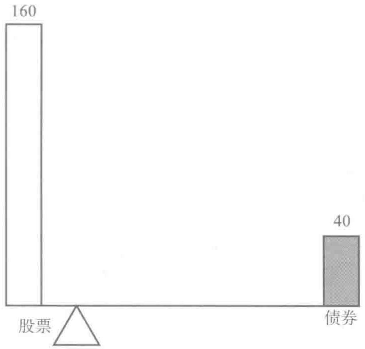
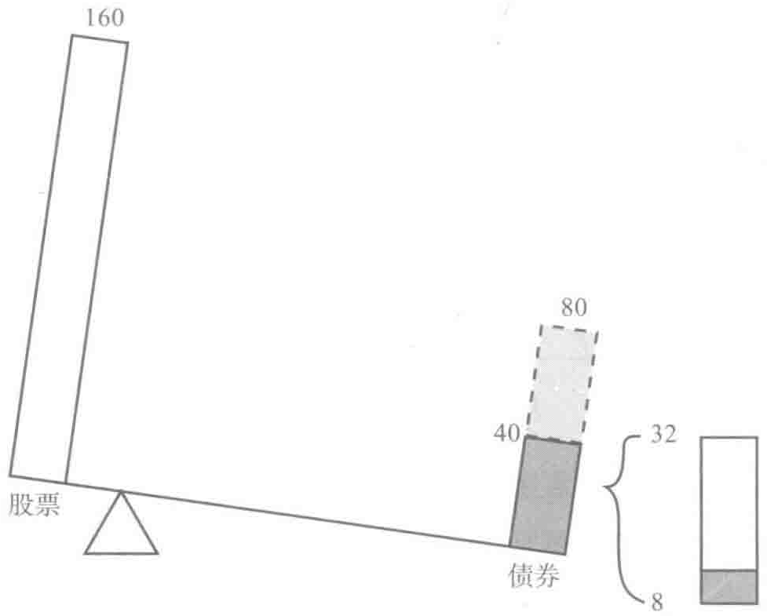
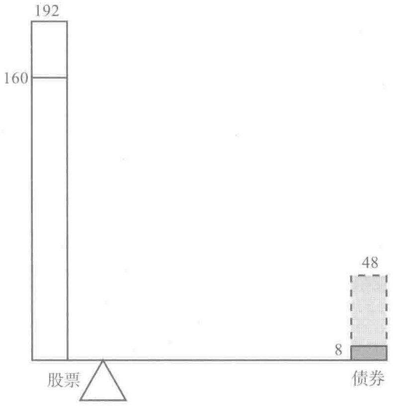

# 第1章 改变投资理念

2009年1月7日，一个法学院大三的学生安德鲁·维斯坦（Andrew Verstein）做了一件让人大跌眼镜的事情。安德鲁用自己辛辛苦苦赚来的存款——4770美元，出其不意地购买了100份2011年12月的指数期权LEAP。该指数挂钩标准普尔500指数。

听闻这个消息，大家的第一反应可能是初生牛犊很冒失啊！不过我们要告诉大家，这个投资行为很明智。安德鲁用这种方式投资，在大大降低投资风险的同时，还能让退休时账户里的存款可能会比使用传统投资得到的高出50%。

先别忙着给安德鲁的行为定性是冒失还是有才，我们分析了他的投资行为后就能见分晓。LEAP是长期股票预期（long-term equity anticipation，LEAP）的简称，这可真是对长期股票期权的妙称。安德鲁获得指数期权，就有能力购买100份SPDR基金[SPDR在英文中读做spider（蜘蛛）]，它是为效仿标准普尔500指数的投资表现而建立的。单份SPDR基金价与标准普尔500指数的1/10价位持平。⊙安德鲁买入该指数期权后，就能以45

⊙ 1月7日标准普尔500指数开盘价是927.45美元，而SPDR的开盘价是92.00美元。

美元的单价买入 SPDR 基金，即以半价买入基金。当然安德鲁不可能免费买入这样的期权。为获得这样的特权，他支付了 4770 美元的总期权费，买了 100 份期权，每份期权的价格为 47.70 美元。

安德鲁要赚钱，SPDR 的单价必须得比 45 美元高出 47.70 美元，即达到 92.70 美元才行。市场价格涨到了 92.70 美元以上，安德鲁就会赚钱。这比他直接用 4770 美元投资美国标准普尔 500 指数的回报率高一倍。如果他直接购买标普指数，只能购入 52 股。而今，通过投资 SPDR，他获得了 100 份的投资敞口。当然，如果市场下跌，安德鲁赔本也是双倍的。如果指数最终的价格低于 45 美元，他将赔光自己的退休储蓄。

## 是拿自己的所有身家来赌博吗

安德鲁平常非常节俭，几乎到了吝啬的地步。在进入法学院学习前，他曾担任法律助理一年。这份工作让他有机会去巴黎、米兰和墨西哥城等地工作。因为生活开销都能报销，所以即使安德鲁的薪水不高，也能攒下不少钱。也许身在异国他乡，他本应该去享受有异国风情的格调生活，在咖啡馆里好好享受卡布奇诺，但这不是他的风格。

为什么安德鲁得赌上自己所有的积蓄，置自己退休后的生活品质于不顾呢？简言之，他觉得自己购买LEAP股指期权是谨慎的投资。他不敢肯定股票市场就会上涨，也不指望这样做能从短线投资中大赚一笔。实际上在2008年股票市场震荡剧烈的时候，安德鲁对于股价在期权有效期内的走势心里根本没底。话虽如此，但他依然认定这是一种有效的、保守的长期投资战略，能让个人积蓄保值、增值。此前，安德鲁曾读过我们撰写的一篇有关分散时间投资的学术文章。他把里面的想法用到了自己的投资

实践中。我们撰写本书也是希望有更多的投资者像安德鲁那样开展有效的投资。

安德鲁的举动并非投资菜鸟的鲁莽之举。为证明这一点，我们先来谈一谈20世纪60年代保罗·萨缪尔森和罗伯特·默顿的研究成果。两位学者在发表的文章里，开创性地提出了如何将个人退休账户里所有的储蓄投资股票和债券，并合理分配投资比例的观点。[^2]设想一下，如果你在25岁时继承了一笔50万美元的信托基金，但你只有退休了，才能花这笔基金。你会如何在股票和债券投资中进行投资分配呢？

这个答案显然与你的风险承受能力和对股票与债券的投资回报预期有关。为了讨论方便起见，我们可以假设你以六四开投资，60%的钱投资股票，40%投资债券。现实的情况是我们知道没有人会凭空给你留那么一大笔钱。

还是站在安德鲁的角度思考一下。你25岁，很快就会成为律政界的新秀。你的个人退休账户里有5000美元。你如何开展股票和债券投资？

如果你的投资比例是六四开，即3000美元投资股票，2000美元投资债券，你就掉进了投资陷阱。这是绝大多数人常犯的错误。因为你忽略了一个事实：安德鲁将来的收入比较稳定。这就好比他有资格获得某种债券一样。纽约律师事务所的平均起薪超过15万美元。安德鲁打算每年攒下1万美元存入401（k）职工养老金账户。随着安德鲁职位的晋升，外加通货膨胀，401（k）职工养老金账户的存款额度会逐年上升。这种储蓄方式可以看作安德鲁每个月定期归还按揭贷款，虽然他并没有购买任何资产。401（k）职工养老金账户就像是个银行，里面有现值50万美元的余额。

> 保罗·萨缪尔森会给像安德鲁这样的年轻人提出这样的投资建议：

年轻人初入职场，如果你未来的收入无法高效资本化，也无法高息放贷，为了保证你的新增收入在真正财富总额中成比例保值，你得趁早将你大部分的流动资产投资普通股票。[^3]

安德鲁大部分的真正财富总额与其人力资本关联。随着时间的流逝，这将转变为金融资本。从理论上讲，安德鲁应该赶紧想办法将自己未来稳定的收入和存款换取现在就能到手的50万美元。可是现实中哪有这样的市场？其实安德鲁就跟我刚才举例说明的获得了50万美元信托基金遗产的人一样，他作为律师有这样的身价，只是他现在没办法获得这50万美元。他未来预期的收入可以看作在投资组合中无法动用的价值50万美元的债券。幸运的是，钱不仅能赚，也能借。所以安德鲁可以通过早早开始超额投资来实现对将来到手资金的控制和管理。

如果安德鲁将手头的5000美元存款按照六四开投资股票和债券，那么他会把3000美元投入股票，剩下的2000美元投资于债券。当然，如果把5000美元全部投入股票市场，考虑到他将来可能获得的收入，从真正财富总额投资的角度来看，他投放股市的资金比例依然小于1%。即使他以2:1的杠杆比例投资，获得1万美元的股票敞口，他在股票市场的投资只占真正财富总额的2%，远远低于他预期的60%。我希望大家明白，利用股票杠杆投资，无论如何安德鲁对真正财富总额的投资比例都不会达到60:40。从这个角度来讲，安德鲁以2:1的杠杆比例进行价值10 000美元的投资，这种投资方式一点儿也不激进。从全局的角度考虑，他无非是拿不到2%的真正财富总额来承担投资风险。

安德鲁知道自己才刚起步。他学会了谨慎投资，只投资5000美元，而非投资10万甚至50万美元。用安德鲁的话来说："当我开始学习某项体育

运动时，我会对球赛进行小额的投注，这样我就有了研究球手和比赛的真正动力。我开始股票投资是因为这能让我知道怎样才算是比较小的投注。"

安德鲁上大学的时候偶尔会打打牌。他的牌技很不错，曾在扑克锦标赛上获奖，但安德鲁可不是个赌徒。用2美元的牌本，安德鲁能赚到100美元。想要提高牌技，他只能提高赌注，但是他可不想在扑克上耗费过多的青春。而对于如何投资自己的存款这个问题，他可等不起，持观望的态度而无所作为不合适。

分散投资是金融投资必备的投资战略。安德鲁开始股票投资是为了更好实现分散投资。当然，他在一定程度上已经做到了分散时间投资。他购买了股指期权，不像普通投资者一样就买某种股票。这种投资方式有些人会觉得很无趣，不过的确是不失明智的做法。如果大多数散户都像安德鲁那样只买股票指数，CNBC高收视率访谈节目主持人吉姆·克莱姆（Jim Cramer）在镜头前也就没有太多话可说了。安德鲁知道成为一名律师才是他的职业目标，他不是专业的操盘手，也不会选股。法学院的课业繁忙，他无暇计算出到底哪种股票的投资表现好，哪种不好。就算他有时间，他也有自知之明，明白不可能获得比市场平均水平更好的投资回报。

后来，安德鲁对于分散投资越发驾轻就熟。他投资境外股票、商品和房地产，希望能使投资对象更加多元化。而一开始就能投资标准普尔500指数，他已经给个人投资开了个好头。

## 股票历年累计投资总额

安德鲁的投资战略能降低投资风险。为了分析这个原理，我们采用了表达股票市场敞口的全新指标，即股票历年累计投资总额。假如第一年安

德鲁用 5000 美元投资股票，第二年投资 1 万美元，第三年投资 15 000 美元，那么他总共投资了 3 万美元。随着时间的流逝，每一年安德鲁都增加自己的投资额，这种分散时间投资的方法，大大降低了市场波动给投资带来的风险，其在这三年时间里，平均每年的投资额为 10 000 美元。股票历年累计投资总额相等，只是时间分布更加合理。当然，第一年的时候安德鲁没有 1 万美元的闲钱来投资，正因为如此他才会选择购买 LEAP 股指期权。

其实，我们人生当中每一年都蕴藏着独特的投资机会。分散资产投资告诉我们不应该把 80% 的钱只投资 10 种股票。如果选择更多的股票来投资，你肯定能获得更高的投资回报。

分散时间投资其实和分散资产投资的方式有异曲同工之妙。人们往往犯一个错误，就是 80% 的股票投资是在一个十年的时间区间内完成的。如果这十年的投资前景不佳，股民们很有可能损失惨重。实际上，我在 2009 年夏天写这本书的时候，美国标准普尔 500 指数跌到了 1997 年的水平。那些马上退休的人，如果时运不佳，刚好是在市场大跌的十年里投资自己的毕生积蓄，结果可想而知。其实如果能将股票投资的时间延长到几十年，在同等股票历年累计投资总额水平下，要尽可能将股票投资的期限延长，分散投资。

## 利用杠杆进行股票交易

向来喜欢否定新事物的人秉承一贯什么都做不了的态度说分散时间投资这种方法不可行，因为年轻人根本没钱去投资。你因为没钱就不能投资，这种观点大错特错。人们买房时，一向都是手头没钱的时候就买入了。攒

下了首付就去买下房子或者公寓，剩下90%的尾款都得靠借入或者贷款。因为有房子作抵押，所以银行等金融机构或者其他出借人一般愿意给购房者贷款。

股票投资也一样。你可以利用存款和贷款来超额投资，即投资额超过自己的总存款。联邦法律有规定：贷款额不超过你用于投资的数额。如果你有4000美元可以投资，那么你就能贷款4000美元，购买总价8000美元的股票。这叫用保证金购买股票（buying stock on margin）。

用保证金购买股票增加了你的股票敞口，也提升了你投资的短期风险。这叫杠杆交易头寸，因为就像阿基米德杠杆一样，市场一点点的波动就能引起投资组合价值的巨大波动。[^4]如果你用5万美元的首付和45万美元的按揭贷款购买50万美元的房子，你的杠杆比率就是10：1。房价升值10%，就表明你的权益增加100%（55万房价-45万按揭=10万美元）。当然，如果房价下跌10%，那么你的投资就会赔得精光。杠杆比率越大，短期风险越高。

用保证金购买股票同样也有杠杆效应。如果你用4000美元的保证金购买了8000美元的股票，当股价上涨10%到8800美元时，你就用4000美元的投资获得了20%的投资回报。无论市场走高还是走低，你赚的和赔的钱都是市场（正负）回报的两倍。

我们并不是鼓励大家承担更高的风险去投资。恰恰相反，用保证金购买股票降低了投资的长期风险，因为这种投资方式使得你有能力将市场敞口在更长的时间区间里平均化。你25岁的时候去投资，有4000美元的市场敞口；到65岁的时候，敞口增加到20万美元。怎样才是更明智的做法呢？将第一笔投资的敞口增加到8000美元，将最终的投资敞口降低到196 000美元。

用保证金购买股票能帮助实现分散投资，但也会产生其他问题。如果股价跌幅过大，投资者需要提供更多的抵押品。如果投资者无法追加保证金，则其投资组合将被清账。由于投资者一开始就是举债投资，很有可能无法追加保证金。第二个问题是很多股票经纪人（当然不是全部）对于保证金贷款收取很高的利息。利息成本太高，分散投资所获的收益都不足以支付利息。我们认为用保证金购买股票的缺点太多，因此它并不是有效的投资战略。

幸运的是条条大路通罗马。通过购买看涨期权，你可以获得相同的杠杆比例。这种期权的优势在于不需要追加保证金。不管市场的行情如何变化，你不需要再追加投入。看涨期权的第二个优势是购买看涨期权可以使投资者在只承担较低成本的基础上使自己的投资敞口翻倍。本书第8章将阐明近年来能够提供2:1杠杆比例的长期看涨期权的隐含利息率只有4%。

这就是为什么安德鲁投资指数期权LEAP，它能更好地分散自己的投资组合。安德鲁花费了4770美元来获得期权，由此获得以45美元购买SPDR的权利。如果股价比当前水平提升10%（即从92美元上涨到101.2美元），安德鲁就能凭借4770美元的投资获得850美元的回报，回报率为18%；如果股价下跌10%，安德鲁会损失990美元，那么损失率为21%。[^5]这与利用保证金贷款购买股票的杠杆效果相同，但安德鲁不需要担心追加保证金或者支付较高利息的问题。

提出杠杆投资办法往往会招致怨恨。近期发生的事情也凸显了这个问题。若遵循我们的建议，年轻投资者就可能在2008年损失64%的存款，他们是怎样评价我们的投资策略的呢？

损失 64% 的投资额，谁碰到了都会经历难以忍受的煎熬。当然，如果注定有此一劫，那么宁可在 25 岁的时候碰到，也不要在你 65 岁的时候碰到。为什么？有两个理由。首先，如果你在年轻的时候碰到这样的局面，你会有充分的时间来调整自己的反应。在未来 40 多年的时间里，你可以更加努力地工作赚钱存钱，也可以因此少消费一些。其次，在遵循我们的建议时，你在 25 岁的时候损失的资产肯定要比你在 65 岁的时候损失得少。如果安德鲁会损失自己最初投资的 64%，他的损失额是 3000 多美元。这种损失让人难以承受，但不至于毁掉一个人的生活。而对于一个 65 岁的人来说，丧失 64% 的资产就很难东山再起了。

请记住，我们的投资建议不仅仅是为 25 岁的年轻人设定的。我们也有为 65 岁的人提供的投资建议——要减少股票的购买量。如果我们能在 40 年以前撰写本书，给大家提出投资建议，那么就会有其他像安德鲁这样的人在 2008 年的时候投资得少一些，遭受的损失也就少很多。我们已经进行了数据模拟，并发现投资者完全有能力获得比用传统的投资战略高 7% 的投资回报。[^1]

由于我们一直提倡在年轻的时候多投资，随着年龄的增大，要逐渐减少投资的金额。这样一来，如果年轻时市场表现好，而后来市场表现不理想时，利用这种投资方法，显然就能比一般投资者取得更好的投资回报。另一方面，当投资前景不理想时，你年轻的时候投资的表现较差，而在快退休的时候，投资结果会逐渐转好。但就从这一个角度来评价我们的投资战略，未免有失公允。我们的目标是降低风险，这意味着我们不可能得到

全部最高的回报，也会避免一些最差劲的损失。我们不可能全面排除风险，但是通过分散时间投资，我们能大大降低投资的风险。

当然，安德鲁刚出道的时候时运不佳。2009年1月道琼斯工业平均指数刷新了历史最低纪录，几乎倒退到1896年的情况。[^6]2009年5月，他的投资账户上又有盈余了。一路上，他经历了起起伏伏。我们现在无法对安德鲁将来的前途给出定论，至少得经过40年的沉淀才能真正弄明白。我们不需要大家对我们的话深信不疑。第3章我们将介绍如果大家遵照我们的建议，在过去138年时间里可能已经出现了怎样的景象，尤其是那些在2008年结束的时候面临退休或者已经退休人员的投资状况。

## 要以发展的眼光看问题

明白将来你能获得一笔可观的存款和终生财富的价值，利用杠杆投资的方法能让你从分散投资战略中获益良多。一般而言，未来收入增加会导致总体财富的增值。当然，实现这个目标还有其他办法。

这是我们俩一起合著的第二本书。2000年，我们签署合约撰写了《有何不可》（Why Not?）。这是为哈佛商学院出版社撰写的一本有关创意的书。我们知道大约一年后会拿到稿费，而且我们拿到稿费后要做的第一件事情就是全额投入股票市场。我们当时没有回答的一个问题是：为何要等两年后才去投资，才想着利用市场风险来获得更高的回报呢？答案是因为当时我们手头上没有可以用于投资的闲钱。

只是这个理由太牵强了。为了解释其中的原委，也为了更直接地说明问题，我们会使用整数。假如我们每个人开始都以16万美元投资股票市场，然后另外4万美元投资债券。我们在拿到书款前投资的资产分配比例

是 80% 用于股票投资，20% 用于债券，具体如图 1-1 所示。

*图 1-1（单位：千美元）*

我们取整数，书款大约是 15 万美元，两个作者分别可以拿到税后 45 000 美元。我们都打算取 5000 美元花掉，另外 4 万美元存进退休金账户里。（我知道，现在看起来我们不太懂享受，不过我们会投资赚钱，等以后就能好好享受了。）

要记住，我们的目标是拿 \(80\%\) 的钱投资股票，这表明我们会利用 4 万美元中 \(80\%\) 的金额投资股票，也就是 32 000 美元投资股票，剩下的 8000 美元投资债券。

这样做无可厚非，但是为什么要等待呢？因为我们肯定还是要把 4 万美元用于投资，其中 32 000 美元投入股市。有人认为这样做肯定是提升了股市投资的比例，那肯定是错了。这样做，恰恰是为了保证资产分配 80/20 的比例。

> 假如我们什么都不做。我们的资产组合比例会朝着债券倾斜，如

图 1-2 所示。我们在常规债券里有 4 万美元外加书的稿酬。从出版商手里拿到的本票可与定期国库券不同（虽然已知哈佛大学捐赠基金的规模，但我们不知道国债和哈佛商学院出版社本票哪个信用风险更高）。我们写作的目的就是为了拿到稿酬，因此有信心能够如期获得较高报酬。

*图 1-2（单位：千美元）*

为了重新实现股票和债券投资的 80/20 比例，我们要做的是从债券中抽取 32 000 美元转移到股票市场投资上来，具体如图 1-3 所示，我们只在债券上投资了 8000 美元，而近期能够获得的书稿支票就像债券一样。知道了收入的具体金额和获得的时间，可以估算拿到手的税后收入是多少。这样一来，我们真正投放债券的投资就成了 8000 美元的政府国债以及 4 万美元的稿酬本票。

要更精确地计算，我们还要采取一个额外的步骤。稿酬会在未来一年内收到，我们要对未来到手的这笔 4 万美元进行贴现。我们买入一张面值

为 38 000 美元的零息债券，相当于获得未来能到手的 4 万美元。这表明，我们投资面值为 4 万美元的债券，真正的价值只有 38 000 美元。我们可以把未来一年到手的 4 万美元，当成是现值 38 000 美元的资产，然后选择其中的 80% 投资股票，具体金额就是 30 400 美元。

*图 1-3（单位：千美元）*

稿费看似比较特殊，不是所有人都能拿到，但是这能说明我们整个投资战略的关键想法。大家都有自己的薪水，这就好比稿酬一样。大家可以预测未来自己的收入状况以及投资意向，然后全力实现预想的情况。你不可能做到十全十美，但八九不离十不是什么难事。

这主要涉及两个步骤。首先，如果你的想法和大多数人别无二致，你得明白未来的薪水就像债券，因此债券在整体投资的占比偏高，而且你还没有意识到这一点。第二步是一定要计算这笔债券的现值。由于你的钱是未来进账的，考虑到时间的价值，贴现以后不会有名义价值那么高。

从小到大，我们学到的一个道理是要先数数可能破壳而出的小鸡的数目，做到心中有数。这句话道理是没错，但是我们会建议你一定要提前规划。不要忽略你未来的存款，你应该对未来储蓄的现值一清二楚，从而尽早开始拿这部分钱财投资股市。未来收入的"现值"就是折合成现在你能到手的部分。将来某个时刻获得的 1 美元，其现值肯定低于 1 美元。你一定得好好考虑目前最佳的投资战略。

年轻的投资者常犯的错误是忽略了未来可能拥有的存款。一开始，我们估计安德鲁未来的存款可能会超过 50 万美元。但即使安德鲁不太自信，因为他在律师事务所上班前花了一年时间在中国地区担任志愿者，也很难想象他未来收入的现值会不到 20 万美元。为了避免将安德鲁终生的积蓄都在他快到退休的五六十岁时投资，安德鲁得对未来的部分收入进行贴现，现在就赶紧投资股票市场。

## 提前贴现你的收入

设想一下，如果你今年 30 岁，每年稳赚 10 万美元，且可以存下 5000 美元。这就相当于你在债券市场投资了 12 万美元。每年存 5000 美元，未来 36 年时间里你就能获得现值为 12 万美元的存款。如果你现在已有 5 万美元的存款，其中 90% 投资在股票市场，这并不代表你把个人存款的 90% 投进了股市。更加精准的计算方法是你在股市投资了 4.5 万美元，而债券投资达到了 125 000 美元（即现在的 5000 美元和未来的 12 万美元存款）。这样一算，你便知道你的股票投资比例只有 26%。年轻时你多投资一点进入股票市场所承担的风险要比你想象的更低。

> 事实上，大部分人的股票投资比例远远低于 26%。如果你赚了 10 万

美元，可以预计的是到退休的时候，社保所占的比例将达到 \(25\%\)。这样折算后的收入价值更高，因为它直接与通货膨胀挂钩。等你退休的时候购买相同数额的养老金大约要花去50万美元，其现值是19万美元，你持有债券的总价值将接近315 000美元，因此，45 000美元投资股票，在整体储蓄的占比只有 \(13\%\)。你之前可能还在想用 \(90\%\)投资股票市场比例过高。但是如果你估算一下债券所占的投资比例，你会发现，即使你把现有存款两倍的钱投资股市，股票投资在整体资产组合的比例也只有 \(28\%\)。

## 现状

我们当初没有把将来可得的稿酬提前用于投资是一个错误，但这个错误和大家在退休投资方面所犯的错误相比就是小巫见大巫了。大多数人针对401（k）退休金投资有两种办法。

办法一：设定固定的资产分配规则，即 \(75\%\) 投资股票，\(25\%\) 投资债券，然后顺其自然。从你一开始加入养老金计划，填写表格，你就设定了这样的比例。撰写本书前，我们所用的就是这种方法。办法一让人安心的地方，就是它比较传统。

办法二：按照预期的退休年龄设立目标日期基金。如果你在2050年退休，你就要投资2050基金。目标日期基金本质上遵照生日公式进行投资，即以110减去年龄的差的比例投资股票。25岁的时候，资产的 \(85\%\)用于投资股票。60岁的时候，资产的 \(50\%\)用于投资股票。2050基金的设立，可以让所有在2050年达到65岁退休年龄的人按照生日公式进行投资。

目标日期基金是近期最重要的金融改革成果。1993年由巴克莱全球投资者公司（Barclays Global Investors）首度引入这种基金。现在绝大多数共

同基金公司都提供此类投资产品。截至 2008 年，该类型基金的资产值已经增值 2000 多亿美元。

这种办法的优势是基金能自动对资产进行调整，每年会有更多的资金投资于债券，而非股票。此外，基金还重新调整了股票和债券的相对价值。在遭遇 2008 年的股市危机后，股票投资的比例下跌到了目标水平以下，因此投资比例会重新向股票倾斜。

虽然这两种办法都很简单流行，但各有问题。固定比例投资战略就好像是一只弄坏的钟一样，每天只有两次时间是准确的。有时候这个规则是准确的，但在大部分时间里都有问题。年轻的时候，股票投资比例过低，年老的时候，股票投资比例太高，而且这种办法也没有考虑市场波动情况，因为按道理随着市场行情的波动，我们需要随时调整资产投资比例。

最大的问题在于，任何固定比例投资的方式都有随着时间的流逝发生投资比例不和谐的情况。假如你每年在 401(k) 养老金计划里存 4000 美元，其中 75% 投资股票。这意味着，你每年在股市里投资 3000 美元。大体估算一下，这相当于你第一年投资 3000 美元，第二年投资 6000 美元，第三年投资 9000 美元。三年内，你的股票投资敞口翻了 3 倍。第 10 年投资股票的敞口是第一年投资股票敞口的 10 倍。

在实际投资实践中，这样的比例会变得更加极端。随着薪水的增加，401（k）养老金缴存的比例也会上升。此外，长期而言投资组合中的股票也会增值。我们的模拟表明，典型的按照生日规则投资的投资者在第 10 年投资股票的敞口将比第一年投资的敞口多 20 倍，第 20 年投资的敞口要比第 10 年的多 3 倍。

这表明随着时间的流逝，你每一年都在不断增加股票市场的投资敞口。如果进行了分散时间投资，每一年股票投资的震荡幅度就不会那么大。

目标日期基金比固定比例投资的分散程度高很多，但它依然存在两个问题。一个是费用较高，另一个是战略本身有瑕疵。很多目标日期基金收费很高。业界臭名昭著的当属富兰克林邓普顿。他们提供的2035基金，手续费是 \(5.75\%\) ，年费为 \(2.99\%\) （假如你不想支付预付费用，那么C类份额的年费则高达 \(3.69\%\) ）。一笔30万美元的初始投资，投资30年，年费高达739 000美元。外加你一次性支付的356 500美元和因为支付这些费用而减少的收入382 500美元，这简直是天价基金。[^7]总共高达659 000美元的费用，远远超出了投资者的预期。[^8]

不是所有的基金都会收取这么高的费用。先锋（Vanguard）基金因为收费合理受到了业界的赞赏。[^9]他们的目标日期基金投资一系列的指数基金，可以自动调整股票和债券的投资比例，总费用低于19个基点（一个基点是万分之一）。如果投资者将同样的30万美元投资收费较低的先锋目标日期基金，则只需要支付49 486美元的费用，最终能获得1 349 000美元，这个结果比投资邓普顿的回报要多出一倍。

没有理由花冤枉钱。计算机程序能够出色地完成股票和债券投资比例的分配，可以在购买股票后，加入全球市场指数基金。目前先锋基金所做的就是这样的业务。正因为如此，该基金的收费才如此之低。

当然，即使你投资先锋基金这样的低成本基金，你依然面临第二个问题：投资分配的规则是错误的。标准的生命周期基金按照110减去投资者年龄差的百分比来持有股票。[^10]因此，20岁的年轻人可以按照90：10的比例投资股票和债券，而60岁的老人则可以按照50：50的比例来投资股票和债券。理解分散时间投资战略，能告诉我们一开始以90%的资产投资股票是过于保守的做法。

> 目标日期基金通过每年减少股票投资比例的方法实现分散时间投资。

这是正确的观点。但由于一开始投资股票的比例只有 90%，那么降低股票投资比例所付出的代价就是不断减少总体股票投资的敞口。你可能会认为 90% 和 50% 投资比例的平均值是 70%，但你要明白一开始你按照 90% 投资股票的资产总额要少很多，看加权资产的净值，你会发现平均股票投资敞口只有 60%。

## 打败现实的方法

阅读本书会让你相信 60% 的人股票投资的比例过于保守。当然，增大股票投资敞口也意味着承担更高的风险。这里就有必要引入改良的分散投资战略。这种方法能够让你在提升股票投资敞口的同时，保持较低的风险水平，而你的投资回报不会因为风险降低而减少，事实上你能获得更高的投资回报。

生命周期投资战略与以往固定资产比例投资或者按照生日规则投资的方法有很大不同。为了实现分散时间投资，得在你年轻的时候大幅度提升股票投资的比例，不是 90%，也不是 100%，而是 200% 的资产。实施这种改良的分散投资战略，你能在整个生命周期中安全地实现较高的股票投资敞口。股票投资敞口增加，正是提升投资回报的原因。同时，因为你实现了分散时间投资，所以你也能更好地控制风险。

生命周期投资战略提升了投资回报均值的 50%，其风险水平与生日规则的风险水平相当。在与固定比例投资战略相当的风险水平上，我们甚至可以提升投资回报高达 60%。生命周期投资战略在投资态势糟糕的时候能保护投资者，让他们不受太大的损失，而在行情看好的情况下能大大提升他们的投资回报。

随着医疗水平的提高，人均寿命延长，生命周期投资战略的好处就显得更加重要了。人们不仅要为15年或者20年的退休后生活储蓄，而且很有可能要让自己的投资回报能延续到90岁甚至更长寿命的生活。

这就是安德鲁计划背后的动力。如果他坚持自己的投资计划，按照本书第2章的投资战略进行投资，我们预计他可以提前6年退休，且保证高品质的生活。在不透支自己存款的前提下，获得让投资者多活至少15年的生活成本。我们希望他每一分钟都能活得很快乐。

我们希望能帮助读者实现相同的梦想。我们相信本书能大大改变你的人生。如果你遵照我们的投资建议，你可以早早地期待退休生活了。

[^1]: 用传统的方法投资，最后账面的价值为635000美元，而我们的生命周期投资战略最后取得了679000美元的资产价值。2007年，大家都面临了行情暴跌的情况，但我们的方法能减少遭受的损失。

[^2]: 编者注：此处原书脚注对应上文保罗·萨缪尔森与罗伯特·默顿相关学术论文的具体出处（原书脚注文字缺失，仅标注引用位置）。

[^3]: 编者注：此处原书脚注对应上文萨缪尔森投资建议引文的具体出处（原书脚注文字缺失）。

[^4]: 编者注：此处原书脚注为对上文杠杆交易机制表述的补充说明或数据引用来源（原书脚注文字缺失）。

[^5]: 编者注：此处原书脚注对应上文期权收益率/损失率计算过程的具体测算说明（原书脚注文字缺失）。

[^6]: 编者注：此处原书脚注对应上文道琼斯工业平均指数历史低点数据的引用来源（原书脚注文字缺失）。

[^7]: 编者注：此处原书脚注对应上文富兰克林邓普顿基金费用测算的具体数据来源（原书脚注文字缺失）。

[^8]: 编者注：此处原书脚注对应上文659000美元总费用测算的补充说明或数据来源（原书脚注文字缺失）。

[^9]: 编者注：此处原书脚注对应上文先锋基金收费评价的引用来源（原书脚注文字缺失）。

[^10]: 编者注：此处原书脚注对应上文"110减龄"生命周期基金配置规则的引用来源（原书脚注文字缺失）。