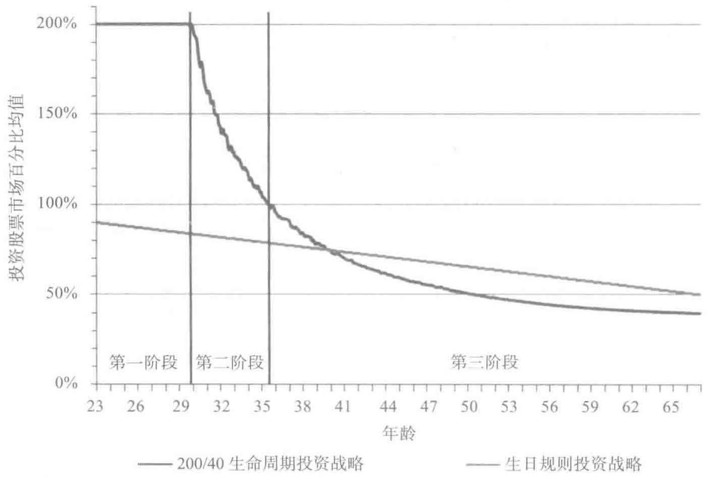

# 第2章 投资规划

## 投资规划

我们接下来解释如何利用杠杆投资手段实现财富分散时间投资的战略。为此，我们做个简单的类比。一个小孩想要去拿放在橱柜里的饼干罐。这个过程和你生命周期投资的过程类似。

## 饼干罐

一开始，小孩个子不高，根本够不着，所以他会用尽全力跳起来去拿这个罐子。他使劲儿跳，但因为人太小，所以无论他怎么努力向上跳，他都够不着饼干罐。不过他会不断地尝试。后来他慢慢长大了，开始越来越靠近这个饼干罐。这是第一阶段。

孩子长高了以后，终于可以拿到这个饼干罐了。生平第一次，他实现了自己的目标。这是第二阶段的开端。他在第二阶段不断长高。虽然他高了很多，但依然得跳起来努力伸手去拿才能够得着。他不断向上跳的这个阶段，就属于第二阶段。

最后，这个小孩终于长大了，不用跳起来就能拿到这个饼干罐。实际上，成年后，他的身高超过了厨房橱柜的高度。他完全不用刻意把手抬得

很高就能拿到他所需要的饼干，这就是第三阶段，也是最后的阶段。

我们投资股票的三个阶段与小孩努力去拿这个饼干罐的三个阶段类似。你年轻的时候钱不多，离你期望的市场敞口投资目标很远。即使你努力向上跳了，依然达不到这个目标。在这种情况下，"跳起来"就代表你要利用杠杆交易方法来提升投资敞口。我们在下文讨论的时候，"尽可能"表明你要采用2：1的杠杆比例。即使是2：1这样的杠杆投资比例，也不足以让你实现目标，但是随着投资组合价值的增长，你会越来越接近你的目标。

你利用2：1的杠杆投资比例不断提升投资组合的总价值，在达到你期望的投资分配比例目标前，一直处在第一阶段。之后就进入第二阶段。你依然需要使用杠杆投资战略来实现目标，但你不需要像之前那么卖力了。随着资产组合的增值，通过资产溢价和继续缴存，你能在降低杠杆比例的前提下实现投资目标。（如果市场下跌，你可能需要回过头去暂时提升杠杆比例并持续一段时间。）

最后，你在不需要使用任何杠杆的情况下就实现了投资比例目标。这标志着你进入了第三阶段。在此阶段你以 \(100\%\) 的股票投资比例开始，随着资产的增值，你逐渐减少股票投资敞口，最终实现投资目标。

## 两个数字

> 生命周期投资战略看似复杂，可以归结为两个数字。
> 
> (1) 终生财富的现值；
> 
> (2) 你的"萨缪尔森份额"。

终生财富的现值是指你当前存款的现值加上未来缴存退休账户金额的现值。终生财富的现值是你考虑分配投资比例的总额。在安德鲁这个例子

中，他现在只有 5000 美元的存款，不过预期会有 50 万美元的终生财富现值。

你想把终生财富现值的多少比例投资股票市场？回答这个问题最简单的办法就是想象有个人让你具备了现在就能支配你终生财富总额的能力。假如你有 50 万美元的现金（见第 1 章的信托基金案例），但是这些现金全部锁在了你的个人退休账户里，你不能支配使用，连借用都不可以。你唯一可以做的就是将这笔财富提前做好股票（包括国际股市、房地产和商品市场）和债券的投资比例分配。你的分配比例就是你实际投资股市的比例。

我们把这种核心目标分配比例以恩师保罗·萨缪尔森的名字命名，称为"萨缪尔森份额"。萨缪尔森认为，在合理的风险偏好程度范围内，无论股票价值的走向如何，投资者往往想要按照固定的比例来分配股票和债券的投资比例。萨缪尔森的投资模型有一个基本的假设：你从一开始就获得了终生财富的现值。本书从某种程度上来讲，无非是萨缪尔森观点的延伸。虽然你只能在将来的某个时刻才能将存款存入退休金账户，但是你要从生命周期的角度去投资，以未来财富的现值作为分配的基础，虽然你现在无法拥有这部分财富，但你可以"提前支配"进行投资。

萨缪尔森的看法产生了非常简单的投资规则。在你工作的生涯中，每一年的投资目标都是萨缪尔森份额乘以终生财富现值的积。假如安德鲁现在的萨缪尔森份额是 60%，而在某个年度他所拥有的终生财富的现值是 50 万美元，那么安德鲁就应该在股市投资 30 万美元，剩余的投资其他资产类型，以分散投资风险。我们强调这只是一个投资分配比例目标。安德鲁开始工作的时候，即使他能采用杠杆投资办法，也无法实现这个目标。但我们会阐明，接近萨缪尔森的投资目标，可以让我们获得更高的分散投资收益。

我们无法告诉你精确的萨缪尔森份额是多少（本书第7章会帮助大家寻找这个问题的答案）。资产投资分配比例的答案取决于两个要素，一个要素对所有人都一样，另一个要素与投资者个人相关。正因为这种私人的性质，所以萨缪尔森份额的具体数额对每个人而言都各不相同。

第一个是通用要素，主要指股票投资的回报和风险及其与债券收益的比较情况。股票投资的回报越高，风险越低，你想投资于股票的资产比例就越高。

第二个是个性化的要素，主要是你对风险的态度或者说对风险的容忍度。无论股票投资的结果如何，你规避风险的程度越高，你越不想投资股票市场。预期这个词非常重要。虽然股票投资的实际回报对所有投资者而言都是一样的，不过问题是投资回报到底是多少，没有人知道。因此投资者必须根据对风险和回报的预期做出投资决策。不同的人对回报和风险的预期肯定不同，因此第一个要素也有例外的情况。

## 三个阶段

按照萨缪尔森的目标，自然而然就能得到生命周期投资的三大生命阶段。

第一阶段：通常指工作后的前十年，应该按照2：1的杠杆对储蓄进行投资。

第二阶段：通常指工作后十年一直到投资者50岁左右的时候，投资需要杠杆，杠杆比例大于1：1，小于2：1。

第三阶段：通常指退休前的十年时间，投资完全去杠杆化，投资组合包括公司和政府债券还有股票。

> 我们以伊恩的外甥奥吕斯为例子。奥吕斯是前空军上尉，最近开始就

职于一家财产/灾害保险公司（property/casualty insurer）。他和妻子每年能赚20万美元，每年能攒下10%的收入，算在一起，奥吕斯未来财富的现值是40万美元。在奥吕斯的例子中，他现在有6万美元存款，那么他终生财富的现值是46万美元。这就是我们得到的第一个数字。我们的分析已经对了一半。

奥吕斯检验了自己的风险承受力以及他对未来股票回报的预期，确定他的萨缪尔森份额是40%，非常保守。这表明，如果他的终生财富现值都摆在他面前，他会把40%的财富投资股票，60%的财富投资政府债券。

他的目标是在股市投资46万美元的40%，即184 000美元。即使他把现有的全部存款6万美元投资股票，那也只是现在和将来财富价值的13%。使用2:1的杠杆比例可以让他在股市投资12万美元，但离184 000美元的目标仍然很远。

你可能会认为在奥吕斯存够92 000美元前，他会一直处于第一阶段。在这种情况下，使用2:1的杠杆比例能使他实现184 000美元股市敞口的目标。这样分析不太准确。随着时间的推移，奥吕斯的总体存款会发生变化，与之对应，期望的市场敞口水平也会发生变化。当奥吕斯总体财富的价值是46万美元的时候，184 000美元的市场投资敞口才是准确的。当奥吕斯攒够了92 000美元时，他未来财富的现值可能已经下降，而剩余可以用于缴存的年数越来越少（当然，他如果职位晋升了，那可以缴存的额度将大大增加）。如果未来财富的价值刚好从40万美元跌到了368 000美元，而终生财富的价值依然为460 000美元，那么他的目标也会停留在184 000美元的水平。但是我们无法肯定现实能和预计的情况类似。当前存款的价值取决于市场波动的程度，因此这两个数字终究不会明朗。如果奥吕斯未来财富的价值是378 000美元，而他的投资组合价值为92 000美元，那么

他的总储蓄额就会达到 47 万美元。这表明他的目标价值会上升到 188 000 美元，但是奥吕斯依然停留在第一阶段。

当奥吕斯当前的存款超过了他总财富的 20%，才能进入第二阶段。比如，假如他的退休金账户上有 10 万美元，他对未来财富缴存的预期停留在 40 万美元，当前和未来的存款额是 50 万美元时，按照 2:1 的杠杆比例用当前的 10 万美元投资，奥吕斯的账户价值将达到 20 万美元，即总财富的 40%。

随着奥吕斯存款额的不断上升（主要起因于市场回报和后续的缴存额度的上升），他可以开始去杠杆化操作了。比如，当他的总存款上升到 15 万美元，而未来财富的价值为 318 000 美元，那么他 468 000 美元总资产额对应的 40% 萨缪尔森份额就是 187 000 美元。他可以将现有的 15 万美元投资，按照 5:4 的杠杆比例进行，实现 187 000 美元的投资目标。他目前的投资比例依然超过 100%，但是杠杆比例已经是 1.25 而非 2。

奥吕斯在他的当前存款额度达到终生财富现值的 \(40\%\) 之前，将一直处在第二阶段。当存款额达到了终生财富现值的 \(40\%\)，且可以在不使用任何杠杆投资的前提下实现既定的市场敞口目标，那么他就进入了第三阶段。假如他的存款已经上升到了 275 000 美元，而未来用于投资的存款额跌到了 30 万美元。那么他的终生财富总额就是 575 000 美元，而期望的市场敞口就是 23 万美元，占流动存款的 \(5/6\)。这样一来，他现有存款的 \(84\%\) 投资了股市，通过这种方法他将 \(40\%\) 的终生财富现值进行了投资。随着市场的起伏波动，奥吕斯得按照既定的 \(40\%\) 目标来调整自己的市场敞口。他的存款额够大，因此不需要杠杆投资了。

这三个阶段一起构成了新型的生命周期投资。虽然传统的目标日期基金可以从 \(90\%\) 投资于股票的比例开始，逐渐降低到 \(50\%\) 的股票投资比例，但用杠杆进行生命周期投资的方法是从现有存款 \(200\%\) 的比例逐渐降低，

然后利用现有存款的 40% 来投资股市（针对奥吕斯的例子）。最后一次股票投资比例分配刚好是在他退休之前，将与奥吕斯设定的萨缪尔森份额相等，因为在这个时点上，没有任何未来的预期存款了。如果你打算将现在和未来存款现值的 40% 投资于股市，这恰好与你把当前存款的 40% 投资的比例相同。

图 2-1 比较了生日规则投资战略和生命周期投资战略的股票投资分配比例。你所看到的分配是基于历史模拟基础上的（关于这一点将在第 3 章详细说明）。按照 40% 的萨缪尔森份额，投资者都会处在第一阶段，以现有储蓄的 2 倍投资股票市场，时间长达 10 年。这将大大改善安德鲁或者奥吕斯的投资成效，他们一开始的战略并不取决于特定的目标。

*图 2-1 生命周期投资战略的各个阶段*

如果你是新手上路，很难知道整个生命周期是多长。你会成为合伙人吗？你会升职还是下岗？时间增加了这些问题的不确定性。你在30岁的时候对未来的存款进行预期，要比你在23岁的时候预期容易得多。还有一种正确看待这种情况的方法是，你对未来存款的现值做出非常保守的估计，包括未来你可能不会有任何存款的情况，你依然要把现在所有存款的2倍金额投资于股票市场。

在分析的过程中，请牢记一开始投资 \(200\%\) 的存款额和最终投资 \(40\%\) 的存款额相比，前者的金额要小得多。因此，按照真正用于投资的价值来看，这两种投资战略拥有相同的股票历年累计投资总额。实际上，生日规则投资战略的股票投资总敞口比最终股票投资比例目标为 \(40\%\) 的生命周期投资战略的总敞口要大。

## 社会保障金

我们还得考虑储蓄的重要组成部分——社会保障金。拥有社会保障金就好像拥有一种能在退休后产生回报的巨额债券。因此，即使到了退休，奥吕斯除了有自己多年的积蓄外，还有一大部分将来可以入账的资金。对于很多退休人员来讲，到他们退休的那一天，退休保障金的现值往往和他们多年来积累下的财富价值一样。比方说，可以想象奥吕斯有30万美元的存款，而他的社会保障金账户里也有30万美元。如果他的投资目标是将\(40\%\) 的个人财富投资股票，这就相当于是60万美元的 \(40\%\) 。换言之，奥吕斯需要在股票里投资24万美元，这在他不包括社会保障金的个人财富中

占比 80%。

忽略社会保障金是很多人都有可能犯的错误。你可能认为奥吕斯确定40%的萨缪尔森份额这个想法非常谨慎，而绝大多数投资者在投资实践中，只会将退休金账户余额的40%用于投资股票，也就是说，她会把30万美元的40%投资股票，这12万美元在他全部的个人财富中只占20%。很多投资者在投资的过程中非常谨慎而不自知。这样做恰恰让他们损失了本可以获得的很多回报。

社会保障金在整个个人财富中所占的比例是我们时刻都需要考虑的问题，光在退休前考虑远远不够。考虑社会保障金的比例并妥善投资，能给我们带来更多的收益，因为你实际投资债券的比例要比想象中的高出很多。

本书第3章我们会提供在不考虑社会保障金的前提下进行投资的很多实际例证，我们这样做有很多理由。首先，我们希望让大家明白利用杠杆进行生命周期投资能比传统的投资战略取得更高的收益，即使在没有考虑社会保障金的情况下也是如此。其次，社会保障金提供的替代收入金额主要取决于你的收入。随着薪水的提高，社会保障金在整体收入中的占比下降，这让生命周期投资的计算过程变得更加复杂，因为收入无法呈现单纯的上升或者下降态势。最后一个理由是未来的社会保障金不太确定。我们认为社会保障金还会继续上升，而届时它带来的收益会与当前的不同。

鉴于此，其中的道理很清楚：社会保障金是你终生财富的一个重要组成部分。因此，在考虑投资分配的时候，一定要好好考虑。我们也会告诉大家如何考虑这个因素。

现在，你能看出来目标日期基金所采用的分配规则的瑕疵。生日规则投资战略只关注了账户中的资产余额，而非你的总体资产。因此，按照这种办法进行投资，投资于股市的比例过少。即使是存款账户90%这样的比

例，也只是你总体资产的一小部分。因此，我们需要使用杠杆进行投资。

目标日期基金到头来分配的资金也很少。我们认为奥吕斯想要实现40%的目标很谨慎，却是合理的。但如果考虑了社会保障金的因素后，在奥吕斯快退休时，他需要将其除了社会保障金以外的资产的80%投入股市，这样才能实现他总体资产40%投资敞口的目标。

## 杠杆比例为什么选择2：1

在考虑利用杠杆进行交易的时候，你肯定在想为什么选择2：1。选4：1或者10：1的杠杆比率岂不更好？那个男孩奋力跳起来是想去拿饼干，他受到了身高和弹跳力的限制。我们举债投资的时候未必有这么多的局限。如果我们采用高于2：1的杠杆比率，也许就有可能更快地实现目标。

我建议采用2：1的杠杆比率，这并不代表杠杆比率越高越好（比如10：1或者20：1）。两片布洛芬胶囊可以让你不再感到头疼，但是吃下一整瓶药，你就小命不保了，杠杆投资也一样。2：1的比率能减少风险，但是10：1，甚至4：1就会让你的投资变成悲剧。过高的杠杆比率正是造成2008年金融危机的原因。

杠杆比率增加的一个问题是它大大增加了投资过程中覆灭的风险。另一个问题是借钱的利息率也大大增加。如果你希望通过股指期权获得更高的杠杆，我们发现超过2：1比率的杠杆交易隐含的借入成本远远超出了预期的利润。换言之，随着杠杆比率的升高，投资的成本也大大增加。

我们曾在网上读过一个故事，一个投资者严重误解了我们的建议。如果他帖子所述内容属实，这个可怜的年轻人使用20：1的杠杆比率并用信用卡透支的钱进行投资。所以我们很肯定地告诉大家，我们不主张杠杆比

率超过 2:1。如果你一直考虑靠透支信用卡的钱来购买股票，我们劝你趁早收手。这样做不仅大大提升了投资的风险，而且股市上赚的钱都不够你支付利息。 [^1]

我们已经说明了杠杆比率过高进行投资很危险，但也不要走了另一个极端。我们谨慎投资并不代表使用杠杆投资本身不可取。适量的布洛芬胶囊的确可以药到病除，多加一点儿盐的确能让食物变得更加美味——别过量就可以了。

[^1]: 编者注：此处原书脚注内容对应上文关于信用卡透支利率远高于股市预期收益、故不应借高息债务加杠杆炒股这一说法的具体测算依据或引用来源。

我们认为你会有更多的问题，希望在下文中能为你一一解答。我们已经解释了生命周期投资的基本观点，很快就会为大家说明该投资战略的可行性。现在我们可以用数据说话了。