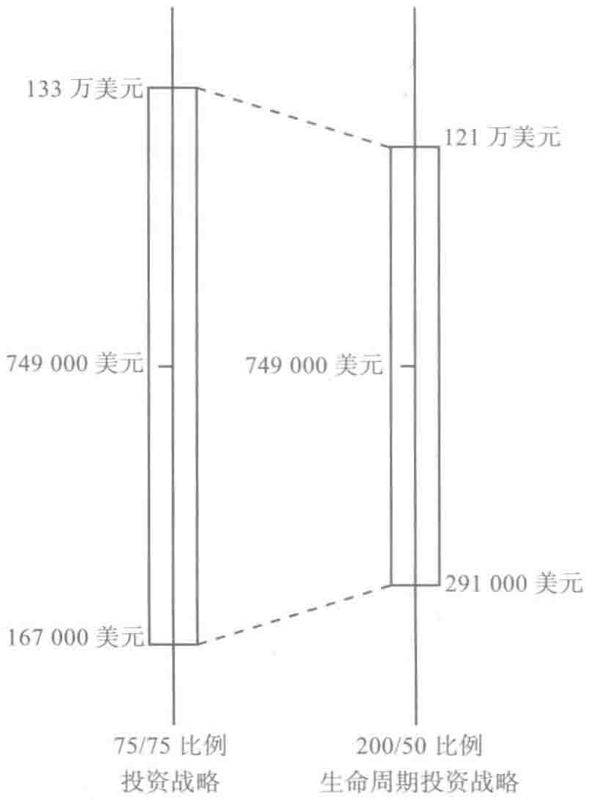
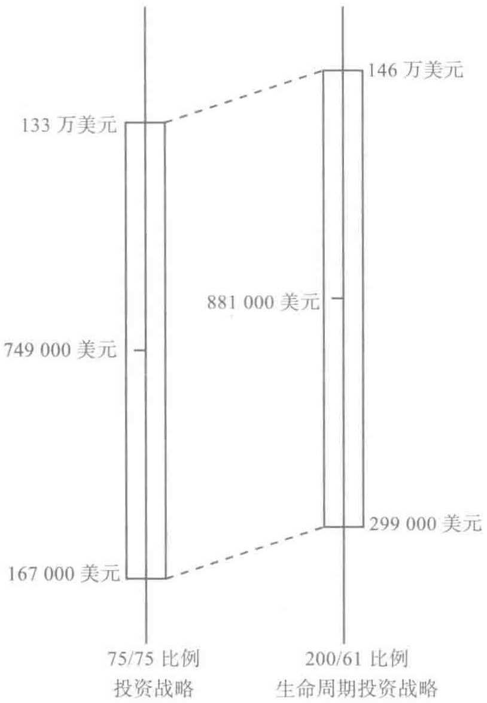
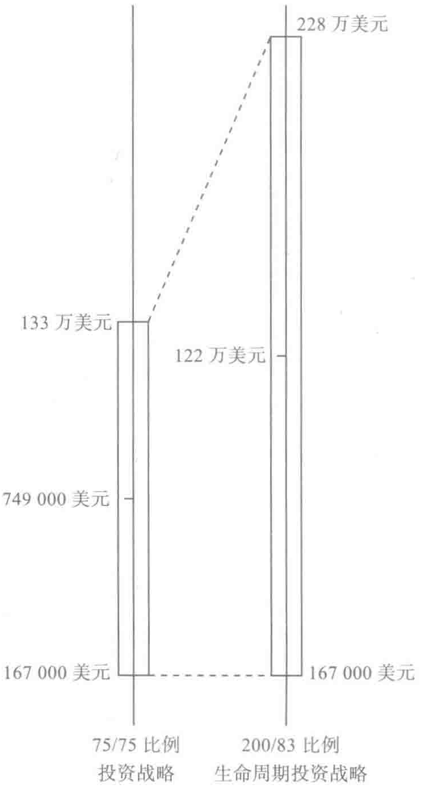
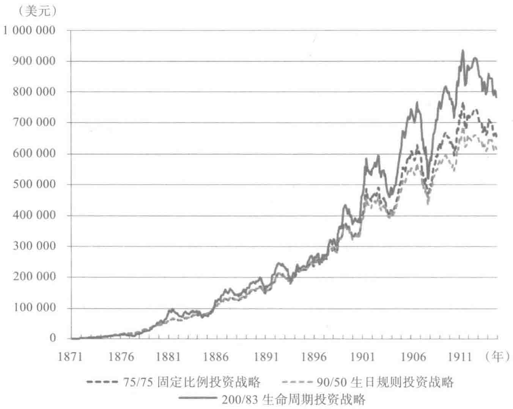
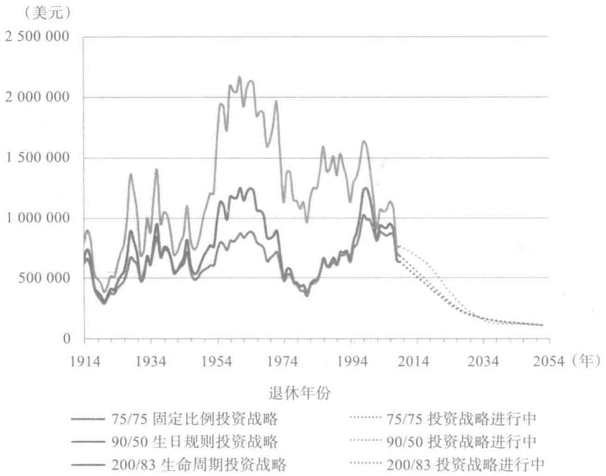
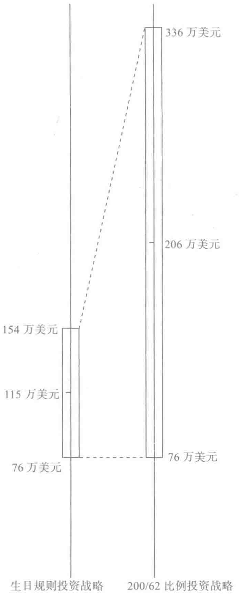

# 历史表现

理论说得通还不够，要说服大家接受这个观点，即分散时间投资战略真的能改变我们的人生，我们得先证明，使用生命周期投资战略本可以帮助投资者在过去获得更好的投资回报。权且让大家设想一下：本书早在1871年就成稿，从那个时候起，就有人遵照我们的建议进行投资了。那么到现在，他们取得了怎样的回报呢？我们可以看一看那些可能采用了我们投资建议的96位不同时间退休的人（我们暂时称他们为生命周期投资战略的忠实拥护者）的投资光景，分析他们退休后有多少资产。[^1] 我们会单独分析每一个投资者的案例，包括投资表现处于平均水平、最好的10%、最差的10%以及最糟糕的情况。如若我们能证明，使用了生命周期投资战略，即使面对最糟糕的投资环境，依然能取得更好的投资回报，大家就会相信生命周期投资战略能保证在降低风险的同时获得较高的投资回报。

我们一开始分析了1871年至2009年年中[^2]美国股市的情况。如果你认为过去138年美国股市的情况很不正常，那么我们会重新进行计算。结果表明，即使在股价总体上升幅度很小的情况下，生命周期投资战略也具备优势。虽然美国股市的情况可能是统计学的个例，但是分散时间投资战略的优势不是巧合。我们还会用伦敦和东京股票交易所股票的历史表现证

明生命周期投资战略同样适用于各类股市的投资。

为了证明生命周期投资战略的价值，我们对三种不同类型投资战略的业绩进行了比较。

> （1）固定比例投资战略；

> （2）目标日期投资战略；

> （3）杠杆生命周期投资战略。

先来看看第一种，也就是最传统的固定比例投资战略（constant percentage rule）：75%的存款投资股票，剩余的25%投资政府债券。这听起来很简单，而且我们很多人都是这样处理我们退休金账户上的资产的。大家拿出存款的一部分投资各种共同基金或者债券，然后就听之任之。不思进取实乃投资大忌，但这种固定比例投资战略的惯性力量非常强大。

当然，不同的投资者使用的比例不同。按照传统的标准来看75：25的分配比例还是比较激进的。大部人倾向于在股票和债券之间进行六四开分配。我们主要说明75：25的投资分配比例的情况，主要是因为这个在大部分人眼里已经非常激进的投资比例其实最大的缺陷在于它投资股票的比例远远不够（六四开的投资分配比例差的就更多了）。

第二种是最近比较被看好的投资战略：目标日期投资战略（target-date rule）。这种投资战略很多金融服务机构都使用，只不过是变了点花样而已，包括富达（Fidelity）和先锋等。这些基金按照投资者的年龄分配资产。23岁的时候，90% 的资产投资股票；随着投资者年龄的增长，逐渐减少股票投资的比例。一直到投资者65岁的时候，股票投资比例降至 50% 。目标日期投资战略无非是生日规则投资战略（birthday rule）的一个别名罢了。投资股票的比例大约等于110与投资者的年龄差。目标日期基金将比例调整的过程自动化，按照年龄和近期的股票走势来重新调整资产投资比例耗

时耗力，因此这种方法简单易行。你只要购买了这种类型的投资项目，后面就不用去管结果如何了。这样看来，这种投资战略的确很省心。但问题是这些投资组合比例与优化的动态投资战略根本无法相比，而且很多这种类型的基金收费都很高。我们暂时忽略费用的因素，假设投资者不需要为这些基金缴纳费用。这样我们就能跳过费用，集中说明这种方法所具备的劣势。

第三种与众不同的投资战略是杠杆生命周期投资战略（leveraged lifecycle strategy）。这是一种分散投资战略，旨在利用终生财富现值固定的萨缪尔森份额来投资股票。本书第2章强调过，"生命周期"（lifetime）这个词凸显了分散时间投资的优势。投资分配并不是建立在你现有的存款基础之上，而是根据你未来储蓄的现值。我们将资产投资分配的目标标记为"目标"百分比，是因为早年刚开始投资的时候，即使使用了杠杆，投资者也未必有足够的资金来实现自己的投资目标，但他们依然要朝着这个目标挺进。

为了初步证明这个战略的效益，我们可以设想投资者选择了相对保守的萨缪尔森份额战略——50%的比例，即将终生财富的50%投资于股市。由于50%的终生财富要比绝大多数人刚起步时的存款高很多，所以人们必须使用杠杆或者保证金投资股票。我们可以先尝试使用2 : 1的杠杆进行投资。在实际操作中，投资者一开始处在生命周期投资的第一阶段，将现有存款的200%投资于股票。随着年龄的增大，他慢慢地不再依赖杠杆进行交易，最终在退休前将50%的终生财富投资于股票。

简言之，我们以投资生涯之初和最终投资生涯结束时投资股票的比例来区分股票投资战略。固定比例投资战略一开始和最终投资股票的比例分别是75%和75%，简称75/75比例投资战略。目标日期投资战略一开始和

最终投资股票的比例分别是 90% 和 50%，简称 90/50 投资战略。我们提倡的生命周期投资战略一开始和最终投资股票的比例分别是 200% 和 50%，简称 200/50 投资战略。[^3]

为了更明确地对照三种投资战略的利弊，我们假设其他条件都相同，只有投资战略不同。我们的模范投资者——某女士每年将收入的 4% 存起来，这笔钱到退休的时候可以达到 10 万美元。[^4] 在她一生中，总存款达到了 194 573 美元。存款总额对于退休金账户的账面余额举足轻重，但对我们的分析结果没有太大的影响。如果投资者每年存款的额度是这个数额的两倍，甚至是 10 倍，那么退休后的存款额将翻倍或者翻十倍。只是这和投资者究竟使用什么战略没有太大关联。也就是说，这三种投资战略的优劣排名并不随着投资金额的大小而发生改变。

## 众里寻他千百度：200/50 比例投资战略

比较一下 75/75 比例投资战略和分散时间 200/50 比例投资战略的历史表现，我们的分析有了新的突破。在撰写本书前，没有人曾想过在刚开始工作的十年时间里以 2 : 1 的杠杆比例来投资，然后逐渐降低股票投资的比例直到 50% 为止的投资战略比用 75% 的存款投资股票，用剩余 25% 的存款投资政府债券的传统投资战略更可靠。我们习惯了认定杠杆投资本身风险高，一般的投资顾问都会让你对杠杆投资敬而远之。

我们一开始把杠杆投资的结果在耶鲁大学展示的时候，我们的同事 [也是《雇员退休收入保障法案》（ERISA）的专家]——精明的约翰·朗本（John

Langbein）根本不相信这种投资战略。他认为之所以取得这些结果完全是因为杠杆投资战略激进而不计后果，运气好罢了。这完全不是分散投资的优势。

这种担心自有其道理。激进的投资办法往往不至于让你获得最差的投资回报。股票市场的回报远远高于债券市场，只要有钱就往股市里投资，就能保证你稳操胜算。只要你有能力在股市中投足够的钱，你总会有机会的翻本。这就是为什么传统的股票投资战略，如生日规则投资战略（75/75比例投资战略）往往会比那些单纯投资债券的人获得更高的回报。债券的流动性较低，因其平均回报太低，也注定赚不了大钱。朗本认为我们使用杠杆投资战略能胜出也是因为这个原因。

乍一看200/50比例投资战略比75/75比例投资战略更加激进。总体而言，在生命周期/分散时间投资战略中，股票投资比例超过常数75%的年数较多。但是在一开始杠杆投资的几年时间里，由于存款基数很少，因此投资风险较小。实际上，这两种投资战略都很前卫，从历史上来看，它们产生了相同的平均回报。我们持有固定存款的时候（从理论上来讲，某个人在退休前一直保持10万美元的薪水），将这两种投资战略套在96个生命周期里，并计算其回报，我们会发现，两种投资战略都能产生相同的平均退休账户余额749 000美元。

当我们开始比较回报的分布情况时，让人大跌眼镜的现象出现了。我们发现200/50比例投资战略降低了高达20%多的风险水平。在96个不同的历史模拟情境中，其标准方差比传统的75/75比例投资战略的标准方差要小21.4%。

根据以往市场波动的情况来看，有99%的概率固定的75/75比例投资战略会让你获得至少167 000美元的投资结果。①你能获得低于133万美元

回报的概率也接近 99%。在图 3-1 左边你能查看这个范围。按照 200/50 比例投资战略，你依然能获得平均为 749 000 美元的投资回报，但是波动的范围从减少至 291 000 美元至 121 万美元这个区间。

*图 3-1 回报相同，风险更低*

当我们分析这个图像时，我们知道自己已经发现了一种很管用的投资战略。分散时间投资战略能够降低风险，不是因为它投资股票的资金更多。其实，这两种投资战略要获得相同的投资结果，必须得有相同的股市敞口。应用了分散时间投资战略，同样的总市场敞口花了更多的时间来实现，所以它能降低风险。因此，能否获得更好的投资结果，并不取决于股票到底

比债券的表现好了多少，而纯粹是因为分散时间投资起了作用。分散时间投资能降低风险，这恰恰是我们获得更好的投资结果的关键因素。现在我们先暂停一下，来打消人们可能存在的疑虑。普遍存在一种误解：只要你能在更长的时间里投资，你就能大大减少面临的风险。这就像是在说每40年投资1000美元要比每30年投资1000美元的风险更小。其实不然，风险和收益应该随着投资金额的上升而上升。

我们提倡的生命周期投资战略好，不是因为它的投资分配比例更激进。生命周期投资战略和传统投资战略所获得的投资回报均值是一样的。按照75/75比例投资战略，我们的投资总额主要是在20年内完成的；而使用杠杆投资战略，同样的投资敞口分散在更长的投资期限内实现，即按照200/50比例的生命周期投资战略投资，由于实现了分散时间投资，因而降低了风险。

## 风险更低抑或回报更高

现在你可能在想虽然可以降低20%的风险，但是这样做未必值得。我们有必要看看分散投资的收益。投资向来要从风险和回报两个角度去看。200/50比例投资战略的目标是在保持既定的回报前提下，充分利用分散投资的优势，与此同时降低风险。但是我们也有可能走向另一个极端：即在保持既定的风险水平前提下，充分利用分散投资的优势来创造更高的回报。在本节最后，我们会向大家展示这种方法，并证明能大大提升投资的回报。

按照75/75比例投资战略的规则，你有大约583 000美元的投资敞口。我们也可以在保证这个投资敞口的前提下，获得更高的均值。除了使用更好的分散投资战略来降低市场波动外，你也可以在保持市场波动幅度的情况下，获得更高的市场敞口。

200/61 比例生命周期投资战略能够带来大约 583 000 美元的投资敞口。按照 200/61 的规则投资，你能将平均回报从 749 000 美元提升到 881 000 美元。可以说，你已经超额获得了 132 000 美元的回报，增幅高达 18%。因此，你也有更好的条件去冒险。

200/61 比例生命周期投资战略的表现不仅仅停留在平均回报较好或者大体不错这个水准上。每一次投资表现都比传统投资战略高出 132 000 美元，这就表明无论你对风险持怎样的态度，你会一直偏好图 3-2 右边的投资战略。

*图 3-2 绝对风险相同，回报更高*

不要去想收益或者损失的绝对值，一定要从最终积累财富总额的角度去衡量风险。新的投资战略和你利用75/75比例投资战略的风险差不多，但是投资回报从美元直接换成了欧元。一般情况下，你能获得749 000欧元；最差的情况是167 000欧元，而最好的情况是133万欧元。这样一看，你就能很轻易分出孰优孰劣了。欧元的面值要比美元高出40%，可以说你比一般的投资者高明了40%。

如果采用200/75比例生命周期投资战略就好像让你的投资回报变换了货币单位，从美元转到欧元，甚至更好。你可以提升45%的预期回报，超额回报的总价值高达109万美元，而投资回报的波动范围却保持不变。按照75/75比例投资战略进行投资，你可能会遭遇财富78%的投资回报振幅。最差的情况是167 000美元，比平均财富总额749 000美元低78%；最好的情况是财富总额比平均水平高78%。按照200/75比例投资战略进行投资，投资回报的振幅同样是78%，只是最差的情况是获得109万美元，而不是749 000美元。虽然从百分比变化的角度来看风险是一样的，但是利用200/75比例投资战略，即使面临最糟糕的状况，所获得的投资回报依然比普通投资战略所获得的投资回报高出45%。

如果你愿意接受小概率投资前景不好的情况，就能获得更高的最佳表现。我们假设你有1%的概率碰到最糟糕的情况。按照75/75比例投资战略，最差的情况是获得167 000美元的账户余额。如果你能接受这样最差的情况，你就能进一步提升你的预期回报。

能接受1%最糟糕的情况，届时所得的投资账户余额是167 000美元，这也是采用200/83比例生命周期投资战略碰到的最不理想的投资情况。可以说，75/75比例投资战略和200/83比例生命周期投资战略最糟糕的起点是一样的。使用200/83比例生命周期投资战略，平均水平下你能获得122

万美元，这比使用固定的75/75比例投资战略所获得的回报高出了63%（与

生日规则投资战略相比，投资表现高出了90%）。简言之，这样的差异可以让你过两次退休后的生活了。

200/83比例生命周期投资战略为我们构建了利用分散时间投资获得更高回报的渠道。虽然一开始大部分结果看起来都很惨淡，但是投资最好的回报水平大大提升了。新的平均回报看来非常乐观，有90%的概率能够击败使用75/75比例投资战略获得的749 000美元的平均回报。而最差的回报依然是167 000美元，这和75/75比例投资战略相同，如图3-3所示。

## 用投资回报率说话

> 对市场波动率进行估计有其

*图3-3 最糟投资情况相同的投资战略所获得的回报比较*

局限，其前提是股票投资回报呈现正态分布。但在现实中，股票投资并非如此。认定股票投资呈现正态分布这样的假设有多重目的，也并非是不着边际的估计。但对于如何投资，如何管理退休账户余额的问题，我们一定

要深入挖掘，逐个分析不同的案例，逐年排查，从而发现如果过去有人按照这种方法投资，他们最终的投资表现如何。鉴于此，我们对过去96年间出生的投资者的情况进行了分析。

我们先看看扎卡里，他于1848年出生（以美国总统扎卡里·泰勒命名，当年泰勒当选美国总统）。扎卡里可能在1871年开始工作，当时他23岁，然后44年后退休，即在1914年年末他快到67岁的时候退休。如果扎卡里按照90/50的目标日期战略来投资，他拥有的194 573美元存款将增值至623 630美元。还不错。但是这个数字本身并不能说明问题。我们要比较一下不同投资战略的结果。

对当前存款的75%进行投资，这样做投资回报更好，可以将其财富总额增值至667 171美元。当然如果使用200/83比例投资战略，结果就更好了。到他1914年退休的时候，他已经有798 481美元的财富总额。

为什么我们的投资战略比其他投资战略要好那么多？我们可以逐年分析一下这三种投资战略的表现。如图3-4所示，扎卡里并没有一开始就依靠杠杆投资。从1873年到1879年，200/83比例投资战略的效果没有传统投资战略的效果好。但是扎卡里在19世纪70年代末就懂得如何使用200/83比例投资战略这样前卫的投资战略，他当时正年轻，完全可以使用杠杆投资。1879年，股市收益率高达49%，1880年又增加了27%。这样的行情亘古未有。由于扎卡里采取了杠杆投资方式，他可以在这些年里分别获得101%和49%的年收益。②杠杆投资组合的增长足以克服1893年股市暴跌19%所造成的恐慌。截至此刻，扎卡里已经45岁了。他的投资组合的杠杆比例不高（股票投资杠杆比率为113%），所以在这一年股市暴跌

的时候，他的投资组合价值缩水了22%。就算考虑了他此前支付的保证金利息，因为他是借钱去投资股票的，200/83比例投资战略比传统的两种投资战略都创造了更高的财富。[^5]

*图3-4 1871～1914年使用不同投资战略扎卡里的存款总额*

扎卡里的经历并不是特例。2009年年底退休的人，在经历了2008年股市的黑暗之后，会有怎样的投资情况呢？这个人大概在1943年年初出

生，我们称她为埃莉诺，其他的情况与扎卡里的类似。我们可以假设埃莉诺于1966年也就是23岁的时候工作，每年的存款额度和扎卡里一样。如果埃莉诺遵循传统的90/50目标日期投资战略，她退休的时候账户有683 699美元。如果使用75/75比例投资战略，她可以获得634 559美元。当然，如果使用200/83比例投资战略，她会存下766 454美元。

埃莉诺一开始投资的时候很不顺。1966年当股市下跌6.4%之后，她的杠杆投资组合价值下跌了17.4%。1987年10月，她的投资组合再次遭遇了重创，因为股市一个月的跌幅超过了12%。那个时候，埃莉诺已经44岁了，股市投资的杠杆比例是1.23。虽然那一年10月的投资回报是-15.3%，但1987年整年的投资看来还不算太差，整个投资组合只下降了5.1%。20世纪90年代的时候，事情发生了转折。这个时期她的投资组合价值翻了四倍。即使经历了2008年金融危机，股市暴跌了36.6%，埃莉诺利用我们的分散时间投资战略获得了比使用75/75目标日期投资战略多了21%的回报，比使用生日规则投资战略所得的回报高出了12%。

基于这样的分析，我们发现一切都很不错。但是怀疑论者会认为我们是精挑细选了少数个例来忽悠人们。投资者的生命投资周期很有可能是介于扎卡里和埃莉诺之间的。我们认为用表格对照更加清楚。表3-1总结了我们发现的信息，可以说这是本书最重要的表格。它对比了在我们讨论的96年时间里出生的投资者（包括扎卡里和埃莉诺）使用三种投资战略所获得的不同财富总额。唯一的区别在于这96位投资者是在不同的46年时间获得股票投资回报的。扎卡里于 \(1871\sim 1914\) 年投资股票。我们也为那些在 \(1872\sim 1915\) 年投资股票的投资者进行了财富总额的计算。依此类推，一直到埃莉诺的年纪，她是在 \(1966\sim 2009\) 年投资股票市场的。

> 表 3-1 从 1871 年至 2009 年 96 位不同投资者累计投资的结果

|  | 生日规则投资战略 | 固定比例投资战略 | 分散生命周期投资战略 | 超越生日规则投资战略的百分比 | 超越固定比例投资战略的百分比 |
| --- | --- | --- | --- | --- | --- |
| 最高投资比例 | 90 | 75 | 200 |  |  |
| 最低投资比例 | 50 | 75 | 83 |  |  |
| 平均结果 | 646 575 美元 | 748 839 美元 | 1 223 105 美元 | 89.2% | 63.3% |
| 最小结果 | 290 310 美元 | 308 726 美元 | 387 172 美元 | 33.4% | 25.4% |
| 第10百分位 | 416 253 美元 | 449 266 美元 | 701 834 美元 | 68.6% | 56.2% |
| 第25百分位 | 539 343 美元 | 561 032 美元 | 884 138 美元 | 63.9% | 57.6% |
| 中值 | 641 555 美元 | 691 427 美元 | 1 146 812 美元 | 78.8% | 65.9% |
| 第75百分位 | 779 044 美元 | 922 028 美元 | 1 522 653 美元 | 95.5% | 65.1% |
| 第90百分位 | 870 921 美元 | 1 152 276 美元 | 1 929 577 美元 | 121.6% | 67.5% |
| 最大结果 | 1 026 903 美元 | 1 252 684 美元 | 2 177 424 美元 | 112.0% | 73.8% |

三种投资战略一比较，显然新的投资战略完胜传统的投资战略。

我们首先来看一下传统的（90/50）目标日期投资战略。该投资战略的平均回报是64万美元。当然，我们这里提到的96位投资者，每个人都出生在不同的年份，他们的投资回报各不相同。这种投资办法最糟糕的结果是出生于1854年、投资生涯在1877～1920年的人。这个投资者（我们就在这里称之为皮尔斯，以富兰克林·皮尔斯总统命名）在投资前景最好的19世纪70年代积蓄很少，根本没法投资。然后在1893年股市震荡的时候又遭受巨大损失，由于这一年他把大部分的个人存款转移到了债券上，所以他也没有从股市的恢复中获益。采用90/50投资战略获得最佳回报的投资者是赫伯特（以赫伯特·胡佛总统命名），这位投资者于1932年出生，投资区间从1955年延续到1998年。这位投资者获得了较高的投资回报，主要归功于20世纪90年代的经济复苏。遗憾的是，90/50比例投资战略没法让他充分利用股市回升的好处，因为投资组合中股票的比例太小。如

果赫伯特遵照了我们提出的 200/83 比例投资战略，他的投资将获得更好的回报，具体而言要高出 59.6%。

这张表格比较了三种投资战略的投资回报分布情况。就扎卡里和埃莉诺的情况来看，很明显，我们可以知道 75/75 比例投资战略要比 90/50 比例投资战略产生更高的投资回报，而 200/83 比例投资战略所带来的投资回报远远超出了前面两种战略。利用杠杆投资的 200/83 比例投资战略所获得的回报几乎是生日规则投资战略的两倍，比 75/75 比例投资战略获得的投资回报高出 60%。

如果你在传统的目标日期基金中投资了好几年，这张表格的结果应该会让你赶紧停止目前的投资。我们的投资战略比生日规则投资战略高明很多，因为 200/83 比例投资战略能获得的平均回报（122 万美元）要比 90/50 比例投资战略在 96 年时间里所取得的最高投资回报（103 万美元）还要高出很多。

利用我们提出的战略来获得较高的回报本身可操作性强，并不复杂。我们从金融经济学中学到的第一课就是风险和回报并存。我们认定杠杆投资战略能够产生更高的平均投资回报。但是如果碰到投资前景很糟的情况，我们该怎么办？利用杠杆进行投资的投资者中有多少人是靠吃猫食来度过凄凉的晚年的？

分析一下这三种投资战略能给投资者带来的累积财富的最小值。生日规则投资战略能积累的最低财富总额是 290 000 美元。有了杠杆作用以后，200/83 比例投资战略的最低总投资回报（387 000 美元）也要比生日规则投资战略高出 33%，比 75/75 固定比例投资战略的高出 25%。位于最底部的 10% 和 25% 投资者投资回报的逆袭结果更加喜人。使用 200/83 比例投资战略所获得的累计存款第 10 百分位的水平要比使用 90/50 比例投资战略

对应水平高出 69%，比使用 75/75 比例投资战略对应水平高出 56%。（使用 200/83 比例投资战略所获得的累计存款第 75 百分位的水平要比使用 90/50 比例投资战略对应水平高出 64%，比使用 75/75 比例投资战略对应水平高出 58%。）

简言之，面临最糟糕的情况时，使用杠杆投资战略要比使用上述两种传统投资战略获得更好的投资回报，杠杆投资战略所获得平均投资回报也更高，当然，投资前景好的时候所获得的投资回报也是毫无悬念地位居榜首。对于在 1918～1961 年利用分散时间生命周期投资战略所产生的回报，去除了通货膨胀的因素后，可以获得不菲的 218 万美元的回报。这相当于利用生日规则投资战略获得的最高投资回报的两倍，几乎是利用 75/75 固定比例投资战略所获得的最高回报的 \(75\%\) 。这样的投资战略我们有什么理由拒绝呢？

## 大萧条

有人可能会想，我们会不会算错了。那些刚好在大萧条之后退休的倒霉鬼碰到了怎样的情况呢？ 1929 年、1930 年和 1931 年标准普尔 500 指数的回报分别是 \(-9.5\%\) 、 \(-22.7\%\) 和 \(-44.2\%\) 。为什么杠杆投资战略没有让这些在 1932 年后退休的投资者遭遇劫难呢？大萧条后刚退休的人没有深受这次金融大崩盘的打击，是因为我们所说的杠杆投资战略只在投资者刚开始工作的几年里用杠杆投资。比如，1932 年退休的人按照 200/83 比例投资战略投资，当年市值下跌幅度超过 1/3 的时候，他投资在股市的资产比例是 \(83\%\) 。因为在 20 世纪 20 年代经济崛起的时候，这个投资者取得了巨额的回报，那么即使经历了大萧条的市场暴跌，他们在退休的时候账面上依

然有 729 487 美元，这比利用绝大多数人眼里更加传统的 90/50 比例投资战略所获得平均回报水平要高。相比同期生日规则投资战略取得的累积回报，200/83 比例投资战略获得回报要高出 32%。

在大萧条发生前刚入职工作的人，利用杠杆投资战略获得的回报将更好。那些在 1931 年之前刚工作的人，在入职后的一两年里就经历了初始投资额 73% 的跌幅。要记住，他们一开始的投资总额并不高，这是幸运的地方。当这些投资者在 1974 年底退休的时候，他们将有 1 133 421 美元的积蓄，这比其他两种投资战略所获得的总回报要高出很多。[^6]

我们的杠杆投资战略使投资者在较长的期限里使用杠杆投资，从而能够很好地弥补投资初期投资者遭遇的损失。要知道 200/83 比例投资战略的目标是用当前和未来财富现值的 83% 投资于股市。如果市场损失减少了当前投资组合的价值，在不用保证金贷款购买股票的前提下，需要花费更久的时间使用杠杆投资才能达到 83% 的目标。相比传统的投资战略，杠杆投资战略更加灵活，更加依赖于先前的回报。使用目标日期或者固定比例投资战略，我们可以提前在我们人生的每个阶段来安排股票的分配。利用生命周期投资战略，使用杠杆投资的期限到底有多长主要取决于市场的总体表现。

在使用杠杆投资战略模拟的过程中，一般投资者要在工作的前 12.8 年里全面使用 2 : 1 的比例进行杠杆投资。在接下来 14.2 年时间里要使用较

低比例的杠杆进行投资，直到这些投资者过完50岁的生日。在工作生涯的最后17年时间里，投资者可以直接投资，不使用杠杆投资。也就是说，在最后的一个阶段里，我们的投资战略才看起来更加接近传统的投资战略。投资者要将当前的存款分别投资股票和政府债券。由于杠杆投资战略得益于过去的回报，有些投资者会花费更长的时间来进行杠杆投资。实际上，有些投资者在56岁之前一直保持了一定比例的杠杆进行投资。

拿亚伯拉罕的投资经历举例说明。他于1863年出生（以林肯的名字命名），投资期限从1886年起至1929年止。亚伯拉罕36岁的时候，他将当前存款的 176% 投资于股票。1899年菲律宾和美国之间爆发战争，股市的情况一直不妙。1899年11月美国标准普尔500指数下跌了 6.5%（包括了收益）。按照我们的投资战略，亚伯拉罕在12月的时候将投资股票的比例增加到 189%（杠杆比例增加是为了在使用生命周期投资战略时，能保证固定比例的资产投资股票）。与此形成强烈的对照，1929年10月股市崩盘的时候，200/83比例投资战略并没有引导亚伯拉罕在退休前提升自己投资股票的比例。这实属明智之举。股市大崩盘的时候正值亚伯拉罕退休，他使用 83% 的个人财富去投资股票，其实就是拿手头 83% 的现金去投资。

这样的投资战略使得投资者在市场下跌后，自身还能在分散时间投资的时候承担更多的风险，而在他们快退休的时候，减少自身在股票市场的投资。亚伯拉罕在1929年市场大崩盘后退休，他非常不幸。但是我们的杠杆投资战略让他在市场的风暴中尽情驰骋。年轻时市场大跌后，他可以比较激进地投资，借此构建相当数量的投资组合，随着年龄的增长，逐渐减少风险。亚伯拉罕在市场大崩盘后的几个月内退休，错过了1930年年初市场反弹的机会。当然，由于在亚伯拉罕中年的时候，他充分利用了杠杆投

资战略带来的好处，因此能很好地度过这次市场大跌的局面，并在退休的时候，除去通货膨胀的因素，依然保有 1 231 861 美元的财富。由于亚伯拉罕的投资生涯一开始和快结束的时候都遭遇了市场大崩盘的局面，他使用杠杆战略投资比所有使用 90/50 投资战略的投资者获得的回报都多，打败了大部分使用 75/75 比例投资战略的投资者。

这里的例子告诉我们确定使用杠杆投资战略期限的办法。年长一点的投资者能够在市场整体下跌的时候免除损失，因为他们在退休前 10 年或者 15 年时间里投资的时候完全没有使用杠杆比例。年轻的投资者能从市场大跌的情况中迅速恢复过来，因为他们来日方长。持续多年利用杠杆投资战略并不是一个提升风险、朝不保夕的投资战略，相反，这是将个人当前和未来财富总额的特定固定比例投资股市的分散投资，在个人漫长的投资生涯里实现分散时间投资战略，一开始遭遇损失，而后扳回局势，在整个投资生涯中取得总体较高的回报。

## 杠杆投资的优越性

表 3-1 展示了使用 200/83 比例投资战略能比传统的投资战略产生更高的回报均值、回报中值、回报最大值和最小值。表中在长达 96 年时间里不同年份出生的投资者中，使用 90/50 或者 75/75 比例投资战略的投资者都不可能获得比使用杠杆投资战略更高的回报。这就是我们需要的最好证据。这也就是我们能如此理直气壮地应用杠杆投资战略的原因。大家也看到了我们并非挑选了有利于我们说明问题的个例来论证我们提出的投资战略的有效性。

> 图 3-5 展示了三种投资战略在投资者退休当年的财富情况。

*图 3-5 三种投资战略的比较（投资结果和投资过程）*

扎卡里的投资结果列在图 3-5 的最左边，他是在 1914 年退休的。我们可以看到使用 200/83 比例投资战略后，他退休时获得了 798 481 美元的总财富，远远超过了使用传统投资战略所获得的回报。这个数据表明，无论用三种投资战略中的哪一种，1920 年年末退休的工人所获得的财富总额绝对值都是最低的（290 310～387 172 美元）。对这些投资者而言，在 1893 年、1903 年、1907 年、1917 年和 1920 年遭遇两位数市场下跌的情况时，他们受到的损失有限，小于其他投资者在 1933 年市场大崩盘时遭受的损失。

生命周期投资战略比 75/75 比例投资战略优越，但在 2002 年即将退休的投资者对此有所保留。在这一年使用杠杆比例进行投资的相对优势显得

最小，股市连续三年下跌（2000年下跌5.2%；2001年下跌13.5%；2002年下跌20.1%），之后没多久，这些投资者就要退休了。这些年市场总体不景气使得投资者在退休前最后几年遭遇巨大损失，相比固定比例投资战略和目标日期投资战略，生命周期投资战略依然带来了最大的回报，只是最后几年的损失减小了利用生命周期投资战略获得更多总回报的幅度。我们对照一下生命周期投资战略和目标日期投资战略，在2008年，两种投资战略的投资回报最接近。生命周期投资战略获得的回报比后者多了6.2%。目标日期基金的优势是在2008年的时候市场敞口较小，但是这不足以弥补投资者在之前几年时间里敞口较小、回报有限的劣势。

图3-5显示了未来退休的投资者利用不同的投资计划，考虑未来存款现值后所获得的投资回报。我们现在还无法确定2015年退休的人将获得多少存款，因为我们不知道未来几年股市的表现，也就无法预测这些投资者在最后几年投资生涯里所获得的回报。但是我们可以肯定的是到目前为止投资组合的回报。比如，我们来看一下1954年出生的投资者艾克（以艾森豪威尔的名字命名），他于1977年开始投资，2020年退休。2009年年底，艾克使用90/50比例投资战略，他的投资组合价值为400 291美元，若使用75/75比例投资战略，投资组合的价值会更少一些，具体为373 388美元。如果他使用生命周期投资战略，他将获得529 692美元，即比传统投资战略的回报高出42%。所以，即使只有33年的投资时间，我们也可以断定艾克因为使用分散时间投资战略获得了更高的回报。

生命周期投资战略的优越性同样在那些离退休尚早的投资者的投资实践中得以体现。诚然，在图3-5中，我们可以看出任何投资时间超过20年的投资者使用杠杆投资战略比传统的投资战略表现更佳，而对于年龄小于40岁的投资者而言，这种投资战略的优势没有显现。这很正常。因为对

于那些在2043年退休的年轻人而言，他们现在投资的时间只有10年，他们还没有充分的时间来分散风险。一开始就使用杠杆投资战略，并遭遇了2008年罕见的金融危机的投资者，如果他们一开始使用生日规则投资战略将获得更高的回报。按照短期投资的回报来确定长期投资的方法是完全错误、愚蠢的，但是犯这种错误的人很多。我们可以看到，扎卡里和埃莉诺前面几年的投资回报都不好，后来才变得越来越好。从总体情况而言，按照对股市过去138年的表现分析，我们可以证明一点：无论投资者出生于哪一年，生命周期投资/分散时间投资战略将比传统的投资战略获得更多的回报。

使用 200/83 比例投资战略获得的优势很明显。表 3-1 强调了使用生命周期投资战略进行投资的回报均值、中值、最大值和最小值均高于使用传统投资战略获得的对应值，我们有必要清楚地阐释这些超额的投资回报对我们人生的影响。分散时间投资战略的回报比生日规则投资战略的回报高一倍，这表明我们快退休的时候，账户的余额是使用传统投资战略所得余额的两倍。由此可见，你可以提前 6 年退休，且有相同的退休金。你不必等到 67 岁退休，你可以在 61 岁的时候就退休。[^7]

还有一点，你可以在工作的时候每年少存一点，但依然能获得相同的回报。也就是说，你不用像使用生日规则投资战略那样，每年将收入的7.5%用于投资，而是利用4%的收入进行投资，并可以获得相同的退休金存款。

当然，随着人均寿命的不断延长，你可能觉得要为晚年做好打算。在所有退休投资计划中，你觉得自己活到87岁就差不多了的想法会让我们很

多人晚上睡不着。如果你定期将自身收入的 \(4\%\) 存起来，当你在67岁退休时，使用200/83比例投资战略可以存够让自己活到114岁的钱。这一点千真万确。如果你将67岁预期存款的现值进行较为保守的投资（比如投资政府债券），也能存够支持自己度过退休后47年生活的钱，而使用生日规则投资战略，你的投资回报只够支持你活20年。生命周期投资战略能给我们带来47年的生活保障，这样做更加保险。

## 考虑社会保障金的影响

不管实际的投资表现如何，很多人依然认为200/83的投资分配比例过于激进。退休的时候要拿个人存款的 \(83\%\) 投资股市，这样的投资比例怎么可能不让人忧心呢？我们的理由是，使用了分散时间投资战略，从终生投资周期的角度来看，投资风险大大降低了。我们可以断言，即使临近退休时你的投资惨败，之前你所获得的高额投资回报足以让最后一年的投资结果变得微不足道。无论是1933年的大萧条，还是2008年的金融危机，都是如此。我们举例说明了在长达96年的期间里退休的每个投资者都有这样的保障。

虽然我们提出了200/83比例投资战略，但你不一定非得把个人存款总额 \(83\%\) 的份额投进股市。使用 \(83\%\) 的比例，我们并没有考虑社会保障金的情况。我们一直强调一定要着眼于将来能拥有的所有资产，包括现在和未来资产的现值，然后来确定投资股票和债券的比例。之前所谈的例子比较保守，没有考虑社会保障金这一部分，它毫无风险。分散时间投资战略说明你需要在退休前将未来获得收入的现值投放股市。可惜到目前为止，我们一直忽略了社会保障金的价值。随着退休日期的接近，社会保障金将

会成为我们巨大的一笔财富。

在投资模拟中，我们想象你在67岁退休，最后一年工作的收入是10万美元。在这种情况下，社会保障金是替代收入的 \(25\%\) 多一些（即\(26.8\%\)），而且这笔收入还会随着通胀率的变化而调整。如果你买入了一种能够提供此类收入的养老金，你可能需要花费大约507 000美元（计算的具体过程见本书第7章）。

这就好比在退休的时候，除了股票和债券投资外，你还拥有一份价值507 000美元的债券。按照200/83比例投资战略，你会用122万美元或者100万美元中 \(83\%\) 的份额投资于股市。如果考虑了社会保障金的要素，你的资产组合价值将达到172万美元。投资于股市的100万美元只是你真正财富总额的 \(58\%\)。我们忽略了资产组合中价值最高的债券——社会保障金，从而以更加保守的姿态进行了投资。收入水平越低，投资分配比例就会越保守。

在乔治·沃克·布什担任总统期间，人们对于是否该把社会保障金投资于股市曾发生过激烈的争论。现在你大可放宽心这样做，根本不需要改变法律。为了表明我们的想法，我们以一个年近60岁、67岁即将退休的人为例。假如他退休前的最终薪水是10万美元。他的社会保障金的现值是42万美元。为了说明问题，我们假设他的退休账户里有58万美元，其财富总额是100万美元。如果我们想要将 \(60\%\) 的社会保障金和定期缴存的养老金投资股市，就相当于把60万美元投资股市。只要他用58万美元，再用一点杠杆比例，就能轻易达到60万美元投资股市的目标。其实，我们的资金渠道多种多样，为了投资股市，无须动用社会保障金。

一开始投资的时候，我们就要把社会保障金计算在内。这才是正确的投资方法。哪怕是一个23岁的年轻人，他要投资，就要考虑社会保障金的未来价值。

我们重新模拟了一组交易的情况，这一次使用的200/83比例投资战略与之前的投资战略类似，也需要一开始将存款的 \(200\%\) 投资股市，之后逐渐减少投资比例，然后在退休前，确保投资股市的比例是 \(83\%\) 。这次的投资战略不同点在于在设定股市投资比例为 \(62\%\) （萨缪尔森份额），这 \(62\%\) 的资金包括了现在和未来财富以及社会保障金的现值。我们没有用比较激进的 \(83\%\) ，而是使用较为保守的萨缪尔森份额（\(62\%\)）来精确计算。我们虽然只选择了 \(62\%\) 的比例，但加上社会保障金的财富组合，该比例对应的资产价值与之前不包括社会保障金的 \(83\%\) 投资比例所对应的投资股市额相等。

考虑了社会保障金的200/83投资战略与生日规则投资战略面临的损失风险一样（资产价值为760 000美元，包括社会保障金的价值）[^8]。当投资情况乐观的时候，获得的回报要高出很多，甚至比之前利用200/83比例投资战略所得的回报还要好。虽然考虑了社会保障金的200/83投资战略与先前没有考虑社会保障金的投资战略对于当前存款分配的比例相同，但是因为将更多的社会保障金用于投资股市，因此，投资股市的比例下降速度较慢。在中年的时候通过杠杆进行投资，为投资者带来了更多的回报。而今，在考虑了社会保障金后，最终获得的资产组合价值高达206万美元，几乎是利用生日规则投资战略（115万美元）或者固定比例投资战略（126万美

元）进行投资获得回报的两倍。多出来的投资回报部分源于社会保障金投资的回报。因此，如果我们分析一下退休时资产组合的价值，除去社会保障金，你的存款已经翻倍了。新的200/83比例投资战略带来的资产组合价值为155万美元，而用生日规则投资战略进行投资获得的资产组合价值为65万美元，用固定75/75比例投资战略进行投资获得的资产组合价值为75万美元。新的200/83比例投资战略是可行的。在退休前把部分社会保障金投资股市能够提高投资回报，让最终的资产组合价值翻倍甚至更高。这样一来，损失的风险不会增加，也不需要投资者每个月增加养老金的存款额度。

图 3-6 对比了两种投资战略所产生的回报。这一幅图与之前展示的图类似，只是考虑了社会保障金的投资。通过曲线的比较，我们选择哪一种投资战略就

*图 3-6 投资前景不好、回报更高的情况  
(考虑社会保障金)*

很清楚了。

当然，大家可以意会的就是社会保障金的未来价值。对于那些快要退休的投资者而言，尤其能依靠社会保障金投资来保持财富的增值。但是从长远看，社会保障金究竟有多少不得而知。我们会在本书第7章详细分析这个问题，届时会说明实现既定投资目标的概率主要取决于萨缪尔森份额。本书第4章的投资模拟没有考虑社会保障金，这是非常保险的做法。

## 结论

迄今为止，希望书中的数据能让大家相信生命周期投资战略的有效性。我们要阐明的是能改变你人生的新投资理念。只是这样的改变并不容易，需要你下定决心。当然，我们也已经向读者展示了如果只是保持现状，静观其变，也需要我们付出巨大的代价。投资事关重大，需要我们正确对待。

在后面几章里，我们提供了生命周期投资战略可行的实证。在高校工作的同事会督促我们为大家展现多种假设的情况。我们会向大家一一说明。大家会知道利用生命周期投资战略所获得的回报，并非只有在美国股市才能发生。就算将来股市投资的表现不好，甚至购买股票的成本提升，生命周期投资战略依然能够带来较好的回报。

虽然我们认为杠杆投资战略很适合大部分人使用，但并非所有人都能得心应手地应用这一战略。对于那些薪水或者职业本身与股市紧密相连的人，由于他们已经置身于股市，因此就没有必要增加股市投资的敞口了。比如，股票经纪人的薪水会在牛市时提升，在熊市时下降。在股票经纪人投资股票前，请阅读本书第6章的内容，确保本书所讲的生命周期投资战略适用于股票经纪人当下的情况。等你阅读完第7章和第8章的内容，大

家会进一步掌握投资的各个步骤。

我们知道读者肯定有很多问题。我们希望能在下文一一解答。你也可以根据现实调整模拟的情况，详见 www.lifecycleinvesting.net。

## 常见问题

问题一：正如大家所言，过去的表现无法保障未来的投资回报。我如何能肯定生命周期投资战略在将来也能奏效？

问题二：如果我现在利用杠杆投资，股票经纪人要求我追加保证金，投入更多的钱，但我没钱，是否会碰到这样的情况？

问题三：我认为保证金贷款成本很高。生命周期投资战略的投资结果难道不是以更低的借贷成本为前提的吗？

问题四：目标日期基金在2008年的投资表现不好。你的方法和目标日期基金方法相似，但是一开始投资股市的比例要高很多。这种投资战略有问题吗？

> 问题五：市场的时机如何判定？

问题一：正如大家所言，过去的表现无法保障未来的投资回报。我如何能肯定生命周期投资战略在将来也能奏效？

这个问题的解答倒能用得上各种理论。风险降低并非因为幸运或者是股本溢价（即股票回报超越债券回报的程度），而是因为股票敞口在更长的时间区间内分散了风险。你可以保持相同的市场敞口（按照股票历年累计投资总额计算），但由于在更长的时间内投资，回报的震荡减少，总体风险降低。

将资金分散投资到多种股票上，其中的道理是一样的。不要只投资一种或者几种股票，而是投资种类繁多的投资组合，就可以降低风险，最好投资股票指数。分散时间投资也有这种效果。

本章我们展现了股票投资的历史数据。但是过去的股票投资表现只是一部分数据。为了打消大家的疑虑，本书第4章将展现这样的投资结果不仅局限于美国股市。日本和英国的股市表现也会体现这种投资战略的好处。我们会进行蒙特卡罗模拟。我们随机选取44年的回报数据，按照模拟数据可以调整股本溢价。杠杆价值不仅取决于股本溢价或者牛市和熊市的历史模式。利用多种股票组合的回报来证明生命周期投资战略的优势，其中包括那些投资回报远远低于市场平均水平的股票。无论股本溢价的情况如何，更好地进行分散投资能降低风险。

问题二：如果我现在利用杠杆投资，股票经纪人要求我追加保证金，投入更多的钱，但我没钱，是否会碰到这样的情况？

我们先来谈一谈追加保证金是怎么回事。投资者有100美元的存款，借款100美元，这样就能持有200美元的股票，并保证投资者有钱还贷款。股票价值大幅度下跌会导致投资者追加保证金的发生。股票经纪人会打电话给你，限期24小时内给账户存储更多的现金，否则经纪人将抛售部分股票，保证投资者能够足额归还贷款。

各大股票交易市场规定利用杠杆进行投资的资产组合净值不得低于资产组合总价值的75%（包括保证金贷款）。用经纪人和股票交易所的行话来讲，这里有25%的保证金保有要求（margin maintenance requirement）。假设投资者持有200美元的股票，市场跌幅为33%，那么本来价值为200美元的股票净值跌到了133美元。那么资产组合的净值就下跌了33美元（133美元-100美元=33美元），这刚好是整个投资组合价值的25%（33

美元 /133 美元 =25%）。市场价值 33% 的跌幅引发了追加保证金的要求，对于绝大多数保证金投资者而言，这导致了他们被迫出售部分股票。

本章提及的表格和图都考虑了追加保证金的要求。不管中期回报如何，我们在每个月的开头就考虑了保证金贷款的需要。投资者会偿还贷款，并重新权衡投资组合，实现既定的杠杆投资目标。当然，由于月中股价下跌，也会有追加保证金的情况出现。但现实的数据表明，短暂的日回报下跌无法触发追加保证金的要求。1987年10月19日和1929年10月26日人称"黑色星期一"的这两天发生了史上最大的股票跌幅。鉴于我们在月初就要求了追加保证金，所以日股票回报意外的下跌也不再要求追加额外的保证金。事实上，最有可能发生追加保证金的时候，并不是某个股价下跌最厉害的一天，除去1931年9月30日——当时正值月末，连连发生的损失使得股票的资本价值下跌了31.5%。日股票回报意外下跌并不足以引发追加保证金，即使真的是因为当日股价下跌厉害，投资者只要重新调整一下投资组合即可。

利用生命周期投资战略进行投资，不会出现额外的追加保证金的要求，但我们要强调这一点，这仅限于杠杆比例为2：1的投资情况。如果你采用了较高的杠杆比例，你肯定要做好准备应对更多的追加保证金的要求，而这会限制分散投资获得的利益。追加保证金要求投资者通过抛售股票还款来去杠杆化。这自然会影响投资者利用杠杆比例进行分散时间投资的力度。一开始杠杆比例较高自然会提升你在股票市场的投资敞口，但这也会大大提升追加保证金的概率，从而将投资者踢出市场。投资者可能是马上出局，也有可能是在日后等到资产全部出售后出局。另外一个要素是借贷的成本会随着杠杆比例的提升而迅速增加。这很容易理解，因为贷款的风险更高了。事实上交易的成本已经大大超越了股票的预期投资。

如果追加保证金这件事情让你不安的话，本书第8章将介绍通过投资指数期货来实现杠杆投资组合（见第1章安德鲁·维斯坦的案例）。你会发现，这是实现杠杆投资经济安全的方式。因此我们有了双赢的投资局面，指数期货能为你省钱，还能减少追加保证金的概率。

问题三：我认为保证金贷款成本很高。生命周期投资战略的投资结果难道不是以更低的借贷成本为前提的吗？

使用杠杆比例进行投资完全取决于借贷成本。与传统的投资战略不同，分散时间投资要求投资者先贷款然后进行股票投资。借款的成本（保证金比率）很重要，因为你要对贷款支付利息。如果保证金比率过高，就不值得进行分散时间投资。利用 10% 的保证金比率来购买股票，获得 8% 的预期收入，这样做是得不偿失的。

人们认为保证金贷款成本较高，因为绝大多数股票经纪人都会索要高得离谱的费用。也许他们认定了利用短期投资散户是有利可图的，因为短线投资者通常不太留意利息率的高低。当我们开始撰写本书的时候，巴里发现他在富达基金持有少额保证金贷款就得支付高额的利息——10%。幸运的是互联网公司已经改变了这个规则。互动经纪人网站（InteractiveBrokers.com）于2009年7月以1.65%的利率提供保证金贷款。这个费率对投资者而言简直就是福音，也正确地反映了贷方所承受的资金风险较低。

本章的投资模拟假定投资者有能力按照银行向股票经纪人提供的保证金贷款利率（即保证金利率）来借款。从历史上来看，这个比率已经接近零风险的利率。而今，在线经纪公司可以提供成本很低的借贷产品。你可以通过借款来购买股票，而股票看涨期权的成本较低。第8章将详细介绍以较低的成本创造杠杆投资头寸的方法和指示。

问题四：目标日期基金在2008年的投资表现不好。你的方法和目标日期基金方法相似，但是一开始投资股市的比例要高很多。这种投资战略有问题吗？

2008年，退休时间为2010年的31种目标日期基金的平均投资回报下跌了25%。[^9] 这种情况应该不足为奇。目标日期基金可以说是共同基金和债券的合体。因此，如果2010年目标日期基金中有60%的资金投资于证券，但是国内股市下跌了36.6%（2008年就出现了收益分配后跌幅达到30%多的情况），那么目标日期基金平均回报下跌的幅度就是这个比例的60%，即22%。[^10] 因为这些基金中包含了很多国外的股票，这些股票的跌幅比美国股市的跌幅更大，外加这些股票投资调整资产结构的方式同美国投资者普遍采用的方法不同，目标日期基金的投资表现比22%跌幅还要差一些。

随着股市整体下跌的出现，目标日期基金中投资于股票的部分也下跌到少于60%的比例，这使得基金不得不购买更多的股票，由于股市跌势不止，这进一步增加了损失的程度。换言之，基金在不断买入，资产价值却在不断贬值。比如，当股市下跌了20%之后，在没有调整资产结构的前提下，基金中股票投资占比为54%。为了调整资产结构，基金只能继续购买股票，当股市继续下跌16.6%时，资产价值会进一步下跌1%。重新调整资产结构所产生的后果是，当股市下跌36.6%的时候，目标日期基金采用将60%的资产投资股市，那么它遭受的整体资产损失不是只有22%，而是23%。

在这样投资回报欠佳的状态下，基金还要向投资者收取管理费用，一般都超过2%（我们在本书前面几章讨论过，先锋收费的情况例外，在收益

率低于 0.2% 的时候，基金要收取 10% 的费用）。这样高额的费率进一步影响了目标日期基金投资总体的吸引力。

生命周期投资战略属于目标日期基金方式，只是股票投资的比例一开始是 200%，后来逐渐下降，在目标退休日期达到比较合理的投资比例。因此，某些针对目标日期基金投资战略的评论也适用于生命周期投资战略。虽然基金投资必然会收取费用，但是你可以投资与标准普尔指数表现挂钩的 LEAP 股票指数，避免支付高昂的基金管理费用。

我们还要面对两点质疑。首先，正如证券交易委员会（Securities and Exchange Commission）主席玛丽·沙皮诺（Mary Schapiro）所言，目标日期投资组合对于那些快退休的人而言，投资股票的比例过高。股票交易监管部门很难介入来限制股票投资的比例，比如当目标日期接近的时候限制股票投资的比例小于 50%。如果允许这种情况发生，就只能在投资者年轻的时候提升股票投资的敞口。

但是问题是如果不投资股票，那么要让人们攒够足够的钱几乎是不现实的。你不可能预期到市场大跌，然后及时降低股票投资的比例，因为你不知道什么时候市场跌势来临。如果你认为投资者在快退休的时候应该只拿出 20% 的财富来投资股票，这表明你在 60 岁的时候，投资股票的比例不得高于 30%，在 50 岁的时候投资股票的比例不得高于 40%。由于股票敞口很低，本身就不会有多少钱可以损失。

要发出这样的评论，首先得问一问对于那些马上退休的人而言，如何从整个投资生命周期着眼寻找更好的投资规律。快退休的时候用 83% 的资产投资股票，如果碰到 2008 年这样的金融危机，那么投资者要损失 28%。这听起来非常可怕，但是这样的损失能用该投资者年轻的时候因股票投资敞口较高而获得较高的回报来弥补。这样的打击的确不小，但由于他一开

始起点就高，所以总体的投资回报依然可观。

在阅读财经报道的时候，人们质疑目标日期基金的第二种声音源于这类基金的投资方式比较保守。比如《福布斯》的专栏作家迈克尔·麦耶罗（Michael Maiello）曾写道："开立了401（k）或者个人退休金账户（IRA）后安枕无忧的日子就已经不复存在了。市场的活跃也要求你采取积极的资金管理模式。"[^11] 人们有一种想法，那就是投资者早就该知道如何在2008年避免与金融服务公司打交道。只要没与它们沾上边，就应该能够获得比指数投资更高的投资回报。然而，现实的数据表明，情况并非如此。

用本杰明·格雷厄姆（Benjamin Graham）的话来讲："投资者的主要问题——甚至是投资者最大的敌人在于自己。"布莱德·巴布尔（Brad Barber）和特伦斯·奥迪恩（Terrance Odean）表明从1991～1996年，积极的投资者获得的投资回报要比市场平均回报低了6.5%。他们发表的系列论文指出，男性投资者比女性投资者的投资额高出了45%，过分的投资使得每年男性投资者的回报减少了2.65%，而女性的投资回报每年减少了1.72%。[^12] 更糟糕的是，肯尼思·弗兰奇（Ken French）认为，投资者过分投资不仅获得的投资回报更少，还要每年为此承担更高的费用，平均高出0.64%。[^13]

> 问题五：市场的时机如何判定？

有些投资者想要更加积极地管理资产投资组合。即使他们没有尝试选股，也会想着如何判定最佳的投资时机。他们不会将个人存款中固定比例的部分投资共同基金或者指数基金，而是想要在股价大跌的时候增加投资（比如市盈率较低的时候），在股价大涨的时候减少投资。按照历史的数据，我们发现这种方法在以前的股市投资中表现很不错。生命周期投资战略恰好与市场时机投资战略的理念吻合。本书第4章我们会介绍一些判定市场时机的方法，从而引领大家更加理性地投资。

[^1]: 编者注：此处原书脚注对应上文所述 96 位模拟退休投资者样本的具体统计口径或数据来源说明。
[^2]: 编者注：此处原书脚注用于注明所引用美国股市历史数据的具体统计截止时点或数据来源。
[^3]: 编者注：此处原书脚注用于补充说明 200/50 投资战略中股票投资比例设定的具体依据。
[^4]: 编者注：此处原书脚注用于说明该退休金测算示例所采用的收入、存款比例等具体假设参数的来源。
[^5]: 编者注：此处原书脚注用于补充说明该年份杠杆投资组合回报测算的具体计算依据。
[^6]: 编者注：此处原书脚注用于说明该阶段投资回报数据的具体测算方法或来源。
[^7]: 编者注：此处原书脚注用于补充说明提前退休年数测算所依据的具体假设条件。
[^8]: 编者注：此处原书脚注用于说明考虑社会保障金后风险对比测算的具体依据。
[^9]: 编者注：此处原书脚注对应上文所引用目标日期基金 2008 年投资回报数据的具体来源。
[^10]: 编者注：此处原书脚注用于补充说明该跌幅测算的具体计算过程或数据来源。
[^11]: 编者注：此处原书脚注用于标注上文所引媒体评论的具体出处。
[^12]: 编者注：此处原书脚注用于标注上文所引研究论文的具体出处。
[^13]: 编者注：此处原书脚注用于标注上文所引用研究结论的具体出处。