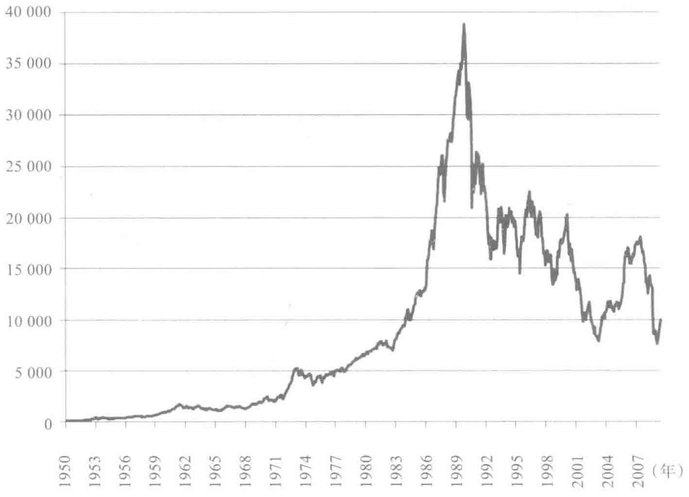
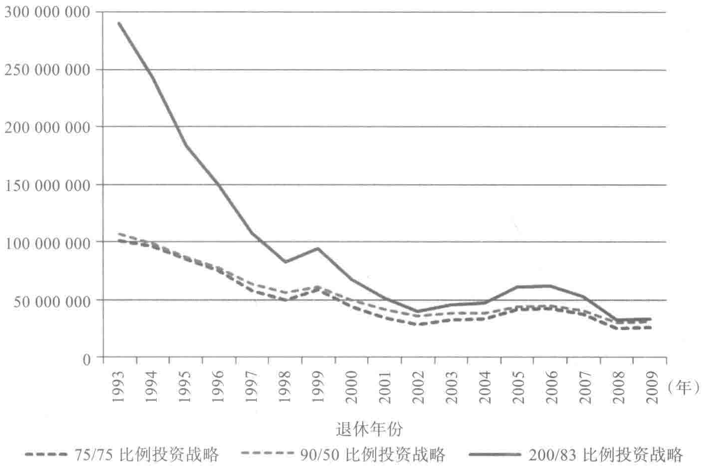
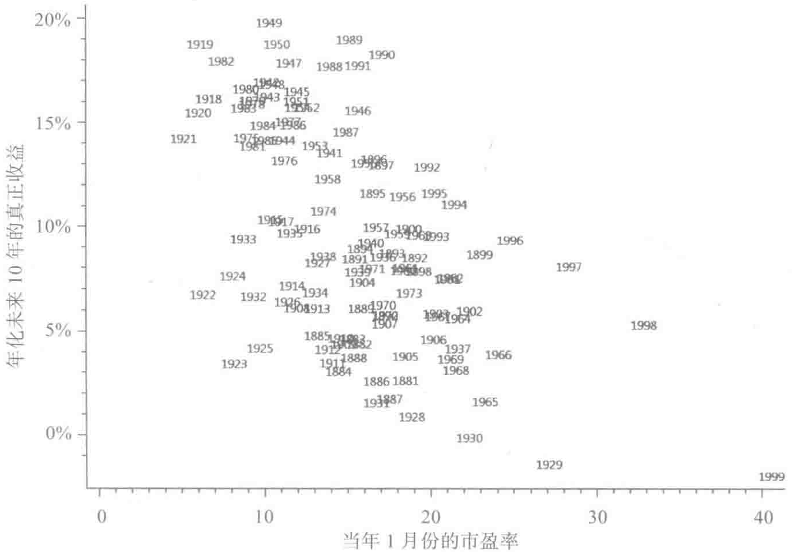
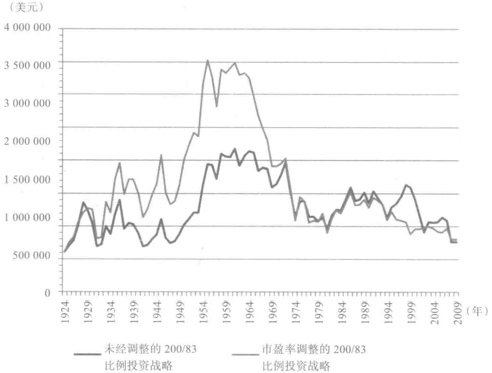

# 没有假如

影片《生活多美好》（It is a Wonderful Life）的一开始，乔治·贝里（George Bailey）[由吉米·史都华（Jimmy Stewart）饰演]正麻烦不断。比利叔叔失去了贝里公寓，贷款也没有了，而乔治正面临着大量的刑事犯罪赔偿。影片开始后没多久，乔治就站在桥上想着自杀了。乔治顾影自怜，认定他就不该出生在这个世界上。

影片情节的发展证明了乔治的想法是错误的。上帝派来的天使克拉伦斯（Clarence）出现了，向乔治表明如果乔治死去了，这个世界将会变得黯然失色。

我们钟爱弗兰克·卡普拉（Frank Capra）执导的电影（当乔治崩溃时亲吻了玛丽的时候忍不住潸然泪下），但是影片试图用它独特的叙事来说服观众，我们实在忍不住彷徨。天使想要告诉乔治，他的人生非常美好，但是乔治过去的经历实在不堪回首，他可以这样说来反驳："如果不曾有我，这个世界会更美好，也许这样说，我可能错了，但是前路未知，我的明天不会更好，所以我要自杀。"

影片讲道理的方式非常隐晦。可以说片名本身就有误导之意。电影终了，天使说："你看到了吧，你的确有美好的人生。"但是乔治既不关心过

去，也不想现在如何，他真正担忧的是未来会怎样。

也许金融中最常出现的警告是："过去的表现无法保证将来的结果。"你可能觉得这种老生常谈和影片《生活多美好》的导演弗兰克·卡普拉一样，有忽悠人的嫌疑。第3章表明如果过去曾利用杠杆进行生命周期投资战略投资，我们的投资回报会大大提升。未来也会这样吗？

## 当今股市正走俏

当我们向精明的约翰·朗本（John Langbein）展示本书第3章的分散时间投资战略的结果时，他并不觉得这个方法很棒。如果读者还记得的话，约翰一开始担心我们的投资战略所带来的高回报是以"过激"投资股市为前提的。我们认为如果我们能在降低22%的风险水平基础上，获得相同的回报，约翰肯定就觉得这个方法可靠了。只是我们想错了，约翰是这样回复的：

你们的论文对历史价格数据进行了前推，证明在过去几十年时间里，总体而言是持股投资的绝佳时期，但不是持有固定收益资产投资的好时候。你们偏好股票投资，并利用杠杆比例买入，认定可以带来较高的投资回报。按照你们的建议，我在每个税季为孩子们购买了罗斯个人退休金账户（Roth IRA）。国内投资部分，我都投资于先锋平衡指数基金（Vanguard Balanced Index Fund），它60%投资股票，40%投资债券。为什么不考虑使用艾尔斯/奈尔伯夫免费的黄金投资法则？因为我认为20世纪后面50年时间是对股票投资有利的半个世纪，尤其是从1982～2000年这段时间，是可遇不可求的。但长期而言，股票投资的回报可就不那么可观了，尤其是考虑养老金避税方面，固定收益回报是

> 免税的。也许时间会证明我的想法有误，但这同样也会证明你们的想法也是错误的。如果我的看法有误，我的孩子们在退休后财富数额会少一点。但是如果按照你们的方法对退休账户资金进行投资，那么损失就非常惨重了。届时人们只能住在偏远的地方吃狗粮度日了。

天哪！我们是不是和导演弗兰克·卡普拉在《生活多美好》这部电影中犯了同样的错误？

我们已经证明过去在美国股市利用杠杆进行生命周期投资战略能够获得很不错的回报。20世纪是美国快速发展的100年，美国股市反映了美国经济的成功。我们如何确定在21世纪生命周期投资战略依然奏效呢？

要回答这个问题，有好几种方法。理论告诉我们，只要约翰能保证自己的股票历年累计投资总额固定，在更长的时间里分散投资也能获得相同的预期回报，且波动率更小，哪怕未来股票市场的投资回报要下降也是如此。分散时间投资战略的好处与股票投资本身的收益关系不大。但是我们知道，怀疑论者需要的不仅是理论答案，还要有实践的支持。

用数据说话。我们首先表明历史结果并不是美国股市独有的。虽然我们利用的是事后之见，但这的确可以让我们相信，较高的回报不仅是因为美国股市有超凡的表现。我们重新审视了生命周期投资理论，分析最佳的投资战略碰到投资前景不佳的时候，情况会如何。显而易见，总体的投资敞口下降了，是通过降低最终的股票敞口，而非一开始的投资敞口来实现的。趁年轻进行杠杆投资，依然能帮助你分散风险。我们使用蒙特卡罗（Monte Carlo）模拟的方法，以数据来说话。我们对未来的情况做了数千种可能的模拟，借此与传统的投资战略进行比较。这可以让我们考虑在股票投资红利下降或者股市变得更加震荡的情况下投资回报的走向。

## 富时指数和日经指数

首先，我们先分析一下美国境外金融市场的情况。我们针对日本和美国股市的数据，按照200/83比例投资战略进行了计算，发现使用200/83比例投资战略要比使用传统的75/75比例投资战略和生日规则能获得更高的回报。如果投资英国富时全股指数，使用200/83比例投资战略要比使用75/75比例投资战略获得的回报高出61.6%；如果投资日本日经指数，则获得的投资回报要高出89.5%。最终投资股票市场比例为83%的生命周期投资战略是根据美国股市的风险和回报规律来设置的，但是按照这样的比例投资其他海外市场，依然产生了高于传统投资战略的更高回报。这些发现（见表4-1）是按照历史回报来确定的，但显然生命周期投资战略的优势不仅仅归功于美国股市本身在20世纪取得了超凡的回报，而且也能从美国境外的金融市场投资中体现出来。

对于日本股市的分析从多个方面展开。一开始，我们要明白日本从1950年开始到1990年发生了翻天覆地的变化。市场指数增加了100倍。市场达到峰值的时候，人们害怕日本市场会笑傲全球。可惜，日本后来经历了20年的下滑期，自1990年开始，日经指数价值缩水了75%（按照实际情况测算，缩水的幅度可能更大，见图4-1）。

在图4-2中，我们比较了200/83比例投资战略和75/75比例投资战略以及90/50比例投资战略的表现。结果显示，使用200/83比例投资战略不仅获得的回报均值和最小值都更高，利用它在其他国家的股票市场所获得的回报也都更出色。

> 早期的投资者所取得的胜利结果是惊人的。投资者到退休的时候获得

的资产净值几乎翻了三倍。其中的理由非常简单：1990年退休的投资者在市场峰值的时候退休，利用杠杆投资帮助他在全世界经历最大股市泡沫时提升了投资的回报。

对于那些在 2009 年退休的投资者来说，利用杠杆投资也获得了喜人的成绩。1990 年日经指数崩盘的时候，这些投资者才 48 岁，股市投资比例较高。从 1990 年起到后来的 20 年时间里，日经指数不断下跌。使用 200/83 比例投资战略的投资者在这一期间受挫，但是在 1990 年之前获得的投资红利，足以超越 75/75 比例投资战略以及保守的 90/50 比例生日规则投资战略所带来的投资红利。

*图 4-1 日经指数 225 的表现（1950～2009 年）*

表 4-1 将生命周期投资战略应用于多个国内市场

| | 96位美国投资者 | | | 30位富时指数全股投资者 | | | 17位日经指数225投资者 | | |
| | (1871~2009年) | | | (1937~2009年) | | | (1950~2009年) | | |
| --- | --- | --- | --- | --- | --- | --- | --- | --- | --- |
| | 固定比例 | 生命周期 | 后者比前者 | 固定比例 | 生命周期 | 后者比前者 | 固定比例 | 生命周期 | 后者比前者 |
| | (75/75比例) | (200/83比例) | 超出的投资 | (75/75比例) | (200/83比例) | 超出的投资 | (75/75比例) | (200/83比例) | 超出的投资 |
| | 投资战略 | 投资战略 | 回报百分比 | 投资战略 | 投资战略 | 回报百分比 | 投资战略 | 投资战略 | 回报百分比 |
| 最高投资比例(%) | 75 | 200 | | 75 | 200 | | 75 | 200 | |
| 最低投资比例(%) | 75 | 83 | | 75 | 83 | | 75 | 83 | |
| 平均结果 | 748 839 美元 | 1 223 105 美元 | 63.3% | 538 863 英镑 | 870 619 英镑 | 61.6% | 51 120 760 日元 | 96 864 911 日元 | 89.5% |
| 最低结果 | 308 726 美元 | 387 172 美元 | 25.4% | 258 337 英镑 | 492 356 英镑 | 90.6% | 24 626 938 日元 | 32 181 435 日元 | 30.7% |
| 第10百分位 | 449 266 美元 | 701 834 美元 | 56.2% | 328 675 英镑 | 637 066 英镑 | 93.8% | 27 480 810 日元 | 37 304 150 日元 | 35.7% |
| 第25百分位 | 561 032 美元 | 884 138 美元 | 57.6% | 457 336 英镑 | 742 526 英镑 | 62.4% | 33 088 478 日元 | 47 026 090 日元 | 43.1% |
| 中值 | 691 427 美元 | 1 146 812 美元 | 65.9% | 544 441 英镑 | 873 400 英镑 | 59.8% | 42 556 445 日元 | 62 026 643 日元 | 45.8% |
| 第75百分位 | 922 028 美元 | 1 522 653 美元 | 65.1% | 649 572 英镑 | 1 006 454 英镑 | 54.9% | 58 724 153 日元 | 107 895 235 日元 | 83.7% |
| 第90百分位 | 1 152 276 美元 | 1 929 577 美元 | 67.5% | 730 909 英镑 | 1 078 129 英镑 | 47.5% | 89 853 314 日元 | 207 352 643 日元 | 130.8% |
| 最大结果 | 1 252 684 美元 | 2 177 424 美元 | 73.8% | 846 533 英镑 | 1 203 285 英镑 | 42.2% | 100 875 934 日元 | 290 197 957 日元 | 187.7% |

*(日元)*

*图 4-2 日本投资者退休后的最终财富总额*

## 只为过上平庸的生活吗

万一将来的股票投资回报前景没有过去那么乐观，生命周期投资战略依然管用吗？理论上回答是肯定的。只要预期的股票投资回报比你借款的成本高，你就该在年轻的时候使用杠杆投资战略。如果你认为股票投资的平均回报率是 \(5\%\)，那你就不能按照 \(6\%\) 的利率来借款进行杠杆投资。这样做是只赔不赚的。但是只要你认定股票投资的回报高于借贷的成本（过去十年的平均贷款利率是 \(2.5\%\)），你就会愿意开展生命周期投资。

股票市场里具体投资多少取决于你对股票投资一般所需要承担的风险

水平和获得的平均回报率的预期。如果你像约翰·朗本一样，觉得将来股票投资的回报会比过去低，你就会想着如何减少自己的股票投资敞口。约翰从本能上认定这一点，所以他只会用总储蓄的60%投资于股票市场。

当然，你认定一生中投资于股票市场的敞口要减少，并不代表你每一年投资股票市场的敞口都应该比其他种类的投资对象少。朗本认为要减少自身承担股市投资的风险，股票的投资回报就会减少；如果要获得更高的回报，必然要承受更高的风险。但是他并没有以最佳的分散时间投资战略来投资，因此他犯了一大错误。

你要明白这一点，首先要估算一下股票历年累计投资总额，要明白一个美元年度敞口是指将一美元在某一年投资股市所承担的风险。所以如果你在第一年投资 10 万美元于股市，第二年投资 30 万美元，股票历年累计投资总额就是 40 万美元。为了实现分散时间投资，你需要将自身的股票敞口更加平均地分布于时间轮盘里。

按照我们的模拟，使用 75/75 比例投资战略的投资者，平均具有 750 万美元的股票历年累计投资总额。他们通常在一开始投资的时候，只投资很少量的钱在股市里，后来随着时间的推移，投资的比例大大增加。理想的方式是在整个生命周期里比较合理地实现分散投资，即每一年投资 17 万美元。[^8]

我们对于朗本认定谨慎的投资者应该减少自己的股票投资敞口毫无异议。但是不管你选择在股市投资多少，你最好进行分散时间投资。这依然会要求你在年轻的时候使用杠杆进行投资。比如，想象一下，比较谨慎的扎卡里想要将自己的股票投资敞口减半，即从 750 万美元减少到 375 万美

元。第一次减少了股票投资敞口后，他依然希望每年投资85 000美元（即17万美元的一半）。不过，他年轻的时候是拿不出这笔钱去投资的，他得非常谨慎地按照2:1的杠杆比例进行投资，实现生命周期投资。

预估自己的股票历年累计投资总额，能够帮助你清楚地意识到在没有使用杠杆的前提下，你历年的股票投资敞口是很不均匀的。虽然每年把特定数量的资金投入股市能让你的投资敞口更加平均化，但这种办法没有考虑金钱的复利因素。年轻时，投资者的投资敞口非常重要，因为它有40年的复利。我们需要按照朗本对于未来的预期来调整200/83比例投资战略，从而更好地适应未来股市回报更低、风险更高的情况。

## 悲观主义者更要趁早开始杠杆交易

你可能会想当然地认定调整成200/83比例投资战略，但最简单的是调整成100/41.5的比例投资。减少投资周期一开始和结束时的投资敞口，可以减少投资者总体的市场敞口。诚然，有些人认定真正保守的人会使用传统的90/50目标日期投资战略，因为这种方法现在非常流行。

> 只是分散投资的逻辑会告诉我们事情并非如此。

200/83比例投资战略的背后有一个非常简单的道理，你应该定期将特定比例的资产或者储蓄投资股市。对股市的未来回报或者风险持有悲观态度的投资者应该通过减少自己整个生命周期的投资比例，从而减少投资敞口。比如，你不要把自己一生储蓄的83%投资股票，你可以尝试用其中的41.5%投资股票。即使如此，这表明在你年轻时刚开始投资的时候，你还得利用杠杆进行投资。

> 为什么？年轻的时候，你对未来财富定投的现值依然数目不菲。对于

> 表 4-2 200/83 比例投资战略与 200/50 比例投资战略对比

|  | 200/83 比例投资战略 | 200/50 比例投资战略 |
| --- | --- | --- |
| 第一阶段：全部杠杆投资 | 12.8 年 | 8.3 年 |
| 第二阶段：部分杠杆投资 | 14.2 年 | 7.1 年 |
| 第三阶段：非杠杆投资 | 17.0 年 | 28.6 年 |

要说明的是，如果你对于未来股市回报非常悲观，你可以直接选择不再投资股市。如果你认为股市的预期回报不够高，或者你认为未来股市的回报相比过去振幅加剧，或者你想规避投资的风险，你将投资的重心转向债券或者国库券也在情理之中。

但是如果像朗本等人一样，的确在股市里是有投资的，你就应该努力实现分散时间投资。哪怕你属于完全规避风险的那一种类型（尤其你是这样的投资者），或者想要对投资敞口进行分配，你应该尝试在年轻的时候更多地投资股市。

## 未来有上万种可能

当然，我们也不指望像约翰这样的人会满意。生命周期投资战略非常强大。我们已经证明这个理论在过去非常管用。我们也说明了为什么在将来股票市场回报预期没有过去那么乐观的时候，这种投资战略依然管用。只要你的历年累计股票投资总额是固定的，通过分散时间投资战略，必然能够产生更加稳定的结果，即使未来股票的投资回报不再像过去那么乐观。那么接下来我们能做些什么？我们可以等上 25 年，然后表明我的战略比其他的战略更胜一筹。[^9] 等到下一代来利用这种投资战略的核心理念恐怕已经太迟了，再者下一代也会担心他们未来的回报不够乐观。

> 我们不要等，我们可以使用蒙特卡罗方法对未来可能发生的上万种可

能性进行模拟。这就好比我们在转蒙特卡罗轮盘一样，蒙特卡罗模拟可以随机地按照股票回报的概率分布来计算出不同的股票回报。想要看看如果股票预期的回报降低或者股市更加动荡，使用生命周期投资战略会出现怎样的结果吗？你只需要以更加悲观的预期进行投资回报模拟就可以了。

蒙特卡罗方法的一大优势在于它可以不断地重复。我们不仅仅可以分析96位使用相同投资战略的投资者所获得的回报，我们还可以分析1万名不同的投资者在面临投资回报分布概率更加多样化的情况下会得到怎样的投资回报。

比如，你想要知道生命周期投资战略怎样才能帮助像约翰那样保守型的投资者吗？约翰只把自己孩子们60%的财富投资股市。我们比较了50/50比例投资战略和另外一种同样比较激进的生命周期投资战略，投资比例为200/32。[^10] 胆小的投资者更愿意采用哪一种方法？如果你真的很担心风险，你肯定需要一个平均回报水平不错，且收益可以预计的投资策略。200/32比例投资战略的财富积累水平处于中等水平的概率较高，而赔本的概率较低，当然它获得高回报的概率也较低，也就是说，其波动性较低。这种投资战略的投资回报比较平均。1万名投资者的投资回报结果如表4-3所示。

表 4-3 固定比例投资股票战略对比均值保留（mean-preserving）生命周期投资战略（蒙特卡罗模拟 1 万种投资场景的投资回报呈现对数正态分布）

|  | 固定比例投资战略 | 生命周期投资战略 | 超越固定比例投资战略的百分比 |
| --- | --- | --- | --- |
| 最高投资比例 | 50.0 | 200.0 |  |
| 最低投资比例 | 50.0 | 32.1 |  |
| 平均结果 | 711 746 美元 | 711 746 美元 | 0.0% |
| 标准偏差 | 320 699 美元 | 276 903 美元 | -13.7% |
| 最小结果 | 130 575 美元 | 159 394 美元 | 22.1% |
| 第 10 百分位 | 384 025 美元 | 412 317 美元 | 7.4% |
| 第 25 百分位 | 490 450 美元 | 516 189 美元 | 5.3% |

> (续)

|  | 固定比例投资战略 | 生命周期投资战略 | 超越固定比例投资战略的百分比 |
| --- | --- | --- | --- |
| 第75百分位 | 856 652 美元 | 849 440 美元 | -0.8% |
| 第90百分位 | 1 112 747 美元 | 1 067 025 美元 | -4.1% |
| 最大结果 | 3 523 088 美元 | 3 084 903 美元 | -12.4% |
| 股票分布 |  | 均值 | 6.1% |
| 标准偏差 |  | 17.3% |  |

200/32 比例投资战略的风险更低，其标准偏差比 50/50 比例投资战略的标准偏差低 13.7%。在本书第 3 章中我们比较了 75/75 比例投资战略和同样激进的 200/50 比例投资战略的表现，发现标准偏差降低了 21%。表 4-3 对于分散投资的优势初现端倪，这正是我们的理论可以预计的。你可以发现，如果你使用 0/0 比例投资战略，即将所有的资金都投资于政府债券，你对股票投资敞口就实现了最完美的分散化，因为你在任何时候都没有投资敞口。定期将个人财富的 1% 进行投资的方式不够多元化，长期很难进行分散投资（如果投资 1% 是你的目标，你很快就能实现目标，只是你很快就得进行资产组合的重新调整）。表 4-3 表明，对于长期采用 50% 比例投资股票的情况而言，还有很多分散投资收益的空间。这一点很重要，因为很少有投资顾问会建议年轻人将不到 50% 的退休储蓄投资股票，就算投资者是风险规避型的也不会。

采用 200/32 比例投资战略进行投资，最小的财富累积额度要比传统的投资战略对应的数值高 22%，我们在本书第 3 章也看到了类似的结果。不过这里的发现更让人惊奇，因为使用蒙特卡罗方法碰到运气不好的时候，可能要比现实的情况更加糟糕。在美国历史中，实际的投资者可能至多会经历一次经济大萧条的情况，但是在蒙特卡罗模拟的情况中，如果一个投资者很不幸运，很有可能要一次次经历 1929 年美国大萧条这样的局面。诚

然，你在模拟上万种不同的投资前景时，不可避免地会有一些不幸的投资者会多次经历市场崩盘的情况。[^11] 我们有个投资者在六年的时间里，资产价值缩水了20%。[^12] 虽然这种倒霉的情况让人难以忍受，但使用杠杆进行投资依然能够取得更好的投资回报。在年轻的时候，提升投资股票的敞口（即使用200%的比例而不是50%的比例），年纪大一点的时候，承受的投资风险更低一些（32%的比例而非50%的比例），这种投资战略在碰到最糟糕的情况时能保持更高的资产净值。

## 更加平均化的均值

我们目前进行投资前景和回报模拟都是基于一个前提：股票回报的均值以及标准偏差和过去的类似。如果股票预期回报的均值有更加平均化的趋势，那情况又会如何？这种情况很有可能出现，尤其可能在美国股市出现。20世纪，美国股市的回报要比国外股市的回报更高。[^13] 从1871年到2009年，美国股票市场的回报比债券的回报高出了4%。[^14] 然而，2004年《华尔街日报》针对经济学家的调查显示，在未来44年的时间里股票的风险溢价会更小，只有1.7%。按照我们的投资理论，只要股票投资预期的回报高于借款的成本，则依然能够获得分散投资的收益。当然，耳听为虚，

眼见为实。

所以我们重新进行了模拟，产生了1万多种未来股市可能出现的情景，选定了更加悲观的股票投资回报分布，其中预期的平均回报要比表4-3里的数据低 30%（4.26% 对比 6.13%）。结果如表4-4所示，数据让人放心。

> 表 4-4 固定比例投资股票战略对比均值保留生命周期投资战略

> (蒙特卡罗模拟 1 万种投资场景，均值较低的投资回报呈现对数正态分布)

|  | 固定比例投资战略 | 生命周期投资战略 | 超越固定比例投资战略的百分比 |
| --- | --- | --- | --- |
| 最高投资比例 | 50.0 | 200.0 |  |
| 最低投资比例 | 50.0 | 31.6 |  |
| 平均结果 | 544 785 美元 | 544 785 美元 | 0.0% |
| 标准偏差 | 234 763 美元 | 204 868 美元 | -12.7% |
| 最小结果 | 109 267 美元 | 126 532 美元 | 15.8% |
| 第 10 百分位 | 302 382 美元 | 322 261 美元 | 6.6% |
| 第 25 百分位 | 382 266 美元 | 399 713 美元 | 4.6% |
| 第 75 百分位 | 652 709 美元 | 648 084 美元 | -0.7% |
| 第 90 百分位 | 838 548 美元 | 810 276 美元 | -3.4% |
| 最大结果 | 2 521 100 美元 | 2 258 514 美元 | -10.4% |
| 股票分布 |  | 均值 | 4.3% |
| 标准偏差 |  | 17.3% |  |

正如我们所预期的，所有的投资回报都很糟糕，但是我们关心的是使用200/32比例投资战略和50/50比例投资战略的相对表现。正如我向大家保证的，和之前的模拟情况相比，分散投资的好处依然显而易见，在更长的投资周期更好地处理了投资波动性的情况，这就是分散投资的优势。投资平均水平的降低并不会影响总体的投资收益。

其次，你可以看到最佳的生命周期投资战略取决于你对未来股票投资回报的预期。如果你认为投资股票市场的风险更高，你就得减少自己的股票投资敞口。正如前文所述，这并不代表你要在每个投资周期都减少自己的投资

敞口。相反，规避风险的投资者应该一开始就全面使用杠杆进行投资，之后逐渐减少投资股票的比例，最终股票投资的比例减少到既定的水平。

## 肥尾恐惧

《随机致富的傻瓜》（Fooled by Randomness）和《黑天鹅》（The Black Swan）的作者纳西姆·塔勒布（Nassim Taleb）利用正态分布中的肥尾股票回报分布规律赚了一大笔钱。20世纪90年代，纳西姆·塔勒布的公司抄底买进了上万份期权。除非股价波动剧烈，否则这些期权就是一文不值。绝大多数期权到最后真的是一文不值，但是纳西姆·塔勒布认定别人认为只有万分之一发生概率的少有的股票价格起起落落，在他看来有千分之一的概率。他的估计是正确的。虽然千分之一的概率比较低，但是如果你也是用万里挑一的好价格买进的，那么你就会稳赚不赔，而且你会乐此不疲。

我们非常喜欢纳西姆·塔勒布的书。我们也同意他认定对单只股票或者整个股票市场的价格进行预估是非常愚蠢的行为。不过他说数据无法引导投资者做出正确的投资决策，我们却不敢苟同。诚然，塔勒布作为金融工程师的成功表明了利用未来的股票投资回报信息能够带来更好的投资回报。我们认定可以对未来股票价格做出噪声的无偏估计。我们可以预计标准普尔500指数会在来年增加7%，问题是我们还可以估计我们的预估标准偏差是20%。像塔勒布一样，我们认为如果股票投资回报波动率较高，即使我们对平均回报的预计是正确的，也没有太大的价值。这种不确定性正是我们认定投资必须多元化、分散化的原因，但这并不代表预测未来的风险和投资回报就是无用的。我们可以利用对股票未来投资风险和回报的预计来制定更明智的投资战略。

如今，聪明的对冲基金都会推动市场更好地进行肥尾定价。投资散户在肥尾上押注，希望借此打赢市场，这样做越来越难了。虽然如此，最佳的分散时间投资策略依然取决于你对未来股票市场波动性的预期。

假如你和塔勒布一样认定股票市场的肥尾效应比过去更加明显，那么分散时间投资，降低风险就更是明智之举。规避风险的投资者想要减少自己在高风险市场中的投资敞口。当然，降低资产投资组合在股票市场的投资敞口并不代表不再使用杠杆进行投资。与那些对未来股市投资回报持有悲观论调的投资者类似，你可以减少自身在高风险的股市中的投资敞口，具体就是通过一开始进行杠杆投资，尔后快速降低投资股票的资产比例，最终保证在投资周期的最后，投资股市的资产比例较低。

表 4-5 表明了这样的结果。在最后一组蒙特卡罗模拟的情形中，我们看到了 1 万种股票投资的情况，股票投资回报的波动率几乎超过了 50%（主要是通过标准偏差来衡量）。

表 4-5 固定比例投资股票战略对比均值保留生命周期投资战略（蒙特卡罗模拟 1 万种投资场景，股市震荡加强的投资回报呈现对数正态分布）

|  | 固定比例投资战略 | 生命周期投资战略 | 超越固定比例投资战略的百分比 |
| --- | --- | --- | --- |
| 最高投资比例 | 50.0 | 200.0 |  |
| 最低投资比例 | 50.0 | 33.0 |  |
| 平均结果 | 911 087 美元 | 911 087 美元 | 0.0% |
| 标准偏差 | 668 540 美元 | 564 139 美元 | -15.6% |
| 最小结果 | 80 625 美元 | 92 893 美元 | 15.2% |
| 第0.1百分位 | 153 436 美元 | 169 983 美元 | 10.8% |
| 第1百分位 | 209 694 美元 | 236 705 美元 | 12.9% |
| 第10百分位 | 348 005 美元 | 385 503 美元 | 10.8% |
| 第25百分位 | 491 757 美元 | 535 653 美元 | 8.9% |
| 第75百分位 | 1 116 997 美元 | 1 122 598 美元 | 0.5% |
| 第90百分位 | 1 647 642 美元 | 1 589 371 美元 | -3.5% |

> (续)

|  | 固定比例投资战略 | 生命周期投资战略 | 超越固定比例投资战略的百分比 |
| --- | --- | --- | --- |
| 最大结果 | 9 865 224 美元 | 7 921 964 美元 | -19.7% |
| 股票分布 |  | 均值 | 6.1% |
| 标准偏差 |  | 25.0% |  |

肥尾效应并没有否定分散时间投资的优势，反而凸显了利用杠杆进行投资是人们的上好选择。比较表4-3和表4-5的数据，我们可以发现在股市震荡的时候，利用杠杆进行投资大大降低了退休账户总额的波动性，标准偏差降低了16%。当然，我们真正担心的是出现糟糕的结果会怎么样。即使是在最糟糕的万分之一的情况下，投资回报也能增加超过15%。通常情况下，我们会考虑概率为10%的情况，为了更加谨慎地对待这个问题，我们比较了概率为千分之一、百分之一和十分之一的最糟糕情形。在这三种情况下，投资回报率都增加了至少10%，可以说赔本的风险大大降低。当然，到头来你会发现股市的震荡让风险与回报的权衡结果变得更加不如人意，你最终决定放弃投资股市。但是如果你还是选择投资股市，哪怕你投放股市的资产份额在下降，你也要明白表4-5要告诉我们的一个道理：趁早使用杠杆投资，分散时间投资是正确的选择。

## 现在是最佳投资时间吗

我们在2009年夏天曾经说过，人们依然担心股市，甚至是整个经济形势。次贷危机和经济低迷导致3月份美国标准普尔500指数下跌了676.5点。即使经历了极力反弹之后，纳斯达克指数依然只有11年前的水平。对于很多人而言，未来的前景很不乐观。

肥尾效应的出现不能成为我们拒绝使用生命周期投资战略的理由。但

是读者会说市场当前的价格虚高，我们又如何回应呢？他们可能会说："你当然不能要求我利用杠杆投资，市场陷入低谷，投资者很难有出头之日啊！"

我们的第一反应是大家一定要有怀疑精神。我们无法预计市场究竟是在底部盘整还是会反弹。说实话，我觉得其他人也做不到这一点。人们在买卖股票或者持股的时候是拿实实在在的钱来投资的。如果大家真的有一致的意见，认为明天股价会下跌，那么大家都会在今天抛售股票，今天股价就该跌了。

我们对于股票分析师分析投资时机的能力表示怀疑。人们总会过高估计自己的能力，认定自己对于何时该持股，何时该把资产转换成风险更低的诸如政府债券这样的投资对象非常有把握。本书可不是教大家低买高卖，而是希望指导大家分散时间投资赚钱。

我们无法预计投资市场的时机，但可以安排自己的投资时间。知道自己还有多少年退休，退休前每年能攒多少钱，你可以利用这样的自知之明分散在市场的投资敞口。

由于我们的分散投资战略不依赖于股票定价有偏差这样的假设，按照这种战略投资的人彼此之间并不存在竞争关系。与此形成鲜明的对照，短线操作的人应该要为此感到担心，因为有一种可以不费吹灰之力就能把他们打败的人。如果今天的价格过高，会有人想着去卖空。套利者和对冲基金一直致力于将短线操作者挤出市场。由于他们具备调整市场的能力，我们往往会想着和这些靠运气吃饭的人一起共进退。

罗伯特·希勒（Robert Shiller）的研究促进我们思考。1996年，希勒在（美国）联邦储备系统（Federal Reserve）说明股票估值虚高。他将图4-3呈现给大家。该图的数据截至1999年，表明历史股票数据显示，当前市盈

率和股票未来十年的回报之间呈现负相关的关系。

*图 4-3 股市和未来十年投资回报的比较*

市场总体的市盈率体现了股票总价值和总收益之间的比重。市盈率为20意味着对于每20美元的股价，公司对应有1美元的收益。当股价和收益的比率较低时，比如就是5：1，未来十年股市的投资回报比市盈率至少为20的股票更高。希勒偏爱的测量市场市盈率的方法（我们也采用了）主要是比较股票当前的价值和过去十年时间里的平均收益。在希勒为联邦储蓄系统作证的时候，市盈率盘旋在25.9左右。希勒之所以为联邦储蓄系统作证是因为他担心市场可能会下跌。结果，未来十年股票平均回报停留在让人惊讶的 9% 这样的水准。截至1999年，市盈率已经上升至40.6，这个数值已经超过了本图右上角的极限。在这一点上，出现了希勒所谓的小鸡

场景（chicken little scenario），未来十年中发生了2001年的互联网经济泡沫以及2008年的金融危机，这十年期间股票投资的平均回报是 \(-1.99\%\) 。希勒所谓的非理性繁荣（irrational exuberance）应验了。

从历史的数据来看，高市盈率无法保证股市会大跌。我们在分析数据时发现，当市盈率为25时，人们依然看好股市，认定能够获得差强人意的3%的平均回报。相反，当市盈率较低时，比如市盈率为8时，调查显示股票投资的年化收益应该是13%。

认可希勒分析市盈率观点的人已经提出了很多预计市场投资时机的简单策略。当市盈率低于15的时候就应该买入持有股票，当市盈率超过15的时候，就应该抛售股票，持有债券。[^15] 希勒的实证主义分析已经让像我们这样的怀疑论者开始相信把握市场投资时机的策略了。

我们在决定预测投资时机前，这类投资策略有个问题摆在面前，就是它们牺牲了分散时间投资战略的价值。[^16] 如果你认可希勒的观点，你认定鱼与熊掌可以兼得吗？的确，是有办法做到这一点的。

到目前为止，我们一直提倡你利用当前和未来所有财富的总额，在退休前按照设定的投资比例进行投资，萨缪尔森份额是多少要确定下来，在大多数情况下是83%。萨缪尔森份额是按照你的个人风险偏好以及对股市未来的收益预估而确定的。在本书第7章中，我们会帮助大家量化对待风险的态度。到目前为止，我们依然按照常见的83%的比例来计算，因为这是对于大部分典型的风险规避型客户所设定的，他们通常会认为过去和将

来差不多，相关的市场风险和回报应该保持不变。这里的目标是个常数，因为我们已经设定投资者的风险偏好不会有太大的差别，他们对于未来股市的回报预期也会差不多。

如果我们接受了希勒的观点，对市场的预期应该各不相同，因此，按道理也应该有不同的投资比例目标。只要将比例设定为市盈率的函数，就可以按照市盈率来调整投资比例。选定了市盈率的区间（以及对应的股市投资回报）后，我们发现把最终投资比例目标保守地设定为83%的投资者在市盈率较低时，会增持股市投资，而当市盈率高的时候，就会减持股市投资。具体的结果如表4-6所示。

> 表4-6 市盈率10与萨缪尔森份额的关系

| 市盈率10 | 萨缪尔森份额 | 市盈率10 | 萨缪尔森份额 |
| --- | --- | --- | --- |
| 6 | 163% | 18 | 57% |
| 10 | 118% | 22 | 33% |
| 14 | 83% | 26 | 12% |

当市盈率是22时，受到希勒启发的战略会将萨缪尔森份额从83%降低到33%，降幅超过了一半。当市盈率是26时，建议的投资股市的比例将下降至12%。和以前的情况一样，悲观主义的看法不会阻止投资者在年轻的时候全面使用杠杆进行投资。毕竟终生财富13%的限制依然要比你25岁的时候手头具备的现金要多得多。

预计市场投资时机的战略可能会让投资者大获全胜，也有可能让投资者血本无归。与之相比，应用市盈率调整的投资战略的人们自然会根据对股市回报的预期，充分发挥生命周期投资战略的优势。当市盈率超越27.7的时候，我们的数据分析显示人们应该全面停止在股市的投资行为。市场的价格虚高，未来预期的股票回报不高，不值得冒险。股市曾经两度陷入

这样危险的境地，一次是在1929年股市崩盘前，另一次是在20世纪90年代末互联网经济泡沫破灭之前。

## 市盈率是否管用

预计市场投资时机的战略并不完美。希勒的方法无法为我们提供准确的信息，我们不会拥有那个能洞穿市场是牛市还是熊市的水晶球。要记住，希勒预计市场大崩盘，结果实际崩盘出现的时间晚了5年。再来看看大萧条给人们带来的灾难，便足以知道预计市场投资时机的战略无法让人们全面获得牛市的红利，却能提醒你不要被市场下滑连累。如果在1929年采用市盈率调整的投资战略，即使美国标准普尔指数上行6%或者4%，投资者也可能会在七八月里不持有任何股票。当标准普尔指数下跌10%时，采用市盈率调整的投资战略的投资者可能已经在9月退出市场。当标准普尔指数下跌26%时，投资者应该在10月重新进入市场，你应该将50%的个人身家投资于股市。

当然，坊间流传的投资秘籍不管用不用，你都要多长个心眼。市盈率调整的83%投资战略和其他战略相比结果如何？表4-7针对86位投资者的投资情况进行了全面的比较分析。[^17]

表4-7显示市盈率调整的投资战略（市场市盈率为14时，投资股市的目标比例应该是83%）比任何传统的投资战略都能带来更高的财富总额，这甚至比我在前文介绍的200/83比例投资战略更加管用。这种投资战略带来的投资回报的增加是惊人的，远远高于我们之前使用传统的投资战略所带来的回报。采取生命周期投资战略可以让投资者在市场价格虚高时完全脱离市场，还能获得比使用传统的投资战略高出两倍的投资回报。

表 4-7 86 位模拟投资者的结果：1881～2009 年

|  | 生日规则投资战略 | 固定比例投资战略 | 生命周期投资战略 | 调整的生命周期投资战略 | 超越生日规则投资战略的百分比 | 超越固定比例投资战略的百分比 | 超越未调整的生命周期投资战略的百分比 |
| --- | --- | --- | --- | --- | --- | --- | --- |
| 最高投资比例 | 90 | 75 | 200 | 200 | — | — | — |
| 最低投资比例 | 50 | 75 | 83 | 0 | — | — | — |
| 平均结果 | 671 239美元 | 771 214美元 | 1 296 998美元 | 1 639 374美元 | 144.2% | 112.6% | 26.4% |
| 最小结果 | 351 550美元 | 390 988美元 | 611 774美元 | 611 515美元 | 73.9% | 56.4% | 0.0% |
| 第10百分位 | 465 921美元 | 476 942美元 | 768 404美元 | 903 884美元 | 94.0% | 89.5% | 17.6% |
| 第25百分位 | 564 012美元 | 587 319美元 | 1 010 702美元 | 1 086 915美元 | 92.7% | 85.1% | 7.5% |
| 中值 | 670 886美元 | 711 777美元 | 1 204 712美元 | 1 365 441美元 | 103.5% | 91.8% | 13.3% |
| 第75百分位 | 793 996美元 | 944 026美元 | 1 587 704美元 | 1 963 838美元 | 147.3% | 108.0% | 23.7% |
| 第90百分位 | 872 311美元 | 1 154 342美元 | 1 939 646美元 | 3 205 714美元 | 267.5% | 177.7% | 65.3% |
| 最大结果 | 1 026 903美元 | 1 286 285美元 | 2 177 424美元 | 3 522 336美元 | 243.0% | 173.8% | 61.8% |

采用市盈率调整的投资战略所带来的投资回报的均值要比使用固定的200/83比例投资战略高出26%，而投资回报均值更高并不是以投资者承担更高的风险为代价的。最小回报都保持在相同的水平，而在第10百分位及以上的情况下，使用市盈率调整的投资战略获得的回报都要大大增加。如果我们将两种投资战略所获得的财富总额进行对比，如图4-4所示，我们发现有70%（即59：89）的投资者在使用市盈率调整的200/83比例投资战略时要比使用未经调整的200/83比例投资战略获得更高的投资回报。

*图4-4 使用市盈率调整的投资战略和未经调整的投资战略的最终财富总额对比*

看一眼图 4-4 你会发现，当未经调整的 200/83 比例投资战略胜过市盈率调整的投资战略时，高出的投资回报远没有在后者胜过前者时所获得的超额投资回报高。虽然我们不知道对于特定的投资者而言，这两种投资战略到头来哪一种会带来更高的回报，但是我们可以说使用市盈率调整的投资战略获得高回报的概率很高，因此值得投资者认真考虑。从另一方面来讲，按照最近的投资历史来看，在 1972～1996 年，这两种投资战略所带来的投资回报差不多；而在 1996～2008 年，未经调整的投资战略一直占上风。[^18]

尽管使用这些战略能够获得比使用传统投资战略更高的平均回报，但我们也不可能就此摒弃这个观点：市场的走向呈现随机的态势。预计市场投资时机的理论往往会把投资者挤出市场，如果每个人都认可希勒的理论，市场就不会出现奇怪的市盈率。如果预期的市场回报过高，聪明的投资者会蜂拥而至，抬高股价，直到股票未来预计的回报不再超过正常的水平为止。

采用经过市盈率调整的投资战略给投资战略的确定增加了难度，也让很多投资者觉得很难按照既定的投资战略进行投资。这可能会要求投资者更加严格地克制自己，因为市场会出现股价节节高的情况。让投资者忍住不去增持的确很难。

我们的理论提示大家，如果我们对未来的风险或者股市未来的回报持有消极的观点，就应该减少萨缪尔森份额。之所以这样做，是因为较高的市盈率表明未来股市的回报较低，因此自然要减少萨缪尔森份额。最后，

我们建议大家遵守萨缪尔森的建议：

每当你看到诱人的拐点，只是正弦值较小。在所有的资产分配者中，有些人信心满满，他们对于股票和债券的资产分配比例可能从90：10转移到95：5。这表明投资者的自信很有可能代表了他的傲慢或者自我欺骗。多年来，当两类资产分配者预计市场投资时机的能力都有限时，股票和债券的投资分配比例在65：35和60：40之间往往能获得超凡的跟风险相关的总收益。[^19]

恰如其分地进行投资时机的预测可以提升回报，也不会让投资者承担额外的风险。恰如其分是指按照市盈率来调整最终投资股票的比例，上下浮动范围在 \(10\%\) 以内。如此一来，预测市场投资机会就好像帕斯卡的赌注（Pascal's Wager）一样，即使赔本，损失也不多，如果能赚，那可是一大笔。

当股市预期的风险或者股票的波动性较高，投资者就应该减少萨缪尔森份额。按照希勒的市盈率观点，也很难预测股市未来的回报。如果你使用未来的股价，那就有可能推导出预计未来股市波动性的方法。如果波动性指数（VIX）上升了4倍，即和2008年发生的情况一样，这就相当于市场发出了巨大而又清晰的声音一样，风险水平大幅度提升。那么我们就建议大家减少萨缪尔森份额。所以，如果你没有按照预期回报变化来调整萨缪尔森份额，由于预计预期回报很难，而预计波动性的变化却相对比较容易，那么我们往往会按照预计波动性的变化结果来调整（我们将在本书第7章向大家介绍如何进行调整）。

---

[^8]: 编者注：此处对应上文将750万美元股票历年累计投资总额平均分摊到整个投资周期、得出每年17万美元这一测算的具体换算说明。

[^9]: 编者注：此处是作者对"需要等待数十年才能用实际数据验证战略优劣"这一说法的补充说明，原书脚注具体内容缺失。

[^10]: 编者注：此处说明200/32比例投资战略与50/50比例投资战略保持相同预期收益水平的具体测算依据。

[^11]: 编者注：此处说明蒙特卡罗模拟中部分投资者反复遭遇市场崩盘情形的统计细节或概率依据。

[^12]: 编者注：此处指该模拟案例中具体投资者资产缩水情形所对应的数据来源或补充说明。

[^13]: 编者注：此处引用了20世纪美国股市回报高于海外股市回报这一结论的具体数据来源。

[^14]: 编者注：此处引用了1871年至2009年美国股票市场回报高于债券回报约4个百分点这一测算的数据来源。

[^15]: 编者注：此处说明该市盈率买卖阈值这一简单择时策略的具体出处或提出者。

[^16]: 编者注：此处对应上文"市场择时策略会牺牲分散时间投资价值"这一论断的具体论证或引用依据。

[^17]: 编者注：此处说明表4-7中86位模拟投资者比较分析所采用的数据来源或测算方法。

[^18]: 编者注：此处说明1996～2008年间两种投资战略表现对比结论所依据的具体数据。

[^19]: 编者注：此处引用了萨缪尔森关于资产配置比例与风险调整后收益关系的相关论述或研究来源。