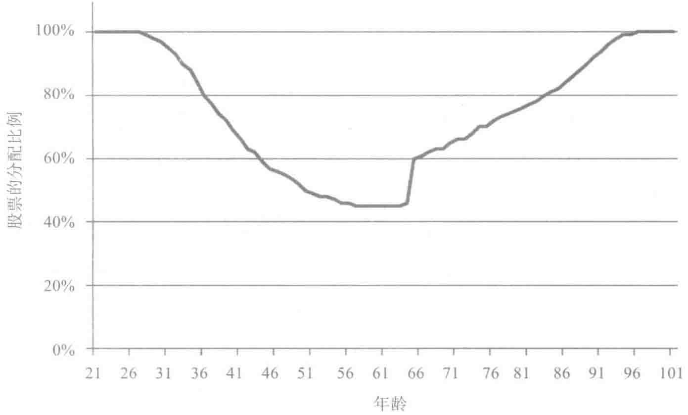

# 第5章 开始投资和止损的时间

## 开始投资和止损的时间

等待着计算机显示模拟的结果，看到不同的数据集合或者不同的蒙特卡罗模拟再次证明了生命周期投资战略的重要性。阐述并证明生命周期投资战略的有效性是我们所做过的最激动人心的事情。当然，从另外一种意义上来看，也有不如人意的地方。

大家知道，我们在撰写本书的时候，我们刚刚50岁，年轻的时候错失的投资机会已经一去不复返。我们年轻的时候就用杠杆进行投资，买入并持有股票，那么我们的经济状况会好很多。梅林可能有扭转乾坤之力，让时光倒流，但我们这些凡人就只能活一次。我们在20多岁的时候错失了利用分散时间投资战略的机会，我们的而立和不惑之年也已经同样一去不复返了。

但这并不意味着世界末日要来了，或者我们的日子就要黯然失色了。分散时间投资可以帮助我们，哪怕我们已经五六十岁了，哪怕我们已经退休了。所谓亡羊补牢，为时不晚。我们会向你介绍如何教会儿女学会分散时间投资战略。我们甚至会向大家介绍生命周期投资战略对于那些不打算等死的组织有很多值得借鉴的地方。

## 起步晚

由于我们起步晚，所以我们得采取一些步骤来充分发挥分散时间投资战略的优势。伊恩（合著者）和他可爱的妻子詹妮弗向来是会过日子的人，他们一直在为退休后的生活以及子女的大学教育费用攒钱，他俩的孩子今年分别是20岁和15岁。伊恩工作后多年，他将自己的存款都投资股票了，包括低成本的指数基金和美国交易所交易基金（ETF）以及美国境外的股票。他可没想着要跑赢市场，所以也没有尝试任何预测投资时机的活动。因此，伊恩从来没有花时间思考投资的问题。每年在报税前的某个时刻，他会列一张清单，列出一年来存款的变化。他每年会和老婆就未来一年的投资项目交谈一次。因为他们向来就只投资股票，所以夫妻俩在这个话题上讨论的时间不多。即使聊起来，也只会说是否该把大部分储蓄投资某只境外股票或低市值的指数基金里。

伊恩的全额股票投资战略比他大部分的法学院同事采用的投资战略更加激进。伊恩的朋友将个人存款的60%投资股市，剩余的40%投资债券，他们错过了20世纪八九十年代的股市大涨带来的好处。问题是伊恩也错过了。虽然伊恩的资产是100%投资股市的，但是从资产的绝对值来看，他因为没有太多的钱可以投资，所以他没能搭上股市上涨的顺风车。他的朋友现在可以暂时得意一会儿。2008年市场下跌后，他们的60/40比例的资产组合价值在2009年6月比伊恩100%投资股市的资产组合价值高出8%。伊恩现在想起来很是后悔，当初年轻时就应该采用杠杆投资战略。如果他早就知道本书提出的建议，采用了200/83比例投资战略，到2008年6月的时候，他的资产组合价值应该会比现在的价值高出23%，超过了他同事的资产组合价值。

和大多数的投资者一样，伊恩的问题是他从来没有把特定数量的资金投资市场。从30岁到55岁期间，他的市场敞口翻了10倍。他的经历可以说是本书的范本。他没能进行分散时间投资，表明2008年的金融危机对他的打击很大。正确的方法不是在50多岁的时候减少投资额，而是要增加年轻时的投资敞口。他认为100%的资产投资额已经非常激进了，但是考虑到他一辈子的储蓄总额，30多岁和50岁出头的时候投资股票的资产比例不到20%。时光无法倒流，之前没有及时把握的机会已经一去不复返了，但是他可以把握住后面的机会。

当伊恩考虑了未来的财富总额时，他计算出未来财富总额的现值给当前的可投资财富总额加上了50%，这个比例已经剔除了儿女教育和照顾老人的费用，所以伊恩即使投资了100%，按照生命周期投资战略的计算方法，也只有终身财富67%的比例。

我们可以分析一下巴里的投资组合，但是这个情况复杂得多，主要是牵涉到了诚实茶公司（Honest Tea）。1998年，巴里和他之前教过的学生塞斯·高德曼（Seth Goldman）共同成立了一个公司生产瓶装冰茶饮料，味道像茶，喝起来绝对不像糖水。这是一种有机饮料，由特殊工艺制备，口感不是很甜。②该公司的价值从零上升到了5000万。2008年，可口可乐公司以超过1亿美元的价格收购了公司40%的股份。现在，巴里的大部分资产都与业务发展息息相关。他希望能够分散自己的投资，这是企业家成长的必经之路。

> 把该投资股市的数额给弥补上，这并不代表要让伊恩在50岁的时候将

自己资产的 200% 投资于股市。不过伊恩如果想要大大增加自己未来的存款的话，一定要把更多的资产比例投资股市。伊恩和詹妮弗热爱自己的工作，预计大约得过 20 年或 23 年后才退休。教授聪明的学生学习投资真是件有意义的事情。和绝大多数同事一样，伊恩觉得自己要到 73 岁才退休。在我们的模拟情境中，使用 200/83 比例投资战略，还有 23 年退休的一半投资者今年 44 岁，他们会把当前可投资资产的 126% 投资于股市。伊恩计算的结果与此差不多，他会把当前可投资资产的 125% 投资于股市。\( ^{1} \) 他已经采取了行动来保证这个投资比例。2009 年，伊恩和妻子投资了 10 万美元购买美国标准普尔指数的期权，这大大增加了他在股市的敞口。

错失了 30 多年的投资机会，伊恩现在采用生命周期投资战略是否太晚？这种战略对他是否有用？幸运的是，我们知道一个道理：亡羊补牢，未为迟也。即使你已经青春不再，哪怕你已经 50 多岁，分散时间投资战略依然可以帮助你。这是好消息。坏消息是你无法让时间倒流（哪怕 50 岁在我们看来也是壮年）。无法进行分散时间投资的岁月，失去了便永远失去了。如果你是起步较晚的投资者，你依然可以从尽快使用生命周期投资战略获益。

表 5-1 展示了这些好处。和第 3 章与第 4 章的情形一样，我们会像分析扎卡里和埃莉诺这样典型的投资者的存款额一样，但采用了不同的投资战略，获得了不同的投资结果。我们现在分析一下在不同的人生阶段采用传统的生日规则投资战略（即 90/50 比例投资战略）和生命周期投资战略获得的财富总额的差别。为了方便比较两者的区别，表 5-1 前面两列展示了表 3-1 中关于生日规则投资战略（90/50 比例投资战略）和 200/83 比例生命周期投资战略的投资回报，后面几列估计了采用生命周期投资战略起步晚所带来的影响。

表 5-1 在退休前的最后若干年时间里从生日规则投资战略转移到生命周期投资战略

| 平均结果 | 生日规则投资战略 | 200/83比例生命周期投资战略 | 超越生日规则投资战略的百分比 | 退休前40年转移到生命周期投资战略 | 超越生日规则投资战略的百分比 | 退休前35年转移到生命周期投资战略 |
| --- | --- | --- | --- | --- | --- | --- |
| 最小结果 | 646 575 美元 | 1 223 105 美元 | 89.2% | 1 200 075 美元 | 85.6% | 1 128 916 美元 |
| 第10百分位 | 290 310 美元 | 387 172 美元 | 33.4% | 355 710 美元 | 22.5% | 368 754 美元 |
| 第25百分位 | 416 253 美元 | 701 834 美元 | 68.6% | 696 276 美元 | 67.4% | 719 691 美元 |
| 中值 | 539 343 美元 | 884 138 美元 | 63.9% | 869 564 美元 | 61.2% | 825 371 美元 |
| 第75百分位 | 779 044 美元 | 1 522 653 美元 | 95.5% | 1 443 402 美元 | 85.3% | 1 381 705 美元 |
| 第90百分位 | 870 921 美元 | 1 929 577 美元 | 121.6% | 1 887 323 美元 | 116.7% | 1 771 132 美元 |
| 最大结果 | 1 026 903 美元 | 2 177 424 美元 | 112.0% | 2 237 399 美元 | 117.9% | 2 378 396 美元 |
| 转换投资战略时的平均投资比例 |  | 200 |  | 200 |  | 200 |
|  |  |  |  |  |  |  |
|  |  |  |  |  |  |  |
|  | 退休前30年转移到生命周期投资战略 |  | 退休前25年转移到生命周期投资战略 | 超越生日规则投资战略的百分比 | 退休前20年转移到生命周期投资战略 | 超越生日规则投资战略的百分比 |
|  |  |  |  |  |  |  |
|  |  |  |  |  |  |  |

| 第90百分位 | 1 676 114 美元 | 92.5% | 1 691 259 美元 | 94.2% | 1 541 586 美元 | 77.0% |
| --- | --- | --- | --- | --- | --- | --- |
| 最大结果 | 2 338 557 美元 | 127.7% | 2 129 773 美元 | 107.4% | 1 943 500 美元 | 89.3% |
| 转换投资战略时的平均投资比例 | 191 |  | 152 |  | 121 |  |
|  | 退休前15年转移型生命周期投资战略 | 超越生日规则投资战略的百分比 | 退休前10年转移型生命周期投资战略 | 超越生日规则投资战略的百分比 | 退休前5年转移型生命周期投资战略 | 超越生日规则投资战略的百分比 |
| 平均结果 | 825 553 美元 | 27.7% | 755 535 美元 | 16.9% | 698 956 美元 | 8.1% |
| 最小结果 | 299 142 美元 | 3.0% | 296 963 美元 | 2.3% | 287 949 美元 | -0.8% |
| 第10百分位 | 454 665 美元 | 9.2% | 431 217 美元 | 3.6% | 418 161 美元 | 0.5% |
| 第25百分位 | 571 529 美元 | 6.0% | 564 212 美元 | 4.6% | 525 011 美元 | -2.7% |
| 中值 | 751 761 美元 | 17.2% | 712 307 美元 | 11.0% | 679 321 美元 | 5.9% |
| 第75百分位 | 989 416 美元 | 27.0% | 917 150 美元 | 17.7% | 848 698 美元 | 8.9% |
| 第90百分位 | 1 406 078 美元 | 61.5% | 1 200 602 美元 | 37.9% | 996 685 美元 | 14.4% |
| 最大结果 | 1 592 337 美元 | 55.1% | 1 359 755 美元 | 32.4% | 1 291 251 美元 | 25.7% |
| 转换投资战略时的平均投资比例 | 103 |  | 92 |  | 86 |  |

你可以看得出来使用生命周期投资战略，即使起步较晚，也能产生较好的投资结果。比如，如果你还有20年退休，从传统的投资战略转变为生命周期投资战略能够提升你最终财富价值，回报增幅比例高达40%。你可以很快就发现投资回报增加了，但投资风险没有增加。在投资情况最糟糕的情况下，投资回报增加了将近16%。也就是说，哪怕离退休只有10年时间，只要你能做到分散时间投资，就能获得更好的回报。从96位投资者的情况来看，如果能让他们在退休前的10年里采用生命周期投资战略，最终财富额平均增加了17%。 \( ^{①} \) 显然，投资者增加投资敞口导致了投资回报的增加。投资模拟的结果告诉我们过去增加的投资敞口平均分散在多年的时间区间里，所以即使碰到投资环境很糟的情况，也能产生很好的投资回报。目前投资回报的增幅不大，如果在整个工作的几十年时间里都采用了生命周期投资战略，就能获得更多的投资回报，增幅达到89%。40岁才初次投资股票的人是无法通过分散时间投资来让自己的财富加倍的。不过，伊恩在50岁的时候依然能够通过使用生命周期投资战略获得更多的投资回报，增幅达到40%。

《经济学人》的专栏作家提姆·哈福德（Tim Harford）将我们之前所做的分散时间投资进行了学术分析，然后发表了一篇题为“智者年纪轻轻就开始大买特买”（Only the Good Buy Young）的文章。表5-1的结果表明，聪明的投资者会在年轻的时候买入股票，然而在年长的时候投资股票也不失为明智的选择。

> 在本书的前言中，我们写道应该将最终获得的稿费提前投资于股市。

同样的思维模式引导我们思考很多中年投资者应该在父母或者祖父母健在的时候就把自己预期的遗产投资股市。伊恩有个高中同学，近十年来他一直在劝说年届耄耋之年的祖母把退休资产从债券中转移出来投资股市。家人的关系很紧密，所有的孙辈们都能继承遗产。但是祖母的钱大部分都投资在固定收益的债券里，投资的回报非常保守。我们认为伊恩的朋友可能不用去哄老太太答应自己的要求，可以直接自行分配资产比例。他可能已经把一部分投资债券的资产转移到股市里，必要的时候他也可以采用杠杆投资战略，在奶奶去世前增加股市的敞口。

美国的财产继承从很大程度上是两代老人之间的财产转移（比如八九十岁的老人转移给六七十岁的孩子们）。等孙辈们收到已故祖辈财产的时候可能已经年过40了。如果你能在未来某个时候继承遗产，而这部分遗产是投资在债券的，你不需要劝说你的祖母转移投资对象，投资股票，你可以自行完成投资比例的转换。

## 起步早

你可以使用分散时间投资的逻辑来帮助你的孩子们。如今的年轻人甚至是青少年可以提前规划进行生命周期投资。我们一直强调在44年的时间内分散风险的优势。如果你能实现在更长的50年或者60年里分散风险，就更好了。当然，真要有那么长的投资生涯，一个人可能得在刚出生时就学会购买股票。光用杠杆进行投资是完全做不到这一点的，你还得积极攒钱。如果你手头有4000美元，你可以向股票经纪人再借4000美元，共投资8000美元。

> 问题是如果一开始你没有存款，没有办法借到钱投资。对于小孩、学

生和应届毕业生来说，没有存款是常态。出借4000美元的股票经纪人希望股票账户里有8000美元，好让他放心借钱给投资者，因为他知道投资者有能力还钱。如果投资者自己本身没有钱，经纪人就会收取超高的利率。这表明借钱是需要付费的。我们都建议年轻人按照2：1的杠杆进行投资。但是如果你没有一分存款，所谓的杠杆投资就不存在。

借钱投资在两个方面限制了分散时间投资的优势。首先，因为借款，年轻的雇员无法完全在自身的职业生涯中分散风险进行投资。2：1的杠杆比例让投资者接近全面杠杆的程度。但是大部分雇员在刚开始工作的十年时间里，都会被2：1的资本杠杆所左右。杠杆的局限是我们当前分析的核心。

从经纪人那里借钱投资还有第二个局限，它对投资者分散时间投资能力的影响更大。绝大多数人在20多岁开始工作之前，是没有能力进行分散时间投资的。伊恩27岁的时候才开始投资股票市场。那个时候他已经大学毕业，有了第一份工作（有一段时间，伊恩看似要在学校待一辈子了。他大学毕业后又去麻省理工学院攻读了经济学博士，在耶鲁大学攻读了法学博士。因为一心读书，他似乎又错过了本可以分散投资的27年，只因为他从未涉足市场）。

当然，我们要摒弃坐以待毙的思维。一个人能把分散投资的福利传给自己的儿女和孙辈。为孩子的未来而投资已是我们的传统。伊恩的祖母在伊恩出生的时候给了他美国国库券。可惜的是，这样做并没有帮助伊恩降低未来在股市投资的风险。代表你的孩子们进行杠杆投资，能大大延长他们投资市场的时间。在他们年幼的时候，按照分散时间投资的原则投资，可以大大降低他们长大后面临的投资风险。

> 当然，这条建议只适用于那些打算给后代留下遗产的人，我们很

多人连自己退休后的生活都保障不了，还有一些人认为儿孙自有儿孙福[也许正是因为这个原因，《破产上天堂》（Die Broke）这本书才销量这么好]。

即使你没有足够的财力来帮助子女们启动投资，你也可以告诉他们分散时间投资能大大提升总体的投资回报，希望他们能好好利用生命周期投资战略的优势。无论孩子多大，是十几岁的少年，还是已经成年的年轻人，你都要告诉他们30岁时将 100% 的个人资产投资股票的好处，而刚工作的时候使用2：1的杠杆比例来投资股票恰恰是谨慎处理退休后财产的方法。我们在书中一直强调如何将大家退休账户中的存款合理投资，但是本书还有一部分非常重要的读者，他们是中老年人。他们能够劝导儿女和孙子辈不再重蹈自己年轻时错过投资机会的覆辙。我们把这一点称为生命周期投资战略的教育功能。

我们知道要读者向他人宣传生命周期投资战略并不容易。父母在给孩子们提供投资建议的时候都比较保守。比起自己的资产组合赔钱这件事情，孩子们投资失利也同样让人心疼。他们相信你的眼光，但作为长辈你很怕让孩子们失望。因此，你决定绝口不提投资的事情，这样最保险。即使你的投资建议会让孩子们在退休的时候腰包鼓鼓，即使他们退休的时候，你也许已经远在天国。

很多父母不向孩子们提出投资建议，主要原因是他们不希望自己因为投资建议不当而后悔。然而，20岁出头的他们怎样才能学会投资呢？如果一开始的投资建议是错误的，他们很难在投资实践中取得成功。虽然你可能并不是注册理财师，但是你读了本书，而且你现在已经读到第5章还没有放下，就足以证明你其实是有自己的判断力的。

你可以告诉孩子们本书的有关内容，跟他们聊一聊如果你年轻的时候

就读了这本书，那该有多好。你可以谈一谈2008年金融危机爆发的时候，你把过多的钱财投入股市，20世纪八九十年代时却没能利用较大的敞口来把握投资的时机。你还可以说年轻的时候，刚开始投资，哪怕你把所有的身家都投入股市，也不足以赢过大多数投资者，但是这样做恰恰能降低投资的风险，提升成功投资的概率。

比起给他们提供建议，更好的办法是直接为他们投资。如果你的孩子们还小，你应该不至于过分担心因提供错误投资建议而后悔的问题。至少他们不需要亲眼见证股市和投资市场的起起落落。我们建议你不要在投资行为上有所改变。如果你设立了被监护人的账户，最好把里面所有的资金都投入股市。如果你想要利用杠杆进行投资，这笔钱就要放进你自己的投资账户中，虽然你可以自行记录孩子的本金到底有多少。在孩子出生的时候，利用杠杆投资1000美元可以带来巨大的收益，也能大力提升孩子分散时间投资的能力。

为了验证这一点，我们重新进行了历史模拟。这次主要是看在孩子出生时将一小部分钱用不同方式投资所带来的结果和分散投资的效果。我们验证了73位投资者在孩子们23岁之前按照多种投资方式进行投资，到23岁之后采用200/83比例投资战略所得到的投资结果。 \( ^{2} \) 我们设定了孩子们在23岁之前开展投资的三种方法。在第一种模拟情景中，我们把孩子出生时收到的见面礼全额投进债券。在第二种模拟情景中，我们把孩子出生时收到的见面礼全额投入股市。在第三种模拟情景中，我们把孩子出生时收到的见面礼以2:1的杠杆投入股市。

表5-2分别列出了把孩子的出生见面礼投资500美元、1000美元和5000美元情况（对于我们大众的一名代表——乔而言，这相当于把预期的未来储蓄按照0.46%、0.92%和4.6%的贴现率贴现后进行投资所得的结果）。

表5-2 从出生到22岁时将出生见面礼（分别是500美元、1000美元和5000美元）分别按照200%、100%投入股票和100%投入债券，之后按照分散时间200/83比例投资策略进行投资的结果

| | 500美元见面礼 100%投资债券 | 500美元见面礼 100%投资股票 | 100%投资股票比100%投资债券超出的回报 | 500美元见面礼 200%投资股票 | 200%投资股票比100%投资债券超出的回报 | 1000美元见面礼 100%投资债券 | 1000美元见面礼 100%投资股票 | 100%投资股票比100%投资债券超出的回报 | 1000美元见面礼 200%投资股票 | 200%投资股票比100%投资债券超出的回报 |
| --- | --- | --- | --- | --- | --- | --- | --- | --- | --- | --- |
| 平均结果 | 1378.031美元 | 1410.573美元 | 2.4% | 1490.899美元 | 8.2% | 1400.825美元 | 1464.596美元 | 4.6% | 1620.486美元 | 15.7% |
| 最小结果 | 727.570美元 | 736.572美元 | 1.2% | 733.416美元 | 0.8% | 760.323美元 | 773.853美元 | 1.8% | 769.655美元 | 1.2% |
| 第10百分位 | 844.958美元 | 859.045美元 | 1.7% | 939.261美元 | 11.2% | 859.708美元 | 904.163美元 | 5.2% | 994.446美元 | 15.7% |
| 第25百分位 | 1087.263美元 | 1106.721美元 | 1.8% | 1161.063美元 | 6.8% | 1089.626美元 | 1152.625美元 | 5.8% | 1183.069美元 | 8.6% |
| 中值 | 1327.069美元 | 1352.427美元 | 1.9% | 1457.633美元 | 9.8% | 1360.025美元 | 1424.139美元 | 4.7% | 1552.222美元 | 14.1% |
| 第75百分位 | 1655.024美元 | 1729.245美元 | 4.5% | 1803.963美元 | 9.0% | 1659.814美元 | 1802.864美元 | 8.6% | 1949.127美元 | 17.4% |
| 第90百分位 | 1968.761美元 | 1981.700美元 | 0.7% | 2167.269美元 | 10.1% | 1976.648美元 | 2039.670美元 | 3.2% | 2297.024美元 | 16.2% |
| 最大结果 | 2220.573美元 | 2265.918美元 | 2.0% | 2991.801美元 | 34.7% | 2256.302美元 | 2345.004美元 | 3.9% | 3902.278美元 | 73.0% |

(续)

|  | 5000美元见面礼 100%投资债券 | 100%投资股票比 100%投资债券超出的回报 | 5000美元见面礼 100%投资股票 | 200%投资股票比 100%投资债券超出的回报 | 5000美元见面礼 200%投资股票 |
| --- | --- | --- | --- | --- | --- |
| 平均结果 | 1 583 369 | 18.1% | 1 852 215 | 56.0% | 2 445 979 |
| 最小结果 | 776 811 | 17.5% | 913 078 | 14.5% | 889 470 |
| 第 10 百分位 | 974 506 | 16.3% | 1 133 555 | 27.3% | 1 240 896 |
| 第 25 百分位 | 1 177 094 | 20.6% | 1 419 360 | 25.2% | 1 473 687 |
| 中值 | 1 570 632 | 8.6% | 1 705 009 | 32.8% | 2 086 440 |
| 第 75 百分位 | 1 911 256 | 19.5% | 2 284 061 | 44.8% | 2 768 188 |
| 第 90 百分位 | 2 220 743 | 17.0% | 2 597 872 | 111.1% | 4 688 804 |
| 最大结果 | 2 514 668 | 28.8% | 3 237 877 | 295.5% | 9 945 576 |

把1000美元都投进股票，可以比投资债券获得更多的收益——64 000美元（除去通货膨胀的因素）。这笔收益不仅来自于前面23年的收益，而且还因为由此在23岁时获得杠杆投资的能力。

从一开始就用杠杆进行投资能带来更高的收益。在500美元的基础上使用杠杆投资能够比单纯投资500美元于债券所获得的回报高出8%。如果一开始在5000美元的基础上进行杠杆投资，将比使用同样数额投资债券的回报高出56%。

一开始就有5000美元较大金额的见面礼，并以杠杆进行投资，在分散时间投资方面成果显著，主要是因为这种模式放松了保证金借款投资的局限。成年人的账户中金额越大，就越接近萨缪尔森份额目标。一个普通人采用传统的投资战略，只是利用了15年或者20年的分散投资区间。人们年轻的时候投资股票的数额自然不高，但是正是因为金额太少，达到一定市场敞口的有效投资年限也不够长。父母通过代理孩子们以杠杆进行投资，就能让分散时间投资的年数翻倍。

进阶分散时间投资战略（enhanced time diversification）优势明显，让那些一向喜欢将可支配的资产投资于相对保险的、非股票类投资对象的家长心动，转变观念，为孩子们尽早开启生命周期投资模式。诚然，代代相传的投资秘方效用明显，很多没有打算给孩子留钱的家长可能会改变想法，而那些打算给孩子留下个人存款的父母则会想方设法增加这部分金额。分散时间投资，即生命周期投资战略是一种新的技术，理性投资者都应该考虑。如果政府债券能够提供更高的投资回报，你肯定要把更多的资金投资债券。当然，如果你知道趁年轻用杠杆投资股票能获得更高的收益，你肯定也不会犹豫入市。无论你的决定如何，表5-2都清晰地表明帮助孩子或者孙子购买股票指数基金，是比传统的投资债券更好的投资方式。

顺便提一下，政府债券有朝一日也有可能会帮助你为孩子们投资股票。2007年，希拉里·克林顿（Hillary Clinton）提出政府为父母提供5000美元，支持他们代表孩子们进行投资。 \( ^{3} \) 在她的临时提议中，每个小孩都能在出生的时候收到一份婴儿债券，为孩子未来在成长教育或者购房等问题上准备好一份能够增值的厚礼。

愤世嫉俗者可能会认为希拉里的提议只不过是为了讨好人们的空头支票，通过的概率很低（诚然，希拉里很快在该提议执行后没多久停止实施这项决议）。但是"婴儿债券"在英国已经由儿童信任基金（Child Trust Fund）执行。2003年，托尼·布莱尔（Tony Blair）的劳工党政府开始给父母250英镑（大约是370美元）——低收入家庭大约是500英镑，请父母代表新生儿投资。在孩子7岁的时候，政府将发放另外250～500英镑（大约为370～740美元）。 \( ^{4} \) 这些基金必须放进金融机构的储蓄或者投资账户里。如果父母没有选定要把钱存进去的账户，政府会自动将孩子的基金存进某个股票经纪人的账户里。当孩子年满18岁的时候，孩子可以收回账户中的钱，或者把钱存进新的储蓄或者投资账户里。

婴儿债券这个主意来自布鲁斯·阿克曼（Bruce Ackerman）和安妮·阿斯托特（Anne Alstott）提出的让政府为每个18岁的成年人提供8万美元的更加激进的提议。 \( ^{5} \) 布莱尔给7岁孩子提供1480美元的建议与之相比，就显得微不足道了。但是表5-2显示正确投资1000美元的话，也能获得不少的收益。布莱尔债券的一大优势是孩子们一出生就能得到这份债券，比布鲁斯·阿克曼和安妮·阿斯托特提议的债券要早18年。这表明他们有了额外18年投资股市的时间。布鲁斯·阿克曼和安妮·阿斯托特希望给每个公民提供获得切实的社会经济利益的机会。不过，政府婴儿债券最重要的方面是它让投资者不再受制于共同投资的限制，有了婴儿债券，无论经济地

位如何，都能开始分散时间投资。

## 随着工龄的增长逐渐降低杠杆比例

2008 年，三个退休投资专家，即伦敦商学院的弗朗西斯科·戈麦斯（Francisco Gomes）、波士顿大学的劳伦斯·科特利科夫（Laurence Kotlikoff）和哈佛商学院的刘易斯·维塞拉（Luis Viceira）进行了抽丝剥茧的一项模拟，来推导他们针对"优化生命周期投资"（optimal lifecycle investing）的估计。和我们一样，他们想要了解投资者每年应该投资股票市场和政府债券的具体百分比。

不过他们并没有推导出优化的投资战略，而是通过计算机对上百万的投资战略进行分析，试图在生命周期模型中找到最佳风险和回报的投资战略。他们的分析与我们的有所不同，因为他们想知道到底有多少退休人员应该投资股市。我们在退休的当天就停止了分析，但是他们认定有一定比例的人会活到100岁，所以计算机会继续运行来看对于整个生命周期而言，最佳的投资战略是什么。在对无数的数据进行分析后，计算机吐出了一项战略，图 5-1 总结了这项投资战略。\( ^{6} \)

图 5-1 列出了一个典型的双薪家庭最佳投资生命周期的含义。从某种程度上来看，这让我们想起了生日规则投资战略，投资者第一年投资的时候将 90% 的资产投资股票，然后逐年减少投资股市的比例。到他们 65 岁的时候，将投资股票的比例减少到 45%。我们再来分析一下这个数据。这就好比是《聚焦》（Highligts）杂志的图像测试。按照我们对生命周期投资战略的了解，哪一部分的资产投资分配比例是有误的？这真的能代表最佳生命周期吗？如果可以代表生命周期，那么他们的生命周期投资战略和分

散时间投资战略能否同时正确呢？我们看图5-1的时候发现了三个疑点：两个与人们在退休前投资的方法有关，另外一个与人们在退休后投资的情况有关。我们分别来分析这三个难题。

1. 在投资者职业生涯的初期，为什么股票分配的比例不提高一点？如果我们的生命周期投资战略是正确的，为什么乍一看它倒像是戈麦斯、科特利科夫和维塞拉在研究最优投资战略时无心插柳的结果？

要解答这个难题其实很简单。我们的战略不是计算机随机选择的结果，因为计算机不会得出这样的结果。计算机所允许的投资股票的比例最高为100%，绝对不会有200/83的投资比例分配。我们来分析一下具体的情况是怎样的。最佳投资战略的核心观点是在一个人职业生涯的前面十年里尽可能多地投资股票。

*图 5-1 戈麦斯、科特利科夫和维塞拉按照年龄实现最佳股票投资分配的比例*

这个投资角度的模拟告诉我们需要提升投资股票的资产比例，但是我们现实中拥有资产的情况不允许我们这样做。

实际上，如果不是把预期的股本溢价人为地设定在 \(4\%\) 这个较低的水平上，资产 \(100\%\) 投资股票的时间应该更长。戈麦斯、科特利科夫和维塞拉这样写道："在比较了普通股票和短期国库券的收益后发现，该股本溢价低于历史股本溢价，但符合法玛（Fama）和弗兰奇（2002）描述的前瞻性估计。更高的股本溢价会产生不切实际的股票组合比例。"我们认为高的股票投资比例并非不切实际，只是这和传统的投资战略不同，而且传统的投资战略往往在投资实践中出错。

100%投资股票的时间只有10年还有一个原因：这类投资者对风险都是极度规避的。了解这一点，我们就能进一步解释下面这个难题。

> 2. 为什么临近退休了，股票分配的比例不能更高一点？

我们的投资者认定退休前投资股票的比例应该是 \(83\%\) ，而戈麦斯等人的模拟结果表明，投资者在退休的时候，投资股票的比例应该是 \(45\%\) 。考虑了社会保障金之后，戈麦斯的模拟结果只让投资者将个人财富的 \(20\%\) 投资于股票。

为什么有这样的区别？根据戈麦斯的模拟结果，过分规避风险的心态会导致人们采用非常保守的投资战略。\( ^{7} \)明白这一点，再加上股本溢价减少，最终不断减少投资股票的比例，这倒不足为奇。依据现实合理地规避风险将会改变职业生涯过程中和结束的时候股票投资的比例。诚然，如果他们采用了更符合实际的规避风险态度和历史股本溢价，并使用杠杆，其投资战略就会非常接近200/83比例投资战略。按照200/83比例投资战略，投资者职业生涯的前十年需要借用杠杆，按照200%的比例投资股票，之后投资股票的比例逐年下降，到退休前，投资股票的比例是83%。正如本

书第 4 章强调的那样，就算是胆小鬼也愿意在年轻时突破 100% 的比例限制利用杠杆进行股票投资。

我们在这里要介绍戈麦斯的图像，并非因为戈麦斯赞成在职业生涯的周期内逐渐降低投资股票的比例，而是因为戈麦斯及其合著者认定投资股票的比例应该上升。这也是这个理论最大的疑点。

> 3. 为什么股票投资的比例随着职业生涯的深入而上升？

你可以坚持己见，却很难找到哪个理财规划师提出这样的建议：在99岁的时候还要将个人 \(100\%\) 的储蓄投资于股票。但是戈麦斯的模拟表明了退休账户资金新型的生日规则投资战略。这种战略告诉你到了80岁的时候，你的年龄是多大，就该把多少百分比的储蓄投资股票市场。在你查看图5-1的错漏时，如果你意识不到这一点，你可能得暂停一下，等到状态好一点的时候再继续思考。

戈麦斯对于罗斯福新政颁布之后退休人员的情况做了非常合理的假设。这一点值得我们注意。戈麦斯进行模拟的一个前提是人们在退休的时候能够接收社会保障金。说实话，我们现在不能肯定我们退休时还能否获得社会保障金。届时可能因为经济状况和税收政策，所谓社会保障金也无非就是高收入群体忽悠人的空架子罢了！正如我们在本书第3章中强调的，社会保障金的金额较大，能大大提升退休后账户资金的总额。快退休的人的退休金账户中有一大部分是社会保障金。

社会保障金的性质与债券类似，才会导致投资股票的比例逐年上升。请记住我们的观点很简单，即人们应该将自己现在和未来财富现值特定比例的资产投资股票。社会保障金代表了未来财富投资的一大部分。我们在本书第2章中强调，人们应该在退休前将未来预期财富的一部分投资股票。但为了说明问题起见，本书第3章和第4章的模拟中将社会保障金排除在

外。考虑了社会保障金因素后，我们可以解释图 5-1 中投资股票的资产比例不断增加的原因。

随着投资者的年龄逐渐增大，按照未来社会保障金的现值来计算，他们将过多的个人总财富投资于股票。如果社会保障金（或者特定的收益计划）占据当前财富的比例增大，投资者就需要重新考虑自己的资产组合了。如果你听之任之，投资者的投资对象几乎都是债券了。提升个人存款投资股市的比例，并不代表你要承担过高的风险。戈麦斯有一个99岁的投资者，几乎将自己手头所有的现金都投资股票，那个时候手头的现金占终生财富总额的比例很低。对于一个能活到90岁的投资者来说，到了90岁，他的个人储蓄账户上有1万美元，社会保障金每年有2.5万美元，存款占个人财富总额的比例不到10%，所以1万美元中90%投资股票，从长远来看，依然是比较低的市场敞口。

考虑了社会保障金，那些拥有较多个人储蓄的投资者不需要随着年龄的增大逐年提升投资股票的比例（至少升幅不能太大），因为有了社会保障金，个人退休资产组合在个人终生财富总额中一直占据较大的比例。可行的通用估算原则是，如果你不需要缴纳社会保障金，就不需要提升个人存款在股市中的投资比例。

虽然我们对于模型建立的前提条件有异议，但我们不应该忽视大家已经认可的事实：我们在退休前后还要继续投资股票。

无论优化的投资比例上升还是下降，我们都得明白退休并不意味着投资的结束。因为15～30年的退休后生涯是终生生命周期投资的重要时段，大家要充分利用，实现分散时间投资。[^8]

我们的模拟并没有分析退休后的情景，但你应该明白社会保障金就像资产投资组合中金额较大的债券一样。这会导致即使你将个人存款的50%

甚至 83% 投资股票，在考虑了社会保障金后，你投资股票的比例可能就下降到 60%。 \( ^{9} \)

至于投资的办法，我们最终还是建议大家使用终生年金（life annuities）作为管理退休风险简单而又有力的一种方式。简言之，很少有人知道自己的死期，我们总是希望寻求一种保证自己在有生之年能获得固定收益的投资方式。我们面临的最大风险是活得太久却没有足够的钱。为退休后再活30年做好储蓄工作，这一点很难做到，几乎不可能。年金与固定收益计划或者社会保障金类似。与固定收益计划或者社会保障金有所区别的是，你可以买入短期年金，其回报与股市的表现挂钩，这些就称为可变年金（variable annuities）。将个人存款的一部分投入短期可变年金，能够保护投资者因投资股市过多、过久所带来的风险。

## 这是一条不归路吗

我们在不知不觉中已经把生命周期投资战略应用的时间拓展到一生，即一个人从出生开始到死亡。再说一点生命周期投资战略的优势：看看它能否应用在打算永远存续下去的机构上去。我们谈论的对象是公司、信托基金，特别是捐赠基金和养老基金。你会发现本节讲述的内容是对你能否采用生命周期投资战略的终极测试。

> 问题是：福特基金和耶鲁大学捐赠基金的策略是否应该区别对待？

在回答这个问题之前，先在脑海里仔细思考另一个问题：对于散户投资者来讲，利用生命周期投资战略进行投资的优势是什么？为了简化这个问题，设想机构对风险一般都是持规避态度的，每个机构都希望确保自身

能实现使命，永久存续下去。我们也假定（本书下文也是如此）捐赠基金管理者的核心投资目标是明确现有捐赠基金应该投资股票的比例。两个不同的捐赠基金投资股票的比例各不相同，这样做是事出有因吗？

这里给大家一个提示。就捐赠基金管理的目标而言，福特基金和耶鲁大学捐赠基金的目的各不相同，主要是因为提供捐赠的校友的人数和捐赠金额不同。耶鲁大学现在和未来的毕业生将不断向耶鲁大学捐赠基金捐钱，我们要替这笔巨大资金投资的受益者向全体校友说声谢谢。从另一方面来看，埃兹尔·福特（Edsel Ford）的后代个个都是才俊。他们并不是福特基金的受益者，也不会是福特基金的捐赠者。福特基金不会像耶鲁大学捐赠基金那样有源源不断的资金支持，而且福特基金已经正式关闭了外来捐赠的渠道。 \( ^{10} \)

知道了这两个基金的重大区别，两者的投资战略是否应该相同？我们觉得应该区别对待。为什么？与个人的退休金投资一样，机构也要考虑未来的收入。耶鲁大学捐赠基金就像是一个40岁的上班族一样，他每年还要往自己的退休金账户里存钱；而福特基金就像是一个退休了的人一样，不再有额外的收入了。

表5-3的前面两列展示了福特基金、耶鲁大学捐赠基金、洛克菲勒基金（Rockefeller Foundation）和麻省理工学院捐赠基金的捐赠规模和年度捐赠的数额（我们不是特意拿耶鲁大学捐赠基金和麻省理工学院捐赠基金来当例子，主要是因为我们两个人本来就是这两所大学的校友）。

福特基金和洛克菲勒基金都是封闭式捐赠基金，分别拥有110亿美元和40亿美元的捐赠额，但是每一年没有新增资金。麻省理工学院捐赠基金和耶鲁大学捐赠基金每年都有后续的新增基金（2008年两个基金的新增

资金分别是 100 亿美元和 230 亿美元）以及相应的校友捐赠。 \( ^{②} \)  麻省理工学院 2008 年的受捐额是 3.86 亿美元，而同年耶鲁大学的受捐额是 3.7 亿美元。 \( ^{11} \)

> 表 5-3 捐赠额

> (单位：亿美元)

|  | 2008年的基金价值 | 2008年的受捐额和筹措资金 | 未来受捐额和筹措资金的现值 | 2008年当前和未来捐赠额\( ^{1} \) | 增幅% | 股票投资比例(目标为50%) | 股票投资比例(目标为83%) |
| --- | --- | --- | --- | --- | --- | --- | --- |
| 福特基金 | 108.7 | 0.00 | 0.00 | 108.7 | 0.0 | 50.0% | 83.0% |
| 洛克菲勒基金\( ^{2} \) | 41.0 | 0.00 | 0.00 | 41.0 | 0.0 | 50.0% | 83.0% |
| 麻省理工学院捐赠基金 | 100.7 | 3.9 | 150.8 | 251.5 | 149.7 | 124.9% | 219.8% |
| 耶鲁大学捐赠基金 | 228.7 | 3.7 | 144.5 | 373.2 | 63.2 | 81.6% | 143.6% |

① 假定年化无风险利息率为 2.56%。

② 没有 2008 年洛克菲勒基金受捐价值数据；41 亿美元是 2007 年的数据。

当然，过去的捐赠并不能确保将来校友会一如既往地捐赠，但是这两所大学素来都有比较显赫的校友捐赠记录。本书要表达的核心观点是投资者一定要考虑未来预期的收入。同理，麻省理工学院和耶鲁大学应该将未来校友的捐赠额的现值考虑在内。我们在表5-3的第三栏里列出了这一点，假定校友未来会无限期地保持捐赠，只是我们把未来的捐赠额按照 \(2.56\%\) 无风险真实利率进行贴现。我们认为以真实利率贴现是有道理的，因为捐

\( ^{②} \) 2008 年市场大跌以后，麻省理工学院捐赠基金的价值缩水到 80 亿美元，而耶鲁大学捐赠基金的价值缩水到 163 亿美元，每年的受捐额也大幅度下跌。下文将讨论捐赠额和股票价格的关系对投资战略选择的影响。

赠额会与通货膨胀率保持一致。诚然，随着机构规模的增长，捐赠者群体也会增大，所以捐赠额的增幅有可能会高过通胀率。

福特基金和洛克菲勒基金未来新增资金的现值当然是零，因为未来不会有新增的资金。然而，麻省理工学院捐赠基金未来捐赠额的现值是150.8亿美元，而耶鲁大学捐赠基金未来捐赠额的现值接近144.5亿美元。麻省理工学院捐赠基金未来新增资金本身的价值数额很大，而且要比当前的捐赠额大。从这个角度来看，麻省理工学院捐赠基金更像是一个30岁的年轻人，正当盛年，投资生涯才刚开始不久，未来有望获得更多的收入。 \( ^{①} \) 如表5-3第5栏所示，考虑到未来新增资金的现值，耶鲁大学捐赠基金增幅超过了60%，而麻省理工学院捐赠基金的增幅达到了150%。

因此，即使麻省理工学院捐赠基金和耶鲁大学捐赠基金的管理者都很谨慎，前者似乎投资股票的比例要高于后者。比例高多少？如果要将基金当前价值和未来价值现值的 \(50\%\) 投资于股市，耶鲁大学捐赠基金需要将其当前账户余额的 \(82\%\) 投资于股市，而麻省理工学院捐赠基金则需要将其当前账户的 \(125\%\) 投资于股市。是的，麻省理工学院捐赠基金需要采用杠杆进行投资，因为当前账户价值不足其总价值的 \(50\%\) 。

不过，我们倒不建议这两个基金按照上述的比例进行投资比例分配。为什么？问题不是出在我们的投资战略有问题，而是在于未来新增资金的性质。适逢牛市，校友们乐于捐钱，捐赠数额肯定大于熊市时的捐赠额。 \( ^{12} \)  这表明未来获得的捐赠就好比买到了股票一样。2008～2009年耶鲁大学捐赠基金受捐额下跌了28%，而市场平均水平下挫了38%。由此可见，校友捐赠就好比是打了7.4折的股票。再来看一看麻省理工学院的情

况。2008～2009年，个人捐赠下降了32%。 \( ^{13} \) 因此，耶鲁大学捐赠基金和麻省理工学院捐赠基金已经将其未来受捐额的绝大多数部分通过捐赠者的资产组合间接投资股市了。 \( ^{⊖} \)

麻省理工学院捐赠基金如果把其中的50%投资股市，那么这个比例应该是现值100亿美元和未来所获捐赠150亿美元总和的50%，即用126亿美元投资股市。对于未来所获捐赠的150亿，其中有84%投资股市了（所获捐赠额32%的跌幅相当于市场跌幅的84%）。150亿美元的84%就是126亿美元，这就是麻省理工学院期望实现的股票市场敞口。所以如果麻省理工学院捐赠基金希望把其中的50%投资股市，那么它现有的100亿美元部分压根就没有变动，投资股市的资金全部来自未来所获捐赠的现值部分。从更加现实的角度来讲，麻省理工学院捐赠基金可能会将84%的资金投资股市。未来所获资金部分的现值投资股市已经达到了既定的股市投资目标，而当前价值100亿美元资产的84%投资于股市，就能获得目标的股市投资比例。在这种情况下，麻省理工学院捐赠基金未来校友捐赠情况如何，不会对投资效果有太大影响，因为麻省理工学院当下的投资比例分配已经考虑到了未来所获捐赠资金的情况。

对于耶鲁大学捐赠基金而言，要实现50%投资股市的目标，就得有187亿美元投资股市的敞口。对于未来获得的144.5亿美元捐赠，可以说其中107亿美元要投资股票。这就相当于耶鲁大学捐赠基金当前价值229亿美元中有80亿美元投资股市。如果你要更加现实一点，投资委员会将拟定一个接近83%的投资比例分配目标（这个数据看起来很高，但是考虑了

国际市场、私募股票、商品市场以及其他非传统的投资方式）。这表明在总共310亿美元投资股市的资金中，其中有107亿美元来自未来的捐赠，有204亿美元则来自当前资产组合，即 \(89\%\) 投资股市的比例。

为了正确分配投资的比例，你得按照自身的情况不断练习。你个人退休金账户未来的收入性质更接近于债券还是股票？这个答案取决于你的职业。如果你是公务员或者大学教授，那么你未来的收入更像是债券。如果你是投行工作人员，你未来的收入性质就和股票类似。本书第6章将详细探讨这个问题。

我们举这个例子的真正目的是确保你理解了分散投资广义的使用方法。各大学捐赠基金在投资的时候会考虑它们未来所获捐赠的现值。它们不仅要考虑投资的数量，还得明白投资的比例。如果未来的收入接近股票的性质占比更大，那么大学捐赠基金对当前资产价值的投资就要持更加保守的态度。如果未来所获的捐赠额更像是债券，那么当前捐赠基金价值的投资就可以更加积极一些。

当然，如何把握具体的度，这才是投资的关键。我们估计未来所获得的捐赠额将与市场的行情紧密相关，这主要基于一个非常明显的数据点，\(50\%\) 或者 \(83\%\) 投资股票的比例未必和大家实际打算的投资比例一样。所以请不要拘泥于这一组投资数值。

总体而言，投资者应该对未来所获得的捐赠额进行贴现。无论是针对个人退休金的投资还是大学捐赠基金的投资或其他投资，大体情况就是如此。事实上，我们也很容易发现养老基金使用的分散投资战略非常灵活。养老基金经理一直考虑未来预期的开销，但是我们认为他们应该对未来预期的收入进行分散时间投资。 \( ^{14} \)

> 所以可以大胆地使用生命周期投资战略了。到目前为止，我们已经带

领大家梳理了分散时间投资战略优势的理论证明和经验证据。如果你到现在还不相信生命周期投资战略的价值，认定它不可能在现实投资中获得实际的价值，那么是时候放下这本书，另求他法了。有很多人从来没有用过生命周期投资战略进行投资，依然过得非常开心快乐。我相信你也能做到。实际上，本书第6章将为大家介绍年轻时不应该对退休账户进行杠杆投资的情形。对于那些敢于使用分散时间投资的大胆先行者，本书第7章和第8章将为各位投资者揭晓在投资实践中应用生命周期投资战略的方法。

---

[^8]: 与生日规则投资战略不同，我们的战略不是从200%线性递降到50%。