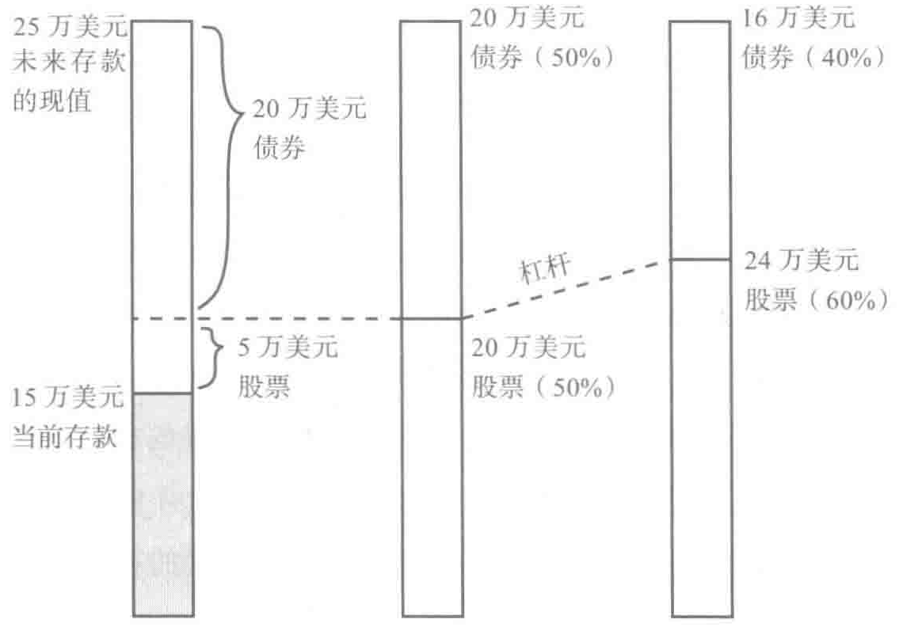

# 生命周期投资战略的使用禁忌

先别忙着赶紧使用生命周期投资战略，考虑一下市场时机选择者"MT"的建议，他曾经因为遵循自创的杠杆投资战略而输得血本无归。[^15] MT 是个学经济学的研究生。他凭借自己的投资嗅觉，决定年纪轻轻就要开始提升自己的投资额，做到分散时间投资。遗憾的事情在于他是在 2007 年秋季决定实施这个投资方案的，当时正是市场见顶的时候。截至 2008 年 11 月，他不得不清算自己的资产组合。那个时候，市场时机选择者拥有 21 万美元。

MT 杠杆投资的比例不仅仅是 2：1，他是全力以赴。他通过出售看跌期权增加杠杆，当市场大挫的时候，损失非常惨重。他不仅把钱投进简单的指数基金里，还把所有的钱反向押注，投在了他认为被严重低估的金融服务领域里。他很不幸，投资了个人银行股票，尤其是花旗银行的股票，而花旗银行的股价从 57 美元骤跌到 45 美元的时候，MT 觉得应该出售看跌期权。最后，花旗银行的股价下跌到了每股 1 美元以下，而 MT 早就被挤出了市场。

作为一个研究生，MT 可没有 21 万美元来豪赌。他的贷款来源是信用卡。虽然很多创业者创业初期都是靠信用卡来获得资金的，MT 却用信用

卡来完成个人杠杆投资。

理性的选择应该是减少对银行股票的投资，而改成其他投资。这正是我人生转向低谷的时候。我对金融投资的兴趣才刚刚开始，希望用申请多张信用卡的方式来获得资金，但是就是这种投资战略让我栽了大跟头。我开了很多张卡，将银行卡里的钱投资收益更高的地方。我当时没有减少对赔钱的银行股票的投资，反而不断利用杠杆借款把资产组合的金额翻倍，甚至三倍，然后投资LEAP股票指数，出售标准普尔500指数的看跌期权。我在开展这些投资行为的时候试图说服野心膨胀的自己，冒险投资数万美元的举动是谨慎的。

MT 违反了我们提倡的投资战略的所有规则，希望大家能明白。在投资的时候把杠杆比例限定在 200% 上，而 MT 一开始就采用了 400% 的杠杆比例，并且在股价大跌的时候不断增加杠杆比例。我们的投资战略是在股价下跌的时候重新分配资产比例，从而减少在股票市场的投资敞口，而 MT 却继续增加买入的数量。这表明，当他的资产价值缩水到零的时候，他的杠杆比例将变为无穷大。我们希望大家分散时间投资，而 MT 却对某一种股票下了大注。他利用信用卡借款来购买股票，为此支付高昂的 15% 的利息。

在现实生活中，我的继父知道我年轻气盛，人很自大，书读得不错就自以为能够通过投资让个人的资产账户价值不断翻倍。我了解了美国长期资本管理公司（Long-Term Capital Management，LTCM）的市值和奈德霍法（Neiderhoffer）的回忆录，认定自己的想法可行。但是2008

年10月以后，我常常失眠，一直想弄明白其实这样的杠杆比例是不合适的，但是我没有清醒过来。当时的我已经处于一种失去理性的状态，总是寄希望于我对公允价值的估计是正确的。当初我的空想害了我，希望我能牢记这段惨痛的经历和教训。

因为各种理由，MT不想透露他的个人信息。他在网上的头像是正在同假想敌作战的唐·吉诃德。这个故事后来的结局出人意料。最近这个人发布的信息表明，他通过投资捞回了本，而且还清了债务。在针对亚洲市场的投资战略痛定思痛后，MT发现了全新的套利交易战略，并以此来赚钱。有一天，你也许会在他的个人传记中更清楚地知道他的整个奋斗史。

绝大多数投资者在快退休的时候，投资的市场敞口总是偏大。MT走向另外一个极端："退休账户资金投资是一个长达40年的博弈。我从来没有想过要把所有的身家都投进去。"更好的办法是避免走极端，通过分散时间投资战略降低风险。

MT 的个人经历为我们提供了投资的反面教材。我们会在下文阐述让投资者陷入困境的心理因素，届时会重新审视他的个人经历。一开始，我们先回答一些非常实际的问题，比如如何使用信用卡。有些信用卡自称提供无息贷款业务，这不过是忽悠你开卡的理由。一开始会让你觉得太划算了，但是滞纳金高得吓人，之后利率就一路上扬。我们不仅反对利用信用卡贷款进行杠杆投资，在你还清信用卡的债务前，我们也不建议你购买任何股票。

## 不要背上信用卡的债务：代价高昂

> 如果你有能力投资股票，并获得 100% 绝对安全的、更高的无息免税

回报，你就没有理由投资回报率为 8% 的股票。我们在撰写本书的时候，消费者信用卡的平均利率是 14.67%，[^2]还清信用卡债务是绝对最有回报的金融投资。

我们假设你很幸运，信用卡透支的额度只需要 8% 的利率。其实你还清了债务，就等于进行了回报率为 8% 的投资。这种回报不需要缴纳任何税费。因为你在偿还信用卡的利息，所以无须纳税。但如果你是赚取利息，那就得另当别论了。

我们这里举一个例子来说明。你的信用卡欠费 1 万美元，利率（年度成本百分率，APR）为 8%。

贷款年度：你欠款 1 万美元。

第一年：你欠款 10 800 美元

第二年：你欠款 11 664 美元。

第三年：你欠款 12 597 美元。

第四年：你欠款 13 604 美元。

第五年：你欠款 14 693 美元。

第六年：你欠款 15 869 美元。

假如你现在拥有了 1 万美元，可以还清信用卡的债务。你今天就偿还所有的欠款，其实相当于你提前拿到了 5869 美元。

如果你把这 1 万美元投资股市，而不是偿还信用卡债务，你每年能获得 8% 的回报，到第 6 年的时候，你会有 15 869 美元。但这也只够你偿还信用卡的债务。

不过你拿到的回报还不够还本。为什么？因为你要对 5869 美元的资本收益缴纳税费。另外，你还得承受巨大的投资失利风险。市场每年都上涨 8% 的概率比较低。

之所以要投资股票，主要原因是它的平均收益要比债券的平均收益高。这一点固然正确，但是股票投资的回报不会比信用卡的利息更高，因为股票投资的回报不可能达到14.67%，而且资本收益也不可能免税。

投资中一定要记住这条规定：即使是伯纳·马多夫（Bernie Madoff）也不可能给你带来免税的14.67%的回报。他可是个大骗子。偿还了信用卡的债务，你就不会让自己掉入偿还14.67%利息的无底洞。因为要从其他投资渠道获得无税的14.67%回报率可不容易。你现在还清信用卡的债务，日后就不需要偿还14.67%的利息了。这与你投资获得14.67%无风险无税的回报一样划算。[^16]

当然，信用卡的利率和费用加起来往往超过了14.67%。记住，14.67%只是平均利率。20%的利率也不是什么稀奇之事。利率越高，你偿还信用卡债务所获得的潜在回报就越高。

信用卡债务的偿还与我们提倡的200/83比例投资战略矛盾。问题不在于分配原则，而是你应该拿多少钱去投资的问题。如果你信用卡里还欠着钱，就不要再挖空心思去投资股票或者债券，如果你的本金是零，经过杠杆作用后，你的投资账户依然是零。[^17]

除了信用卡债务，还有其他五种情况下，我们不赞成使用杠杆投资。

（1）你能用来投资的金额不足4000美元。

（2）工作单位已经帮你缴存401（k）养老金计划。

（3）你手头的钱仅够支付孩子读大学的费用。

（4）你的薪水高低与市场行情直接挂钩。

（5）你一旦投资赔了钱，就寝食难安。

## 最低投资

要获得杠杆，最划算的方法是购买能大赚一笔的看涨期权。问题是看涨期权都是以100的倍数出售的，以合约来进行交易，你能买到的提供2:1的杠杆比例的看涨期权至少也得花费4500美元。

为了获得2:1的杠杆比例，你需要拥有合约价是市场价一半的看涨期权。记住，这些期权与SPDR指数挂钩。2009年夏季，SPDR合约交易价为90美元，这表明看涨期权的成交价应该是45美元左右，而对应的看涨股票价格应该高于每股45美元。SPDR的每份期权合约都是100股起购的。因此，你能获得的杠杆投资最小的购买总价应该是4500美元左右。

你可以以成交价为50美元而非45美元来购买期权合约，从而减少第一次的投入。但是无论你如何分割，要投资就必须购买一份合约。这样一来，相当于获得了投资美国标准普尔指数9000美元的敞口。因此，如果你的本金不够4000美元，那么你的杠杆比例过大，就不适合马上投资。

还有一种可能是使用保证金借款来实现杠杆效应。传统的股票经纪人，包括富达和先锋，它们对于利用保证金借款购买股票收取高额的利息，这表明投资的举动不太划算。还有一些互联网的期权，比如互动经纪人，但是它们要求最低开户金额是1万美元。当然，这对一般的新手投资者而言不值当，也行不通。

如果你能用来投资的金额不足4000美元，你投资的关键就是不赔钱。你可以直接投资股票。遵守100%投资股票的原则，这是你正确投资的第一步，在你的账户资金增长到投资金额本身不再是个问题之前，需要遵守这一条原则。

> 就算你一开始的投资金额超过了4000美元，你刚起步没有问题，但

在重新调整投资组合的过程中会有麻烦。为了分析这个问题，我们再来看看安德鲁·维斯坦的例子。他投资了大约5000美元在LEAP股指期权上，获得了10万美元投资股市的敞口。如果市场上涨 10%，他的投资总额就上涨 20%，从5000美元上涨到6000美元。同时，他的股票投资组合就将增值到11 000美元。此刻，他还没有使用2：1的投资杠杆。为实现2：1的杠杆，他还要再买入1000美元的股票。

指数合约不是按照定期增加1000美元的方式来出售的，所以他无法使用LEAP投资来做到杠杆投资。最简单的方法是使用保证金购买股票。但是安德鲁没有多余的500美元作为保证金来购买1000美元的股票。当然，安德鲁可以以6000美元出售当前的LEAP指数合约，然后使用保证金来买入另外一份LEAP指数合约或者股票。但是他要为此支付短期资本收益的税金和额外的交易费，包括买卖差价（bid-ask spread）。

对于新手投资者来说，短期内重组投资组合不切实际。我们使用年度数据进行了历史模拟，重组投资组合的频率为一年一次。结果发现，如果晚一点重组投资组合并不会带来太大的问题。不过在市场大涨的时候，投资者的确需要增加投资额，并对资产组合进行重组。如果你没钱在互动经纪人上开立账户，这就是个大麻烦，你也就没有使用LEAP获得杠杆效应的余地。

还有一个需要注意的信息是，如果你只需要设定退休金投资组合，然后后续就不想去管理这个投资组合，那么生命周期投资战略可能就不适合你。使用杠杆投资需要你关注投资的进展情况。我们希望很快市面上会出现使用杠杆的目标日期基金，可以全盘包揽一切细活，投资者就不用自行对投资组合进行比例调整，因为基金投资战略会自动按照你的年龄增长来减少对股市的投资比例。我们针对生命周期投资战略已经申请了专利，希

望能在不久的将来推出这样的基金产品。当然，如果你的确不愿意花力气自己调整投资比例，进行了初始投资设定之后，就不太想去管理投资组合，你可以按照一开始 100% 投资股市，后续遵循 100/S 的比例进行，S 就是你的萨缪尔森份额。

## 匹配 401（k）养老金计划

如果你很幸运，单位已经帮你缴存了 401（k）养老金计划，你就应该充分利用这个计划的优势。当你个人缴存 100 美元时，这个账户就会多出 200 美元，因为单位以 1：1 的比例缴存。这就好比你投资即刻获得了 100% 的回报。

在理想的情况下，你应该对这 200 美元采用杠杆进行投资（至少在你年轻的时候，要抓紧利用杠杆投资）。在这种情况下，你会获得 400 美元的股票投资敞口。到目前为止，唯一的问题是相关的监管规定不允许你在 401（k）养老金计划内部使用杠杆。

因此，你能做的要么是把钱投入个人退休金账户（或其他税后账户），这样你就能利用杠杆，或者存入 401（k）账户并放弃杠杆投资计划。401（k）养老金计划的税收优势和工作单位代为缴存的特征会让你毫不犹豫地选择存入 401（k）职工养老金账户。如果你直接就有 200 美元来投资了，就不必用 100 美元加上杠杆来投资了。

这两种方法都能让你获得相同的市场敞口，但是如果市场上涨 25% 的话，会出现什么情况呢？如果你一开始就用 200 美元投资，你将获得 250 美元。如果你用 100 美元杠杆投资的，你依然能获得 50 美元（算上利息要稍微少一些），这样你也有 150 美元。

如果单位帮你按照 1：1 的比例缴存 401（k）养老金计划，那么比较结果就很明显了。如果你的单位缴存比例是 50%，那么你个人缴存 200 美元，单位会帮你缴存 100 美元，你可以通过利用这笔养老金加上一定程度的杠杆比例进行投资。你比别人有了更好的起点：投资额中有 50% 是无风险的。

如果单位有匹配的退休金 401（k）项目，那么你很幸运，但这并不代表你不需要本书的建议，本书依然能帮助你。就拿 401（k）本身而言，本书的理念能帮助你走好每一步。你不需要采用 200/S 的投资战略，你只需要按照 100/S 的比例投资就可以了。每当你需要将超过 100% 的个人存款投入市场的时候，你就应该全力投入。你最终的目标是达到萨缪尔森份额，只是你的起点是 100% 的个人可投资资产。

虽然相比 200/S 比例投资战略，100/S 比例投资战略的投资回报没有那么高，但是这种投资战略还是非常值得的。与固定的 75/75 比例投资战略相比，100/58 比例投资战略的平均回报与之相同，但是标准方差降低了 24%；100/80 比例投资战略的风险水平与之一样，但是平均回报高出 24%（这两个数字竟然一样，也太巧了）。你可以利用 100/S 比例投资战略胜过使用生日规则投资战略。100/71 比例投资战略比生日规则投资战略所带来的平均回报高出 33%，而在遭遇最差的投资环境时，前者的投资回报比后者也高出了 20%。两种投资战略出现最糟糕的投资情形的概率都是 1%。

当然，如果你有足够的资金，除了缴存401（k）养老金计划外，还有资金投资股市或者建立个人退休金账户，那么你就可以对其他资产进行杠杆投资。绝大多数用人单位会为员工缴存退休金，典型的方式就是按照员工薪水的5%缴存。超过这个比例，员工都得自掏腰包。如果你有能力缴

存更多的退休金，你就应该针对罗斯个人退休金账户进行杠杆投资，前提是你有资格建立罗斯个人退休金账户。[^18]

我们要指出的是在你把个人存款投入个人退休金账户准备进行杠杆投资前，你首先要充分利用用人单位代为缴存的401（k）退休金计划。利用这种计划，你虽然不能使用杠杆，但是用人单位帮你缴存，情况就更好了。在这种情况下，你依然可以使用100/S的投资比例分配。

## 为大学攒好学费：要未雨绸缪

我们绝大多数人的储蓄账户都不止一个。其中一个是为了退休后的生活，另外一个是为孩子上大学准备的钱，还有一个是应急账户。虽然很多人未必会把钱分开储蓄，但是这些存款，具体如何使用，我们每个人都得心中有数。这就引出一个问题，我们是否应该把这些资金放在一起投资，如果可以的话，具体应该怎么办？

为了回答这个问题，我们假设有一个人已经40岁，为退休生活存了9万美元，为孩子的大学教育存了5万美元，算上未来收入的31万美元，你的总存款是45万美元。你将如何分配这45万美元？

首先，得看你采用怎样的投资战略。假如你选择使用200/50比例投资战略，你会把退休储蓄账户总额的一半投资股票。但是真正的退休金存款不是45万美元，因为其中有5万美元是用来支付教育经费的。因此，你应该把40万美元的 \(50\%\) 作为萨缪尔森份额，即20万美元。当然，你现在还没有20万美元，你可能需要使用杠杆进行投资。问题是你是会对既定的9万美元退休金账户按照 \(200\%\) 的杠杆进行投资，还是会对14万美元按照 \(143\%\) 的杠杆进行投资，从而实现20万美元的投资目标。在这里混合投

资就是个好办法。你可以轻松地实现20万美元的投资目标，而如果你只用9万美元去投资，即使用上杠杆也无法轻易实现20万美元的投资目标的。这表明，在实际操作中，你可能需要借6万美元。如果不借钱，用现有的6万美元按照2：1的杠杆比例进行投资，剩下的8万美元无须使用杠杆比例。[^19]

也就是说，你暂且借用本来用于支付大学学费的5万美元投资股市。事实上，你手头有这笔现金可以大大增加你投资市场的敞口。这样，投资额就能达到20万美元，而不是18万美元就到顶了。利用这笔5万美元，可以减少你从其他地方贷款的麻烦。你只需要挪用一下现有的资金而已。

如果你把所有的资金都投资股票，但突然出现你要支付2万美元学费情况，你该怎么办？你必须得筹到钱。一种办法是贷款。联邦加贷款项目（Federal PLUS loan program）就是专门为有偿付能力的父母提供贷款的项目，利率是8.5%，如果你采用的是自动扣款服务，费用会降低0.25%。[^20] 这比绝大多数信用卡的服务好多了。如果你是通过借款然后再用杠杆进行股票投资的，这样的利率还是太高了。不用贷款就相当于你进行了毫无风险的回报率为8.25%的投资。这比你投资绝大多数股票获得的回报都要高。所以如果你有其他的资产可以抵用，就不要轻易去贷款。

在我们的例子中，你有14万美元的资产，按照143%的杠杆比例进行投资。你突然需要支出2万美元，最好的办法就是先从股票账户中提现2万美元，剩下12万美元投资股票。剩余的资金按照167%的杠杆比例投资，从而保持20万美元股票投资的敞口。这样一来，你虽花掉了2万美元，但在股市投资的敞口没有变化，只是杠杆比例发生了变化。

一般的原则是你首先要用可流动的资产来支付学费，这可能会暂时提升你投资的杠杆比例。如果你没有足够的流动资产来负担子女的生活教育

费，那么你就别无选择，只能去贷款。贷款之后，还款就是你的当务之急。

还有一点需要提醒大家。如果你的账户价值缩水到既定水平，就得赶紧变现了。比如，你以 \(143\%\) 的杠杆比例投资了 14 万美元，市场却下跌了\(45\%\)，那么你的账户价值就降低到了 5 万美元。这刚刚好是你准备给孩子上学用的。碰到这种情况，你要赶紧割肉离场。

大学费用这个例子为我们如何从退休金账户中留存备用资金提供了参照意义。大部分投资者上有老、下有小，除了为孩子上学和结婚存钱，还要为赡养老人以及突发情况的应急等进行储蓄。这里的一大原则是为了明白退休金账户的现值，我们必须先努力扣减当前退休金账户的现值。萨缪尔森份额应用的对象是资产净值，在本书前面这个例子中是 40 万美元（45 万美元减去 5 万美元）。如果你希望留出 8 万美元孝敬父母，那么你的退休金账户当前余额的现值就是 32 万美元（而净资产投资的目标也降低到了 16 万美元）。这个例子表明心中有数是投资的前提，因为我们可以及时区分存款的不同用途和额度。正如本文所显示的，其他形式的存款能帮助你减轻现金流动性的束缚，也能帮助你更快地实现投资目标。

## 华尔街离家很近

我们接下来谈论的是各位投资者需要考虑的最重要的投资禁忌。对于绝大多数读者来讲，我们可以断定的是未来收入的价值与市场的关联度相对较低。如果你是公务员、教师、汽车修理师或者律师，你的薪水就不会随着市场行情起起落落，至少起伏的幅度不太大。当然，如果你是负责企业兼并案子的律师，你的收入可能与市场的关联度较大。

> 最近发生的情况可以很好地验证这一点。在 2008～2009 年，你的收

入变动情况如何？如果你的收入没有下跌很多，那么你的工作和市场的关联可能就不是很紧密。

教师的工资是受市场浮动影响最小的。2009年，大学捐赠基金大幅度下降，很多大学采取了固定薪资的政策，这样薪水就不会随着通货膨胀和职称的变化而变动。这表明，对于绝大多数教授而言，其薪资收入与市场的关联度非常低，大约只有 \(5\%\) 或者 \(10\%\) 。因此，教员在看待与人力资本关联的未来收入的价值时，未来收入更像是债券而非股票。

对于金融学教授而言，教授薪资水平与市场的关联度要高一些。从2000年到2007年，很多大学的金融教授跳槽去了华尔街，结果，他们的薪水大大增加。既然华尔街的吸引力在下滑，几乎没有投资银行打算挖大学的墙角，那么大学就没有给这些教授加薪的压力。的确如此，教授的薪水要更上一层楼，还得经历一段时间。

关注薪水会忽略两个重要的特征。除了加薪和降薪外，员工是有可能下岗的。如果你失业了，你的未来收入将大大降低。如果你的职业和股市状况都和总体经济形势相关，那么你未来的收入就具备了股票的一些特征。

对于房屋所有者，另一个隐藏的相关因素是房屋的价值。在这次危机中，如果你的房子位于密歇根州，那么你不仅有可能会丢掉工作，你的房子也会贬值。

约翰·希顿（John Heaton）和黛博拉·卢卡斯（Deborah Lucas）从多个行业入手分析了这个问题。[^21] 根据1979～1990年个税申报的情况来看，普通人的薪资上涨和股市表现之间呈现一定负相关的联系，而房价上涨和股票价格之间呈现很大的负相关（-20%）。这些因素都表明未来的薪资和房价水平都有可能减少你在股市的投资敞口。

> 虽然普通职员涨薪的情况和市场呈现负相关关系，但不同人群之间的

差异较大。32%的人群这两个要素之间的关联度为-15%～15%；33%的人群两者的关系为-15%以下；而35%的人群两者关联度高于+15%。这表明，对于65%的普通人来讲（他们没有业务收入），没有必要担心未来收益和市场之间的关系。

即使你是未来收入和市场行情呈现正相关的35%人群中的一员，你依然想要采用杠杆投资，只是杠杆比例要低一些。我们来看一下一个未来收入和市场行情呈现高度相关（20%）的投资者的情况。有个投资者40岁了，已经存了15万美元，未来可投资收入的现值是25万美元，这样他的可投资总额就是40万美元。他的目标是投资60%进股市，那么就是24万美元。由于他未来的收入与市场高低相关（20%），那么这就表明又有5万投资股市了。

理由如下。如果市场上涨10%，我们期望这个投资者未来收入本身能上涨20%，那么考虑市场上涨的因素就是2%。他打算未来再存款25万美元，其中80%即20万美元买入债券，另外20%即5万美元买入股票。如果市场上涨10%，我们认定25万美元这部分会上涨2%，即到达255 000美元。这就好比20万美元投资债券，而另外5万美元投资股票，并和市场一同上涨10%。

为了实现24万美元的目标，投资者需要再投19万美元在股市里。如果他当前的投资额是15万美元，杠杆比例是126%，他是可以实现这个目标的。具体情况如表6-1所示。

弗莱戴斯拉夫·克莱切克（Vladyslav Kyrychenko）最近的著作阐明了不同行业里人力资本和股市之间的关系。[^22]对于那些就职于金融、保险和房地产行业的人而言，两者的相关度是21%；对于那些就职于制造业的人而言，相关度是17%；对于就职于公共管理事业单位的人而言，两者的关联

度在 4%；而对于就职于批发零售行业的人而言，两者的关联度为 -7%。[^10]

*图 6-1 为人力资本调整杠杆比例*

不管你未来的收入更像是摩西·米列夫斯基（Moshe Milevsky）所描述的股票或者是债券（我们后来知道了米列夫斯基是克莱切克的博士生导师）。[^11] 对于一个典型的 40 岁的终身教授而言，米列夫斯基建议要将个人存款的 280% 投资于股票；对于破产的律师而言，则需要投资 170% 在股市中；对于机械工程师而言，需要投资 125% 在股票上；而对于投行从业者而言，其投资的比例应该是 60%。[^12]

对于那些业务收入占个人存款大部分的人而言，情况则大不相同（比如创业者和小型公司老板）。他们取得的主要是经营收入，所以他们的市场投资敞口要比工薪阶层的投资敞口高很多，业务收入和市场行情的关联度是 14%。此外，这个群体的人还往往在公司中持有大量股票，因此他们的投资分散程度不高。如果你属于这个群体的人员，那么也没必要采用杠杆

来获得预期的总体市场投资敞口。

## 重蹈覆辙

如果你在 30 岁的时候把后半生所有的积蓄都赔光了，你会怎么办？我们认定你的回答肯定是：情况不妙。没关系。虽然你年纪轻轻赔掉一辈子积蓄的概率较低，但我们还是要考虑这种情况。如果你在 2008 年时的投资杠杆比例是 2:1，那么你很有可能把你终生积蓄的 64% 赔掉。

这看起来很多，事实如此。但是关键在于那个时候的比例虽高，但是绝对值很低。以两个投资者为例。一个 30 岁，按照 2:1 的杠杆比例投资了 1 万美元在股市；另一个投资者 60 岁，有 25 万美元的存款，其中 50% 投资于股市。

2008 年，30 岁的投资者可能会失去 1 万美元中的 64%，即 6400 美元；而 60 岁的投资者可能要赔本 36 500 美元（15%），两个数据的绝对值比较一下，后者是前者的 6 倍。我们的观点是 60 岁的投资者面临的情况要比 30 岁的投资者面临的情况糟糕很多。关键是你最后赔本的金额和你所拥有的终生储蓄的比例问题。

年轻的投资者在市场上的投资量很少，所以即使当时损失比例很大，也不会对未来终生财富的账户产生较大的影响。因此，趁年轻的时候，一定要多投资，而在快退休的时候，一定要减少自己在市场中的投资敞口。虽然赔本生意总是让人觉得很难做，但是年轻的时候容易接受，因为年轻的时候赔本的绝对值小，且有充分的时间进行调整。

知道了这个建议以后，我们要向大家提出一点忠告。你可能会从理论上认可这一点，但如果你曾经在 30 岁的时候赔掉了 64% 的身家，你还有

勇气坚持这个投资战略吗？我们的计划要求你越挫越勇，在经历失败后，依然返回股市按照2：1的杠杆比例投资。如果你认定自己会在这一刻放弃，也许一开始你就不应该开始投资，也许你一开始就用100%的资产投资股票就行，不用杠杆。

还有一个心理要素需要考虑，那就是你想要翻倍下注的冲动。如果你的资产组合价值下挫了64%，你可能会认为市场出错了，现在正是加大投资的时候，股市陷入抛售潮正是买入的时候。市场时机选择者MT就是这样做的，而这也就决定了他的命运。

如果市场下挫时你进行了杠杆投资，那么你的股票价值将会下跌得更快，由此杠杆比例也在迅速上升。一旦市场的波动幅度超过了10%，就是该抛售股票，降低敞口的时候了。如果你在2008年的时候重新调整自己的资产组合，情况就会大大不同。虽然市场下跌了36.6%，我们用2：1杠杆投资的资产组合价值却下跌了64%，而非73.2%。理由是重新调整资产组合要求投资者不断抛售，而这恰恰在市场下跌的时候及时止损了。[^23]

抛售能让你的杠杆比例保持在2：1。这是生命周期投资战略卓有成效的投资步骤之一。如果你是那种不知道如何止损的投资者，也许杠杆投资就不适合你。

以下一些市场时机选择者日记的选段可以帮助大家了解聪明的青年才俊，即使懂得金融知识，也会轻易被情绪左右、无法理性投资的过程。

从理性的角度来看，我应该降低杠杆比例，认识到要止损，先离开，然后再在合适的时候回来。此时，我觉得自己就像亚哈一样，断腿之后，希望能向白鲸复仇。

2008年9月15日，美国标准普尔指数停留在1193，净值为-105000美元

> 我从来没有想过自己会深陷泥潭无法自拔。

2008年10月10日，美国标准普尔指数停留在899，净值为-165000美元

我打算拿我现在所剩无几的资产赌一把，我打算一开始的杠杆比例是4～5倍，如果我被挤出市场，我就完了。实际上，我认定美国标准普尔指数不会在低于800的水平上交易。

2008年10月15日，美国标准普尔指数停留在908，净值为-180000美元

保证金余额不足的警告邮件接踵而至。美国标准普尔指数预计会停留在855左右。我不能确定接下来会发生什么。这些情景是我从来没有遇到过的。我无法理解为什么会损失了那么多。如果我在世界棒球职业大赛上赌球输掉100美元，都会觉得很泄气。如今我赔了21万美元？我都不知道自己有什么感觉了。如果我一年前意识到今天我会置于这种境地，我可能会换一种投资方式。

2008年10月24日，美国标准普尔指数停留在855，净值为-205000美元

我的账户马上就要清算了，我在想如果我是在未来5年内比较平均地分散这些损失，我会不会有不同的感觉？按照传统的方式赔钱，我心里会好受一些，不就是运气差一点，不是吗？

2008年10月27日，美国标准普尔指数停留在836，净值为-210000美元

大家可以从市场时机选择者 MT 的例子中发现，很难预计人们在赔钱的时候会有怎样的情绪和反应。当然，他的情况比较极端，他不仅没有选对投资的时机，用过高的杠杆比例和集中的投注让他赔得很惨（按照生命周期投资战略，MT 可能会损失 5 万美元，这也是不少的一笔损失了。但至少能保证他在银行里有 3 万美元，且有机会从 2009 年市场回升的时候恢复过来）。在采用 2：1 的杠杆投资前，一定要问问自己是否做好了坚决执行这个战略，无论投资情况如何都能坚持下去的准备。

有些事情说得容易，做起来很难。MT 的几个朋友被他的分析打动，也按照他的方法去投资，不过他们的做法更加谨慎。他们投注很多，一开始就用 2：1 的杠杆比例。随着市场的下跌，虽然他们的资产组合价值没有下跌到腰斩的地步，但是杠杆比例也上升了很多。2008 年的股灾带来的不仅是金钱的损失。我有一个 35 岁的同事，他积攒了 45 万美金，市场见底的时候大约损失了 35 万美元。这笔损失给他的婚姻造成了阴影，后来他不再投资股票（因此也错过了 2009 年股市反弹的投资时机）。这个同事还对他姐姐的资产组合也进行了杠杆投资，他的姐姐也损失了 75% 的个人财富，从此不再把钱交给她的弟弟来打理。

我们从来不会幻想当退休金账户的余额缩水 75% 后，你和家人依然坚信生命周期投资战略的有效性。我们对此唯一能做的就是痛定思痛，从错误和教训中学习。如果你适当重新调整投资比例，就有可能不会损失那么多。就算你在这个过程中没有重新调整资产组合比例，你损失的并不是终生财富的 75%，而是当前退休金账户余额的 75%。假如你的目标是在股市投资 83%，那么即使你有杠杆，也无法做到以高于这个比例的水平来投资股市。当市场在 2008 年下跌 36.6% 的时候，利用生命周期投资战略，你可能会失去 30% 以上的资产价值，而如果考虑社会保障金的话，这个占比

就变小了。这是非常重要的一条原则，可以避免你重蹈覆辙。

## 有点矛盾的建议

我们认为生命周期投资战略不适合所有人。这六大投资禁忌会帮助你远离投资陷阱。从另一个角度来看，有些反对生命周期投资战略的人会认定我们的方法对谁而言都是行不通的。他们认为任何带有杠杆效应的投资战略都是不良的投资战略。我们对于那些习惯了提出尽可能全部变现的理财师们说些什么呢？比如，兹维·博迪（Zvi Bodie）和迈克尔·克洛斯（Michael Clowes）曾经合著《无忧投资战略》（Worry-Free Investing）。书中提出了和生命周期投资战略截然相反的投资建议。他们建议年轻人应该把所有的储蓄都投资于通胀保值的债券中。由于我们建议大家尽可能把资产投资股市，年轻的时候最好能贷款投资，这两种观点肯定有一种是错误的。

我们同意通胀保值的债券是最安全的投资对象。谈及持有债券这个问题，我们也支持大家持有通胀保值类债券，如通货膨胀指数型国债。问题是债券、通胀保值类国库券或者其他类型的债券保险收费很高。这类债券的回报率不高，收费却很高，让绝大多数人无法为退休后的生活存够钱。

博迪和克洛斯提出购买政府的指数系列债券。他们的书于2003年出版，这些债券的利息比通胀率高出 3%。我们在撰写本书的时候，这些债券的回报率下跌到 0.1%。针对投资者个人购买的限额，政府已经规定每个社保号码只准购买5000美元。在这种情况下，你只要将收入的 15% 存起来，就能实现你的退休后目标。但是这对绝大多数人来说是不可能的。[^14]

除了政府指数系列债券外，你还可以购买通胀保值类国库券，两种都是通胀保值型债券。10年期的通胀保值类国库券通常需要支付 1.589% 的

利率（2009年4月的水平）。这样做固然省事，但实际这样操作的不多。因为你只能将个人收入的\(10.8\%\)存起来。[^24]

如果你能把个人收入的10.8%存起来，从23岁的时候开始投资，投资生涯持续44年，就有了一种毫无风险的实现终生投资目标的方法。但是我们在本书第7章会说明，生命周期投资战略给投资者获得了存款额高出4%的投资方法，这种方法成功的概率有90%。[^25]

风险或者概率看起来很不错。同样投注1000美元，你愿意赚2000美元还是4000美元？因为两者的回报相差一倍，后面的选择让人望而却步，尤其是跟1000美元的投注相比更是如此。但是由于风险不高，这样的风险概率不应该让大家畏首畏尾。就算碰到了投资前景不好的情况，你采取这种方法，也能获得双倍的回报。

如何综合权衡这些因素？假如你只能把收入中的\(4\%\)存起来，且你都用来购买通胀保值国库券，你获胜的概率有多大？概率是零。这种方法毫无风险，但你也很清楚这丝毫无法让你实现负担退休后生活的目标。你可以大胆地预计，到了退休的时候，你会存下薪水三倍的钱，但这还不够，远远不够。[^26]对于绝大多数人而言，这种必败的概率会让他们寝食难安。

是的，做任何事情都有风险——从过马路到为了退休后的生活投资皆是如此。我们的目标是帮助你通过分散时间投资将投资风险最小化。这让你能获得充分的市场敞口，有了高的投资回报就能维持生计，在退休后过上安稳的生活。如果你能避免这六个投资雷区，做好准备进行分散时间投资，接下来的两章内容就会带领你明确如何选择战略并有效执行。

[^2]: 投资的结果当然取决于储蓄规律、投资分配等因素。我们将在本书第3章列出所有可能的情况。但投资回报不会受到股票对比债券溢价区间的影响。整体的股票投资额一样，所以投资收益的增加源于更出色的分散投资方法。

[^10]: 因为保证金利息和我们每个月重新调整投资比例，杠杆投资的回报比美国标准普尔指数高出了不止一倍。

[^11]: 我们的建议是购买股票期权来实现杠杆效应。显然19世纪还没有股票期权。按照我们的计算方法，我们假设投资者会按照银行提供给经纪人的利率借款。今天，可以通过股票期权以更低的成本实现投资的杠杆效应。具体内容参阅本书第7章以及第3章结尾的问答环节。

[^12]: 假如你担心我们只分析了那些在大萧条时期退休或者从那个时候开始投资的人所获得投资回报的情况，我们要强调其他时段投资的人也取得了惊人的回报。比如，在1910～1953年投资的人（相当于是在50多岁的时候经历了大萧条的人）使用200/83比例投资战略将获得120万美元的总回报，这比那些从1933年开始投资的投资人获得的总回报113万美元明显要高。

[^14]: 社会保障金收入有优惠的税收待遇，其中最多有85%的收入需要缴税。

[^15]: 编者注：此处脚注对应作者对匿名投资者"MT"这段真实经历的来源或化名处理方式的补充说明。

[^16]: 编者注：此处脚注对应上文关于偿还信用卡债务等同于获得14.67%无风险无税回报这一说法所依据的计算假设的补充说明。

[^17]: 编者注：此处脚注对应上文"本金为零、杠杆后账户依然为零"这一结论的补充说明或限定条件。

[^18]: 编者注：此处脚注对应上文关于建立罗斯个人退休金账户资格条件（如收入限制等）的具体说明。

[^19]: 编者注：此处脚注对应上文6万美元与8万美元资产分配及杠杆比例示例的具体测算过程说明。

[^20]: 编者注：此处脚注对应上文联邦加贷款项目利率及自动扣款优惠数据的引用来源说明。

[^21]: 编者注：此处脚注对应上文约翰·希顿和黛博拉·卢卡斯相关研究的具体文献出处说明。

[^22]: 编者注：此处脚注对应上文弗莱戴斯拉夫·克莱切克相关著作的具体文献出处说明。

[^23]: 编者注：此处脚注对应上文64%与73.2%两个跌幅数据背后具体测算依据的说明。

[^24]: 编者注：此处脚注对应上文10.8%储蓄比例这一数据的具体测算依据说明。

[^25]: 编者注：此处脚注对应上文90%成功概率这一结论的具体测算依据或参见章节的说明。

[^26]: 编者注：此处脚注对应上文"退休时存下薪水三倍"这一预测的具体测算依据说明。