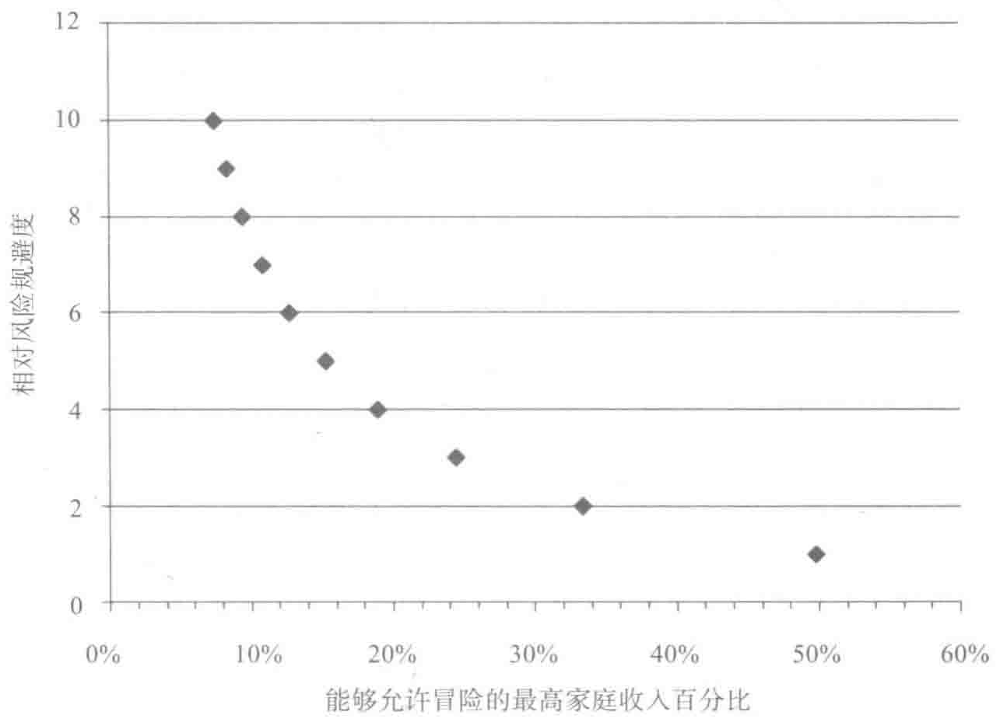
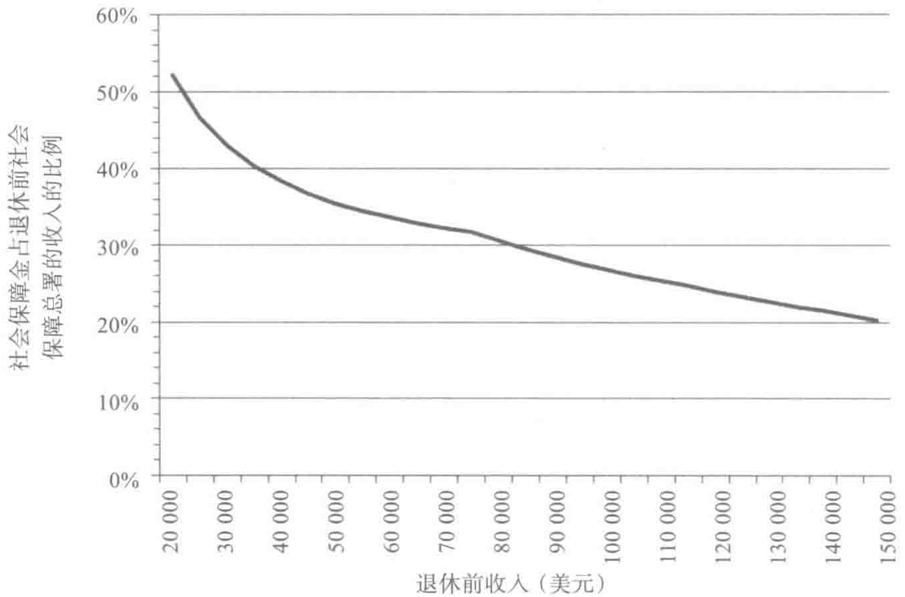

# 第7章 CHAPTER7

## 萨缪尔森份额的确定

假定你是家里唯一一个赚钱的人，你有一份很不错的工作，能保证你一生衣食无忧。你现在眼前有个机会，可以做另一份工作，这份工作有50%的概率能够让你的家庭收入翻倍，另外50%的概率可能会使你的家庭收入减少1/3。你愿意接受这份新的工作吗？

是否接受新工作这个问题是理论上的，但这个问题的答案揭示了你对风险的承受能力。[^1]对于经济学家而言，祖父一辈们对待风险的态度是典型的相对风险规避度（relative risk aversion，RRA）。如果你说你愿意接受这份新的工作，这间接表明了你的相对风险规避度小于2；如果你不愿意接受这份新的工作，那么你的相对风险规避度就超过了2。

你的相对风险规避度越低，你对风险的容忍度就越高。那些无视风险的人相对风险规避度是零。这些人愿意冒任何险，通常情况下他们总是勇于尝试新的事物。

通过回答下列问题，你可以大致了解自身的相对风险规避度。比如说搬家，这可能会危及你们家庭的一半收入，也就是说，有一半的概率这次搬家会让你们家的收入减半，你还会搬家吗？如果答案是肯定的，那

么你对风险的容忍度较高，我们可以推断你隐含的风险系数（implicit risk parameter）低于1（如果你愿意拿家庭的1/3收入冒险，那么你隐含的风险系数介于1和2之间）。

通常情况下，为了确定你愿意用来冒险的最高家庭收入比例，从而获得 \(50\%\) 的概率来将家庭收入翻倍的机会，你可以按照图7-1来计算相对风险规避度。

*图7-1 从愿意拿家庭收入百分比来冒险中判断相对风险规避度*

比如，如果经济形势不佳，你愿意用来冒险的最高家庭收入比例是20%，那么你的风险容忍度较低，你的隐含相对风险规避度是3.76。

曾有成千上万的人被问这样的问题，他们的答案显示了对风险承受能力的巨大差异。 \( ^{2} \)

| 相对风险规避度 | 回应者的百分比 |
| --- | --- |
| 相对风险规避度&gt;3.76 | 64.6% |
| 相对风险规避度&lt;3.76 | 11.4% |
| 相对风险规避度&lt;2 | 10.9% |
| 相对风险规避度&lt;1 | 12.8% |

在所有接受调查的人中，有 \(64.6\%\) 不愿意拿家庭收入的 \(20\%\) 冒险，来换取将家庭收入翻倍的 \(20\%\) 的概率，因此这部分人群的风险规避度很高，超过了3.76。另外有接近 \(25\%\) 的人愿意拿至少1/3当前的收入来冒险，希望换取将家庭收入翻倍的机会。如果你问我们具体的门槛值应该是多少。我们能猜到的相对风险规避度应该是2。但是你无法把你的风险承受力和我们的相比。你应该按照自己的冒险习惯和能力来确定自己的选择。

当然，我们并不完全赞成用一个是否愿意换工作的问题来概括所有人的风险承受能力。但是如果（这个概率很高）你相信这个问题的有效性，按照个人的偏好来设定分散时间投资战略就会变得格外容易。有关新工作问题的答案能让你明白自身的相对风险规避度，至少你可以用将相对风险规避度代入某个公式确定生命周期投资战略行之有度的方法，即确定萨缪尔森份额。

## 萨缪尔森份额 \(= 1.58 /\) 相对风险规避度

这个简单的等式表明如果你的相对风险规避度是2，那么你就应该将79%的个人存款投资股市。如果你对风险的承受能力弱一些，你的相对风险规避度就会上升，那么萨缪尔森份额自然会下降。如果你的相对风险规避度是3，那么你会打算将个人存款的53%投资股市。

当然，你还得想办法计算未来新增存款额用于投资部分的现值（你还得记住前面几章中解释的投资战略和投资禁忌）。从基础入手，你可以将萨缪尔森份额乘以当前和未来存款总额的现值。很快你就知道该投资股市的比例了。正如我们在上文强调的那样，风险规避型投资者一开始应该采用杠杆投资。愿意拿20%的个人存款进行冒险的人，他们的萨缪尔森份额是42%（1.58/3.76=0.42）。这个投资者年轻的时候依然需要采取杠杆手段，从而更快地实现个人的投资目标。

在套用这个公式进行股票经纪账户投资之前，你要问问自己：1.58 这个数字从哪里来？我们的答案会帮助你来确定自己的萨缪尔森份额。

决定你投资股市资产比例的要素不仅包括你对风险的承受能力，还涉及你对未来风险和投资股市潜在回报的预期。

> 萨缪尔森份额的等式具体如下：

> 萨缪尔森份额 = 投资回报 / (风险 2× 相对风险规避度)

其中投资回报是通过预期的股本溢价股票回报超越政府债券回报的程度，风险是通过股票回报的市场波动率，即预期的标准偏差来确定的。 \( ^{3} \)

从历史的数据来看，股票的年均真实回报（包括股利）是7.9%，而波动率是17.86%。 \( ^{4} \)  我们真的很想知道股票回报比政府债券回报高出的溢价。投资股票你要承受两样东西：第一你得承受一定的风险；第二你在未来的某个时候才能获得收益。债券利率是你的耐心获得的回报。股本溢价，即股票回报超出政府债券回报的部分决定你为承受风险能够获得的报酬。即使在2008年市场大跌之后，股票的历史股本溢价也为股票回报率7.87%-债券回报率2.83%=5.04%。

神奇的 1.58 这个数字来自于一个前提：即当前的股市投资风险和回报与过去的相同。

告诉我们预期的股票投资回报将更低，我们就要减少相应的萨缪尔森份额。当市盈率低的时候，我们会因为对未来股票回报的预期增高而增加萨缪尔森份额。同理，我们也可以按照波动性指数的现值以及其他大盘波动性指数的现值来调整对风险的看法。

## 支持相对风险容忍度的一大理由

只要回答一下有关新工作调动问题的心理测试，就能推算个人的萨缪尔森份额，事情要真的这么简单就好了。遗憾的是大家不太相信这样得出的答案。大家谨慎一点是有理由的。

好消息是是否接受新工作的问题要比很多其他心理测试题准多了。如果你登录诸如 www.myrisktolerance.com 这样的网站，你会被问一系列诸如下面所示的问题。

当你在金融的语境下思考风险这个词的时候，你首先想到的是下列哪一项？

> A. 危险

> B. 不确定性

> C. 机会

> D. 激动

这一类的问题纷繁复杂，让人捉摸不透。就凭回答这些问题得出对风险承受能力的数值，简直是天方夜谭，更不用说由此得出股票投资的分配比例了。很难相信像这样的选择题竟是理财顾问评估客户对风险承受能力的指标，并在此基础上给出如何在股票和债券上分配投资的建议。是否接受新工作这个问题，至少能帮助你权衡风险和回报，其他问题的参考价值

不大。

坏消息是人们对于新工作问题给出的答案过分小心翼翼。比如，我们设定下列情景。

Acme 公司打算明天在开市前宣告收益数据。如果销售额实现或者超出了预期目标，股票的开盘价为 110 美元。如果销售额不理想，低于预期目标，那么股票的开盘价就是 90 美元。有 50% 的概率销售额会实现或者超越既定目标。那么你愿意拿个人资产的 10% 投资单只股票，需要达到的最高股价是多少？

要回答这个问题，我们希望大家忽略税收和其他可选投资对象等因素的干扰，也不要考虑今天的股价可能会给明天市场的价格带来利好或者利坏的信息。我们只是很简单地要求你继续投资，有 50% 的概率股票将在 110 美元的价位开盘，有 50% 的概率股票将在 90 美元的价位上开盘。

你在思考这个问题的时候，请留意 90 美元（或者 90 美元以下）的价位并非是合规的回应。每个人都愿意对下跌概率为零，而上升概率为 50% 的投资对象进行投资。

相反，如果你的答案高于 110 美元，你肯定会赔钱，所以这样就没有投资的意义。即使股价只有 100 美元，你也不应该投资。从平均水平来看，你赔的钱和赚的钱是一样的，但你有 50% 的风险。这样的投资很不划算。

简言之，我们希望你的答案介于 90 美元和 100 美元之间。股票 100 美元的平均开盘价得下跌多少，你才愿意加入这样的赌博？如果你对风险更倾向于规避态度，股票得折价多少才值得投资呢？一定要选择介于 90 美

我们反过来分析一下这个问题。我们想要你思考一下如果你没有购买这份保险的情况，这和你在股市投资的情况类似。假如你有机会以100美元的成本买入股票，在大部分情况下，确切地说是94%的情况下，股票每年升值5.40美元。但是其中有6%的可能，股票价值会降低到50.40美元（我们无须考虑100美元的利息，我们可以承担这样的风险，但无须今天就要筹到这100美元）。

这是一次上好的投资机会。按照平均的水平，我们可以获得额外的2.10美元。\(^{9}\)虽然损失49.60美元非常痛苦，但是能防止你参与这样的赌博，也算是值得了。

我们将电话内线修理的风险与股市中遇到的情景类比。如果你没有购买这份保险，那么你实际上是每月帮自己省出了0.45美元，即一年5.40美元。你遭遇内线出问题的概率是每个月\(0.477\%\)或者每年\(5.7\%\)，接近\(6\%\)。这表明，在\(94\%\)的情况下，你不会有维修的需要，你手上就多了5.4美元；而在剩下\(6\%\)的情况下，你得支付55美元。当然，你能用节省下的5.4美元来支付，但你依然需要额外支出49.60美元。

如果你还是不理解我们的观点，可以换个角度来看。你可以把每个月用来支付给电话公司的0.45美元存起来，一年你就能积攒5.4美元。十年后，你可能存下了足以支付一次修理服务的费用。考虑到家庭电话内线出现故障的概率很低，每17.5年才有可能碰到一次电话线路出故障的事情。那么在漫长的17.5年的周期里，你可以省下39.50美元。

这样一来，不仅你不需要购买电话内线保险服务，还应该把这项服务转让给邻居。也许这样做不切实际，你如果真的向邻居提出这一点，他们说不定会笑话你。如果你已经购买了电话内线保险，就赶紧取消掉。我们帮你省下的钱都够你购买本书了。同理，自来水公司也会想方设法说服你，

每个月支付 5 美元，可以保修自来水管。不要购买这项服务。 \( ^{10} \)  提到这个话题，你可能还想到了你的房屋物业政策和汽车保险中也有很多类似的可节省的费用。

有很多理由可以解释为什么人们要购买电话内线或者水管保险。正如经济学家艾迪·格尔哥塔（Edi Grgeta）曾解释说：人们总是有高估风险问题的倾向。 \( ^{11} \)  如果你认定需要报修的概率是每个月 1%，而非 0.5%，那么购买保险合约就很划算。还有相关的解释是人们总是把某些低概率事件的影响力看得过重。在他们眼里，总是把发生概率只有 0.5% 的事件当成是 1% 的概率事件。

即使你理解这样做很不划算，但是你还是担心自己会后悔。如果出现了问题，你却没有购买保险，你会觉得自己很蠢，或者你的配偶会觉得如此。还是买份保险心里比较踏实，这样就不用为这件事情烦心了。

当然，对于金额不大的事情来说，的确完成计算也需要时间，未必就划算。但是这里有一个好办法。如果有人向你兜售保险，他们的目的是为了从你身上赚钱。很少有保险产品的管理费和利润率低于30%。因此，如果你不购买保险的话，你得保证自己能用同样的投资获得至少30%的利润率。

如果你能把保险合约看成一项投资，你就会为一些小风险事件购买保险。使用投资的框架，你可以分析一下电话公司的例子。他们向每个用户一年收取5.4美元的费用，只提供成本为3.30美元的服务。他们的利润率是 \(40\%\) [即（5.4-3.3）/5.4]。这样的回报相当高。

从这个角度来分析，我们很难解释人们为什么这么怕丢掉55美元，他们宁可让保险公司每年获得 \(40\%\) 的回报。水管保修服务也是如此，还有汽车和家庭财产保险等内部都有类似的可以节省的保险项目。

我们在这里最主要的是说明人们对于如何处理风险有各种各样的态度。

职工福利研究所（Employee Benefit Research Institute）研究的结果表明，有超过半数的退休员工在退休后五年时间里的消费水平几乎和工作时的一样。 \( ^{14} \) 鉴于退休后的消费水平与个人的健康水平、是否爱好旅行以及是否为孙子辈未雨绸缪等因素相关，读者也不可能很轻易地就回答这些问题。我们依然坚持70%的规则，你可以按照个人预期的需要来上下调整。

社会保障金能在一定程度上帮助你，当然前提是在你退休的时候依然还有社会保障金。 \( ^{15} \) 如果你退休前的薪水是15万美元，其中有20%的社会保障金，如果你要保持原有的收入水平，重置收入必不可少，那么你的个人存款账户余额至少得有你退休前收入的一半。如果你退休前的薪水是75 000美元，社会保障金占32%，也就是说，你只需要38%的重置收入就能弥补其中的差异。图7-2显示了社会保障总署在线计算器提供的重置收入的占比。 \( ^{16} \)

*图7-2 社会保障金占退休前收入的比例*

让你安度晚年。如果你退休前的薪水上涨了，社会保障金缴纳的费用更多，那么你的存款就要比退休前的薪水高更多倍。在 lifecycleinvesting.net 网站上，我们提供了预期退休前收入和需缴终生年金费用的关系。

## 我的存款够用吗

既然我们已经估计了为购买终生年金需要的费用，现在我们来模拟一下，看大家是否有能力购买。对于一个每年会把收入的 4% 存起来，退休前薪水是 10 万美元的人来说，我们知道要购买终生年金，她需要有 8.2 倍退休前薪水的存款。

针对在 96 个不同年度出生的投资者而言，从 1871 年开始投资的扎卡里，到 1966 年开始投资、2009 年退休的埃莉诺，我们发现了退休时存款的中值情况，具体如下：

采用 90/50 比例投资战略，退休金账户余额为 42 000 美元，是退休前收入的 6.4 倍。

采用 200/57 比例投资战略，退休金账户余额为 834 000 美元，是退休前收入的 8.3 倍。

采用 200/83 比例投资战略，退休金账户余额为 115 万美元，是退休前收入的 11.5 倍。

其中有半数投资者退休时的存款比中值水平高，有一半人员的情况不妙。对于幸运的那一半人，每年省下 4% 的收入，按照 200/57 比例或者 200/83 比例投资战略就足以保障自己安享晚年。但是按照生日规则投资战略投资的投资者就不那么幸运了。90/50 比例投资战略固然风险较低，但是回报率也非常低。依靠这样的投资模式，我们很难实现凑够 8.2 倍退休前

---

[^1]: 投资多元化的指数基金意味着你不需要过分关注市场、季度盈利或其他因素。为了从分散投资中获得最大利益，你应该确保指数基金包含国际或者国内股权。全世界股权总价值几乎有60%源于美国境外的股票交易。至于具体要投资哪只共同基金，要看费用如何。低费用指数基金往往要比高费用指数基金的表现更好。因此，超低费用的富达斯巴达（Fidelity Spartan）和先锋（Vanguard）基金就符合要求。当然，低费用也意味着广告预算更低。如果你碰到某家企业正在花大钱试图说服你投资他们，你应该清楚你也要为部分广告费埋单。