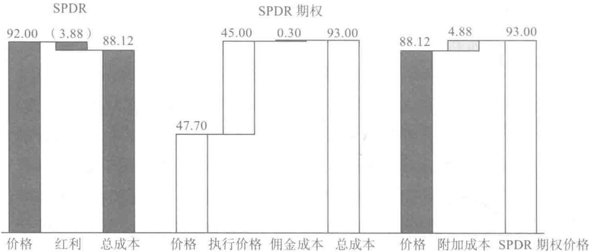

# 第8章 投资机制

在未来的某个时刻，我们希望实施生命周期投资战略就好比管理目标日期基金一样简单易行。目标日期基金就是在投资的初期采用杠杆比例投资的。我们在本书第9章会解释监管部门需要一定的时间才能意识到我们提出建议的价值，才能批准相关的金融产品上市。在此之前，大家都只能自己动手制定具体的投资策略。

本章将向大家阐明如何使用杠杆进行投资的问题。我们会解释如何购买期权，成交价是多少，购买期权的成本是多少，以及此类期权提供的杠杆比例是多少。我们先来分析一下不同的退休金账户及其相应的限制条件。

## 401（k）、403（b）和457退休计划

从实际操作的角度来看，你缴存的401（k）养老金是无法利用杠杆进行投资的。对于非营利的和政府的403（b）以及457退休计划也是如此。这是因为你受到了用人单位既定的投资选择的限制。目前而言，这些养老金计划都是不具备杠杆操作的共同基金，不允许你自行利用里面的资金购买期权。

那我们该做些什么？尽力而为。如果你正处在第一阶段和第二阶段，你想以超过 100% 的杠杆比例进行投资，那么你可以通过将所有的资金都投资在股市中，从而尽可能接近你的投资组合目标。如果你想用 200% 的资产投入股市，但现实中你做不到，那么 100% 投资股市肯定要比 80% 投资股票、20% 投资债券要好。如果你希望用 150% 的杠杆比例投资股市，那么 100% 投资股市还是要比 80% 投资股票、20% 投资债券要好。

还有一个办法，但我们不太提倡这种做法。在某些情况下，你可以把 401（k）养老金账户中的余额进行提款，一半或者 5 万美元，取两者中较小的数目。这个计划的利息是既定的，但因为是你自己挪用自己的款项，利息高低就不那么重要了。

用人单位可能会禁止你提取这笔钱用作特殊用途，比如教育、报销医疗费、交房租免得被赶出门或者买房。即使允许你贷款，你也必须在 5 年内还清。如果你要换工作，也必须立即还清这笔款项。

如果你没有及时还款，那么提现的款项会被视为提前折现，这就要求你立即补交税款，还有 10% 的税务罚款。你面临的情况就是在你最没钱的时候，你还得支付一大笔税额。

对于 401（k）养老金账户里的钱，100% 地投资股票是正确的选择。但是如果想借此进行杠杆投资则风险太大，就不值得了。

## 个人退休金账户

无论是传统的个人退休金账户还是罗斯个人退休金账户，都能让你在投资的选择上有更多余地。更重要的是在实施生命周期投资计划的时候，有了个人退休金账户你就能自己掌控投资的过程。

要实现杠杆投资，有三种方法：①你可以购买股票指数的期权；②你可以用保证金购买股票指数；③你可以投资有既定杠杆比例的共同基金。我们将一一讨论这些投资战略。

我们认为期权是我们进行杠杆投资最好的办法。更具体一点来讲，我们喜欢两年期、高收益的美国标准普尔 LEAP 看涨期权，它的收益非常可观，而且操作起来非常容易（智能手机 APP 的存在使得你可以在任何地方进行操作），只是其中的博弈变得更加扑朔迷离。

你可以对常规的账户（非个人退休金账户）进行杠杆投资。其中的劣势是你得对所有的资本收益纳税，这是购买美国标准普尔期权而非美国标准普尔 500 指数本身的问题，LEAP 期权两年内到期，届时大家都知道谁输谁赢。此外，我们的战略要求你时刻重新调整投资比例，你不能认为买入持有就完事了。

## 如何找到 2:1 杠杆比例的期权

看涨期权（购买股票指数的选择权）能让你进行杠杆股票投资。假如我们想要实现 1 万美元股票投资的敞口。你想要找到一种投资对象，成本低于 1 万美元，但是会随着股价上升或者下跌，这个投资对象能直接反映出股价的实时变化。

你要找的是深实值的看涨期权。这样的期权有什么特征呢？首先其执行价很低，但是你坚信它能实现。例如，如果股指交易价格为 100 美元，期权让投资者有权在 50 美元的时候买入股指，只要在股指期权到期前股指价格高于 50 美元，你就可以行使该期权。你可以肯定的是这是个高概率的事件。

我们假设你最终要求行使该期权。你在购买期权后至期权到期前延迟支付50美元（即执行价）。实际上，将期权出售给你的人相当于借了你50美元。即使你没有被迫行使期权，由于你愿意行使该期权，那么交易的经济学原理就应该不会发生改变。[^18]

以50美元的价格买入可以在100美元交易的指数，这样的期权价格略高于50美元。这表明你可以通过购买执行价为当前指数价格一半的期权，实现2:1的杠杆比例。如果我们回头看一看第1章安德鲁·维斯坦的例子，SPDR的价格是92美元，而看涨期权的价格是45美元，刚好可以匹配。你不需要获得完全匹配的价差。如果看涨期权的价格为50美元，你可能会觉得他的杠杆比例要高于2:1；如果看涨期权的价格是40美元，那么杠杆比例就略低于2:1。

如果你想要降低杠杆比例，有两个方案。你可以对资产组合中部分资产使用2:1的杠杆比例。或者你可以购买杠杆比例更低的期权。比如，你有1万美元，但想要达到股票市场投资的15 000美元敞口。你期望的杠杆比例是 \(150\%\) ，即3:2，可以用2:1的杠杆比例投资5000美元，从而获得1万美元的敞口，然后将另外5000美元直接投资股票，再获得5000美元的敞口。你也可以购买面值更低的期权，购买价为当前价格的1/3。如果股指位于100美元这个水平上，看涨期权的价格是33美元，那么你就只需要借入33美元，即总价的1/3。这个期权的成本就接近67美元。买1.5手这样的期权，成本为1万美元，获得在股市投资的15 000美元敞口。在实际操作中，你无法分割一手期权，每一手期权都是100股的倍数。所以，你以2:1的杠杆投资5000美元，再直接投资另外5000美元是更好的选择。第二种办法还存在另外一个问题，就是并非所有的成交价在市场里都会出现。如果人们以如此低的价格买入期权，这些期权可能早已无法变现，

甚至不再存在。

关于在哪里购买期权的问题，你也有选择权。任何股票经纪账户都可以用来购买期权，你得表现出你是懂点金融知识的。[^19] 有网上股票经纪交易所，比如OptionsXpress.com，在这类网站上交易的佣金费率很低。

关于针对哪些指数购买期权的问题，由于我们都主张更好实现分散投资的组合，我们建议采用标准普尔500指数。你既可以购买直接和该指数挂钩的期权，也可以购买诸如SPDR这样的通过交易所交易基金(exchange-traded fund, EFT)跟随指数的期权。SPDR是以1/10的价格来跟踪美国标准普尔500指数。

我们喜欢与SPDR（股票代码：SPY）关联的期权，因为投资者买得起，且SPDR是市场上最活跃的交易所交易基金。如果股指变现能力不强，那么投资者就不得不支付超高的买卖价差先行买入，然后再出售合约。

对于安德鲁而言，他的长期看涨期权是以股票代码 CYULS 来交易的。只要 2010 年 12 月的合约有效，这个股票代码就持续有效。你会发现其实长期的期权合约是最适合投资的。2010 年 1 月他就开始寻觅 2011 年 12 月的期权合约了。

还有可能直接购买美国标准普尔500指数（股票代码：SPX）的看涨期权。比如，2011年12月的期权合约的执行价是450美元，股票代码是SZJLI。这些合约的变现能力很强。2009年5月，有5000份2010年12月到期，执行价为500美元的期权合约未执行。这些期权的价值大约为2000万美元。问题是，大家可能也已经猜到了这一点，每份期权合约都是100份股票指数起卖的。因此执行价为500美元的单份期权合约可能价格为4万美元（指数大约为900时）。这么一大笔钱不是很多刚起步的年轻人能够负担的。正因为如此，SPDR期权合约是非常好的选择。SPDR能够以美国

标准普尔指数 1/10 的价格交易，每份期权合约的价格大约是 4000 美元。

## 借贷的成本

一份期权扮演了两种角色。首先你能通过期权借款，另外它还能让你免受股价大跌的影响太大。如果期权的成交价是指数价格的一半，防止股价大跌这一点价值不大。该期权的主要成本在于你最终支付的价格要比你一开始就直接买股指所支付的价格高，多出来的部分是隐含的利率。

我们回过头来再看一下安德鲁的 LEAP 交易，分析他借款的隐含成本是多少。他支付了每份 47.7 美元获得在 2011 年 12 月以每份 45 美元买入 SPDR 的权利。在他购买该合约时，SPDR 在 92 美元的价位上交易。因此，和当时就购买 SPDR 相比，安德鲁节省了 44.3 美元。

这相当于安德鲁借了 44.3 美元。他的投资对象的价格波动和 SPDR 合约关联，只是他只支付了 47.7 美元，而不是 92 美元。2011 年 12 月来临的时候，安德鲁还得支付另外的每份 45 美元。如果他在 2010 年 1 月直接以 92 美元购买的话，还便宜一些。现在安德鲁得支付 47.7 美元 + 45 美元 = 92.7 美元。因此，安德鲁得支付多出来的 0.7 美元在 2011 年 12 月购买 LEAP。[^20]

这 0.7 美元是借用了 44.3 美元长达 23 个月的隐含利息成本。这比同样金额一年的利率 0.8% 少不了多少。安德鲁错过了分红的机会，这是更大的成本。

持有 SPDR 的人每个季度会收到分红，该分红反映了美国标准普尔 500 指数公司的红利情况。持有了期权，安德鲁就无法获得这些分红。所以当我们比较购买期权和持有 SPDR 的成本时，我们还得考虑美国标准普

尔股票持股的红利。

通常情况下，我们只要分析一下标准普尔指数历史的分红记录即可。2008年，所有标准普尔500指数公司的总分红是28.05美元，即SPDR合约中每份2.805美元。问题是2008年股价大跌，股票红利从2006年、2007年的 \(1.8\%\) 上升到2009年的 \(3.7\%\) ，上升幅度那么大，让人都无法相信，至少说这样的涨幅不能持久。投资者不会指望公司持续支付同样水平的红利，尤其是那些收益已经承受了巨大打击的公司。我们不知道2009年和2010年期间，最终的红利是多少。为了完成计算，我们认为企业会将红利水平削减到5年以前即2004年的水平，那个时候SPDR每份是1.94美元（当美国标准普尔指数达到900以后，这表明红利水平是 \(2.2\%\) ）。由于安德鲁的期权合约将在2011年12月截止，他将错失两整年的红利。

最后，我们还得加上佣金的成本。买、卖期权合约每一次都需要支付15美元，如果买卖合约一起结算交易成本，就需要支付每份0.3美元。1～10份合约的交易佣金费用是一样的，所以这里的佣金成本是偏高估算的。购买SPDR面值达9万美元（而非9000美元）的期权合约，佣金成本将减少到每份0.03美元。由于安德鲁只购买一份合约，我们会算上整个30美元的佣金成本（见图8-1）。

加上0.7美元，损失的红利3.88美元以及0.3美元的交易费，总共是4.88美元。如果安德鲁直接多支付44.3美元来购买SPDR，不购买期权，这笔费用就能省下来。这样看来，隐含的年利率为5.75%（按照23个月来计算）。

将案例中的数据比较一下可知，购买期权合约的成本相对较高。2009年1月，市场波动性指数超过了40，是历史平均水平的两倍多。这表明不执行期权的可能性展现了投资额价值。购买了SPDR的人可能9200美元都血本无归，而安德鲁的损失最多是4770美元。

*图 8-1 安德鲁隐含的借入资本（单位：美元）*

我们对 1996～2008 年数百份不同的 LEAP 期权的隐含成本进行了计算。我们发现这一时期隐含的利率水平是 4%。比如，2009 年 5 月 26 日（下午两点），美国标准普尔 500 指数的交易价格是 911.23。当时 2011 年 12 月到期，执行价为 500 美元的期权要价是 404.50 美元。因此，购买期权而不是直接购买 SPDR 的成本要低 6.73 美元。[^4] 从另一方面来讲，期权持有者也错失了红利。如果标准普尔公司的年红利跌回到 2004 年的水平 19.40 美元，那么在期权合约于 2011 年 11 月到期前的 569 天时间里错失的红利是（569/365）×19.40 美元 =30.24 美元。这样一来，购买期权的总成本就是 30.24 美元 -6.73 美元 =23.51 美元，即隐含的利息成本是 2.98%。

即使红利保持在 2008 年的水平——28.05 美元，总成本也有 43.73 美元 -6.73 美元 =37.00 美元或者 4.68%。按照具体的红利，利息成本将为 2.98%～4.68%。

如果你想要进一步明确自身交易的潜在成本，你可以登录网站 www.lifecycleinvesting.net，上面有个表单可以帮助你完成每一步骤的计算。

## 其他方法

还有一种获得美国标准普尔500指数2：1杠杆投资更经济的方法，就是购买标准普尔E-mini期货合约（E-mini S&P futures contract）。每一个这样的合约都能让你获得美国标准普尔500指数的50"份"敞口。如果指数上升1点，你就赚50美元。当美国标准普尔500指数在950点交易的时候，每份合约都让投资者获得大约47 500美元的股市敞口。

标准普尔 E-mini 期货合约不需要你一次性缴纳费用，当然你得有担保物（collateral）。合约到期后，你会损失或者赚取原来买入价和美国标准普尔 500 指数价格之间的价差。[^21] 在此之前，标准普尔 E-mini 期货合约的价格是依据供求关系变动而变化的。比如，2009 年 7 月 27 日，12 月标准普尔 E-mini 期货合约的价格是 975.50 美元，而美国标准普尔 500 指数的交易价是 979.26 美元。[^22]

由于标准普尔 E-mini 期货合约的交易价低于美国标准普尔指数，这就好比你折价买入美国标准普尔指数。如果指数走势在整个 12 月保持坚挺，标准普尔 E-mini 期货合约的卖家就会赚取大约  \( 3.76 \times 50 \)  美元 = 188 美元（合约购入价为 975.50 美元，出售价为 979.26 美元，收益为 3.76 美元）。换句话说，无论美国标准普尔指数发生了什么，购买标准普尔 E-mini 期货合约比直接购买美国标准普尔指数要便宜 188 美元。

然而，期货合约的买家会损失红利。在这一期间，买家放弃了大约385美元的红利（我们假定红利收益是 \(1.95\%\)）。因此，净成本就是385美元-188美元=197美元。相对而言，这笔借入成本微乎其微，即用197美元获得连续4个月面值为49 000美元的股票，隐含的利率为 \(1.2\%\)。

> 当然，你得提交担保物。既然你是购买期货合约，而非股票本身，你

就得支付一定的金额作为担保物。互动经纪人要求初始担保金额为 5625 美元（其中至少得在账户里一直保留 4500 美元）。因此，你可以用大约 5000 美元的资金获得 5 万美元股市投资的风险敞口。这相当于是短线投资 10：1 的杠杆。

你肯定很心动了。但别以为只要用指数期货就能实现你的终生投资目标。如果期货合约的价格下跌，你得用上担保，至少得提供 4500 美元。假如指数从 950 下跌到 500。在此期间，你得提供 450 美元 × 50=22 500 美元的额外担保金。这就是每份合约背后必须得有相应的股票来维持 2：1 杠杆比例的原因。

这些合约的优势是它们提供了比较经济的获得杠杆的方式。劣势在于你得不断追加保证金，而且你还得时刻留意、步步为营。这些合约的期限只有几个月，所以你得定时转期。与期权合约不同，如果市场下跌 50% 然后反弹，你不会有机会把股价扳回去，你直接会遭遇平仓。还有一个劣势，这也是期权合约和期货合约重要的区别，很多大型的股票经纪人（比如富达）不允许期货合约交易。因此，如果你想要采用这种方法来达到既定的杠杆效应的话，你必须得在像林德－沃多克公司（Lind-Waldock）或者互动经纪人公司开立账户。我们尝试后，相比看涨期权，这种方法太过于烦琐。

## 用超牛职业基金的方法投资

其实你不用单纯购买期权或者期货合约来获得杠杆，有很多共同基金能帮你解决杠杆的问题。这些基金本身就是杠杆投资的典范，能给你带来投资美国标准普尔 500 指数双倍的回报。

> 在实际操作中，这个情况会更加复杂。首先，基金收费较高。超牛职

业基金（ProFunds UltraBull）的费率是1.5%（针对类似的非杠杆指数基金，该基金收费是先锋基金费用的8倍）。其次，这些基金本身会不断调整自身的投资组合，保证时刻有2：1的杠杆比例。这导致了该基金的回报与那些按月或者按年来保持2：1杠杆比例的基金回报有较大的差别。尤其是当市场上下震荡时，市场波动会导致共同基金回报的锐减。

为了更好地解释这个问题，我们来看一个例子。假如美国标准普尔指数一开始是1000，那么SPDR会在100上交易。有两个拥有1000美元的投资者。投资者甲叫玛吉，使用保证金购买了20股SPDR；投资者乙通过用1000美元投资超牛职业基金获得了2：1的杠杆比例。SPDR会模仿美国标准普尔500指数的表现，从1000多点跌到750点，然后又重新反弹到1000点。

投资者甲在指数下跌25%的时候，失去了一半的投资，当指数反弹后，又挽回了损失。最终是不赔也不赚。

但是在投资者乙的例子中，当指数下跌到750时，基金进行了资产分配比例的调整。此刻，他损失的是市场下跌250点的两倍，所以投资者乙的资产账户价值为500美元。他要用这500美元获得2：1的投资杠杆，他需要获得1000美元股票投资的收益。[^7]遗憾的是，对于乙投资者来说，当指数反弹到1000时，他的资产组合只能获得333美元（即1000美元的33%），净值下跌167美元。

为了保持2：1的杠杆，职业基金（ProFund）在价格下跌的时候会出售股份，在价格大涨的时候买入。每当价格反弹的时候，就会影响最终的表现，因为职业基金在高买低卖。从另一个方面来看，如果SPDR从75下跌到50，玛吉就会失去剩下的500美元，而投资者乙在剩下的500美元中会继续失去333美元。

你可以从这个例子中学到，职业基金的调整比例不是单纯的好或者坏，它只是与众不同。其影响力在很大程度上取决于股价的波动轨迹，而不仅仅是最终的股价。对于每天调整比例的资产组合来说，波动会降低回报，因为该组合的投资原则是在市场下跌时出售，在市场上升时买入。[^23]在市场总是朝着一个方向跑的时候，重新调整比例则会获得更高的回报。好的时候它能获得更好的回报，而在年景差的时候，它能够保护投资者。[^24]

## 重新调整投资比例

重新调整投资比例的问题不仅是职业基金才有。哪怕像安德鲁·维斯坦都应该重新调整自己的投资组合比例。[^25]当安德鲁于2009年1月买入SPY合约时，指数为927点。3个月以后，指数下跌到了835，他的股票价值也从4770美元下跌到了3850美元。由于他当时在美国标准普尔的风险敞口是8350美元，他的杠杆增加到了2.17。

从理论上来看，安德鲁应该出售一部分股票。问题是他不能直接出售一部分股票，把杠杆比例拉回到2∶1。合约是按照100股的倍数来出售的。他可以平仓认栽，然后重新买入执行价接近41或者42的新的LEAP。每一次他都得支付买卖价差。

投资额较少进行投资的另一大附加成本是几乎无法实现重新调整比例。当价格上涨的时候，安德鲁需要追加保证金。问题是他没有更多的钱来投资了。他只能平仓，然后再调整。资本收益会提供额外的资金来实现这一点。假如该账户属于个人退休金账户，税收就不是一个问题（如果不属于个人退休金账户，那么税收就是个问题）。剩下的疑问是来回交易的成本和时间成本，是否让整个调整投资比例的事情还值得。我们认为如果只是为

了稍微改变杠杆比例，那么所花的成本就不划算。如果你的目标是2:1的杠杆，结果实际上你是2.2:1或者1.8:1，这就已经很接近了。市场有超过10%的波动才值得你去考虑重新调整投资比例。

你可能已经留意到上述重新调整比例的性质与传统的调整投资比例的性质完全不同。如果你想要将当前存款的60%投资股票，而股票价格下跌了20%，那么你的投资比例就相当于48/88，即有55%的资产投资于股票。股价下跌表明你需要出售部分债券，并买入更多的股票。[^11]而传统的目标日期基金在2008年股票价格大跌的时候，买入股票的比例一直在下降，这只会让本来不好的投资表现雪上加霜。

为了获得200%的杠杆比例（在第一阶段），你可能一直要追涨杀跌。当股价下跌的时候，你离既定的萨缪尔森份额目标就更远了，你得买入更多的股票。问题是由于你投资股票的份额减少，你的杠杆比例会超过200%，而2:1杠杆比例的限制会告诉你必须得减少你的持股量。

坚持目标：2008年，伊恩发现了一个帮助人们减肥、戒烟、保持理财目标的网站。在stickk.com这个网站中，你可以每月花费500美元来保证自己遵守承诺，每个季度可以重新调整个人的组合。如果你没能信守诺言，你就会有失去那部分钱财的风险。当你建立个人存款账户，可以选择由谁来担任裁判，甚至选择谁将是你失去钱财的受益人。正如雅虎财经所说的："这个理念就相当于你若是不遵守诺言，你就会输钱或者承受其他的惩罚措施一样。这样你会更有可能信守自己的诺言。"[^12]目前该网站已经有4万名注册用户，涉及金额达到300万美元。

总之，当你没有受到杠杆的限制时，重新调整投资比例要求你追跌杀涨。然而，当你才刚开始投资，并受到2:1杠杆比例的限制时，重新调整

投资比例会导致你不得不追涨杀跌。当市场波动较大，重新调整投资比例就会带来巨大的影响。在2008年股市大跌的时候每个月调整带有2：1杠杆的投资组合，能将损失从76%降低到64%。

当然，你也不能过分沉溺于重新调整投资比例的游戏，因为有交易成本，因此过度的调整会让你因为市场波动付出巨大的代价。除非市场波动幅度很大，否则调整的频率不要超过一个季度一次。当然，如果市场震荡剧烈，你也不能偷懒。没能重新调整投资比例意味着你的市场敞口将远远达不到你的预期。

我们的理论表明考虑到你当前账户中资产的价值变化，你要定期重新调整投资比例，因为未来可投资存款现值的变化可能会因为改变你对未来市场风险和回报的预期而改变萨缪尔森份额。由于我们是实用主义者。我们意识到绝大多数投资者会因为每个月调整一次投资比例而心力交瘁。每个季度调整一次是理性的选择（我们建议大家设置日期提醒，比如在stickk.com上建立信守诺言的账户，这会提醒你执行自己的调整计划）。你至少要一年调整一次来确保你的长期资产投资组合和萨缪尔森份额是匹配的。

## 用保证金购买股票

用保证金购买股票是人们获得杠杆比例的传统方式（有时候也因此让自己陷入麻烦）。保证金金额就是贷款。有100美元的投资者可以借款100美元，从而投资共200美元在股票或者股指中。经纪人持有200美元的股票来保证投资者能够还贷，且有权利在股票价值下跌的时候要求投资者追加保证金。

> 当股票经纪人提供保证金贷款的时候，他们也是从银行借款，并支付

所谓的活期贷款利率。这个利率几乎和无风险利率相等。在过去138年时间里，提供这种杠杆的批量操作成本平均保持在超过政府债券平均利率34个基准点上（即 \(1\%\) 的 \(1/3\)）。也许我们认为杠杆投资比较危险，但是这种杠杆作用没有让出借者承担多少风险。诚然，保证金利率应该比按揭贷款的利率更低。

出借保证金贷款的风险比提供房产按揭贷款的风险更低，因为出借方手头的还款保证更加安全。拥有6000美元存款的投资者再借用6000美元来购买股票，12 000美元的股票在股票经纪人手里。而房屋按揭贷款的出借方为价值50万美元的房子提供45万美元的贷款，却没有同样的还款保证。

考虑一下下面的情景。假如股价下跌 \(25\%\) ，我们的投资者损失3000美元，即本金的一半（她的投资组合现在的价值为9000美元，在还清贷款后只剩下3000美元）。出借方没有损失任何东西，依然还有3000美元的股票。相反，如果房价下跌 \(25\%\) ，那么50万美元的房子价格缩水了125 000美元。但是贷款者只有5万美元。这表明出借方的还款保障比按揭抵押的物品价格少75 000美元。如果贷款者违约，那么出借方就得承受75 000美元的损失。

你对此感到很惊讶？因为按揭抵押的杠杆比保证金贷款的杠杆系数更高，因此对于出借者来讲风险更高。此外，出借保证金贷款的一方可以在股票价格下跌的时候要求追加保证金。如果12 000美元的股票价值下跌，保证金出借方有权在股价下跌到贷款余额6000美元以下前出售资产，而房屋按揭的贷款提供者却没有与此类似的权利。这就是保证金贷款的利率比房屋按揭贷款利率低的原因。

真正让人大跌眼镜的事情是很多著名的股票经纪人对于保证金贷款收取过高的利息。比如，2009年7月22日，先锋和富达基金的保证金贷款

利率分别是 7.75% 和 8.575%，而它们的基金收费只有 2%。先锋和富达基金所谓的低成本服务和信用卡的利率差别也不过如此。

幸运的是，如果你四处观察一下，你会发现有更加划算的选择。我们在撰写本书的时候，互动经纪人对于较小面额的保证金贷款只收取 1.65% 的费率（大面额的贷款费用只有 0.4%）。[^13] 它们的公式是联邦基金隔夜的利率（目前是 0.15%）加上根据贷款规模确定的 0.25% ～ 1.5% 的溢价。这比富达基金的利率要低 7%。我们计算的时候，假定投资者按照银行提供给经纪人的利率计算（当前是 2%）。[^14] 这对于寻寻觅觅希望获得合理利率的借款者而言是合理的，但这样的利率依然要比互动经纪人收取的利率高，且比使用标准普尔 500 指数期权合约进行投资获得杠杆的投资者所支付的隐含的利息也要高。

## 购买债券

我们讨论的核心是如何利用杠杆购股，不过我们也希望大家购买债券。当然，债券也不是完全零风险的。违约的可能性不是没有，但通过购买政府债券可以降低这种风险。当然，还有因为通货膨胀导致获得的回报低于预期的风险。此外，还有关于短期或者长期债券哪一种风险更大的疑惑。

有些人认为短期债券的风险系数更高，因为当债券到期或者转期的时候，利率总是会波动。与此相比，长期债券的利率比较固定。和按揭贷款相比就能明确其中的区别。投资短期债券就好比是利率变化的抵押贷款，而投资长期债券就好比是固定利率的抵押贷款。

这个类比恰当，但对于风险的看法很落伍，至少债券不会依据通胀率而变化。虽然长期债券的利率是固定的，但该利率只是名义利率而非实际

利率。我们要关注的是实际利率，即除去通货膨胀影响的净利率。比如，如果债券的支付利率是5%，但是通胀率是2%，那么该债券的实际利率是3%。如果通胀率上升或者下降，而名义利率保持不变，那么长期债券的实际支付利率是变动的，幅度未必很小。我们关注实际利率是因为我们最终要把债券兑现用来过退休后的生活。因此，你要考虑债券的收益对应的购买力问题。如果一张100美元一年期债券的名义利率是5%，而通胀率是2%，那么你在债券到期的时候就只能多购买3%的东西。你会得到105美元，但是物价也上涨了2%。

短期债券的利率会因为两个因素波动：一个是实际利率的变动；另一个是通胀率的变动。一般而言，通胀率波动的幅度比实际利率的波动幅度大。我们暂且假定实际利率保持在3%，如果通胀率为2%，那么短期债券的利率就是5%。如果通胀率上升到5%，那么短期债券利率就会上升到8%。短期债券的优点是它们很快会到期，可以随着通胀率的变动而调整。

就长期债券而言，我们先回到按揭贷款的例子。如果你申请了为期30年的固定利率贷款，抵押物的价值会随着通胀率的变动而变化。如果你一开始支付的利息是5%，而通胀率从2%上涨到5%，那么对于持有者而言抵押物的价值就下跌了3%。你得用贬值的美元来偿付抵押物，结果就是降低了抵押物的价值。从出借方的角度来看，你依然在支付5%的利息，但是该利息与通胀率持平，也就是说你支付的实际利率是0，这对于抵押物的持有者来说就是贬值了很多。持有者必须得出让33%的折扣，才能让抵押物出手。

从房屋所有者的角度来看，你可能会考虑还款额变动的风险，保证自己能按时还贷。其实还有一个隐含的风险，即抵押物的经济价值会随着通胀率的变化而变化。当通胀率上升的时候，抵押物的经济成本下降；而当

通胀率下跌的时候，抵押物的经济成本上升。正是因为这一点，你才会再融资。当通胀率下降时，利率下跌，你能拿较贵的抵押物与便宜的交换。

持有长期债券就如同你走了另一个极端，除非你无法再融资。如果通胀率上升，你持有的长期债券价值缩水；如果通胀率下降，你的债券升值。短期债券的价值不会随着通胀率的变化而升值或者贬值，因为人们总会进行再融资。因此，短期债券的利率会随着通胀率的变化而变化。

短期债券能保护投资者免受通胀的影响，但依然要受到实际利率变动的影响。你希望持有与实际利率挂钩的投资对象，但是这样的金融工具现在还不存在。自从1997年开始，美国财政部开始出售通胀保值的国库券，即TIPS。[^26] 这些债券的面值会随着通货膨胀率而调整，从而保持固定的实际利率。

考虑一张面额为1000美元的通胀保值国库券，承诺收益率为2%，或者每年的收益是20美元（其实是每半年支付10美元）。如果通货膨胀率为4%，债券的利率应该是6%。财政部的做法是调整本金面额，即为1040美元。它按照经过通胀率保值处理的本金来支付利息，而当债券到期的时候，你能获得额外的40美元。

TIPS的优势在于它是与实际利率挂钩的，这也正是我们大部分人认定投资债券的金钱应该都投在TIPS中原因。它的缺点在于本金的变化需要投资者承担额外的赋税。利用个人退休金账户或者401（k）的余额购买债券的人就不会存在这个问题。[^27]

在购买TIPS时，你有三个选项，你可以通过共同基金来购买TIPS。比如先锋通胀保值证券基金海军上将股（Vanguard Inflation-Protected Securities Fund Admiral Shares，VIPX）拥有中期TIPS的资产组合，费用只有20个基本点（0.20%）（如果你有10万美元以上的存款可以投资，海军上将股收取的费用只有0.12%）。

这是最方便的一种方法，你可以随时买入或者卖出，买卖的金额也没有限制。先锋会负责办理所有烦琐的税务会计事项（利息收入和本金增值是不需要缴纳国家和地方所得税的）。

第二种方法是直接购买 TIPS 国库券。这不仅避免了佣金，也能允许你专注于某种期限的债券。缺点在于政府一年只会组织四次拍卖，到期日不同的国库券不是随时都能买到。最简单的办法是通过 www.treasurydirect.gov 的在线账户办理。你可以在网上预购，指定想要购买 TIPS 的面额（面额是 100 美元的倍数）。[^17] 这样下一次政府拍卖的时候，就能优先购买。财政部也会帮助你完成账户内的购买交易。芝加哥联邦储备银行（Federal Reserve Bank of Chicago）作为代理银行，会收取 45 美元的费用。你也可以通过股票经纪账户来购买 TIPS，当然你要支付手续费。

财政部还会发行利率根据通胀率调整的系列 I 债券（Series I bonds）。但是政府限制了这类债券的购买金额，每个人只能购买 5000 美元。更糟糕的是，该债券承诺的利息收入只有 0.10%。

在不远的将来，我们希望共同基金能将杠杆生命周期投资过程自动化。我们知道上述的杠杆投资战略可行，因为我们尝试过。我们已经使用OptionsXpress来购买美国标准普尔500指数的长期期权，也通过互动经纪人利用保证金购买先锋的延展市场指数（Extended Market Index）。伊恩在超牛职业基金也有资金。他已经使用林德-沃多克公司初涉股指期货投资。我们提出这些建议可不收取任何咨询费用，但是我们是OptionsXpress和互动经纪人的铁杆粉丝。伊恩的个人退休金账户在OptionsXpress里，可以在一个账户里持有期权和共同基金资产组合，这一点他很喜欢。正如我们所说的，互动经纪人为那些想要通过部分借款购买股指产品的人提供了非常有吸引力的保证金借款利率。

[^4]: 期权持有者要先一次性支付404.50美元外加500美元，即共904.50美元，这比指数的价格911.23美元低。合同交易的佣金是10美元，每份合同有100股，也就是说，每股的成本只有0.10美元。www.lifecycleinvesting.net上有指数和期权价格的截图。

[^7]: 由于 SPDR 的价位在 75，这表明是 13.3 股的回报，而非 20 股。职业基金投资组合通过出售 6.7 股对价格下跌做出回应，一开始 20 股，现在变成了 13.3 股。

[^11]: 如果你没有按照最大的杠杆比例进行投资，当股价下跌的时候，你会增加杠杆比例。比如，如果你当前和未来收入现值的总额是40万美元，萨缪尔森份额为 \(50\%\)，那么你就得把20万美元投资股票。如果你当前账户拥有15万美元时，就可以考虑按照 1.33：1 的杠杆比例进行投资。假如股价下跌 10%，那么你的资产总值将下跌 2 万美元，余额为 38 万美元，理想的投资股票的金额是 19 万美元。同时，你当前的投资组合只有 13 万美元股票。你依然可以通过将杠杆提升到 46%，从而实现 19 万美元的投资目标。从本质上来看，你还得再购买 1 万美元股票。

[^12]: Walter Updegrave, "Fool Yourself into Saving Smarter" (March 11, 2008) http://finance.yahoo.com/retirement/article/104599/Fool-Yourself-Into-Saving-Smarter.

[^13]: 互动经纪人降低成本的一大方法是减少保证金借款购买股票的概率。如果保证金的要求没有满足，互动经纪人可以在不事先通知投资者的情况下平仓，也可以让投资者选择出售哪些股票。

[^14]: 费率是 2009 年 7 月 22 日的，见 www.newyorkfed.org/markets/omo/dmm/fedfundsdata.cfm and http://individuals.interactivebrokers.com/en/accounts/fees/interest.php?ib_entity=llc.

[^17]: 除非你真的了解内情，否则你应该出一个非竞争性的竞价。这能保证你在拍卖会上胜出，并从赢得竞争性竞标中获得平均的利率。如果你选择出竞争性价格，你可能得指定你需要的利率。政府会先给非竞争性竞价分配债券，剩余的竞争性出价对应的利率最低。

[^18]: 编者注：此处原书脚注对应期权行使与直接借款在经济学原理上等价这一说法的具体分析依据。

[^19]: 编者注：此处原书脚注补充说明经纪账户申请期权交易权限时对投资者金融知识的具体要求。

[^20]: 编者注：此处原书脚注对应上文安德鲁购买LEAP期权时额外支付0.7美元这一具体计算过程的说明。

[^21]: 编者注：此处原书脚注补充说明标准普尔E-mini期货合约到期结算方式的具体细节或数据来源。

[^22]: 编者注：此处原书脚注对应上文引用的2009年7月27日E-mini期货合约与标准普尔500指数报价数据的具体来源。

[^23]: 编者注：此处原书脚注补充说明按日调整比例的资产组合因追涨杀跌而降低回报这一结论的具体测算依据。

[^24]: 编者注：此处原书脚注补充说明在单边趋势市场中重新调整比例能提升回报、在逆境中起到保护作用这一结论的具体测算依据。

[^25]: 编者注：此处原书脚注对应上文安德鲁因股价下跌导致杠杆比例升至2.17这一具体计算过程的说明。

[^26]: 编者注：此处原书脚注补充说明美国财政部自1997年起发行通胀保值国库券（TIPS）的具体背景或数据来源。

[^27]: 编者注：此处原书脚注补充说明在个人退休金账户或401（k）账户内持有TIPS可规避本金调整额外赋税这一结论的具体说明。
