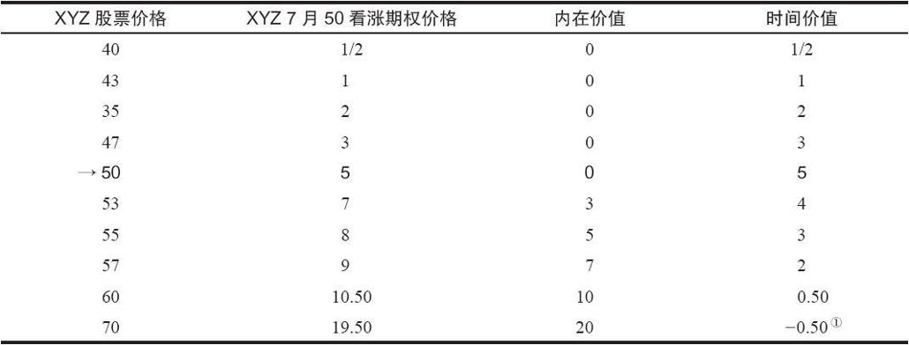
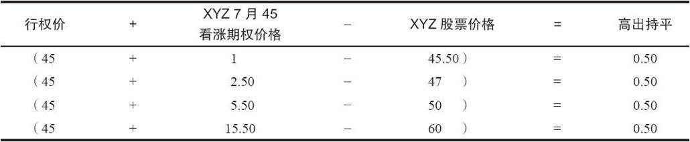

# 1.1　基本定义

股票期权（stock option）是一种在未来某一有限时间段内以某一特定价格买入或卖出某一特定股票的权利。这里所说的股票被称为标的证券（underlying security）。看涨期权（call）赋予拥有者（或持有者）买入标的证券的权利，而看跌期权（put）则赋予持有者卖出标的证券的权利。该股票可能会被买入或被卖出的价格被称为行权价（exercise price），也叫执行价（striking price）（在场内期权市场里，“行权价”和“执行价”是同义词）。股票期权所赋予的买入或卖出的权利只在有限的时间段内有效，因此，每个期权都有一个到期日（expiration date）。本书中所说的期权始终是指场内期权（listed option），即存在二级市场，在全美期权交易所交易的期权。除特别提到之外，场外期权（over-the-counter options，OTC）不包括在我们的讨论范围之内。

### 1.1.1　如何描述期权

任何期权合约都有以下四个特征：

（1）类型（看涨期权或看跌期权）；

（2）标的股票的名字；

（3）到期日；

（4）行权价。

例如，一个名为“XYZ 7月50看涨期权”的期权是一个以每股50美元的价格买入（看涨期权）100股（正常情况下）标的股票为XYZ的期权。这个期权在7月到期。场内期权是以每股为单位进行报价的，不管用这个期权能够买入多少股股票。因此，如果当前XYZ 7月50看涨期权的报价为5美元，则买入这个期权正常情况下需要花费500美元（5美元×100股），再加上手续费。

### 1.1.2　期权的价值

期权是一种“消耗性”资产，也就是说，它的初始价值会随着时间的流逝而降低（或者说“消耗掉”）。有时它甚至会到期一文不值，持有者可能必须在其到期前行权，以挽回一些损失。当然，持有者也可以在到期前将其在场内期权市场中卖掉。

期权自身也是一种证券，只不过它是一种衍生证券。期权与其标的股票密不可分。期权的价格会随着标的股票价格的上涨或下跌而波动。标的股票的拆股、股息和特殊现金股息会对场内期权的条款带来影响，不过一般的现金股息则不会。看涨期权的持有者不会得到标的股票支付的任何现金股息。

### 1.1.3　标准化

场内期权交易所对期权合约的条款进行了标准化。期权的条款包含了该期权的4个描述性特征，将它们组合在一起就得到了期权的名字。期权的类型（看涨期权/看跌期权）和标的股票不怎么需要解释并且本质上已经是标准化的了，下面对行权价和到期日做一些说明。

行权价。股票、交易所交易基金ETF和指数的行权价格间距并不一样，这与标的资产的价格和期权合约的流动性有关。一般而言，股票期权的行权价格间距一般为5点，即使对于诸如苹果（AAPL）等高价格股票，或SPX指数（标普500指数）也是如此。对于价格很低的股票而言，假如该股票的期权的流动性相对较好的话，行权价格间距则一般为1点。还存在介于两者之间的行权价格间距，比如2.5点。了解你想交易的股票期权的行权价格间距的最简单方法是去查阅合约规格表（例如，www.cboe.com在线免费提供）。

到期日。期权的到期日有以下三种固定的周期：

（1）1月/4月/7月/10月周期；

（2）2月/5月/8月/11月周期；

（3）3月/6月/9月/12月周期。

除此之外，最近的两个月也有期权上市交易。不过，在任何一个时刻，最长的到期日一般也不会超过9个月。有些股票有长期期权，也被称为长期普通股预期证券（long-term equity anticipation securities，LEAPS，见第25章）。因此，在任何周期里，期权的到期日为4个主要月份（序列）中的3个，再加上两个近期月份。例如，在任何一年的2月1日，XYZ期权可以在2月、3月、4月、7月和10月到期，但不会是1月。2月期权（最近的序列）是短期或近期期权；而10月是远期或长期期权。如果这个股票有长期期权，它们就将在明年1月和后年1月到期。

每一个月的具体到期日都是固定的。期权的最后交易日为到期月的第3个星期五。虽然这个期权事实上要到下一天（紧随的那个星期六）才到期，但公众客户必须在最后交易日的下午5时30分（纽约时间）之前通知他的经纪人，以行使他买入或卖出股票的权利。

上面的到期日——第三个星期五之后的星期六——被认为是“常规”期权在任意月份的到期日。但近年来，出现了到期日为其他时间的期权。它们是季度期权，到期日为3月、6月、9月和12月的最后交易日。这部分期权数量很少，大部分为大型股指期权。

市场中还存在周度期权。它们一般在星期二上市，而在八个日历日之后的星期五到期（注意，周度期权只在星期五到期，而不是随后的星期六）。现在已经有越来越多的股票和股指开始有周度期权上市，看上去期权交易所还会增加更多，因为这些期权很受投资者的欢迎。

期权的最小变动价位。[1]在许多情况下，期权的最小变动价位为1美分，另一些情况下，则为5美分。对于股票期权而言，当股票价格低于3.00美元时，期权的最小变动价位都为1美分，而当股票价格高于3.00美元时，就会变为5美分。然而，为了提高ETF和股指期权的流动性，这些期权的最小变动价位总为1美分。

### 1.1.4　期权自身：其他定义

种类（class）和系列（series）。期权的种类是指同一标的证券的所有看涨期权和看跌期权合约。例如，所有的IBM期权（包括所有不同行权价和到期日的看涨期权和看跌期权）构成一个种类。系列则是种类的一个子类，它包括同一种类（如IBM）中到期日和行权价相同的所有期权合约。

开仓和平仓交易。开仓交易是指开始交易，可以是买入，也可以是卖出。例如，一笔买入开仓交易会在该客户的账户中创建或新增一笔多头头寸。平仓交易则会减少该客户的头寸。买入开仓通常伴随着卖出平仓，相应地，卖出开仓则通常伴随着买入平仓。

持仓量（open interest）。期权交易所会对每一个系列的期权的开仓和平仓交易的数量进行跟踪。这一交易数量被称为持仓量。每一笔开仓交易都会增加持仓量，而每一笔平仓交易都会减少持仓量。持仓量是用期权合约的数量来表示的，因此一笔买入5手看涨期权的指令会使持仓量增加5手。请注意，持仓量并不区分买方还是卖方，因为你没有办法知道哪一方更占优势。虽然持仓量的大小对于投资者来说并不是非常重要的信息，但它对判断该期权的流动性非常有帮助。如果持仓量大，那么进行较大数量的交易就不会有问题。然而，如果持仓量很小（只有几百手合约还没有平仓），那么这个期权系列可能就不存在一个合理的二级市场。

买入方（holder）和卖出方（writer）。初始买入期权（即买入开仓）的人被称为该期权的买入方（简称买方）。而初始卖出期权（即卖出开仓）的人被称为该期权的卖出方。一般而言，期权的卖出方（简称卖方）被视为做空该期权合约。“卖出方”这个词起源于期权的场外交易年代，当时期权的买入方和卖出方直接联系，由卖出方来起草买入股票的新合约。不过，在场内期权市场中，所有期权的发行方都是期权清算公司，合约也都被标准化。这一重要的差异切断了买入方与卖出方的直接联系，从而为现有的二级市场的形成铺平了道路。

行权（exercise）和指派（assignment）。期权拥有者（或者说持有者）如果行使他的买入或卖出标的证券的权利，那么，他就是在行权。看涨期权持有者行权会买入股票，看跌期权持有者行权就会卖出股票。大部分股票期权的持有者可以在最后交易日下午8时以前的任何时候行权；持有者不必一定等至到期日才行权（请注意：那些被称为“欧式行权”的期权只能在到期日那一天而不是之前行权，不过它们一般不是股票期权）。这些行权通知是不可撤销的；一旦发出了，就不能收回。在实践中，它们每天只被处理一次，时间为市场收盘之后。每当有持有者行权时，就会有某个卖方会被指派，以履行他的义务，实现该期权合约所规定的条款。因此，如果某个看涨期权持有者行使其买入的权利，某个被指派的看涨期权卖方就有义务卖出；反过来说，如果某个看跌期权的持有者行使其卖出的权利，则某个被指派的看跌期权卖方则有义务买入。本章后面的内容会详细地介绍看涨期权的行权和指派，而对看跌期权的行权和指派，我们会在本书的后面部分进行讨论。

### 1.1.5　期权价格与股票价格之间的关系

实值（in-the-money）和虚值（out-of-the-money）。有特定的术语来描述股票价格与期权行权价之间的关系。如果股票价格低于看涨期权的行权价，则该看涨期权被称为虚值。如果股票价格高于看涨期权的行权价，则该看涨期权被称为实值（看跌期权则刚好相反，后文会进行讨论）。

【示例1-1】XYZ股票的市价为每股47美元。XYZ 7月50看涨期权是虚值的，XYZ 10月50看涨期权和XYZ 7月60看涨期权也都是虚值的。而XYZ 7月45看涨期权、XYZ 10月40看涨期权和XYZ 1月35看涨期权则都是实值的。

实值看涨期权的内在价值（intrinsic value）等于股票价格超出行权价的那部分金额。如果该看涨期权是虚值的，则它的内在价值为零。卖出期权的价格一般被称为权利金（premium）。权利金与时间价值权利金[time value premium，简称为时间价值（time premium）]有明显的区别。时间价值等于该期权权利金超过其内在价值的那部分金额。我们可以用下面的公式来快速计算出实值看涨期权的时间价值：

实值看涨期权的时间价值=看涨期权的价格+行权价-股票的价格

【示例1-2】XYZ的市价为48，XYZ 7月45看涨期权的价格为4。该期权的权利金（总的价格）为4。由于XYZ的价格为48，而该期权的行权价为45，那实值金额（或内在价值）为3点（48-45），而时间价值就为1（4-3）。

如果该看涨期权是虚值的，那么它的权利金和时间价值就会相等。

【示例1-3】如果XYZ的价格为48，XYZ 7月50看涨期权的售价为2，那么该看涨期权的权利金和时间价值都为2点。由于股票价格低于行权价，因此该看涨期权没有内在价值。

一般来说，当股票价格等于行权价时，期权的时间价值最大。随着期权变为深度实值或虚值，它的时间价值会显著地减小。表1-1说明了这种效应。请注意，当股票价格接近行权价（50）时，时间价值会随之增加，而当股票价格远离50时，时间价值就随之减小。“时间价值”这一术语表明，期权的这部分价值完全与存续时间相关。事实上，这并不完全正确。标的股票的波动率也对期权“时间价值”的大小有影响。因此，实际上“时间价值”有些用词不当，但它确实是一个标准术语。

表1-1　时间价值的变化

①简单地说，深度实值看涨期权的实际交易价格可能低于其内在价值，因为看涨期权的买家可能对不那么昂贵的看涨期权感兴趣——看涨期权会在股票的上涨过程中赚得更多。我们会在考察套利技术时，对这一现象进行更深入的分析。

持平（parity）。按其内在价值进行交易的期权被称为与标的证券持平的期权。因此，如果XYZ为48，XYZ 7月45看涨期权的售价为3，这个看涨期权就是持平的（at parity）。期权卖出方特别感兴趣的一个常用方法（我们在后文会见到），就是通过指出一个期权与其持平状态普通股之间的距离来说明它的价格。因此，在表1-2所示的所有示例中，XYZ 7月45看涨期权都比起持平状态价格高出半点。

表1-2　比较XYZ股票和看涨期权的价格

[1] 疑原文有误，原文为“期权的价格”（the price of an option）。——译者注
