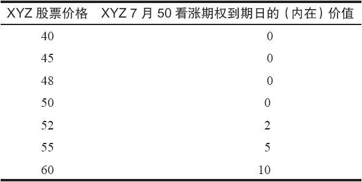
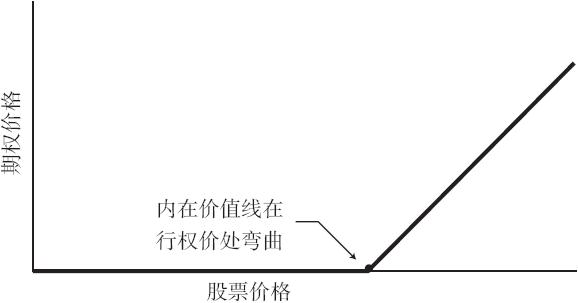
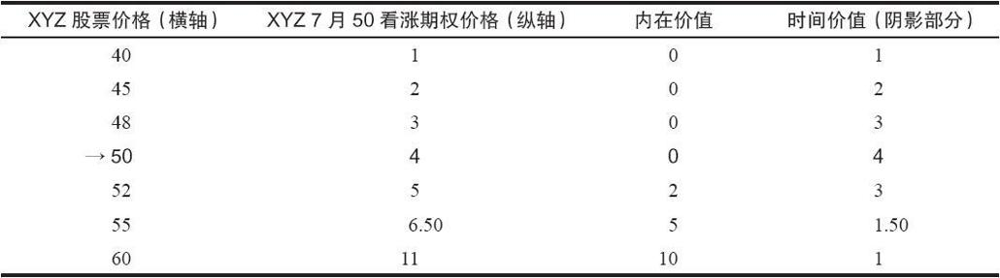
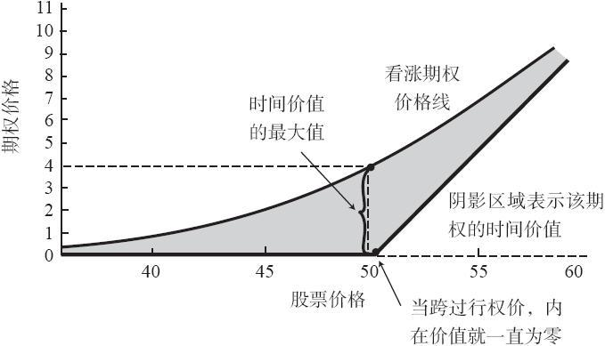
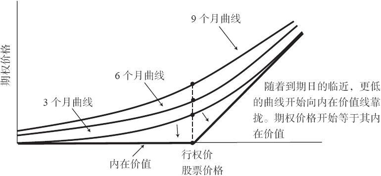
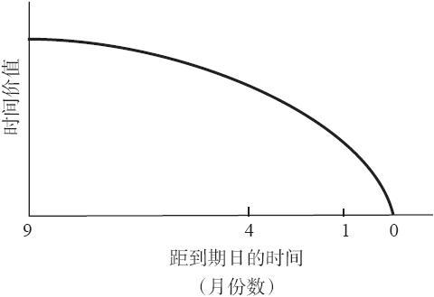

# 1.2　影响期权价格的因素

期权的价格与标的股票和该期权条款的性质相关。影响期权价格的主要可量化因素包括：

（1）标的股票的价格；

（2）期权自身的行权价；

（3）该期权的剩余存续期；

（4）标的股票的波动率；

（5）当前无风险利率（例如90天政府债券利率）；

（6）标的股票的股息率。

前四项是期权价格的主要决定因素，后两项一般没有那么重要，不过，对于高股息股票来说，股息率可能会有显著的影响。

### 1.2.1　四个主要决定因素

对期权价格影响最大的也许要算股票的价格了，因为，如果股票的价格远远高于或者低于行权价，其他的因素就几乎没有什么影响。在期权到期的那一天，它的决定性作用是显而易见的。在到期日，决定期权价值的就只有股票价格和期权的行权价，其他四个因素都不再起作用。在这个时候，期权的价值就等于其内在价值。

【示例1-4】在期权7月到期的那一天，不再有时间剩余，表1-3显示了XYZ 7月50看涨期权的价值，每一个价值都取决于当时的股票价格。

表1-3　XYZ期权在到期日的价值

看涨期权价格曲线。看涨期权价格曲线是根据不同股票价格而绘制的一条期权价格的曲线。图1-1显示了绘制这条曲线所需的轴线。纵轴为期权价格，横轴为股票价格。这是一个内在价值的图形。当期权为虚值或者行权价等于股票价格时，它的内在价值为零。一旦股票价格超过了行权价，内在价值就会随股票价格的增加而上升。由于看涨期权的价格一般在任何时候都至少等于其内在价值，因此这个图形表示了该看涨期权可能出现的最低价格。

图1-1　期权在到期日时的内在价值

当看涨期权还未到期时，它的价格等于内在价值加上时间价值。由此导致看涨期权价格曲线呈现出沿着股票价格轴线向内转的弓形。如果在图1-2所提供的坐标图上绘制表1-4中的数据的话，这条曲线就会表现出两个特征。

表1-4　一个假设的距到期日还有6个月的7月50看涨期权的价格，图1-2为它的图形

（1）时间价值（阴影部分）在股票价格等于行权价时最大。

（2）当股票的价格远高于或远低于行权价时（靠近曲线的终端），期权的售价会接近于它的内在价值。因此，曲线的两个终端都几乎碰到了其内在价值线。（图1-2中同时显示了内在价值线和期权价格曲线。）

图1-2　6个月到期的7月看涨期权（见表1-4）

不过，这条曲线所显示的只是预期的XYZ 7月50看涨期权在离到期日还有6个月时的价格行为。随着到期日的临近，这条弓形曲线会越降越低，直到在期权存续的最后一天，完全与其内在价值线重合。换句话说，在到期日，这个看涨期权的价值等于其内在价值。仔细分析一下图1-3，它描绘了三个不同的XYZ看涨期权。在任何既定的股票价格（股票价格刻度上的某一固定点）上，存续期最长的看涨期权的售价最高，存续期最短的看涨期权的售价最低。在行权价上，三个期权的实际价格之间差异最大。在接近这个尺度的两个终端的地方，三条曲线靠得很近，这意味着不同期权之间的实际价格差异很小。因此，如果股票价格不变，期权价格随到期日的临近而降低。

图1-3　存续期分别为3个月、6个月和9个月的看涨期权的价格曲线

【示例1-5】在1月1日，XYZ的售价是48。XYZ 7月50看涨期权比4月50看涨期权卖得更贵，而4月50看涨期权的售价比1月50看涨期权的售价更高。

无论股票价格多少，这个论断都是成立的。唯一需要注意的是，当期权为深度实值或虚值时，1月、4月和7月看涨期权之间的实际价格差异会小于当XYZ股票的价格等于期权行权价（50）时。

时间价值的减值。在图1-3里，存续期为9个月的看涨期权的价格并不是存续期为3个月的看涨期权的3倍。而在图1-4中，时间价值的减值并不是一条直线，也就是说，期权的减值率并不是线性的。期权的时间价值在其存续期的最后几个星期（也就是到期日之前的那几个星期）里的减少程度要比前期迅速得多。减值比率实际上与期权剩余存续期的平方根相关。因此，存续期为3个月的期权的减值（即其所损失的时间价值）是存续期为9个月的期权的2倍（=3）。类似地，存续期为2个月的期权的减值是存续期为4个月的期权的2倍（=2）。

图1-4　假定股票价格不变时，时间价值的减值

这幅图其实是把问题简单化了，读者不应当因此就以为存续期为9个月的期权的售价一定是存续期为3个月的期权的2倍，因为还有其他因素在影响这两个看涨期权的实际价格关系。在这些因素之中，影响最大的是标的股票的波动率。标的股票的波动率越大，期权的价格就越高。这种关系是符合逻辑的，因为如果股票具有能运动到相对更远向上距离（价格）的能力，那么看涨期权的买家就会更愿意为其付更高的价格，卖家也会要价更高。例如，如果美国电话电报公司（AT&T）和施乐（Xerox）的卖价相同（就像经常出现的那样），施乐的看涨期权的价格会比美国电话电报公司更高，因为施乐股票的波动率比美国电话电报公司股票要大。

这四个主要因素（股票价格、行权价、时间和波动率）之间的相互作用相当复杂。虽然股票价格的上涨会推动看涨期权价格的上升，但与之同时出现的时间的流逝则可能将它推向相反的方向。因此，即使标的股票的价格上升了，虚值看涨期权的买家还是有可能会面临亏损，因为时间的流逝减少了期权的价值。

### 1.2.2　两个次要的决定因素

无风险利率。无风险利率通常是指当前90天政府债券的利率。较高的利率意味着较高的期权权利金，较低的利率则意味着较低的期权权利金。虽然金融界就利率对期权价格的实际影响究竟有多大有着不同的看法，但大部分期权定价数学模型（本书的后面将讨论这些模型）都会把它考虑在内。

标的股票的现金股息率。虽然股息率并不是期权价格的一个主要决定因素，但对期权的卖出方来说，它有可能是非常重要的。如果标的股票根本不支付股息，那么看涨期权的价值就完全是由其他五个因素决定。不过，股息的支付会降低看涨期权的权利金：标的股票的股息越高，它的看涨期权的价格就越低。高股息股票的看涨期权权利金一直较低，最重要的原因之一就是该股票自身的股息较高。

【示例1-6】XYZ的价格相对较低，每股的售价是25美元，波动率也不高。每年它支付很高的股息：每股2美元，每年分季度发4次，每次0.50美元。如果XYZ看涨期权的行权价是25美元，那它的合理价格（fair price）是多少呢？

某个想要买XYZ期权的交易者决定找出这个合理价格。在未来6个月里，XYZ将支付1美元的股息，而在除息（ex-dividend）时，股票价格会减少1美元。这样的情况下，如果XYZ股票价格除了这个1美元的减值外没有其他变化，那它就会变为每股24美元。更进一步说，因为XYZ是波动率不高的股票，在除息之后，它有可能不会很快恢复到25。由于标的股票的价格会因为除息而减值，而看涨期权的持有者并不能得到这部分现金股息，所以他们就不会给出太高的买价（即使有6个月的时间）。

这个看涨期权的买家是根据除息减值后的24美元（而不是25美元）的股票价格来计算XYZ 7月25看涨期权的价值。他明确地知道，在未来的6个月中，如果XYZ股票的股息率没有变化，那该股票将失去1个点的价值。在实践中，期权的买方在出价购买期权时，会倾向于从当前股票价格中扣除将要支付的股息。不过，并不是所有股息都需要完全扣除。一般而言，最近的股息的扣除程度要比很久以后才支付的股息大得多。低波动率高股息的股票的看涨期权的价格比高波动率低股息的股票要低。事实上，在某些情况下，一笔即将支付的大金额股息会显著地增加期权在到期日前被行权的可能性。（这一现象会在后面的部分中更详细地讨论。）在任何情况下，股息都会或多或少地对某些看涨期权的价格起到重要的影响。

### 1.2.3　其他的影响因素

上述六种因素，不管是主要的还是次要的，都只是可以计量的其对期权价格的影响因素。在实践中，无法计量的市场动态（投资者的情绪）同样会起到各种各样的作用。在牛市中，由于需求增加，看涨期权的权利金往往会增加。而在熊市中，因为需求减少，看涨期权的权利金往往会降低。不过，这些影响一般都不会持续太长时间，只会在情绪激动的市场阶段中发挥作用。
