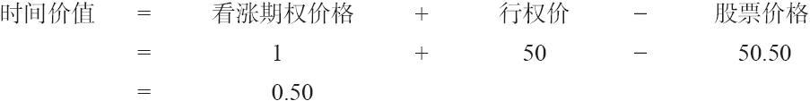

# 1.3　行权和指派：运作机制

期权的持有者可以在该期权的存续期内的任何时候行使他的权利。看涨期权的持有者行权以买入股票，看跌期权的持有者则行权以卖出股票。在期权被行权的情况下，一手相同条款期权的卖出者就会被指派，他需按期权合约的条款来履行其义务。

### 1.3.1　期权行权

由于期权清算公司（options clearing corporation，OCC）的作用，行权和指派的实际运作机制其实相当简单。作为所有场内期权的发行人，期权清算公司控制着所有场内期权的行权和指派。它的活动可以用下面的示例来解释。

【示例1-7】一个XYZ 1月45看涨期权的持有人想要行权，以每股45美元的价格买入XYZ股票。他指示他的经纪人执行这个意愿，然后他的经纪人通知经纪公司的后台来处理这件事，接着该经纪公司再通知期权清算公司，他们想要行权1手XYZ 1月45看涨期权系列合约。

现在，剩下的事情就交由期权清算公司来处理了。期权清算公司记录了所有卖出过XYZ 1月45看涨期权并且没有回补的会员（经纪）公司信息。期权清算公司从中随机选择一家卖出过至少1手XYZ 1月45看涨期权的会员公司，然后通知这家卖方公司它被指派了。这家公司必须按每股45美元的价格交割100股XYZ股票给那家执行的公司。这个被指派的公司再从它所有卖出过XYZ 1月45看涨期权的客户中选择一个。指派的选择方法可以是：

（1）随机的；

（2）按先进/先出的原则；

（3）其他公平、公正，得到相关交易所许可的原则。

在确定了卖出XYZ 1月45看涨期权的客户之后，行权/指派的过程就完成了。（期权的卖出方有必要清楚地知道其经纪公司的期权合约指派方法。）

### 1.3.2　服从指派

被指派的客户没有其他的选择，必须交割股票。这时候再试图从期权市场上把期权买回来就已经太迟了。他必须不折不扣地按每股45美元的价格交割100股XYZ股票。不过，被指派的卖出方可以选择如何来完成这个指派。如果他的账户中刚好有100股XYZ股票，那他只需交割这100股股票就可以满足指派通知（assignment notice）。另一种情况下，他可以在股票市场上以当前的市场价（假定这个市场价要高于45美元）买入100股XYZ股票，然后交割这新买入的股票来满足指派通知。第三种方法则是直接通知他的经纪公司，说他希望卖空XYZ股票，请他们从他的卖空账户中按每股45美元交割这100股XYZ股票。不过并不是任何时候都能够借到股票来卖空，因此，第三种方法不是在任何时候对每种股票都适用。

保证金。如果被指派的卖出者购买股票以满足合约，那么这笔交易的保证金一般可以降低，他无须支付全额保证金来买入股票以完成交割。一般而言，该客户只需就XYZ的当前价格与每股45美元的交割价之间的价差部分支付逐日交易（day-trade）保证金。如果他是采用卖空的方式来完成这次指派，那他就必须全额支付该笔卖空交易当前适用的保证金标准。

### 1.3.3　期权行权之后

期权清算公司和期权行权的客户并不关心被指派的客户是用什么方法来进行交割的，他们只想要保证这100股XYZ股票会以45美元的价格被交割。如果把看涨期权行权的持有者想要这部分股票，他可以把它们留在自己的账户里。另一方面，他也可以立刻在公开市场中以假设的高于45美元的价格把股票卖掉。如果他已经建有一个保证金账户，那他可以不必交付任何钱就马上卖掉。而如果他是在操作一个现金账户，那就必须先付清购买股票的钱——即使该股票在同一天里接着就被卖掉。此外，如果他先前已卖空XYZ股票的话，他可以用行权得到的股票来回补他自己账户中的卖空头寸。

### 1.3.4　手续费

除非经纪公司对客户有特别的安排，通过行权而买入股票的客户和通过行权而卖出股票的客户都必须对这100股股票的交易支付全额的股票交易手续费。一般而言，期权持有者通过指派而交付的手续费要高于他们在二级市场上出售股票所要支付的手续费。因此，持有期权的公众客户一般会在二级市场中把期权卖掉，而不是选择行权。

当然，有时某个客户仍然希望持有该标的股票，或许是因为该股票对他有吸引力，又或许是因为他希望回补一笔卖空交易。在这些情况下，把该看涨期权行权可能是有利的。

### 1.3.5　预见到指派

看涨期权的卖出者常常倾向于在二级市场上将期权买回来，而不是通过股票交易来完成合约义务。再强调一次，如果卖出者已经收到了指派通知，那么再想去二级市场中买回（回补）这个看涨期权就太晚了。卖出者必须在指派之前买，否则就得按合约的条款行事。如果卖出者了解那些通常会导致持有者行权的情况，他就能够比较准确地预见到什么时候会出现指派。如果能预见到指派，那卖出者就可以提前在二级市场中将该合约平仓。只要卖出者在某个交易日中的任何时间内买回了这个头寸，那他就不再会为这手期权而被指派。指派通知是根据每天交易收盘后的未平仓头寸而决定的。于是，问题的关键就变成了：“某个卖出者如何才能预见到指派呢？”指派往往会在下面的几种情形里出现：

（1）在到期时，看涨期权是实值的；

（2）在到期前，期权在贴水交易；

（3）标的股票支付高额股息，而且就要分红。

自动行权。如果期权在到期时是实值的，那就一定会被指派。股票在最后交易日收盘时哪怕只高出行权价1美分，该持有者正常情况下也会行权。事实上，在最后交易日的任何时间里，只要看涨期权是实值的，如果某个持有对冲头寸的做市商收到了一份指派通知，他就会对该看涨期权行权。即使某个持有者忘了他还有这样一手期权并没有行权，那除非该客户通过其经纪公司特别指示不行权，否则期权清算公司就会自动地将所有在到期时至少是1美分实值的看涨期权行权。这个自动行权（automatic exercise）的机制保证了没有一个投资者会因为粗心而丢钱。

【示例1-8】在1月第三个星期五（1月期权系列的最后交易日），XYZ的收盘价是50。由于期权要到第二天也就是星期六才到期，因此期权清算公司和所有的经纪公司就有机会来复查投资者的记录，看一看是否有可以盈利的期权没有被行权。如果某个1月45看涨期权的持有者既没有卖出该期权，也没有行权（可能是由于生病，或者是在旅行中没有电话或计算机），那该期权就会被自动行权。该期权每手价值500美元，即使扣除买入股票的手续费，该客户还能收回一大笔钱。不过，他现在持有的是股票，他需要卖出股票才能实现这笔盈利。

注意，在上面的例子中，期权的行权使得该账户出现了一笔股票买入交易。如果此时账户中没有足够的现金来买入股票，客户就会收到保证金追加通知（margin call）。这就是为什么一些经纪公司不允许客户用退休账户（例如，个人退休账户IRA）来买入期权，因为客户无法定期的向个人退休账户追加资金以满足自动行权的要求。

任何想要避免收到指派通知的卖出者，在到期时股票价格有可能会高于行权价时，都应当买回（回补）这个期权。如果期权在到期时是实值的，那么被指派的可能性就是100%，即使只是高出1美分。

由于贴水（discount）而提前行权（early exercise）。当期权在到期之前行权时，被称为提前行权，或者早期行权。当看涨期权以持平价或低于持平价交易时，往往就会发生提前行权。在到期日之前，期权的价格为持平或贴水时，可能就意味着即将出现提前行权，即使贴水的程度很小。如果期权的价格即将相对于持平价有明显贴水，而该期权的卖方又不希望交割股票，那他应该提前把该期权买回。这样做的原因是套利者（arbitrageurs，场内交易员或会员公司的交易员，他们只需支付很少量的交易费用）会利用这种贴水状态的机会进行交易。（后文会更详细地讨论套利交易，这里提到它，只是为了说明为什么提前行权常常出现在贴水的情况中。）

【示例1-9】XYZ的买价为每股50美元，XYZ 1月40看涨期权的卖价为贴水价9.80。这个看涨期权实际价值10点。套利者可以通过下面的行动来利用这个机会，所有这些都是在一天内完成的：

（1）以9.80的价格买入XYZ 1月40看涨期权；

（2）以50的价格卖空XYZ股票；

（3）把这个看涨期权行权，从而以40的价格买入XYZ。

该套利者从卖空XYZ的交易中（第2步和第3步）获得10点，从这10点中减去他为看涨期权所支付的9.80，他的总盈利为20美分——贴水的数量。由于他只需付很少的手续费，因此这项交易就会有净盈利。

此外，当期权没有时间价值时，卖出者可以预期其会被指派。反过来说，当期权还有时间价值时，它一般就不会被行权。

【示例1-10】在到期日之前，XYZ的市价为50，1月50看涨期权的市价为1。这个看涨期权很难会被马上行权，因为它还剩有半点的时间价值。

由于标的股票的股息而被提前行权。有时市场条件会导致贴水的情况，并且有时的贴水是由高额的股息造成的。由于股票价格几乎总是会因为除息而下跌相当于股息的金额，期权的价格也多半会在除息后下跌。然而，场内期权的持有者是得不到股息的，因此他也许会因为预计到股价会下跌，而决定在除息日之前在二级市场中卖掉这个期权。如果因为这一原因而在二级市场上卖出的看涨期权的数量足够多，那期权的价格就有可能变为持平，甚至出现贴水。在这样的情况下，套利者就有可能会利用这种机会，买入这些期权并行权。

如果期权在除息日前被指派了，卖出者就会得不到股息，因为他在除息日已不再拥有股票。此外，如果他是在除息日当日收到指派通知的，他就必须交割股票以及股息。因此，对于卖出者来说，在到期日的前一天观察期权的贴水情况，就变得非常重要。

需要提醒的是，不要因为此处的讨论而得到这样的结论：如果股息大于剩余的时间价值，看涨期权就会因为股息而被行权。情况并不是这样，下面我们用一个示例来说明原因。

【示例1-11】交易价为50的XYZ股票将要支付1美元的股息，除息日就在第二天。XYZ 1月40看涨期权的售价是10.25，它的时间价值为25美分（时间价值=10.25+40-50=0.25）。同样类型的套利在这里就不起作用。假设套利者以10.25的价格买入这个看涨期权并行权，他现在就会拥有即将除息的股票，而且他计划在第二天也就是除息日开盘后立刻将股票出手。在除息日，XYZ的开盘价为49，因为它就要除息1美元。这个套利者的交易包括：

（1）以10.25的价格买入XYZ 1月40看涨期权；

（2）在同一天行权该看涨期权，从而以40的价格买入XYZ；

（3）在除息日，以49的价格卖出XYZ，并得到1美元的股息。

他在股票上得到9点（第二步和第三步），并且他得到1点的股息，总的现金流入为10点。但是，他在买入这手看涨期权时支付了10.25点。总的交易结果是亏损，因此套利者不会去尝试这样做。

因此，支付的股息超出看涨期权的时间价值，并不意味着卖出者会被指派。

更有可能，但更难确定的一种情况是，套利者在这样的情况下有可能会尝试一种“风险套利”。风险套利（risk arbitrage）是一种套利者承担风险以求牟利的套利。这个套利者可能会认为股票的贴水金额不会有除息金额那么大，或者认为除息之后这个看涨期权的时间价值会增加。无论是哪种情况（或者是两者兼备），他都可以盈利：如果股票开盘时只下跌了60美分，或者期权的权利金上涨了40美分，这个套利者都可以在开盘时获利。不过，一般而言，套利者不喜欢冒险，从而会避免这类情况。因此，由于标的股票的股息支付而导致的指派的可能性很小，除非这个看涨期权是在以持平价或贴水价在交易。

当然，对提前行权的可能性进行预测，会假设看涨期权持有者的行为是合乎理性的。如果看涨期权还有剩余时间价值，从财务权衡上看，相比于行权，到二级市场上卖出看涨期权对持有人更有利。不过，看涨期权的合约条款赋予了看涨期权的持有人行权的权利，即使行权并不对其有利。在这样的情况下，某个卖出方可能会非常意外地收到指派通知。财务上不合理的提前行权尽管比较少见，但确实会发生。期权的卖出方必须意识到这一点，在非常小概率的情况下，他可能会在不合逻辑的条件下被指派。
