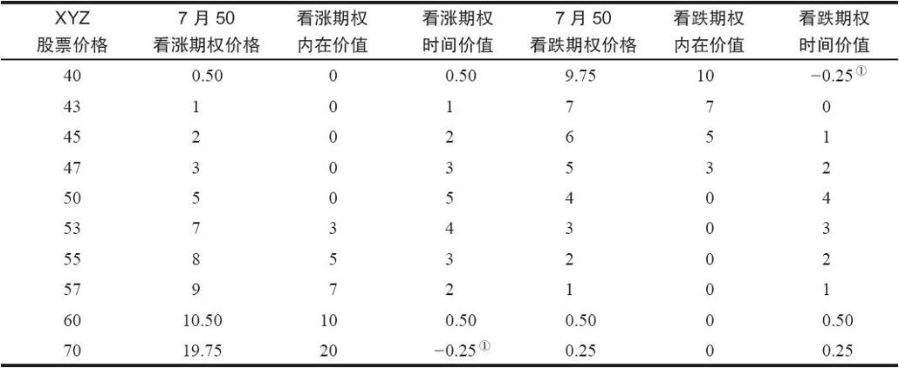

# 15.1　看跌期权策略

就其最简单的形式而言，在直接买入看跌期权时，交易者是希望股票下跌，从而他的看跌期权会变得更值钱。如果股票下跌到看跌期权的行权价之下足够远的地方，看跌期权的持有者就会盈利。这手看跌期权的持有者可以在公开的市场买入股票，然后将他的看跌期权行权，从而按照比股票价格更高的行权价卖出股票，取得盈利。

【示例15-1】如果XYZ的价格是40，XYZ 7月50看跌期权就会至少价值10点，因为这个看跌期权赋予持有者按50卖出XYZ的权利，这个价格高出股票现有价格10点。另一方面，股票价格在期权到期时高于这个期权的行权价，这手期权就会一文不值。从逻辑上说，如果可以在公开市场上以更高的价格卖出股票，没有人会想要将看跌期权行权——按比市场价更低的行权价来卖出股票。因此，随着标的股票价格下跌，看跌期权价值会增加。这当然是与看涨期权的价格行为相反的。

在谈到看跌期权的时候，实值和虚值的涵义有了变化。看跌期权在标的股票价格低于行权价时是实值的；在股票价格高于行权价时是虚值的。这同看涨期权也是相反的。如果XYZ的价格是45，XYZ 7月50看跌期权是实值的，而XYZ 7月50看涨期权就是虚值的。但是，如果XYZ的价格是55，那么7月50看跌期权就是虚值的，而7月50看涨期权则是实值的。实值期权的一般定义，也就是“有内在价值的期权”，这对看跌期权和看涨期权都适用。请注意，当标的股票价格低于看跌期权的行权价时，看跌期权才有内在价值。也就是说，看跌期权在股票低于行权价时才有某些“真正的”价值。

实值看跌期权的内在价值就是行权价同股票价格之间的差价。因为看跌期权是一种（要卖出的）期权，在离到期日还有剩余时间的时候，它的售价一般要大于它的内在价值。这部分超出内在价值的价值被称作时间价值，这和看涨期权一样。

【示例15-2】XYZ的价格是47，XYZ 7月50看跌期权的售价是5，内在价值是3点（50-47），因此，时间价值一定是2点。使用下面的公式在任何时候都可以迅速计算出实值看跌期权的时间价值：

时间价值（实值看跌期权）=看跌期权价格+股票价格-行权价

这同用在实值看涨期权上的公式不同。不过，期权的时间价值等于内在价值之上多余的价值，这对所有的期权都是一样的。

时间价值（实值看涨期权）=看涨期权价格+行权价-股票价格

如果这手看跌期权是虚值的，那么这个看跌期权的全部权利金都是由时间价值组成的，因为虚值期权的内在价值永远是零。看跌期权的时间价值在股票价格等于期权行权价时最大。随着期权变得深度实值或者深度虚值，时间价值会显著减小。对时间价值数量的这些说明，对看跌期权和看涨期权都适用。表15-1可以帮助说明股票价格同期权（看涨期权和看跌期权）价格的关系。读者也可以回过头去看一看表1-1，它描述了看涨期权的时间价值。表15-1所描写的是XYZ 7月50看涨期权和XYZ 7月50看跌期权的价格。

表15-1　看跌期权同看涨期权的比较

①深度实值期权在到期之前有可能会以低于内在价值的价格交易。

表15-1说明了若干基本事实。随着股票下跌，看涨期权的实际价格下跌，而看跌期权的价值上升。反过来，随着股票上涨，看涨期权会增值，而看跌期权会减值。看跌期权和看涨期权都是在当股票价格刚好等于行权价时具有最大的时间价值。不过，当股票价格等于行权价时，看涨期权的售价一般比看跌期权要高。请注意一下表15-1，当XYZ等于50时，看涨期权价值5点，而看跌期权只值4点。除了股息很高的股票之外，一般而言都是如此。这种现象同持有股票的成本有关。我们在后面会对这种效应作进一步的讨论。表15-1同时也描写了一种一般来说都存在的看跌期权效应：相对于实值看涨期权来说，实值看跌期权（股票低于行权价）失去时间价值的速度要更快。注意一下表15-1中价格为43的XYZ，看跌期权在实值7点时就失去了它所有的时间价值。而当看涨期权在7点实值的时候，也就是XYZ为57的时候，还有2点时间价值。同样地，这个现象也受到标的股票股息支付的影响，不过，总的来说这个现象都是存在的。
