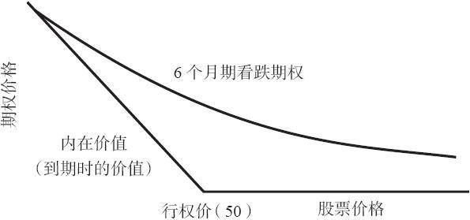
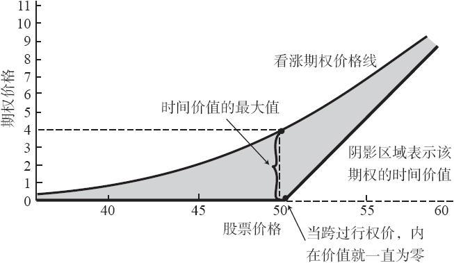

# 15.2　给看跌期权定价

决定看涨期权价格的因素同样也决定看跌期权价格：标的股票的价格、期权的行权价、离到期的时间、标的股票的波动率、标的股票的股息率，以及目前的无风险利率（例如，政府债券利率）。市场的动态变化（供给、需求和投资者的心理）也在其中起作用。

虽然不准备像在第1章中那样进行详细讨论，我们还是可以得出看跌期权的价格曲线。有些事实像看涨期权一样对看跌期权也同样起作用。看跌期权的销蚀率不是直线的，也就是说，时间价值的销蚀在临近到期日之前的那几个星期里会变得更为迅速。标的股票的波动率越大，期权的价格就越高，看跌期权和看涨期权都是如此。此外，市场在任何时候都有可能按比标的股票实际展现的波动率更高或更低的波动率来给期权定价。这叫做隐含波动率，它同实际波动率不同。看跌期权的价值通常在任何时候都至少等于它的内在价值。图15-1显示出在离到期还有6个月时在所有股票价格上可以预期到的XYZ 7月50看跌期权售价。请将这幅图形同看涨期权类似的定价曲线（见图15-2）作一个比较。请注意，看跌期权的内在价值线同看涨期权的内在价值线所面对的方向是相反的。也就是说，当股票跌到行权价之下时，它的价值就增长。这个看跌期权的定价曲线说明了前面所提到的效应，也就是当看跌期权是实值的时候，它的时间价值会失去得更快，它同时也显示出了虚值看跌期权有大量的时间价值。

图15-1　看跌期权价格曲线

图15-2　看涨期权价格曲线
