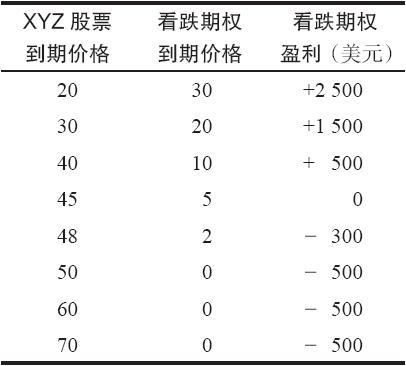
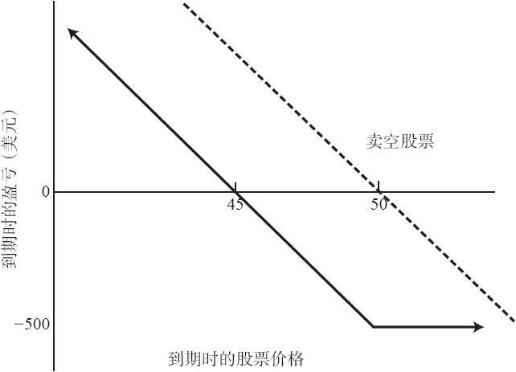
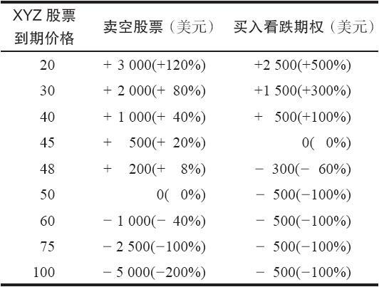

# 16.1　买入看跌期权与卖空股票

在最简单的情况下，当投资者预期某只股票价格会下跌时，他可以卖空标的股票，也可以买入该股票的看跌期权。假定XYZ的价格是50，XYZ 7月50看跌期权的交易价是5。如果标的股票价格大幅下跌，看跌期权的买家就可以得到明显超出其最初投资的盈利。不过，如果标的股票价格上涨，看跌期权的买家只需承担有限的风险，他的最大亏损就是他最初买入这个看跌期权所付的钱。在这个示例里，这个看跌期权的买家不可能亏损到5点之上，这等于他全部的初始投资。表16-1和图16-1介绍了在到期日时这个简单的买入看跌期权所产生的结果。

表16-1　买入看跌期权到期时的结果

图16-1　买入看跌期权

看跌期权买家的潜在盈利有限，因为股票价格不可能跌到负数。他的潜在盈利按百分比计算则有可能非常大。亏损一般出现在股票价格上涨的时候，但它不会超过最初的投资。最简单的买入看跌期权的方法是在预期标的股票价格会下跌时进行投机。

表16-2　卖空股票的结果

可以将这手买入看跌期权的盈亏和相似的在50的价格上对XYZ进行卖空的交易进行比较，从而观察一下看跌期权的买家所得到的杠杆效应和有限风险的好处。为了按50的价格卖空100股XYZ，假定交易者必须使用2500美元的保证金。从表16-2和图16-1中可以证实若干事实。如果股票价格跌得足够深，买入看跌期权的交易按百分比计算的收益会比卖空标的股票大得多。这是因为买入期权得到的杠杆效应。如果标的股票价格保持基本不变，卖空股票的表现就会更好。因为当标的股票在有限的时间内只有小幅变化时，卖空者不会亏损其全部投资。不过，如果标的股票价格急剧上涨，卖空者的亏损事实上就会大于他的全部初始投资。理论上说，卖空股票有无限的风险。而买入看跌期权中就不是如此，它的风险限制在最初投资的数量之内。在对买入看跌期权和卖空股票进行比较时，另一点需要说明的是，股票的卖空者有义务为股票支付股息，而看跌期权的持有者就没有这样的义务。这是看跌期权持有者的另一个优势。
