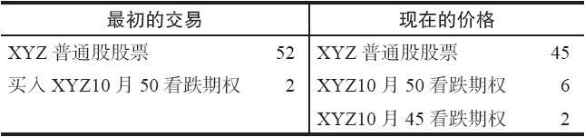
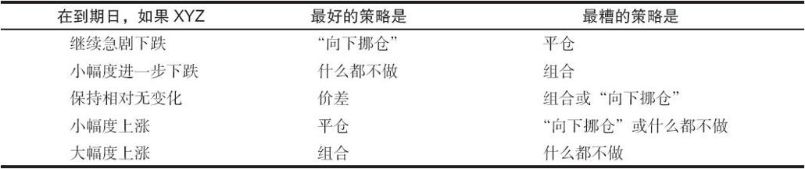
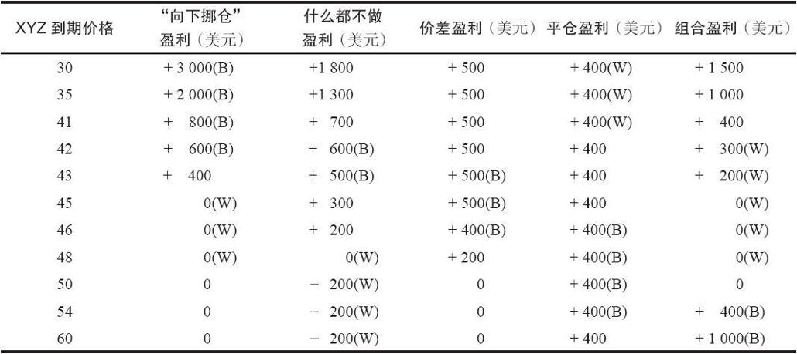

# 16.4　后续行动

同看涨期权的买家一样，看跌期权的买家也可以使用相似的策略来进行后续行动，或者是锁住盈利，或者是改善亏损。在讨论这些具体策略之前，应当再一次说明，通过行权的方法来将期权平仓，很少能给期权买家带来好处，除非看涨期权的买家实际想要拥有股票，或者看跌期权买家实际想卖出股票。如果期权的持有者只是想要将他的头寸平仓，那么股票的手续费就会让行权的成本很高。即使在他卖出期权时不得不接受相对持平价略有贴水的价格，情况也是如此。

### 锁住盈利

读者也许会记得，一手有未兑现盈利的看涨期权的持有者有四种策略（也许更应当说是“技巧”）可以使用。这四种技巧只要略加修改就可以为看跌期权的买家所使用。此外，如果一只股票既有场内看跌期权又有场内看涨期权，那么就还有第五种策略可以使用。

在标的股票向下运动，看跌期权买家有了大量的未兑现盈利之后，他也许应当考虑采取下面行动中的一种：

（1）卖出看跌期权，将这个头寸平仓，提取盈利；

（2）什么都不做，继续持有这个看跌期权；

（3）卖掉实值看跌期权多头，用部分的收入买入多个虚值看跌期权；

（4）就他目前持有的看跌期权而再卖出一手虚值看跌期权，以构造一手价差头寸。

这同前面讨论看涨期权时讨论过的四种技巧是相同的。第五种技巧是，一手有未兑现盈利的场内看跌期权的持有者可以考虑买入一手场内看涨期权来保护他的头寸。

【示例16-3】投资者在股票价格是52时用2点买入XYZ 10月50看跌期权。如果股票现在跌到45，看跌期权就有可能价值6点，积累了4点的未兑现盈利。此时，看跌期权持有者就到了需要实施这五个技巧中的某一个的时候了。经过一段时间后，在股票价格为45时，一手实值的10月45的售价有可能是2点。表16-3对这个情况作了总结。如果交易者只是卖出这手10月50看跌期权将他的头寸平仓，他就可以实现4点的盈利。因为他终止了这个头寸，他的盈利就只能刚好是4点。这是这些技巧中最保守的一种，它没有给升值留下额外的空间，但是也消除了所有将积累起来的盈利亏损掉的可能。

表16-3　不同盈利背景表

如果交易者什么都不做，只是继续持有这个10月50看跌期权，他就是在采取一种激进的行动。如果股票调转方向向上反弹，在到期日涨到50之上，他就会把盈利全都输掉。不过，如果股票继续下跌，他就可以积累更多的盈利。这是唯一的在到期时最终会亏损的技巧。

这两种简单的策略（平仓或者什么都不做）是最容易的选择。剩下的策略可以使交易者在保留已有盈利和积累更多盈利之间寻求平衡。投机者可以使用的第三种技巧是卖出他目前持有的看跌期权，使用部分收益买入10月45看跌期权。这个技巧的基本设想是从市场中拿回交易者的最初投资成本，然后通过买入虚值的期权来增加所持期权的数量。

【示例16-4】交易者从卖出10月50看跌期权中可以收入6点。他应当从中拿出2点放回自己的口袋，收回他最初的投资。然后，他可以把剩下的钱以每手2点的价格买入2手10月45看跌期权。使用这样的策略，他在到期时没有任何风险，因为他已经收回了最初的投资。此外，如果标的股票继续急剧下跌，他就会有丰厚的盈利，因为他增加了他所持有的看跌期权的数量。

看跌期权持有者的第四个选择是通过就他已经持有的10月50看跌期权而卖出10月45看跌期权来构造出一手价差。这样做从技术上来说就建立了一手熊市价差。我们在后面将更详细地介绍这种价差。现在只要明白建立这样的价差对交易者的风险和收益发生了什么影响就足够了。卖出10月45看跌期权带来了2点收入，它可以将最初买入10月50看跌期权所花的2点抵消掉。因此，他的这手价差就没有“成本”，除了手续费之外，他没有风险。如果标的股票在到期时涨过了50，所有的看跌期权都无价值到期。（标的股票在期权到期时价格高于期权的行权价，看跌期权就无价值到期。）这是最坏的情况，他从这个价差中一无所获。如果股票在到期时在45之下，他就可以实现这手价差的最大潜在盈利，也就是5点。也就是说，无论XYZ在到期时低于45多少，10月50看跌期权都比10月45看跌期权的价值多出5点，这个价差平仓时有5点的盈利。他在这手价差中最大的潜在盈利就是5点。如果标的股票在到期之前稳定在45的价位附近，这种技巧就是最好的选择。

为了分析看跌期权持有者可以使用的第5种策略，有必要将看涨期权引入分析中来。

【示例16-5】XYZ的价格为45，10月45看涨期权的售价是3点。看跌期权的持有者可以买入这手看涨期权，以限制他的风险，同时保留在将来获得更多盈利的可能性。如果交易者买入了这手看涨期权，他就有了下面的头寸：

买入1手10月50看跌期权

买入1手10月45看涨期权

综合成本：5点

这个看跌期权和看涨期权的组合的总的综合成本是5点：2点是最初为看跌期权所付的，3点是现在为看涨期权所付的。不管标的股票在到期时的价位是多少，这个组合都会价值至少5点。例如，如果XYZ在到期时是46，看跌期权就价值4，看涨期权就价值1；或者，如果XYZ是48，看跌期权就价值2，看涨期权就价值3。如果股票价格在到期时在50之上，或者在45之下，这个组合的价值就会超过5点。因此，交易者在这个组合中没有风险，因为他为这个组合付了5点，而且在到期时至少可以将它卖到5点。事实上，如果标的股票价格继续下跌，看跌期权变得更值钱，他于是可以积累起大额盈利。此外，如果标的股票反转方向，价格大幅反弹，他还是可以盈利，因为在这种情况下看涨期权会变得更有价值。如果标的股票的价格在到期时没有稳定在45左右，而是上下大幅摆动，那么这种技巧就是最好的策略。我们在第23章将详细讨论同时拥有1手看跌期权和1手看涨期权的策略。在这里引进这种策略，只是供那些想要保护他的未兑现盈利的看跌期权持有者参考。

在不同的情况下，这五种策略的每一种都有可能成为最好的策略。每种技巧的最终结果取决于XYZ未来的运动方向。同看涨期权的情况相同，价差的技巧从来都不是最糟的技巧，虽然只有在标的股票的价格稳定下来的时候它才是最好的技巧。表16-4总结了投机者在使用这五种技巧中从每一种中可以预期的结果。这些技巧如下。

（1）平仓：卖掉买入的看跌期权以提取盈利，然后不再重新投资。

（2）什么都不做：继续持有看跌期权多头。

（3）“向下挪仓”：卖出所持看跌期权，收回最初的投资，将剩下的盈利投资到行权价较低的虚值看跌期权中。

（4）“价差”：保持原有的看跌期权，同时卖出虚值的看跌期权，从而构造出一手价差。

（5）“组合”：继续持有买入的看跌期权，同时买入一手行权价较低的看涨期权，从而构造出一手组合。

表16-4　五种技巧的比较

表16-5　采用五种技巧时每种的结果

注：1.“B”说明这是最好的技巧。

2.“W”说明这是最糟的技巧。

请注意，每一种技巧都在某一种情况下是最好的技巧，不过，在这5种策略中，只有价差一直都不是最糟的。表16-5显示了每一种技巧在使用上面示例中的数据时所产生的实际结果，其中，“B”说明这是最好的技巧，“W”说明这是最糟的。

如果标的股票继续急剧下跌，所有这些策略都有盈利，而“向下挪仓”、“什么都不做”和“组合”的效果最好，因为如果股票价格持续下跌，它们就会持续积累盈利。如果标的股票不是跌了而是涨了，只有组合才有可能比最简单的平仓策略的表现要好。

如果标的股票的价格稳定下来，“什么都不做”和“价差”的技巧效果最好。一般来说，组合的技巧或者“向下挪仓”的技巧最具吸引力，因为它们都没有风险，而且如果股票价格大幅度上涨，都可以产生大笔的盈利。价差的优势主要是在看涨期权里，因为在看跌期权的情况里，卖出虚值看跌期权所得到的权利金并不大，价差的策略因此就失去了它的某些吸引力。最后，这些技巧都可以只运用它们的一部分，例如，交易者可以将一个盈利的头寸卖掉一半以提取部分的盈利，而继续持有剩下的部分。
