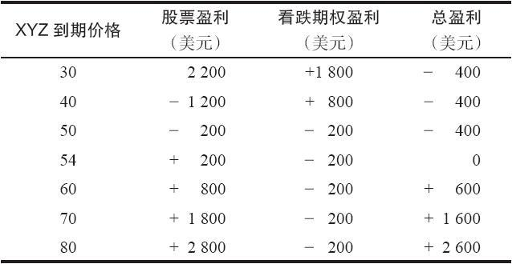
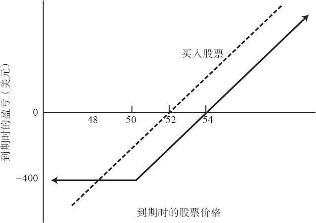

# 第17章　持有股票的同时买入看跌期权

除了在标的股票下行运动中的投机杠杆之外，看跌期权还有另一个有用的特征，那就是，可以使用买入看跌期权的策略来限制已持有股票在下行方面的亏损。在投资者同时持有普通股股票和同一股票上的看跌期权的时候，他就有了一个在期权存续期内下行方向风险有限的头寸。这个头寸也叫做合成看涨期权多头（synthetic long call），因为它的盈利图形的形状与看涨期权多头一样。

【示例17-1】一个投资者持有XYZ股票，它的价格是52，他用2的价格买入了1手10月50看跌期权。这个看跌期权给了他按50的价格卖出XYZ的权利，因此这个股票持有者在他的股票中最多亏损2点。由于他为看跌期权的保护支付了2点，不管在这之前XYZ的股价会跌到多深，他在10月到期之前的最大潜在亏损是4点。另一方面，如果股票价格在10月之前上涨，这个投资者可以实现股票中所有收益，再减去他为看跌期权保护所付的2点。看跌期权的作用非常像一个有期限的保险。表17-1和图17-1显示了这个头寸在10月到期时的结果：用2点买入10月50看跌期权来保护持有售价为52的XYZ普通股股票。图形中的虚线代表了持有股票本身的潜在盈利。请注意，如果股票在10月低于48，买入看跌期权就对股票持有者有好处。不过，如果XYZ在到期时高于48，买入看跌期权就成了影响潜在盈利的一笔小负担。这个策略不一定是用来实现股票持有者在股票中最大的潜在盈利，它实际上是为股票持有者提供了保护，在看跌期权存续期间消除了持有这只股票会有灾难性亏损的可能性。在本章和第18章所讨论的所有买入看跌期权的策略中，看跌期权都是必须全价付清的。这是唯一需要增加的投资。

表17-1　备兑持有股票在到期时的结果

图17-1　买入普通股股票和买入看跌期权

虽然任何普通股股票持有者都可以使用这个策略，但有两类股票持有者会发现这个策略特别有吸引力。首先，不想卖出股票的长期持有者可以使用看跌期权的保护来限制其短期的亏损。其次，在买入股票时想要某种“保险”，以防看错的投资者，也会发现看跌期权的保护具有吸引力。

要是坚信股票价格会下跌，那么，股票的长期持有者也许应当把股票卖掉。不过，他的买入成本有可能使得资本税高到使得卖出股票贵得不可接受。而且，他或许对股票是否会下跌并没有百分之百的把握，也许还想留住这只股票，它说不定真得会上涨。无论是哪种情况，买入看跌期权都可以限制持股人在下行方向的风险，同时仍然为股票上涨留下空间。许多个体和机构投资者手里都有因为这种或那种原因而不能轻易脱手的股票。买入低成本的看跌期权常常可以减小熊市对他们所持股票的负面影响。

第二类为了保护目的而买入看跌期权的人，包括正在股票中建立起头寸的投资者。这样的投资者也许想要在买入股票的同时买入一手看跌期权，从而构造一个头寸，它的盈利性同前面的盈利图所描写的相似。他一开始有的头寸就立刻是一个下行风险有限，但如果股票上涨就有大笔盈利的头寸。这样，在看跌期权的存续期内，他就可以放心地持有这个头寸，而不必担心如果股票价格一时下跌，应当在什么时候将它出手。有些相当激进的股票交易者也使用这个策略，因为有了它就不必在股票上设置止损指令。看着股票下跌，启动止损指令，接着价格又反弹回去，这常常是让人烦恼的经历。有看跌期权作为保护的股票持有者就不需要对股票的下行运动做出过激反应。在这个看跌期权的存续期内，他都可以高枕无忧，因为他已经在头寸中建立了保护机制。
