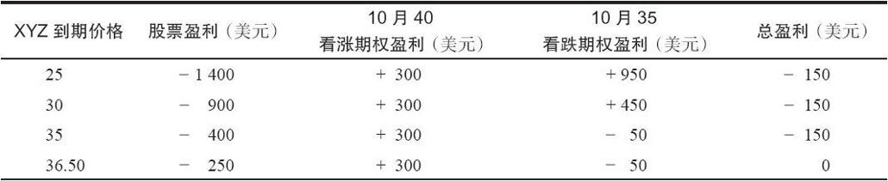
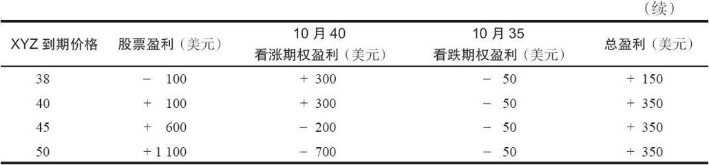
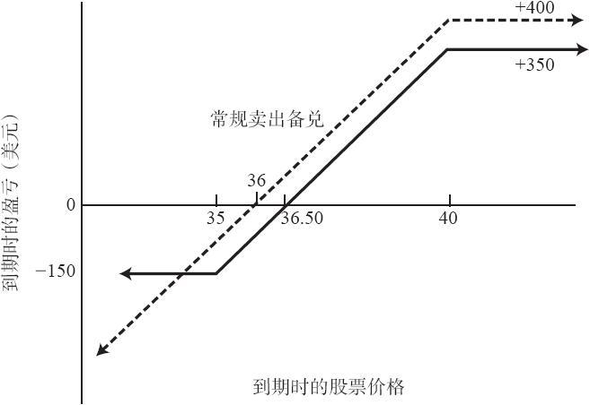

# 17.3　买入看跌期权作为对备兑看涨期权卖出者的保护

因为买入看跌期权为普通股股票的持有者提供了保护，有的投资者自然会想到，同样的保护特性也可以用来限制他们在卖出备兑看涨期权策略中的下行风险。读者应当记得，卖出备兑看涨期权涉及买入股票和就股票卖出一手看涨期权。卖出备兑在上行方向的潜在盈利有限，在下行方向提供了同看涨期权权利金数量相等的保护。如果股票价格在到期时稍许下跌、保持不变或者上涨，备兑卖出者就能盈利。当股票下跌的幅度超过所收入的看涨期权权利金时，备兑卖出者才会实际亏损。他在下行方向有很大的潜在风险。整个策略被称为保护性领圈（protective collar），或者简称为“领圈”（collar）[它有时也被叫做“对冲保护”（hedge wrapper），不过这已经是个过时的说法了]。

买入虚值看跌期权可以为卖出备兑消除大的潜在亏损，但花在买入看跌期权上的钱会减少这手卖出备兑的总收益。因此，交易者在决定是否值得买入这手看跌期权时，必须将它的成本包括在最初的计算中。

【示例17-5】XYZ的价格是39，XYZ 10月40看涨期权的售价是3点，XYZ 10月35看跌期权的售价是0.50点。用39的价格买入普通股股票，按3点的价格卖出10月40看涨期权，就可以建立起一手卖出备兑。如果XYZ在到期日价格40之上，这手卖出备兑就会有4点的最大潜在盈利。如果XYZ在10月到期时低于36这个盈亏平衡点，这手卖出备兑就会亏钱。如果在启动这个卖出备兑的同时买入10月35看跌期权，这个备兑卖出者的潜在盈利就会略有降低，但是他的潜在风险也会大大降低。如果在卖出备兑中加入买入看跌期权的策略，在10月到期日时的最大潜在盈利就减少到3.50点，盈亏平衡点向上移到了36.50，如果XYZ在到期日低于36.50，卖出者就要遭受一定的亏损。不过，这个卖出者的最大亏损不会超过1.50点，这出现在XYZ在到期时价格低于35的时候。买入看跌期权产生了这个止损的效果。表17-2和图17-2显示了普通卖出备兑的盈利性和有买入看跌期权保护时的盈利性。

表17-2　普通卖出备兑同受保护的卖出备兑的比较

图17-2　买入看跌期权保护的卖出备兑看涨期权

在计算备兑卖出者的收益时，应当仔细地把手续费以及看跌期权的成本考虑进去。在第2章中我们说明过，备兑卖出者为了得到一个准确的“总收益”画面，必须将所有手续费、保证金利息成本和所有收到的股息都包括在内。图17-2显示出盈亏平衡点略为提高了一些，总的潜在盈利因为买入看跌期权而减少了一些。不过，最大风险相当小，而且在形势不利的时候，卖出者也不再需要被迫向下挪仓。

读者应当还记得，没有保护性看跌期权的备兑卖出者为了得到更大的下行方向的保护，就不得不向下挪仓。向下挪仓意味着买回目前卖出的那手看涨期权，再卖出另一手行权价较低的看涨期权来代替它。如果股票在下跌之后价格稳定下来，那么，向下挪仓的做法会有帮助。可是，如果股票反转过来，价格重新上升，那么，因为向下挪仓，备兑卖出者的盈利就受到限制。事实上，他甚至可能“锁定”了一笔亏损。有保护性看跌期权的备兑卖出者就不需要操心这种事。他永远不需要向下挪仓，因为他的最大亏损是有限的。因此，他永远不会落入“锁定”亏损的局面。这是一个很大的优势，特别是从情绪的角度来看，因为卖出者永远也不会被迫在股票价格下跌的过程中对股票价格的未来走向做出判断。有了这个看跌期权，他就完全可以不采取任何行动，因为他总的亏损是有限的。如果股票价格后来反弹，他仍然可以获得最大盈利。

卖出备兑并买入看跌期权策略的较长期效果不是很容易确定，不过，看上去卖出者因为买入看跌期权而略为减少了他的总收益率。这是因为他在股票略为下跌、保持不变或价格上涨的情况中放弃了一些盈利。只有在股票严重下跌时他才能够“收益”。因为同其他（略为下跌、保持不变或上涨）情况相比，卖出者只有在发生概率较小的情况中才有可能获益。不过，买入看跌期权的策略还是有用的，因为它消除了因为大笔亏损的可能性所带来的情绪上的不确定性。买入看跌期权的备兑卖出者常常可以发现，在持有保护性看跌期权的情况下，他可以更理性地进行操作。

这个策略同前面介绍的那个牛市价差的策略是相等的，请注意，图17-2的盈利图的形状同牛市价差的盈利图（见图7-1）的形状是相同的。这就意味着这两个策略是相等的。事实上，我们在第7章里说过，牛市价差有的时候可以被看作是卖出备兑的“替代”。实际上，牛市价差同这个策略（买入看跌期权保护卖出备兑）更接近。当然，在这两种策略之间有不同的地方。它们在潜在盈亏方面是相等的，不过，备兑卖出者不可能在短时期内将他的投资全部亏损掉，而价差交易者则有这种可能。为了实际使用牛市价差作为卖出备兑，交易者应当在价差中只投资他可用资金的一小部分，而将剩余资金投在固定收益证券上。在第7章里我们对这个策略有过更为深入的讨论。
