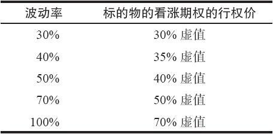

# 17.4　无成本领圈

“领圈”策略往往是以另一种形式出现：一个股票持有者开始对股市会下跌的可能性感到担心，决定要就他的股票买入看跌期权作为保护。但是，看跌期权的成本使他感到沮丧，因此，他同时也考虑要卖出看涨期权。如果他买入一手虚值看跌期权，那么，很有可能他可以卖出一手看涨期权，其收入可以完全抵消这手虚值看跌期权的成本。因此，他就不用成本就能建立起一手保护性领圈，至少没有支出。他的“成本”是放弃了股票在卖出的看涨期权的行权价之上的潜在盈利。

事实上，有些大机构的交易者可以通过像高盛和摩根斯坦利这样的大场外交易期权经纪人来交易领圈。他们甚至会给经纪人下达这样的指令：“我手里有XYZ股票，我想要买1年到期的10%虚值的看跌期权。为了创建一手无成本领圈，1年到期的看涨期权应当用什么样的行权价呢？”于是，这个经纪人也许会告诉他，这样的看涨期权应当是30%虚值的。这个看涨期权的实际行权价取决于对标的股票波动率的估计，也取决于利息和股息。这种类型的交易是经常出现的。

用长期期权可以构造出一些非常有趣的情况。最有趣的情况之一出现在1999年，当时，一家公司持有500万股思科公司（Cisco）股票CSCO，它决定建立3年的无成本领圈为股票对冲。当时CSCO的交易价是130左右，它的波动率是50%。同3年的行权价为130的看跌期权的售价相同的3年的看涨期权的行权价为200！这似乎不合逻辑，但这是通过期权定价模型的帮助计算出来的。因此，这个公司就对它所有的CSCO股票作了对冲，这样，在今后3年里在下行方向没有风险（看跌期权的行权价等于股票的当前价格），而在上行方面仍然有高于50%的潜在盈利。

因此，交易者在建立领圈时，即使他不是一个机构交易者，也应当考虑使用长期期权（LEAPS），因为这样的看涨期权的行权价同看跌期权的行权价相比或者同标的股票的价格相比，会高出许多。表17-3显示了一手卖出看涨期权在抵消一手买入平值看跌期权的成本的同时，可以虚值到什么程度。这个表格里的存续期是2.5年，这是目前场内的LEAPS期权中最长的期限。

表17-3　抵消平值看跌期权成本的看涨期权的最高行权价（假定存续期为2.5年）

### 使用较低行权价进行部分卖出备兑

应当指出，交易者不一定要完全放弃他股票中的全部潜在盈利。他可以像往常一样买入看跌期权，然后卖出行权价比一手低成本的领圈所需要的稍低一些的看涨期权，但卖出的看涨期权的数量要少于所持有的股票的数量。这样做，在标的股票的一些股份上就会有无限的潜在盈利。

【示例17-6】假定存在下列的价格：

XYZ股票：61

4月55看跌期权：1

4月65看涨期权：2

此外，假定交易者持有1000股XYZ。因此，用每手1点的价格买入10手4月55看跌期权就可以在下行方向提供保护。为了抵消这些看跌期权的成本（1000美元），交易者只需要用每手2的价格卖出5手4月65看涨期权。因此，这样的保护没有一点成本，而且在500股XYZ股票上仍然有无限的潜在盈利，因为就所持有的1000股股票上只卖出了5手看涨期权。

使用这种方法，交易者在建立领圈中可以变得更富有创造性，他可以决定使用什么样的看涨期权行权价来实现在抵消看跌期权成本和保留上行方向潜在盈利之间的平衡。在卖出看涨期权上使用的行权价越低，他需要卖出的看涨期权数量就越小；卖出看涨期权的行权价越高，他就必须卖出越多的看涨期权来抵消买入的看跌期权的成本。这里的权衡是，较低的看涨期权行权价在上行方面保留了更多的最终潜在盈利，但是看涨期权的指派价位则设定在较低的水平上。

我们可以使用上面的那个示例来展现这些事实：

【示例17-7】上面的价格依然存在，不过，现在引进了另一个看涨期权：

XYZ股票：61

4月55看跌期权：1

4月65看涨期权：2

4月70看涨期权：1

同前面一样，交易者可以卖出5手4月65看涨期权来抵消10手看跌期权的成本。或者，作为另一种选择，他可以卖出10手4月70看涨期权。如果他卖出的是5手，他就在500股股票上有无限的潜在盈利，但是其他的500手就会被在65的价位上因为期权被指派而卖掉。在另一种策略中，他限制了上行方向的潜在盈利，但是，在股票运动到行权价70之前，没有股票会因为期权被指派而被卖掉。哪一种方法“更好”？这很难说。在前一个策略里，如果股票一直上涨到了75，由此产生的盈利就等于在后一个策略里股票在70的价格被指派买走的结果一样。之所以是如此，是因为500股股票的价值将会是75，但是其他500股则会在价格为65时就被指派买走，由此得到的平均数也是70。因此，前一个策略只有在股票实际上涨到75之上才会比后一个策略的表现要好，而交易者不得不考虑到，这样的情况是不大可能会发生的。不过，许多投资者还是喜欢用前一种策略，因为它在提供保护的同时，并不要求他们放弃全部上行方向的潜在盈利。
