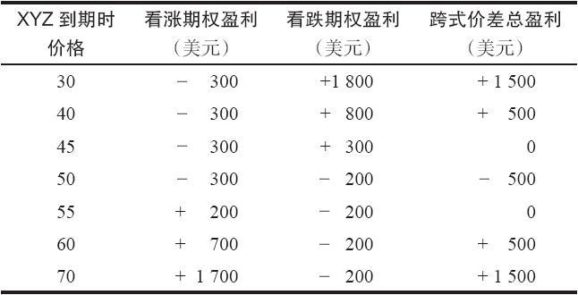
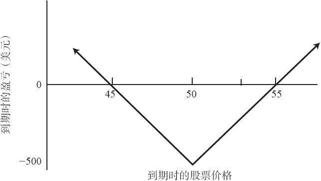

# 18.1　买入跨式价差

一个买入跨式价差的策略包括买入条款相同的一手看跌期权和一手看涨期权，也就是说，它们有相同的标的股票、行权价和到期日。通过买入跨式价差，无论股票朝哪个方向运动，只要运动得足够远，买家都有大量的潜在盈利。最大的亏损是事先确定的，它等于买家最初投资的金额。

【示例18-2】有下列的价格：

XYZ普通股股票：50

XYZ7月50看涨期权：3

XYZ7月50看跌期权：2

如果交易者同时买入7月50看涨期权和7月50看跌期权，他就买入了一手跨式价差。这笔交易的成本是5点加上手续费。买入一手跨式价差所需要的投资是净支出。如果标的股票在到期时的价格刚好是50，这个买家就会亏损掉他的全部投资，因为看跌期权和看涨期权都会无价值到期。如果股票在到期时高于55，这个跨式价差的看涨期权部分的价值就会高于5点，跨式价差买家就能盈利，即使他的看跌期权会无价值到期。在下行方向存在相似的情况。如果XYZ在到期时的价格低于45，看跌期权的价值就会高于5点，他就会有盈利，尽管看涨期权会无价值到期。表18-1和图18-1显示了这个跨式价差在到期时的结果。这个跨式价差的买家可以马上知道他在到期日的盈亏平衡点，在这个示例里是45和55。如果标的股票在到期时价格在这两个盈亏平衡点之间，他就会亏损。如果XYZ在到期时价格远离50，他就会有大量的潜在盈利。

表18-1　买入跨式价差在到期时的结果

图18-1　买入跨式价差

一般而言，交易者应当买入波动率相对较大的股票的跨式价差，这样的股票在所设定的时间内有可能出现幅度大到足以使得这个跨式价差盈利的运动。这个策略在期权权利金较低的时候特别有吸引力，因为低权利金意味着跨式价差的成本更低。虽然把这个价差一直持有至到期日时按百分比计算的亏损可能相对较大，事实上，交易者将整个投资全都亏损的概率是很小的。即使XYZ在到期日的价格为50，在最后交易日仍然有机会将这个跨式价差卖出一点钱来。

### 18.1.1　相等策略

买入跨式价差和反向对冲是相等的策略。我们在第4章介绍过反向对冲策略，它是由卖空标的股票和买入这个股票的2手看涨期权组成的。两种策略的盈利特征相似：出现在期权行权价上的有限亏损，以及如果标的股票价格上涨或下跌到一定的幅度，就会有大量的潜在盈利。不过，买入跨式价差比反向对冲更为优越，而且，只要股票有场内看跌期权交易，反向对冲这个策略就过时了。跨式价差更为优越的原因是持有者不必支付股息，而且，交易跨式价差的手续费成本也比较低。

### 18.1.2　使用看跌期权构造反向对冲（合成跨式多头）

同跨式价差和反向对冲相等的还有第3种策略。它包括买入标的股票和买入2手看跌期权。如果股票价格大幅上涨，这个头寸就会有大笔盈利，因为股票的盈利在抵消了买入2手看跌期权的固定亏损之后还有剩余。如果股票价格大幅下跌，也会产生盈利。在下跌中，2手看跌期权多头产生的盈利在抵消了100股股票多头之外还有剩余。这种形式的买入跨式价差同样也只有有限的风险。最糟糕的情况就是股票价格在期权到期日时刚好等于这些看跌期权的行权价。这时，2手看跌期权都会无价值到期。风险无论就百分比而言还是就金额而言都是有限的，因为相对买入股票的成本而言，2手看跌期权的成本一般来说只占相对很小的比例。此外，如果标的股票是有股息支付的股票，投资者还有可能有某些股息收入。买入股票和买入2手看跌期权是比反向对冲更好的策略，但是不如买入跨式价差。
