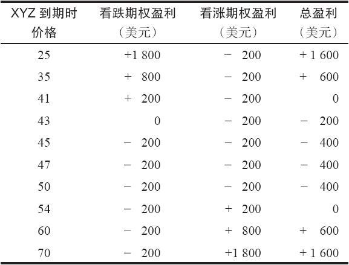
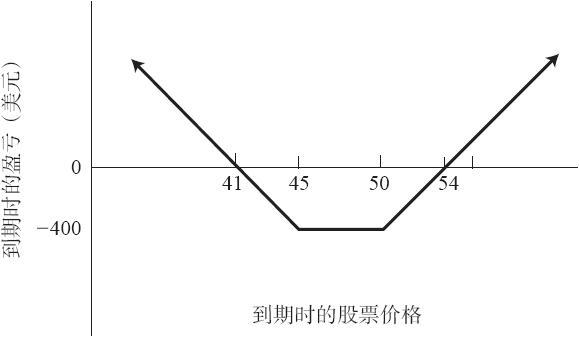

# 18.4　买入宽跨式价差

宽跨式价差是这样一种头寸，它是由一手看涨期权和一手看跌期权组成的，这两手期权一般到期日相同，但行权价不同。下面的示例显示了一手宽跨式价差。

【示例18-7】交易者可以买入一个由一手XYZ 1月45看跌期权和1手XYZ 1月50看涨期权组成的宽跨式价差。买入这样一手宽跨式价差和买入一手跨式价差（straddle）很相似，不过也有些不同。我们在下面的讨论中将说明这些不同。假定有下面的价格存在：

XYZ普通股股票：47

XYZ 1月45看跌期权：2

XYZ 1月50看涨期权：2

在这个示例里，两手期权在买入的时候都是虚值的。这是最常见的买入宽跨式价差的做法。如果XYZ在1月到期时仍然在45~50之间，两个期权都无价值到期，宽跨式价差买家就失去他的全部投资。这笔投资（在这个示例里是400美元）与就XYZ买入一手跨式价差的投资相比，一般要小一些。如果XYZ上涨到高于50或下跌至低于45，这个宽跨式价差在到期时就会有一些价值。在这个示例里，如果XYZ价格在到期时高于54，看涨期权的价值就会高于4点（看跌期权会无价值到期），价差买家就会有盈利。与此相似，如果XYZ在到期时在41之下，看跌期权的价值就会高于4点，价差买家在这种情况里同样有盈利。如果标的股票在期权到期之前有大幅运动，潜在盈利的数量就会相当大。表18-2和图18-2显示了这个头寸在1月到期时的盈亏。同跨式价差相比，宽跨式价差出现最大亏损的价格范围要更大一些。跨式价差只有在股票在到期时刚好等于期权的行权价时才会出现最大亏损。在宽跨式价差的情况中，只要股票在到期日时在两个行权价之间，就会出现它的最大亏损。宽跨式价差的实际亏损额要小一些，这是一种补偿。两种策略的潜在盈利都相当大。

表18-2　买入宽跨式价差在到期时的结果

图18-2　买入宽跨式价差

在上面的示例里，两手期权都是虚值期权。也可以使用实值期权来构建一个非常相似的头寸。

【示例18-8】同前面一样，XYZ的价格为47，实值期权有可能有以下的价格：XYZ 1月45看涨期权的价格为4点，XYZ 1月50看跌期权的价格为4点。如果交易者买入这个实值宽跨式价差，他要付出的总成本是8点。不过，这个宽跨式价差的价值始终至少是5点，因为看跌期权的行权价比看涨期权的行权价要高5点。读者在前面已经看到过这类头寸，我们在介绍买入跨式价差以及买入看涨期权和买入看跌期权的保护性后续行动中讨论过这样的头寸。因为这个宽跨式价差的价值不会低于5点，这个实值宽跨式价差买家在这个示例里最多也只会亏损3点。如果标的股票大幅运动，他的潜在盈利还是没有限制的。因此，即使它的初始投资较大，从买家的角度看，实值宽跨式价差常常会比虚值宽跨式价差更为优越。实值宽跨式价差所涉及的风险按百分比而言无疑较小一些：买家不可能亏掉他的全部投资，因为他始终可以拿回5点来，即使在最坏的情况里（当XYZ在到期日时价格在45~50之间的时候）。买入实值宽跨式价差的百分比盈利要低一些，因为投资者一开始就为这手宽跨式价差付了更多的钱。读者对这样的评论不应当感到奇怪，因为我们在讨论直接买入看涨期权的时候说过，一般而言，买入一手实值看涨期权比买入一手虚值看涨期权更为保守。在买入看跌期权中也是这样，甚至更是如此，因为一手实值看跌期权中的时间价值更小。因此，由这两手期权（一手实值看涨期权和一手实值看跌期权）构造出的这个宽跨式价差，比起虚值宽跨式价差来说，应当是更为保守的。

如果标的股票价格朝某一方向运动得很快，宽跨式价差买家有时候就能采取行动来保护他的某些盈利。他可以用上面讨论跨式价差时所介绍的相似方法来这样做。例如，如果股票向上运动得很快，他可以卖掉他最初买入的看跌期权，买入一手行权价高出一级的看跌期权来替代。如果他一开始用的是虚值的宽跨式价差头寸，通过这样做，他就有了一手跨式价差。不过，策略家不应当盲目地采取这样的后续行动。这取决于已经过去了多少时间和所涉及的期权的价格，用这种方式将看跌期权“向上挪仓”有可能非常昂贵。因此，最好是具体情况具体分析，看一看采取这样的后续行动是否合乎逻辑。

最后一点，虚值宽跨式价差有可能看上去很便宜，在接近到期日的时候，两手期权的价格都不到1个点。但是，在使用宽跨式价差的时候，出现等于交易者最初投资的最大亏损的概率相当高。这同买入跨式价差显然不同，在跨式价差中，损失全部投资的概率很小。激进的投机者不应当使用大笔资金来买入虚值宽跨式价差。实值宽跨式价差的百分比亏损更小一些，它等于最初为期权所付的时间价值，不过，手续费会相当高。无论是哪种情况，买家想要盈利，标的股票就需要有相对大幅度的运动。
