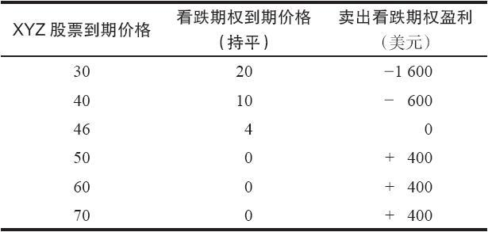
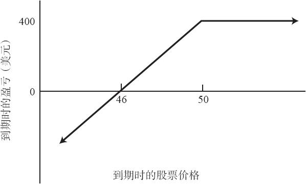

# 19.1　卖出未备兑看跌期权

因为看跌期权的买家有权利按照行权价卖出股票，看跌期权的卖出者就有义务按照行权价买入股票。通过承担了这样的义务，他可以收到看跌期权权利金。如果标的股票上涨，看跌期权无价值到期，卖出的看跌期权不会被指派，因此他可以得到同收到的权利金数量相等的最大盈利。他有很大的下行方向风险，因为股票有可能会大幅下跌，卖出的看跌期权因此会增值，导致大笔亏损。我们可以用一个示例来说明有关风险和收益的一般状况。

【示例19-1】XYZ的价格是50，一手6个月的看跌期权的售价是4点。裸看跌期权卖出者在上行方向有一笔固定的潜在盈利（在这个示例里是400美元），在下行方向有大量的潜在亏损（见表19-1和图19-1）。对下行方向的限制的只是股票价格不可能跌到0之下这样的事实。

表19-1　卖出看跌期权到期时的结果

图19-1　卖出无备兑看跌期权

卖出裸看跌期权的质押要求和卖出裸看涨期权是一样的。这个质押要求等于目前股票价格的20%加上看跌期权的权利金再减去任何虚值的数量。

【示例19-2】如果XYZ的价格是50，卖出一手行权价为50的4点的看跌期权的质押要求就是1000美元（5000美元的20%）加上期权权利金400美元，总数为1400美元。如果股票价格高于行权价，就从质押要求中减去股票价格与行权价之间的差价。无论这样的算法产生出的数字有多大，最低的质押要求是这个看跌期权的行权价的10%再加上期权的权利金。

卖出无备兑看跌期权的策略在许多方面都和卖出备兑看涨期权的策略相像。你可以注意到它们的盈利图的形状相同，这就是说这两个策略是相等的。在介绍卖出裸看跌期权时，将它与卖出备兑看涨期权进行比较，对读者可能会有帮助。

交易者在两个策略中对标的股票都是看多的，或者至少是中性的。如果标的股票向上运动，未备兑看跌期权的卖出者就有盈利，也许是收入的全部权利金。如果标的股票在到期日没有变化（中性），看跌期权的卖出者在最初卖出这个期权时所收入的全部权利金就变成了他的盈利。如果这手看跌期权是虚值的，这就代表了他的最大盈利，因为这就意味着整个看跌期权的权利金都是由时间价值组成的。不过，对一手实值看跌期权来说，时间价值只是整个期权权利金中的一部分。这些性质同卖出备兑看涨期权中固有的性质是相似的。如果股票向上运动，备兑看涨期权卖出者就可以得到他的最大盈利。但是，如果股票在到期日时没有变化，那么，只有在股票价格高于行权价的情况里他才能得到最大盈利。因此，在这两种策略中，如果头寸建立的时候股票价格高于期权行权价，那么，实现最大盈利的概率就更大。这代表了不是那么激进的运用：开始时卖出虚值看跌期权，它同卖出实值备兑看涨期权是相等的。

更为激进的使用卖出裸看跌期权的方法是一开始就卖出实值看跌期权。实值看跌期权的卖出者在开始时就可以收到较大数量的权利金，如果标的股票上涨得足够高，他可以得到一大笔盈利。使用这种方法增加了潜在盈利，因此也承担了更大的风险。如果标的股票下跌，实值看跌期权的卖出者亏钱的速度会比一开始卖出虚值看跌期权的情形更快。同样，这些事实在前面讨论卖出备兑看涨期权时也说明过。比起卖出一手虚值的备兑看涨期权来说，卖出一手实值的备兑看涨期权能提供更多的下行方向的保护和更小的潜在盈利。

要总结这些并不难，只需要注意到，无论是在卖出裸看跌期权策略中还是在卖出备兑看涨期权的策略中，在股票高于卖出的期权的行权价时建立起来的头寸都是不那么激进的头寸。如果股票价格一开始就低于期权的行权价，那么，由此建立的头寸就是较为激进的头寸。

当然，卖出备兑看涨期权和卖出裸看跌期权之间有一些基本的不同。首先，卖出裸看跌期权一般需要的投资比较少，因为交易者只需要股票价格的20%加上权利金作为质押，而卖出备兑看涨期权所使用的保证金需要50%的质押。同时，裸看跌期权卖出者实际上并没有现金投资，他使用的是质押。因此，他可以通过现有的投资组合的价值来帮助他卖出裸看跌期权，投资组合中的资产可以是股票、债券或者政府发行的证券。不过，任何亏损都会导致支出，因而可能影响到他的投资组合。应当指出，如果希望的话，交易者可以用现金账户卖出裸看跌期权，他只是需要在账户中存入与这个看跌期权行权价相等的现金或现金等价物。这叫做“以现金为基础的卖出看跌期权”（cash-based put writing）。备兑看涨期权的卖出者有标的股票的股息收入，而裸看跌期权的卖出者则没有。在某些情况里，这个数目可能相当可观，但是，同样应当指出，高收益股票的看跌期权会有较高的价值，裸看跌期权的卖出者因此在一开始就会有更高的权利金。严格地从收益率的角度来看，卖出裸看跌期权的表现要比卖出备兑看涨期权更好。从根本上说，卖出裸看跌期权需要有同卖出备兑看涨期权不同的心理素质。大部分投资者觉得卖出备兑看涨期权是一种可以接受的策略，因为它涉及普通股股票的持有权。而卖出裸期权对普通投资者来说则是一个陌生的概念，即使这两个策略是相等的。因此，一般而言，同一个投资者不太可能同时参与这两种策略。
