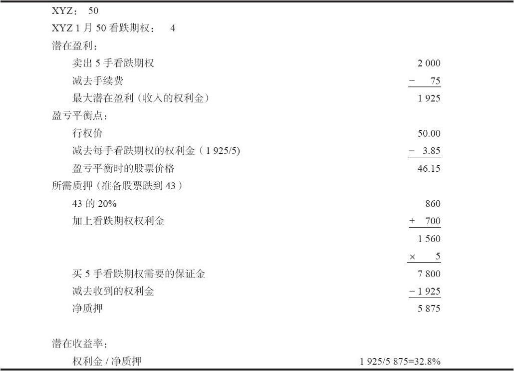

# 19.3　对卖出裸看跌期权进行评价

计算卖出裸看跌期权的潜在收益不像计算卖出备兑看涨期权的潜在收益那么直截了当。原因是质押要求会随着股票价格的变化会变化，因为任何裸期权头寸都是要逐日盯市的。最保守的方法是在账户中放进足够的质押，以防标的股票下跌导致追加保证金。用这种方法，裸看跌期权卖出者就不会因为没有满足保证金要求而被迫提前平仓。

【示例19-3】XYZ的价格是50，10月50看跌期权的售价是4点。最初的质押要求是50的20%再加上400美元，也就是1400美元。没有额外的要求，因为股票价格刚好等于看跌期权的行权价。此外，让我们假设标的股票下跌到43，这个卖出者就要将这个头寸平仓。为了维持他的卖出看跌期权头寸，他应当预留足够的保证金，这样，如果股票在43时，他还能满足质押要求。当股票价格为43时的质押要求是1560美元（43的20%再加上至少是7点的实值量）。因此，建立这个头寸的看跌期权卖出者应当为每一手卖出的看跌期权预留1560美元的质押价值。当然，从这个质押要求中可以减去从卖出看跌期权中得到的收入，在这个示例里是400美元减去手续费。如果我们假定这个卖出者卖出的是5手看跌期权，他总共收入的权利金是2000美元，他的手续费成本会是75美元，净权利金就是1925美元。

在知道了这些信息之后，找出最大潜在收益和亏损方面的盈亏平衡点就是一件容易的事。要得到最大潜在收益，这个看跌期权就要在标的股票高于行权价的情况下无价值到期。因此，最大潜在盈利等于所收入的净权利金。收益率就是用盈利除以质押要求。在上面的示例里，最大潜在盈利是1925美元。每手看跌期权的质押要求是1560美元（准备股票跌到43），或者说，5手看跌期权总共7800美元，再减去收入的1925权利金，总的质押要求是5，875美元。因此潜在收益率就是1925除以5875，或者说是32.8%。表19-2对这些计算作了总结。

表19-2　卖出未备兑看跌期权的潜在收益的计算（单位：美元）

人们对怎样计算卖出裸看跌期权的收益率有不同的意见。上面所说的是一种比较保守的方法，它用的是比初始要求更高的质押要求。当然，因为交易者不是真的用现金来投资，而只是使用他现有投资组合的质押价值。你甚至可以说交易者在这样的头寸里根本就没有投资。这也许不错，但是，如果没有计算收益率的方法，就没有办法对各种不同的卖出看跌期权机会进行比较。

收益率计算的另一个重要特征是无变化时收益。如果看跌期权最初是虚值的，无变化时收益就同最大潜在盈利相等。不过，如果看跌期权最初是实值的，对收益的计算就必须考虑到卖出者在看跌期权到期时为买回这个看跌期权所必须付多少钱。

【示例19-4】XYZ的价格是48，XYZ 1月50看跌期权的售价是5点。如果股票在到期日价格无变化的话，就只能有3点盈利，减去手续费，因为看跌期权在XYZ到期时为48时，这个看跌期权就必须以2点买回来。买回的手续费也必须包括在内，这样计算才能尽可能地精确。

正如卖出备兑看涨期权的情况一样，交易者可以构造出若干不同的卖出裸看跌期权。其中之一可以是最高潜在收益。另一种可以是能提供最多下行方向保护的卖出看跌期权；也就是说，那些亏损机会最小的。不过，两者都需要做一些审视。在考虑最大潜在收益的时候，交易者应当下功夫保证至少在下行运动方面有某些余地。

【示例19-5】如果XYZ的价格是50，XYZ 1月100看跌期权的售价也就会是50，它无疑会有非常大的最大潜在盈利。但是，这里对下行运动没有提供任何的保护余地，交易者显然不应当卖出这样一手看跌期权。处理这类问题的一个简单方法是，如果看跌期权没有提供至少5%的下行保护，那就不要使用这样的期权。另外，交易者也应当拒绝无变化时收益低于5%的这种情况。

另外一种选择涉及下行方向最大限度的保护，使用它的时候也必须进行某种审视。

【示例19-6】XYZ的价格为70，XYZ 1月50看跌期权的售价最多不会超过0.50。因此，在这种情况里，交易者几乎不可能亏钱；要出现亏损，股票必须下跌20点。不过，从这个头寸里实际上得不到什么，几乎可以肯定不会有投资者想要卖出这样深度虚值的看跌期权。

在选择卖出看跌期权时，必须有一个起码的可以接受的收益水平。例如，交易者可以决定，为了选这个头寸来进行最大的下行方向的保护，这个头寸必须至少提供12%的年收益率。有了这样的要求，就可以排除掉上面所说的极端情况。一旦经过这样的审视，就可以用正常的方式来对各种选择进行排序。收益最高的卖出看跌期权应当是较为激进名单的首选，在下行方向提供最高百分比保护的则应当成为较为保守的名单的首选。在最为严谨的意义上，应当正确地使用一个将标的股票的波动率结合在内的更为高级的技巧。正如前面提到过的，在第28章论述数学运用时我们将介绍这样的技巧。
