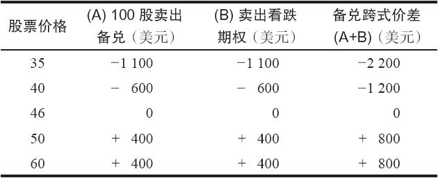
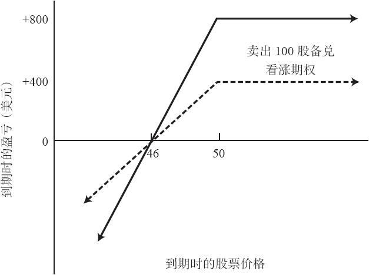

# 20.1　卖出备兑跨式价差

在这种策略里，交易者在持有标的股票的同时卖出一手这个股票上的跨式价差。对那些已经涉足卖出备兑看涨期权的投资者，这种策略特别有吸引力。在现实中，这个头寸并不是完全备兑的，只有卖出的看涨期权部分才为持有的股票所保护。卖出的看跌期权是未备兑的。不过，“备兑跨式价差”的名字一般用在这类头寸上，以便将它同卖出未备兑跨式价差进行区分。

【示例20-1】XYZ的价格为51，XYZ 1月50看涨期权的售价为5点，XYZ 1月50看跌期权的售价为4点。一手卖出备兑跨式价差可以通过在买入100股标的股票的同时卖出1手看跌期权和1手看涨期权而建立起来。这个头寸同一手卖出备兑看涨期权头寸之间的相似性是相当明显的。卖出备兑跨式价差实际上是一手卖出备兑（买入100股XYZ加上卖出1手看涨期权）和一手卖出裸看跌期权组合而成的。因为我们已经证明过一手卖出裸看跌期权和一手卖出备兑看涨期权是相等的，这个头寸同一个在200股股票上建立起来的卖出备兑看涨期权很相似。事实上，一手卖出备兑看涨期权的所有盈亏特征都与卖出备兑跨式价差是相同的。在上行方向潜在盈利有限，在下行方向潜在风险巨大。

读者应当记得，卖出裸看跌期权与卖出备兑看涨期权相等。因此，一手卖出备兑跨式价差可以认为是同一个200股的卖出备兑看涨期权相等，或者是同卖出两手裸看跌期权相等。事实上，相对于卖出备兑跨式价差而言，卖出两手看跌期权策略有它的好处。在这个情况里，手续费成本会低一些，最初需要的投资也会低一些（虽然引进杠杆未必一定是件好事）。

如果XYZ价格在到期日时高于行权价50，就可以实现最大盈利。这个情况中的最大盈利是800美元：从卖出这个跨式价差所得到的权利金，再减去如果看涨期权在股票价格为50时被指派的1点的亏损。事实上，备兑跨式价差的最大潜在盈利可以通过下面的公式很快计算出来：

最大盈利=跨式价差权利金+行权价-最初股票价格

这个示例的盈亏平衡点是46。请注意，在这个示例里，卖出备兑部分（按51买入股票，用5点卖出一手看涨期权）的盈亏平衡点是46。这个头寸的裸看跌期权部分的盈亏平衡点也是46，因为1月50看跌期权卖出时候的售价是4点。因此，这个组合头寸（卖出备兑跨式价差）的盈亏平衡点一定是46。同样，使用一个公式可以很容易地证明这一点：

盈亏平衡价格=（股票价格+行权价-跨式价差权利金）/2

表20-1和图20-1将卖出备兑跨式价差同一个100股的XYZ的1月50看涨期权的卖出备兑在到期日的结果进行了比较。

表20-1　卖出备兑跨式价差到期时的结果

图20-1　卖出备兑跨式价差

备兑看涨期权卖出者可以变成备兑跨式价差卖出者，这样做的吸引人之处在于他可以不必显著地改变他的卖出备兑看涨期权头寸的系数，就可以增加他的收益。使用表20-1中的数字，如果交易者决定通过用51买入XYZ和用5点卖出1月50看涨期权来建立一手卖出备兑，那么，他就有了一个最大潜在盈利在50之上，盈亏平衡点在46的头寸。如果在他的备兑看涨期权的头寸里加进那手裸看跌期权，他没有改变头寸的价格系数；他仍然可以在股票价格高于50时得到最大盈利，盈亏平衡点仍然是46。因此，在变成备兑跨式价差卖出者的时候，他不必改变他对这个标的股票的看法。

由于加进了这手裸看跌期权，投资增加了，在到期时，在股票价格到50之上的潜在盈利金额增加了，在股票价格到46之下的潜在亏损金额也增加了。备兑跨式价差卖出者在下行方向亏损的速度要高出一倍，因为这个头寸同一个200股的卖出备兑相等。因为裸看跌期权的手续费比卖出备兑看涨期权的手续费要低，备兑看涨期权卖出者在他的头寸中加进一手裸看跌期权时，一般而言可以在某种程度上增加他的收益。

实施后续行动的方法同卖出备兑看涨期权基本相同。一般在备兑的情况中需要将看涨期权挪仓的时候，交易者现在都可以将整个跨式价差挪仓（向下挪仓以寻求保护，向上挪仓以增加盈利，如果跨式价差中的时间价值消失，那么就向前挪仓）。上下挪仓也许会涉及支出，除非是挪到更远的到期日。

有的卖出者也许想要对卖出备兑跨式价差策略做一些小的修改。与其按同一价格卖出看跌期权和看涨期权，他们宁愿在卖出备兑看涨期权基础上再卖出一手虚值看跌期权。也就是说，如果交易者在XYZ的价格为50时买入股票和卖出看涨期权，然后他可以在45上卖出一手看跌期权。这样可以增加他在上行方向的潜在盈利，同时，只要XYZ到期时价格处于45~50之间，两手期权都会无价值到期。如果XYZ价格在到期日时低于45时，这样的做法会增加潜在风险的金额。不过，卖出者总是可以将这个看涨期权向下挪仓以得到额外的下行方向的保护。

在这个策略上，最后应当指出一点。如果备兑看涨期权的卖出者是以保证金卖出看涨期权，并在卖出看涨期权时使用完了他的借贷能力时，他就必须增加质押物以完成卖出备兑跨式价差。这是因为卖出的看跌期权是无备兑的。不过，用现金来运作备兑看涨期权的卖出者在把头寸转换为卖出备兑跨式价差策略时，就不必增加额外的资金。他只需要将他的股票移到一个保证金账户里，使用已经持有的股票的质押价值来卖出必要的看跌期权，以完成卖出备兑跨式价差。
