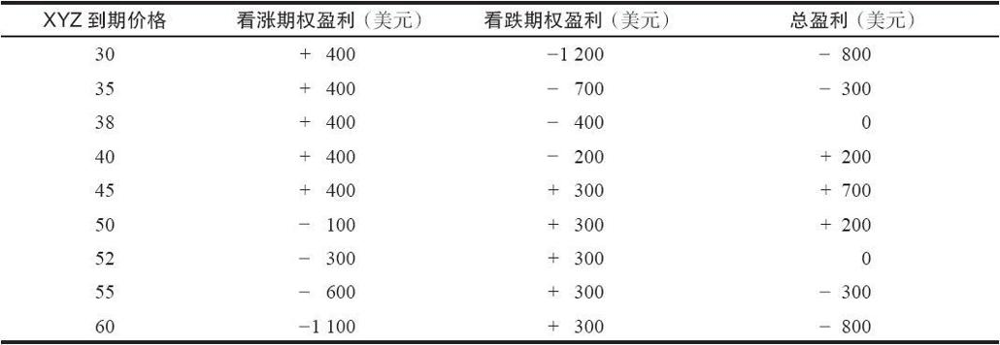
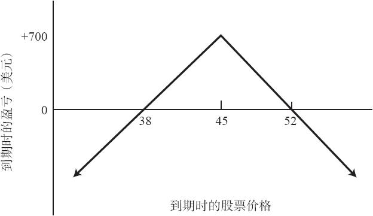

# 20.2　卖出无备兑跨式价差

在一个卖出无备兑跨式价差中，交易者在没有持有标的股票的情况下卖出跨式价差。从广义上说，这是一个潜在盈利有限但潜在风险巨大的中性策略。不过，获得盈利的概率相当大，而且可以采用一定的方法来减小这个策略的风险。

因为交易者在这个策略中是在卖出一手看跌期权和一手看涨期权，他一开始得到大量的时间价值。如果标的股票价格在到期日相对没有变化，跨式价差的卖出者就可以就它的内在价值而将这个跨式价差买回来。这样做一般会带来一笔盈利。

【示例20-2】有下列价格存在：

XYZ普通股股票：45

XYZ 1月45看涨期权：4

XYZ 1月45看跌期权：3

一个跨式价差可以卖出7点。如果股票价格在到期日高于38或低于52，这个跨式价差的卖出者就会盈利。因为在这个情况里，用少于7点就可以把实值期权买回来，而虚值期权则会无价值到期（见表20-2）。

表20-2　卖出裸跨式价差

请注意，图20-2的形状看上去像是一个屋顶。到期时最大潜在盈利点是在行权价上，如果股票价格运动得过远，在两个方向上都会出现大量的潜在亏损。读者应当记得，卖出看涨期权比率策略（买入100股标的股票，卖出2手看涨期权）有着相同的盈利图形。卖出裸跨式价差和卖出看涨期权比率这两种策略是相等的。当然，正如所有相等的策略一样，这两种策略也有它们的不同之处。不过，这两种策略都是基于概率的策略，这样的策略有时会变得相当复杂，在这一点上，它们是相同的。此外，在不利的市场条件中，或是没有采用后续策略，这两种策略都有巨大的潜在风险。

图20-2　卖出裸跨式价差

裸跨式价差所需要的投资比单独卖出看涨期权或看跌期权所需要的投资要大。一般而言，这意味着保证金要求同一手简单的裸卖出中的实值期权的要求是一样的。这个要求是股票价格的20%加上实值期权的权利金。跨式价差的卖出者应当准备足够的质押物，这样，无论是采取什么样的他认为是必要的后续行动，都不至于有追加保证金的要求。如果他想在股票涨到上行盈亏平衡点（在上面的示例里是52）时将这个跨式价差平仓，那么他就需要有足够的质押以保证在股票为52时他仍能持有这个头寸。如果他计划采取行动，而这个行动要求他在股票上涨到55或56时仍然持有这个头寸，那么，他就要有足够的质押能够满足这个行动。如果股票一直没有达到这样的高位，在持有头寸的时候，他会有多余的质押。
