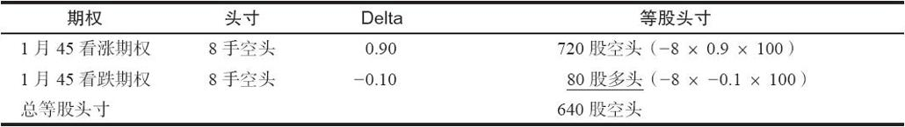

# 20.5　等股头寸的后续行动

在卖出跨式价差中有很多种后续策略可以使用，其中最好的方法还是等股头寸。读者应当记得，一个期权头寸的等股头寸等于期权数量×delta×每手期权所代表的股份数。如果是卖空的头寸，那么期权的数量就是一个负数。把这个方法应用到上面的情形，下面就是一个等股头寸方法的示例：

【示例20-7】和前面一样，假定跨式价差最初卖了7点，但是股票上涨了。有下面的价格和delta存在：

XYZ普通股股票：50

XYZ 1月45看涨期权：7；delta：0.90

XYZ 1月45看跌期权：1；delta：-0.10

XYZ 1月50看涨期权：3；delta：0.60

假定最初卖出的是8手跨式价差，每手期权代表了100股XYZ。我们可以计算出这8手跨式价差空头的等股头寸：

显然，这个头寸是相当看空的。除非交易者对XYZ极度看空，否则他就应当对头寸有所调整。最简单的调整方法是买入600股XYZ。另一种方法是买回卖出的7手1月45看涨期权。这样的买入行为可以给这个头寸加上一个买入630股（7×0.9×100）的delta。这就能使这个头寸基本成为中性。不过，正如前面的示例所指出的，策略家也许不想要买入这个期权。如果他决定买入1月50看涨期权为这手卖出的跨式价差做对冲，那么他就需要买入10手1月50看涨期权才能让这个头寸保持中性。他需要买这么多的原因是这个1月50看涨期权的delta是0.60；买入10手合约可以在这个头寸中加进600股的delta多头。

虽然在理论上买入10手是正确的，但由于交易者实际上只卖出了8手跨式价差，因此在实践中他也许只买入8手1月50看涨期权。
