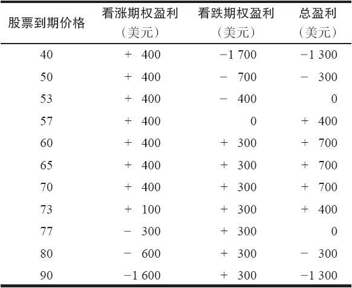
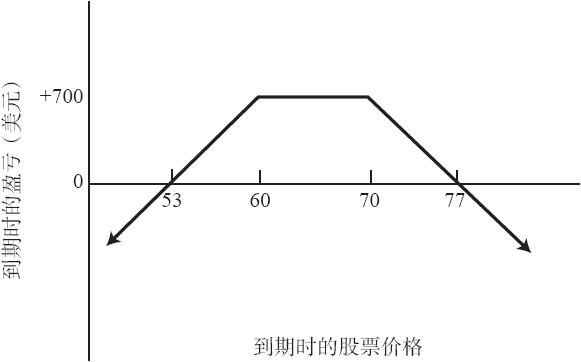

# 20.7　卖出宽跨式价差（组合价差）

读者应当还记得，一手宽跨式价差是一个包含看跌期权和看涨期权的头寸，在其中，这些期权的条款不尽相同。一般来说，看跌期权和看涨期权有相同的到期日，但是行权价不同。卖出宽跨式价差通常是通过卖出一手虚值看跌期权和一手虚值看涨期权来建立的，头寸建立时股票价格大致在这两个期权的不同的行权价的中点。这样，即使股票价格与行权价有一定距离，裸期权的卖出者还是能够对标的股票的走向保持中性。

这个策略和卖出跨式价差很相似，不同的是卖出宽跨式价差的最大盈利区域要比跨式价差大得多。在这个策略或者是任何裸卖出策略中，策略家可以赚到的大部分钱都来自于收入的权利金。跨式价差卖出者只有很小的机会得到相当于全部价差权利金的盈利，因为只有当股票价格在到期日刚好等于行权价时，卖出的看跌期权和看涨期权才会都无价值到期。宽跨式价差卖出者则不同，只要股票在到期日时价格在两个行权价之间，他就可以得到最大潜在盈利，因为在这种情况下这两手期权都会无价值到期。这个策略同第6章里在讨论卖出看涨期权比率时所介绍的卖出变量比率是相等的。

【示例20-10】如果存在下列价格的话：

XYZ普通股股票：65

XYZ 1月70看涨期权：4

XYZ 1月60看跌期权：3

可以通过卖出1月70看涨期权和1月60看跌期权建立一个宽跨式价差。如果XYZ价格在到期日时在60~70之间，这两手期权都会无价值到期。价差的卖出者就有7点的盈利，等于其最初得到的收入。如果XYZ在到期日时高于70，策略家就必须付出一定的成本买回看涨期权。例如，如果XYZ价格在到期日时为77，买回1月70看涨期权就要花7点，因此造成一个盈亏平衡的情况。在下行方向，如果XYZ价格在到期日时为53，1月60看跌期权就需要7点才能买回，因而决定了下行方向的盈亏平衡点。表20-3和图20-3描述了这个卖出宽跨式价差头寸的可能结果。这个示例中的盈利范围相当大，从下行的53到上行的70。因为当前股票价格是65，因此这是一个相对中性的头寸。

表20-3　组合价差卖出的结果

图20-3　卖出组合价差

粗看上去，这似乎是一个比跨式价差更保守的策略，因为盈利范围更宽，股票需要运动相当大的幅度才会达到盈亏平衡点。在没有后续行动的情况下，这没有错。但是，如果股票一开始就迅速上涨或下跌，宽跨式价差卖出者常常没有其他选择，只能买回实值期权以限制他的亏损。正如前面所显示的，这时买回的价格有可能会包括大量的时间价值，从而产生显著的亏损。

宽跨式价差卖出者唯一可用的其他方法（除了通过交易把这个头寸平仓之外），是在股票达到任何一个盈亏平衡点时，将这个头寸转化为一手跨式价差。

【示例20-11】如果前面示例里的XYZ价格上涨到了70或71，1月70看跌期权就会被卖掉。根据可用的质押金额，在卖掉1月70看跌期权的时候，可以买回也可以不买回1月60看跌期权。如果股票价格稳定下来，这种把宽跨式价差转化为跨式价差的做法就会效果很好。如果股票继续上涨，它也可以减少痛苦。不过，如果股票反转方向，1月70看跌期权空头就无法盈利。在决定是否要将宽跨式价差转化为跨式价差上，标的股票的技术分析可以提供一定的帮助。如果股票价格有相当大的可能会回落，那也许就不值得将这手看跌期权向上挪仓。

在这个宽跨式价差的示例里，卖出者从卖出看跌期权和看涨期权中收入大笔的权利金。不过，在许多时候，一个激进的宽跨式价差卖出者会想要卖出两手离到期日很近的虚值期权。这些期权的卖价一般都不到1点。有的时候这是非常激进的策略，因为如果标的股票无论在哪个方向迅速运动，穿过行权价，这个卖出者就没有其他什么办法。他必须买回期权以限制亏损。不过，这类卖出宽跨式价差（卖出价格不到1点的短期虚值期权）对许多卖出者都有吸引力。我们在第5章中介绍过卖出近期看涨期权的裸看涨期权卖出者，这里的哲学和他们的哲学相似，他们也认为期权有很大的可能会无价值到期。它也有着相同的风险：如果价格出现大幅变化或开盘跳空，那么就会出现把许多次交易的盈利一扫而空的灾难性亏损。卖出价格不足1点的组合是一种拙劣的策略，应当避免这种策略。

在结束对卖出宽跨式价差的讨论前，考虑一下对卖出宽跨式价差有什么样的保证金要求是有好处的。还记得吗，卖出一手跨式价差所需要的保证金是20%的股票价格加上看跌期权或看涨期权的价格，取决于哪一手期权是实值的。不过，在卖出宽跨式价差中，正如在前面的示例里那样，两手期权可能都是虚值的。当出现这种情况时，跨式价差的卖出者可以从他的保证金要求中减去虚值金额。因此，如果在卖出1月60看跌期权和1月70看涨期权的时候XYZ价格为68，质押要求就是股票价格的20%，加上看涨期权的权利金，再减去200美元（较小的虚值金额）。这手看涨期权虚值2点，而看跌期权虚值8点。实际上，任何涉及卖出看跌期权和看涨期权（跨式价差或宽跨式价差）的真正质押要求，都是取看跌期权或看涨期权中要求较大的一个，加上另一手期权的实值金额。在最后那句话里，另一手期权的实值金额适用于在构建宽跨式价差时卖出两手实值期权的情况。这种策略没有那么流行，因为卖出者在卖出两手实值期权的时候，通常收入的时间价值较少。实值宽跨式价差的一个示例是当股票价格为65时，卖出1月60看涨期权和1月70看跌期权。
