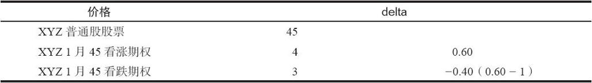

# 20.8　对卖出未备兑跨式和宽跨式价差的进一步讨论

我们在讨论卖出比率的时候曾经指出，这是一个以高概率获得有限盈利的策略。因为卖出跨式价差和卖出比率是相等的，宽跨式价差和卖出变量比率是相等的，这样的说法也适用于这两个策略。不过，使用跨式和宽跨式价差的交易者必须意识到，在一个高波动的市场里，必须要采用保护性的后续行动来限制亏损。跨式价差卖出者有时还可以使用其他的技巧来帮助他降低风险。

我们在前面不断地提到，看跌期权在变为实值期权后失去时间价值的速度要比看涨期权快。交易者常常可以通过卖出1或2手额外的看跌期权来构建一个中性头寸。也就是说，如果交易者卖出5或6手看跌期权和4手条款相同的看涨期权，他常常可以创造出一个比跨式价差更为中性的头寸。如果股票向上运动，看涨期权在一个看多的市场里积累起时间价值，而额外的看跌期权则帮助抵消看涨期权的不利后果。另一方面，如果股票下跌，5或6手看跌期权所拥有的时间价值和4手看涨期权一样多，这也是一个不带偏向的中性头寸。如果股票一开始就大幅下跌，卖出者总是可以通过卖出另外的1或2手看涨期权来保持平衡。卖出额外的1或2手看跌期权是跨式价差卖出者对付最凶险敌人的对策，这个敌人就是标的股票的迅速和极度上涨。

### 20.8.1　使用delta

我们可以用更严格的方法来实施这个通过增加看跌期权空头来构造一个中性头寸的分析。读者应当记得，卖出比率者或比率价差交易者可以使用头寸中期权的delta来决定一个中性的比率。跨式价差卖出者也可以这样做。我们说过，看涨期权的delta和看跌期权的delta之间的差别差不多是1。使用前面跨式价差卖出示例里的价格，假定看涨期权的delta是0.60，那么，就可以得出一个中性的比率：

看跌期权的delta是负数，标志着看跌期权和标的股票是负相关的。用看涨期权的delta去除以看跌期权的delta，忽略那个负号，就得出一个中性的比率。由此得出的比率——在这个示例里是1.5：1（0.60/0.40），是每卖出1手看涨期权就需要卖出多少看跌期权的比率。因此，为了建立一个中性头寸，交易者需要卖出3手看跌期权和2手看涨期权。读者也许会想，假设1手平值看涨期权的delta是0.60是否合理。一般而言这是正确的，非常长期的平值看涨期权有较高的delta；非常短期的看涨期权的delta则接近0.50。因此，3：2的比率常常是中性的比率。当我们在讨论卖出比率涉及中性比率时，我们提到过卖出5手看涨期权和买入300股股票常常会产生中性的比率。读者应当注意到，一个由卖出3手看跌期权和2手看涨期权而构成的跨式价差和一个卖出5手看涨期权和买入300股股票的卖出比率是相等的。

如果跨式价差卖出者要使用delta来决定他的中性比率，他应当在开始投资的时候就对每一个头寸进行计算，而不是仰赖于3手看跌期权和2手看涨期权常常产生中性比率这样的泛泛之谈。delta也可以用作后续行动，在标的股票运动之后调整比率以保持中性。

### 20.8.2　避免过度交易

在上面介绍的所有卖出跨式价差和宽跨式价差的策略里，过多的后续行动都会造成不利结果，因为会有手续费成本。因此，虽然采取保护性行动很重要，跨式价差卖出者应当事先有所计划，尽量不对策略进行改动，从而保护自己。这就是为什么买入保护常常是有用的；它不但限制了股票运动方向的风险，而且只需要一手额外的期权手续费。事实上，如果可能的话，一开始就买入保护的策略常常比采取第2步行动进行保护要更好。

从避免过多的后续行动的概念引申开来，我们可以说，策略家应当避免对标的股票的运动方向进行预测。例如，如果跨式价差卖出者计划在股票达到50的时候采取防御行动，那么，他就不应当在股票只是48或49的时候就根据预测而行动。股票有可能会回落。如果是这样，卖出者不但已经采取了不应当采取的防御行动，付出了手续费成本，还降低了他的潜在盈利。当然，每个人在心理的某个角落都是交易家，预测（或者等待下去）的欲望总是存在。除非有很强的技术理由要这样做，否则的话，策略家应当抵制想要交易的欲望，应当按照他最初的计划执行他的策略。在这方面，卖出比率者或许更有优势，因为他可以使用在标的股票上的买入和卖出止损指令来消除他在后续行动中的情感因素。在第6章讨论卖出看涨期权比率时我们介绍过这种技巧。不幸的是，在卖出跨式价差和宽跨式价差中不存在这样的回避情绪的技巧。

### 20.8.3　使用收入

在前面的章节里我们提到过，卖出备兑看涨期权不需要策略家有任何现金投资。他可以使用他现有投资组合的质押价值来完成卖出裸期权。此外，一旦他卖出了未备兑的期权，他还可以使用他从卖出期权中得到的权利金来购买像政府债券那样的固定收益证券。同样的道理自然也适用于卖出跨式价差和宽跨式价差策略。不过，策略家不应当过分热衷于在他的头寸中持续保持收入，也不应当一心想要不惜代价地把政府债券留在手里。如果卖出者的后续行动需要他有资金支出以限制亏损，或者需要他卖掉政府债券以保持收入，他就应当毫不迟疑地这样做。
