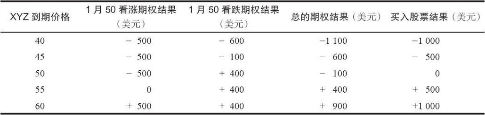

# 21.1　合成股票多头

如果交易者在买入一手看涨期权的同时卖出一手行权价相同的看跌期权，那么，他就构造了一个同持有股票相等的策略。这样的头寸有时被称为“合成”股票多头。

【示例21-1】为了证明这个期权头寸的表现和一个股票多头头寸相同，假定有下面的价格存在：

XYZ普通股股票：50

XYZ 1月50看涨期权：5

XYZ 1月50看跌期权：4

如果投资者对XYZ是看多的，而且想要以50的价格持有这只股票，他可以考虑使用一种变通的方法，买入1月50看涨期权，同时（未备兑地）卖出1月50看跌期权。正如表21-1所显示的，通过使用这个期权策略，这个投资者的潜在盈亏和一个股票持有者几乎是一样的。这张表右面两栏将这个期权策略的结果与仅仅按50的价格持有这只股票的结果进行了比较。

表21-1　合成买入股票头寸

表21-1显示，在到期日在任何价格上这个期权策略的结果都比股票的结果刚好少100美元。因此，“合成”股票多头和实际股票多头有几乎相同的潜在盈亏。这两种相等头寸的结果之所以有差别，是因为期权策略家为了设立这个头寸必须要付1点的时间价值。这100美元代表了股票的持有成本和要支付的股息。因此，实际上这两个头寸是完全一样的（关于持有股票和“合成股票”之间的完整关系，我们会在第27章的转换组合（conversion）中解释）。这个时间价值意味着，在到期时“合成”头寸的表现会比实际股票头寸差100美元。请注意，当XYZ为50的时候，看跌期权和看涨期权一开始都完全由时间价值构成。合成头寸在看涨期权中为时间价值支付了5点，而从看跌期权中只得到了4点的时间价值。因此，净时间价值是1点的净支出。

投资者之所以使用合成股票多头的头寸而不是股票头寸自身的理由是，合成头寸所需要的投资比直接买入股票要小得多。买入这只股票需要在现金账号里有5000美元，或者在保证金账号里有2500美元（如果保证金率是50%）。这个合成头寸则只需要100美元的支出和满足质押要求（股票价格的20%，加上看跌期权的权利金，减去行权价同股票价格之间的差价）。从理论上说，把这笔钱投资在短期资金里，所得到的利息可以抵消为合成头寸所付的100美元。在这个示例里，质押要求是5000美元的20%，或者说1000美元，加上400美元的看跌期权权利金，加上100美元的支出（因为买入看涨期权付了5点，卖出看跌期权只收入4点）。这笔交易的初始投资就是1500美元。在这里，在建立头寸的时候在股票价格与行权价之间没有差价。当然，因为这里有一手裸看跌期权，如果股票价格下跌，这个质押要求就会上升，如果股票价格上涨，这个质押要求就会下降。同时请注意，买入股票在账户中产生了一笔5000美元的支出，而期权策略的支出只是100美元，其他都是质押要求，而不是现金要求。

由于保证金要求降低了，头寸就有了更大的杠杆。如果XYZ上涨到60，股票头寸的盈利就会是1000美元，它代表了在保证金之上的40%的盈利（1000美元/2500美元）。使用期权策略的话，这个百分比要更高。盈利会是900美元，收益率会是60%（900美元/1500美元）。当然，在下行方向杠杆也会起作用，因此，期权策略的按百分比计算的风险也更高。

使用合成股票策略一般并不只是用它来替代股票多头。除了有可能潜在盈利小一些之外，期权策略家没有股息收入，而股票持有者则有。不过，期权策略家有可能从他没有投放在股票持有权的资金中得到利息。对策略家来说，重要的是要懂得，一手看涨期权多头加上一手看跌期权空头等于股票多头。因此，策略家有可能在某些正常需要买入股票的期权策略中，使用合成期权头寸来替代买入股票。
