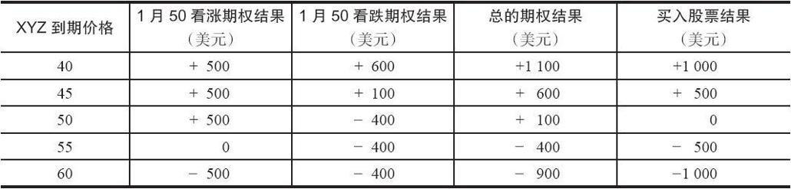

# 21.2　合成股票空头

在卖出一手看涨期权的同时买入一手看跌期权可以建立起一个同卖空标的股票相等的头寸。一般而言，同卖空股票相比，这种替代的期权策略有很大的好处。使用上面的价格（股票价格为50，1月50看涨期权的价格为5，1月50看跌期权的价格为4），表21-2显示了在1月到期日时的潜在盈亏。

期权头寸和卖空股票的头寸有相似的结果：如果股票下跌就有大量的潜在盈利，如果标的股票价格上涨就有无限的亏损。不过，期权策略比股票头寸的表现要好，因为期权策略家得到了时间价值的好处。同样，这是因为看涨期权比看跌期权有更多的时间价值，在这个情况里对期权策略家有好处，因为他是卖出看涨期权和买入看跌期权。

表21-2　合成股票空头头寸

由于两个重要的因素，期权策略比卖空股票更可取：（1）没有必要去借股票；（2）没有遵守uptick[1]规则的必要。当投资者卖空股票的时候，他首先必须从持有股票的人那里借到股票。这个程序是由投资者的经纪公司的股票借贷部门处理的。如果因为某种原因没有人愿意借出股票，那么就没有办法执行卖空股票的指令。此外，卖空纽约股票交易所和纳斯达克的股票必须遵守uptick规则。也就是说，卖空的价格必须高于前一笔交易的价格。这个规则是好多年以前（由纽约股票交易所）引进的，为的是防止交易者在“熊市砸盘”而将市场拖垮。

不过，使用期权的“合成股票空头”策略，投资者就不必为这两个因素担心。首先，看涨期权可以随意卖出；没有借任何东西的必要。同时，看涨期权即使在标的股票在按向下的价码（downtick）交易时也可以卖空（看跌期权可以买入）。许多专业交易商使用“合成股票空头”是因为他们可以非常及时地用相等的方式来卖空股票。如果一个投资者想要卖空股票，且他事先没有安排借贷股票，那么，在他的经纪人询问股票借贷部门，到确定可以借到股票的时候，时间就被浪费掉了。

不过，这里需要防止误解。如果投资者是就一只借不到的股票卖出看涨期权，那么他必须肯定他不会被指派。因为，如果投资者因为看涨期权行权而被指派，他还是必须卖空标的股票。如果这个股票是借不到的，那么，经纪人就必须为他买入股票。因此，在一个股票也许很难借到的情况里，投资者应当使用这样的行权价，这个行权价可以让这手看涨期权在最初卖出的时候是虚值的。这可以减小但是不能排除提前指派的可能性。

在这个策略中，杠杆也是一个因素。假定保证金率是50%，卖空者需要2500美元为这个头寸提供质押。期权策略家最初只需要股票价格的20%，加上看涨期权的价格，再减去收进的收入，所需要的质押是1400美元。此外，我们在合成股票多头头寸中提到的劣势在合成股票空头策略中就再不是劣势。期权交易者不需要为期权支付股息，但是卖空股票的人必须支付股息。

由于期权头寸不必支付股息，还有从大量的时间价值中得到较大潜在盈利的好处，想要卖空股票的交易者常常可以用卖出一手看涨期权和买入一手看跌期权来替代。对一个策略家来说，懂得卖空股票头寸同期权头寸之间的相等关系也很重要。在某些情况里，他也许能够用期权头寸来代替通常需要的卖空股票。

[1] 股市上在你的指令的前一指令的交易价格必须高于你的卖空价格。——译者注
