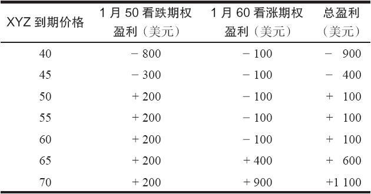
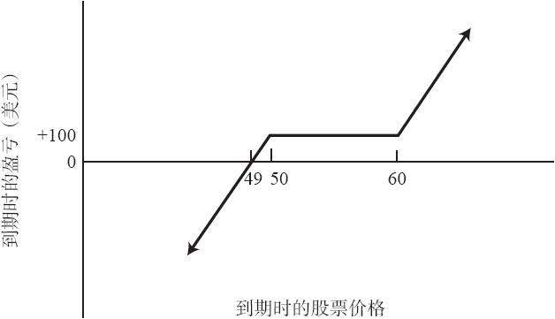
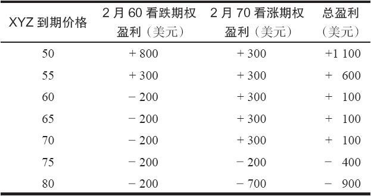
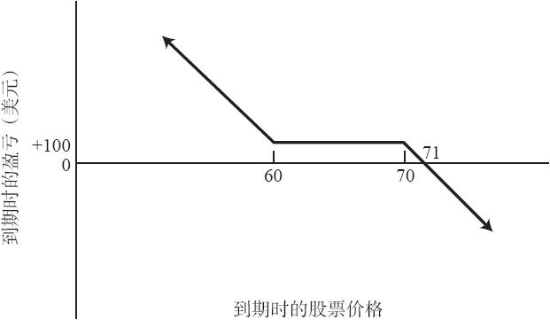

# 21.3　分开行权价

策略家还可以对合成的策略稍加变动，设立一个激进但有吸引力的头寸。与其在看涨期权和看跌期权上使用相同的行权价，他可以在看跌期权上使用较低的行权价，在看涨期权上使用较高的行权价。这种把行权价分开（split）的做法为他可能犯的错误留了余地，同时仍然保留了获得大量盈利的可能。

### 21.3.1　看多

如果卖出的是一手虚值的裸看跌期权，与此同时买入的是一手虚值的看涨期权，那么，这样建立起来的就是一手激进的看多头寸。交易者常常可以在建立这个头寸时得到一笔收入。如果标的股票价格上涨得足够高，买入看涨期权和卖空看跌期权的头寸都能产生盈利。如果股票价格相对无变化，买入的看涨期权就会有亏损，但卖出的看跌期权仍然可以盈利。如果标的股票价格下跌，那就会产生风险，卖空看跌期权和买入看涨期权两方面都会亏损。

【示例21-2】有下面的价格存在：XYZ的价格是53，1月50看跌期权的售价是2，1月60看涨期权的售价是1。一个对XYZ看多的投资者卖出1月50裸看跌期权，与此同时，买入1月60看涨期权。这个头寸有1点的收入，再减去手续费。卖出裸看跌期权需要有质押。如果XYZ在1月到期时在50~60之间，两手期权都会无价值到期，投资者可以得到一笔同初始收入相等的小盈利。不过，如果XYZ在到期日上涨到60之上，他的潜在盈利就是没有限制的，因为他持有行权价为60的看涨期权。如果XYZ在到期之前下跌到50之下，他的亏损就会非常大，他卖出了行权价为50的看跌期权。表21-3和图21-1显示了这个策略在到期时的结果。

表21-3　看多的分开行权价

图21-1　看多的分开行权价

使用这个策略的投资者本质上对标的股票是看多的，他想要免费买入一手虚值看涨期权。如果他错了但是错得不严重，标的股票只是稍许上涨，甚至还略微下跌了一些，那么他仍然可以有少量盈利。当然，如果他是对的，在股票上涨中就可以产生大量盈利。如果他错了，股票大幅下跌而不是上涨，那么他就会损失惨重。

这个策略在期权价格被高估时非常有用。假定投资者对标的股票看多，但发现看涨期权太贵，因而很失望。如果他想买入一手这样昂贵的看涨期权，他可以通过同时卖出一手虚值看跌期权来在某种程度上减少支出，这样的看跌期权也会比较贵。因此，如果他对股票看多的判断是对的，他就持有了一手定价比较“合理”的看涨期权，因为这手看涨期权的成本由于卖出看跌期权的收入而降低了，降低的数量等于从卖出看跌期权中收入的权利金。

### 21.3.2　看空

如果投资者对股票看空，也有一种相应的策略。他可以买入一手虚值的看跌期权，使得他在股票下跌时有机会得到大量盈利，同时卖出一手虚值的裸看涨期权，用权利金收入来“资助”买入的那手看跌期权。如果股票停留在低于看涨期权行权价的价位，卖出看涨期权就会有盈利。但如果标的股票上涨得过高，他就会有很大的亏损。

【示例21-3】XYZ的价格是65，看空的投资者买入了一手2月60看跌期权，价格为2点，他同时也卖出了一手2月70看涨期权，权利金收入是3点。这些交易产生了1点的收入，再减去手续费。投资者必须为卖出裸看涨期权提供质押。如果XYZ在2月到期日之前大幅下跌，那就有可能出现大量的盈利，因为投资者持有2月60看跌期权。即使XYZ的表现不尽人意，但在到期日还是落在60~70之间，他还是会有数量等于最初收入的盈利，因为两手期权都会无价值到期。不过，如果股票上涨到70以上，那就会有无限的亏损，因为他有一手行权价为70的裸看涨期权。表21-4和图21-2显示了这个策略在到期时的结果。

表21-4　看空的分开行权价

图21-2　看空的分开行权价

这显然是一个激进的看空策略。投资者想要下行方向的潜在盈利而持有一手虚值看跌期权。此外，他卖出了一手虚值看涨期权，通常卖出看涨期权的收入会高于买入看跌期权的支出。由于卖出了看涨期权，他基本上就免费得到了那手看跌期权。事实上，即使标的股票只有小量的上涨或者略为下跌，他还是会盈利。如果股票上涨到卖出的看涨期权的行权价之上，风险就会成为现实。

在策略家持有普通股股票的时候，他们非常频繁地使用看空的分开行权价策略。也就是说，想要为他的股票提供保护的股票持有者会买入一手虚值看跌期权，同时卖出一手虚值看涨期权来资助买入看跌期权。这个策略被叫做“保护性领圈价差”，我们在介绍“持有普通股股票的同时买入看跌期权”一章中对它有详细的讨论。在第23章中我们将介绍一个与这个策略相似但风险有所修正的策略。
