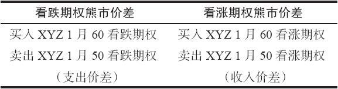
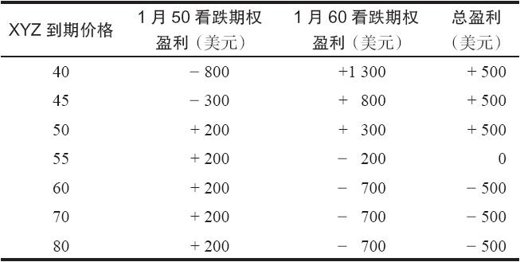
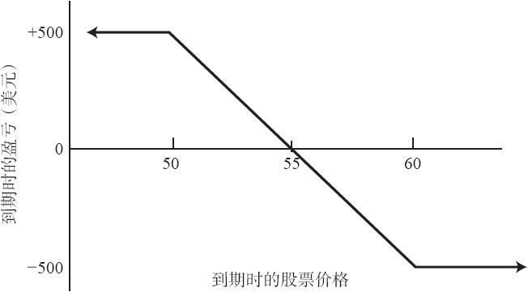

# 22.1　熊市价差

看涨期权的熊市价差是卖出一手行权价较低的看涨期权，同时买入一手行权价较高的看涨期权。与此相似，看跌期权熊市价差是由卖出一手行权价较低的看跌期权和买入一手行权价较高的看跌期权而组成的。看跌期权的熊市价差是一个支出价差。这是因为较高行权价的看跌期权比较低行权价的看跌期权价格更高。因此，对有看涨期权和看跌期权交易的股票，投资者可以用收入（看涨期权）也可以用支出（看跌期权）来建立一个熊市价差。

看跌期权熊市价差同看涨期权熊市价差有相似的潜在盈利。最大潜在盈利有限，如果XYZ价格在到期日时低于较低行权价，就会出现最大潜在盈利。在这个示例里，看跌期权之间的跨度将会扩大且等于两个行权价之间的价差。最大风险也有限，如果XYZ的到期日价格高于较高的行权价，就会出现最大亏损。

【示例22-1】有下面的价格存在：

XYZ普通股股票：55

XYZ 1月50看跌期权：2

XYZ 1月60看跌期权：7

买入1月60看跌期权和卖出1月50看跌期权可以用5点的支出建立起一手熊市价差。表22-1可以帮助证明这确实是一手熊市价差。读者可以注意到，图22-1的图形形状同看涨期权熊市价差的图形形状（见图8-1）是相同的。这个价差所需要的投资是净支出，它必须全部付清。请注意，标的股票价格在到期日只要低于50，就能实现最大潜在盈利；标的股票价格在到期日只要高于60，就会出现最大潜在风险。最大风险始终等于最初建立这个头寸时所需要的支出，再加上手续费。在这个示例里，盈亏平衡点是55。下面的公式可以帮助你迅速计算出与这个看跌期权熊市价差相关的有用的统计数字。

最大风险=初始支出

最大盈利=行权价的差价-初始支出

盈亏平衡价格=较高行权价-初始支出

表22-1　看跌期权熊市价差

图22-1　看跌期权熊市价差

相对于看涨期权熊市价差，看跌期权熊市价差有一个好处。使用看跌期权，投资者在建立这个价差的时候可以卖出虚值期权。因此，投资者不会在这个价差变得盈利之前就在卖出的期权上被提前指派。卖出的看跌期权要有被指派的风险，首先要变成实值。这时价差会有盈利，因为股票必须跌到较低的行权价之下。看涨期权熊市价差的情况就不是这样。在看涨期权价差里，作为熊市价差的一部分，投资者卖出一手实值看涨期权，因此，在这个价差变得盈利之前，有被提前指派的风险。

除了提前行权的可能性有不同，看跌期权熊市价差相对看涨期权熊市价差还有另一个优势。在一个看跌期权价差中，如果标的股票迅速下跌，因此使得两手期权都成为实值，那么它的跨度一般也会迅速扩大。这是因为，正如前面提到的，看跌期权在变为实值之后，倾向于迅速失去它的时间价值。在上面的示例里，如果XYZ很快跌到48，1月60看跌期权的价格就会接近12，几乎没有保留什么时间价值。卖出的1月50看跌期权也保留不住多少时间价值，也许卖价会在4点左右。因此，它们之间的跨度就变成了8。在一个短期的下跌运动里，看涨期权熊市价差常常不会产生相似的结果。因为看涨期权价差涉及卖出一手较低行权价的看涨期权，这手看涨期权在股票价格跌到接近较低行权价时，实际上还在增加时间价值。因此，即使这个看涨期权价差在到期时的盈利和看跌期权价差相似，在一个迅速下跌的运动里，它的表现常常没有看跌期权价差那么好。

由于这两个原因（不容易被提前指派和短期运动中的较高盈利），看跌期权熊市价差比看涨期权熊市价差更好。有的投资者仍然喜欢使用看涨期权熊市价差，因为它是用收入建立的，因此不需要那么多的现金投资。这是个不充分的理由，不应当因为这个就避免使用更好的看跌期权价差，也不应当用它来否定其他的考虑。请注意，看涨期权熊市价差的保证金要求会导致投资者购买力的减小，其数量同建立一个相似的看跌期权熊市价差所需要的支出相近（一手看涨期权熊市价差所需要的保证金是行权价之间的差价减去建立价差的收入）。因此，只有那些初始资金接近最低资本要求的账户，才能够从收入价差中获得显著的好处。大多数经纪公司对价差交易的最低资本要求是2000美元。
