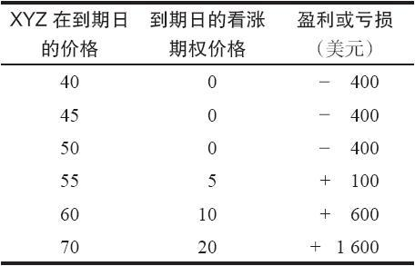
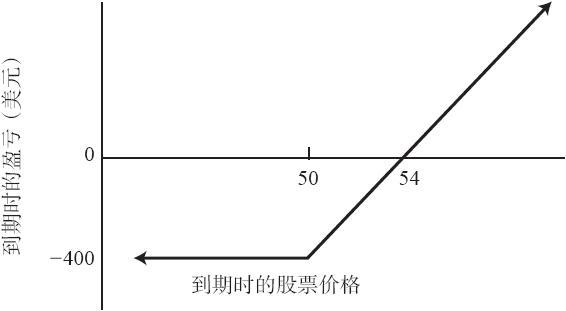

# 1.8　盈亏图形

视觉展示对于全面理解和评估期权头寸的潜在盈利非常重要。在期权交易中，许多多重证券头寸特别需要进行严格的分析，例如股票相对于期权（如卖出备兑期权和卖出比率），和期权相对于期权（如各种价差交易）。有些策略家喜欢用表格来说明不同股票价格下某一具体策略的不同结果，而另一些策略家则认为图形可以更好地说明策略。在本书的后面部分，每当讨论一个新的策略时，我都会既使用表格，又使用图形。

【示例1-16】某个客户想要对其买入的一手看涨期权进行评估。我们既可以用表格，又可以用图形来说明以4美元的价格买入一手XYZ 7月50看涨期权在到期日的潜在盈亏。表1-5和图1-5描述的是相同的信息，图形不过是表中“盈亏”一栏的线性表示。纵轴为盈亏的金额，横轴为股票在到期日的价格。在这个示例里，盈利的金额和股票价格都是到期日的数据。策略家们常常想要知道到期前的潜在盈亏，而不是到期日。我们在下面的许多地方会具体看到，表格和图形对进行必要的分析提供了很大的帮助。

表1-5　买入XYZ看涨期权的潜在盈亏

图1-5　买入XYZ看涨期权的潜在盈利图

在实践中，这样的一个示例太简单了。对一个简单的、持有至到期日的买入看涨期权的头寸作评价，并不需要使用表格或图形，至少不需要两者都用。不过，当我们讨论更复杂的策略时，在快速决定诸如某个头寸什么时候盈利什么时候亏损，以及在特定股票价格上投资者的风险增长速度等问题上，这些工具会变得更加有用。
